# 如何在谷歌地图上放置大头针

> 原文：<https://www.freecodecamp.org/news/how-to-drop-a-pin-on-google-maps/>

如果你想保存你在谷歌地图上发现的一个新位置，你需要在那个位置放一个大头针。

在这篇文章中，我将向你展示如何从你的手机或电脑上放下谷歌地图中的一个大头针。

## 如何在谷歌地图(Mac 或 Windows)上放置大头针

第一步:登录你的谷歌账户

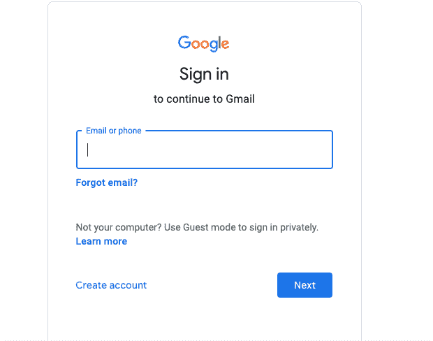

第二步:点击谷歌应用程序图标，进入地图

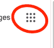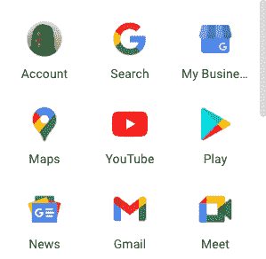

步骤 3:使用搜索栏搜索位置

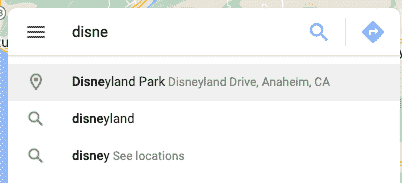

第四步:点击你想保存的位置旁边的大头针图标

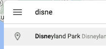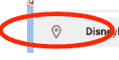

您应该会在地图中的位置看到一个红色大头针图标。

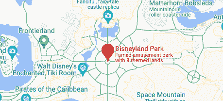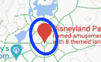

### 如何手动删除 pin

转到地图上的任意位置，然后单击您想要保存的位置旁边的图标。

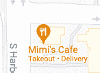

然后，您应该会在该位置旁边看到一个红色图标。

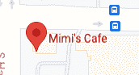

### 如何保存位置

一旦你锁定一个位置，然后点击保存。

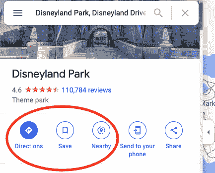

然后，您可以选择要将固定位置保存到哪个列表。

然后您应该会看到它被标记为已保存。

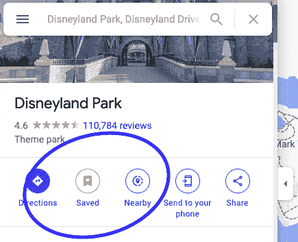

要查找所有保存的位置，请单击菜单图标，然后单击您的位置。

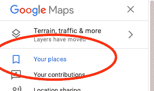

然后，您可以单击保存位置的列表。

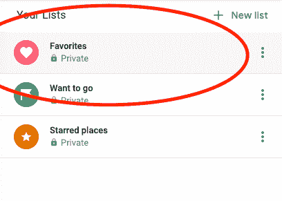

### 如何共享位置

单击固定位置下方的共享图标。

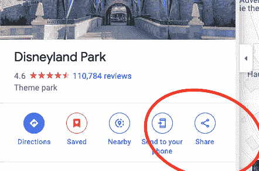

然后，您可以选择在哪里共享您的固定位置。

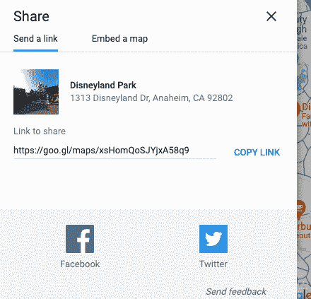

### 如何移除 pin

可以点击搜索栏中的`X`。

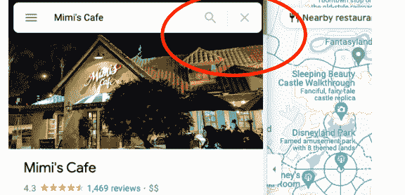

## 如何在谷歌地图(手机)上放置大头针

如果你还没有在手机上下载谷歌地图应用程序，你需要这样做。

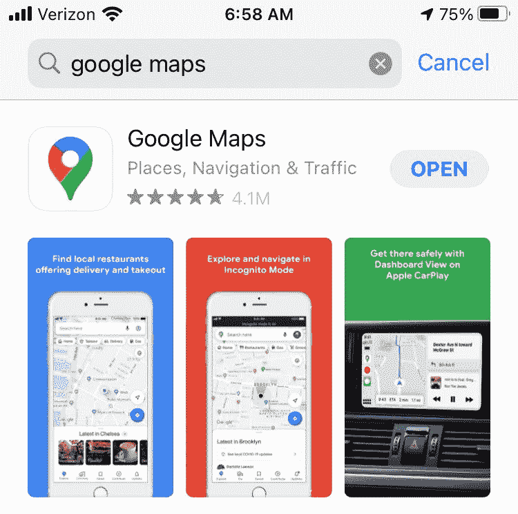

步骤 1:打开应用程序并搜索位置

第二步:点击位置，你会在地图上看到一个红色的大头针

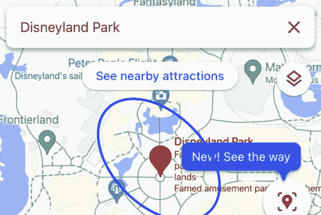

### 如何手动删除 pin

在地图上，前往您选择的位置，并按住您的手指在该位置。

然后，您应该会看到该位置旁边出现一个红色大头针。

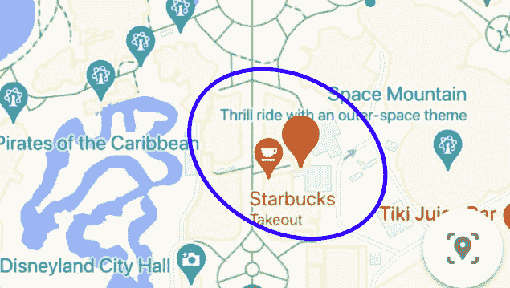

要保存您的位置，滚动选项并点击保存。

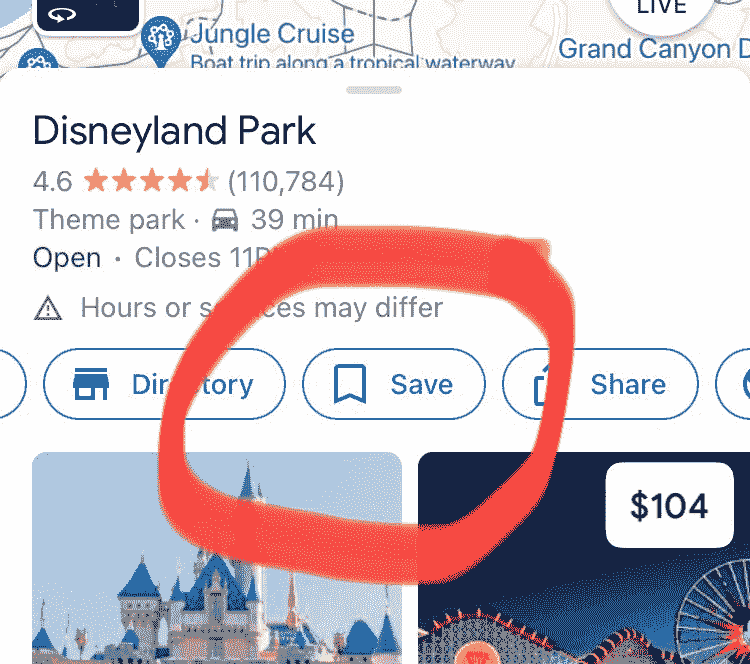

单击列表中您想要保存它的位置。

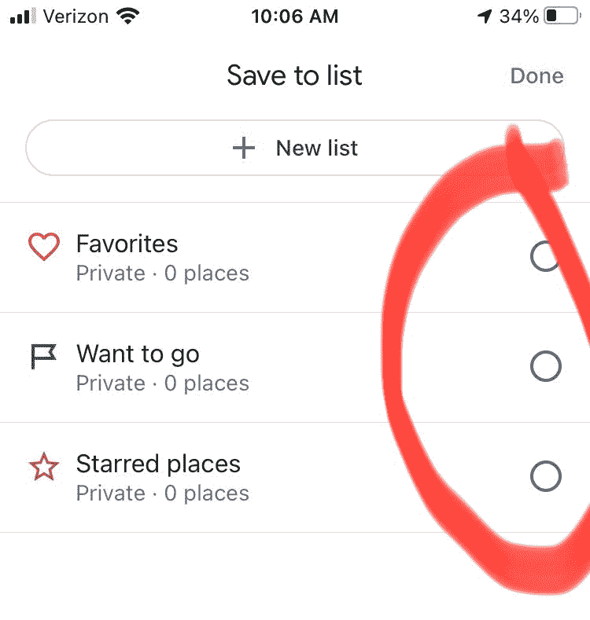

### 如何共享您的锁定位置

您可以在应用程序的底部找到您的固定位置。

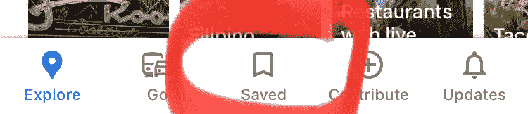

然后点击屏幕顶部的共享图标。

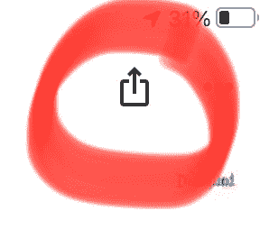

选择共享您的锁定位置的方法。

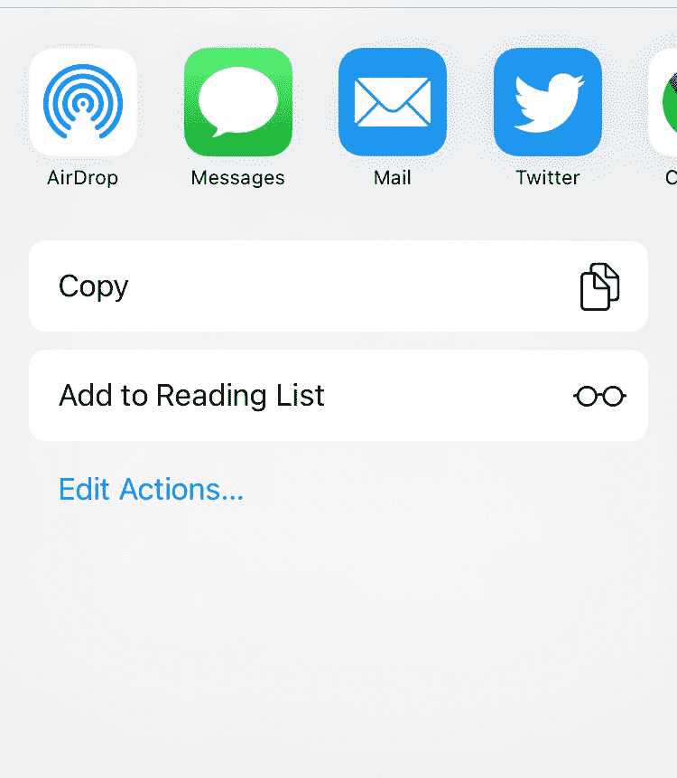

### 如何移除 pin

要删除一个图钉，那么您可以点击搜索栏中的`x`。

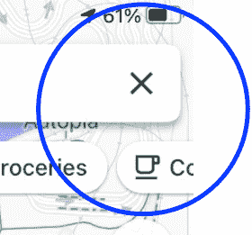