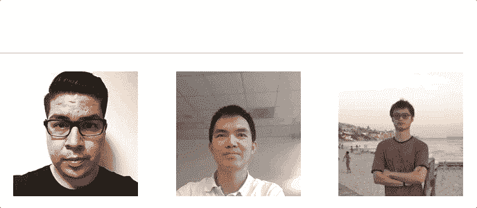
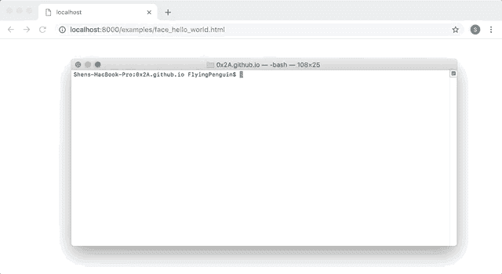
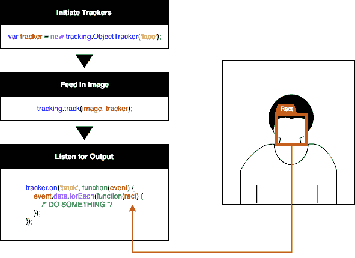
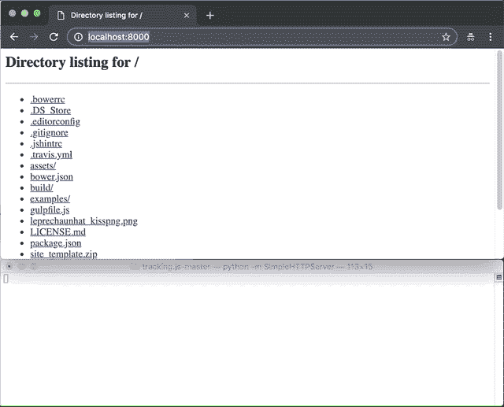

# 如何用计算机视觉把小妖精帽子放到你的网站上

> 原文：<https://www.freecodecamp.org/news/how-to-drop-leprechaun-hats-into-your-website-with-computer-vision-b0d115a0f1ad/>

#### 自动妖精帽子的人在你的网站上为圣帕特里克节。

> **！！！—警告—！！！**

> 对一些中国人来说，给一个人戴绿帽可以被认为是对[](https://mspoweruser.com/microsoft-removes-green-hat-from-vs-2019-installer-after-offending-users-in-china/)**的冒犯，因为它与在一段关系中欺骗具有相同的含义。所以当你为中国用户群服务时，要小心使用这个**。****

> ******！！！—警告—！！！******

****在本教程中，我们将学习如何把一顶小妖精的帽子放到包含人物的网站图片上。这个过程将通过一些**计算机视觉**框架的帮助来完成，所以即使你有数百万张肖像要通过，工作量也是一样的。试玩可以在这里找到[](https://shenhuang.github.io/demo_projects/tracking.js-master/TEAM%20MEMBERS%20_%20Teamwebsite.html)**感谢队友的允许。******

****本教程面向更高级的读者。我假设你可以自己找出很多基本原理。我也为完全的初学者做了一些教程，我在最后附上了链接。****

****

Leprechaun Hats Fall on top of Heads in Portraits**** 

### ****1.初始设置****

****在开始本教程之前，我们需要先进行一些设置。****

****首先，我们在这个项目中使用 **tracking.js** 来帮助我们，因此，我们需要从 [****这里****](https://github.com/eduardolundgren/tracking.js/archive/master.zip) 下载并解压 **tracking.js** 所需的文件。****

**对于本教程，我们从我从我们团队抢来的模板网站开始 **WiX** 这是一个**内容管理系统(CMS)** 允许你用更少的努力建立网站。模板可以从 [**这里**](https://github.com/shenhuang/shenhuang.github.io/raw/master/tracking.js-master/site_template.zip) 下载。将文件解压缩到上一步中的“tracking.js-master”文件夹中。**

**为了让一切正常运转，我们还需要一台服务器。在本教程中，我们将使用一个简单的 Python 服务器。如果您没有 Python 或 Homebrew(这有助于安装 Python)，您可以使用以下 bash 命令来安装它们。**

**安装自制软件:**

```
`/usr/bin/ruby -e "$(curl -fsSL https://raw.githubusercontent.com/Homebrew/install/master/install)"`
```

**安装 Python:**

```
`brew install python`
```

**现在一切都准备好了，我们将在“tracking.js-master”下运行下面的命令来启动 Python 服务器。**

```
`python -m SimpleHTTPServer`
```

**要测试，请访问本地主机的 [**链接**](http://localhost:8000/examples/face_hello_world.html) 查看示例页面。您也应该能够在这里 查看从 [**提取的示例页面。这就是你要做的设置。**](http://localhost:8000/TEAM%20MEMBERS%20_%20Teamwebsite.html)**

**

Setting up a simple Python server.** 

### **2.创造帽子**

**与我的其他教程不同，我们将在本教程中使用在线图像，而不是试图用 **CSS** 重新创建一切。**

**我在 **kisspng** 找到一顶妖精帽，在这里 可以找到 [**。将图像保存到我们网站的根文件夹中。通过将下面的代码添加到`</ht` ml >的末尾，我们应该能够在保存和重新加载后在我们的示例网站中查看图像。**](https://github.com/shenhuang/shenhuang.github.io/raw/master/tracking.js-master/leprechaunhat_kisspng.png)**

```
`<body>
  
</body>`
```

**

Hat Image Appended to the Bottom of the Website** 

**现在我们要用 CSS 设计一个 drop 动画，把代码放在 hat 声明上面。代码基本上允许帽子往下掉，然后稍微晃动一下。**

```
`<style>
 @keyframes shake {
  0% {
   transform : translateY(-30px);
  }
  40% {
   transform : rotate(10deg);
  }
  60% {
   transform : rotate(-10deg);
  }
  80% {
   transform : rotate(10deg);
  }
  100% {
   transform : rotate(0deg);
  }
 }
 .leprechaunhat {
  animation : shake 1s ease-in;
 }
</style>`
```

**

Hat drop animation.** 

### **3.将帽子放在肖像上**

**现在我们将回顾一下如何将帽子准确地放到肖像上。首先，我们必须用下面的代码引用“tracking.js”中的 JavaScript 文件。**

```
`<script src = "build/tracking-min.js" type = "text/javascript" ></script>
<script src = "build/data/face-min.js" type = "text/javascript" ></script>`
```

**代码为我们提供了一个`Tracker`类，我们可以将图像输入其中。然后，我们可以听到一个响应，指示一个矩形勾勒出图像中的脸。**

**

Tracker Explained** 

**我们首先定义一个在页面加载时执行的函数。如果需要，该功能可以附加到任何其他地方。`yOffsetValue`是将帽子调整到更合适位置的偏移量。**

```
`const yOffsetValue = 10;
window.onload = function() {
};`
```

**在里面，我们定义了帽子创建函数，允许它创建任意大小和位置的帽子。**

```
`function placeHat(x, y, w, h, image, count) {
 hats[count] = hat.cloneNode(true);
 hats[count].style.display = "inline";
 hats[count].style.position = "absolute";
 hats[count].style.left = x + "px";
 hats[count].style.top = y + "px";
 hats[count].style.width = w + "px";
 hats[count].style.height = h + "px";
 image.parentNode.parentNode.appendChild(hats[count]);
}`
```

**我们还应该稍微扭曲一下我们的图像声明脚本，使它隐藏图像，就像我们现在用 JavaScript 显示它一样。**

```
``
```

**然后，我们添加下面的代码，在人脸上创建帽子，帽子的大小与人脸相匹配。**

```
`var hat = document.getElementById("hat");
var images = document.getElementsByTagName('img');
var trackers = [];
var hats = [];
for(i = 0; i < images.length; i++)
{
 (function(img)
 {
  trackers[i] = new tracking.ObjectTracker('face');
  tracking.track(img, trackers[i]);
  trackers[i].on('track', function(event) {
   event.data.forEach(function(rect) {
    var bcr = img.getBoundingClientRect();
    placeHat(rect.x, rect.y + yOffsetValue - rect.height, rect.width, rect.height, img, i);
   });
  });
 })(images[i]);
}`
```

**现在，当我们的 Python 服务器还在运行的时候，调用下面的地址应该会向我们显示妖精帽子掉落到肖像上。**

```
`http://localhost:8000/TEAM%20MEMBERS%20_%20Teamwebsite.html`
```

**

Leprechaun hat drop demo** 

**恭喜你！你刚刚学会了如何用计算机视觉把小妖精的帽子放到网站上所有的肖像上。祝你、你的朋友和你的观众有一个伟大的圣帕特里克节！！！**

### **最后**

**我已经链接了下面类似项目的一些以前的指南。我相信前端设计有一定的趋势。尽管最近出现了。js 框架和 ES 更新、计算机动画和人工智能可以在未来为前端创造奇迹，优雅而高效地改善用户体验。**

****初学者:****

*   **[如何用可爱的情人节心形图案填满你的网站](https://medium.com/front-end-weekly/how-to-fill-your-website-with-lovely-valentines-hearts-d30fe66d58eb)**
*   **[如何给你的网站添加一些焰火](https://medium.com/front-end-weekly/how-to-add-some-fireworks-to-your-website-18b594b06cca)**
*   **[如何给你的网站添加一些泡泡](https://medium.com/front-end-weekly/how-to-add-some-bubbles-to-your-website-8c51b8b72944)**

****高级:****

*   **[如何制作漂亮的排列成文字的灯笼](https://medium.freecodecamp.org/how-to-create-beautiful-lanterns-that-arrange-themselves-into-words-da01ae98238)**

**我对编码充满热情，并且喜欢学习新的东西。我相信知识可以让世界变得更美好，因此我愿意主动分享。如果你对阅读什么特别感兴趣，请告诉我。**

**如果你正在寻找这个项目的源代码，你可以在这里找到[](https://github.com/shenhuang/shenhuang.github.io/tree/master/tracking.js-master)**。再次感谢我的队友，他们允许我在这个项目中使用他们的肖像，**在一个有中国用户群的网站上使用这个之前要小心。******