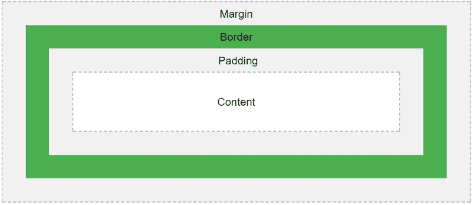
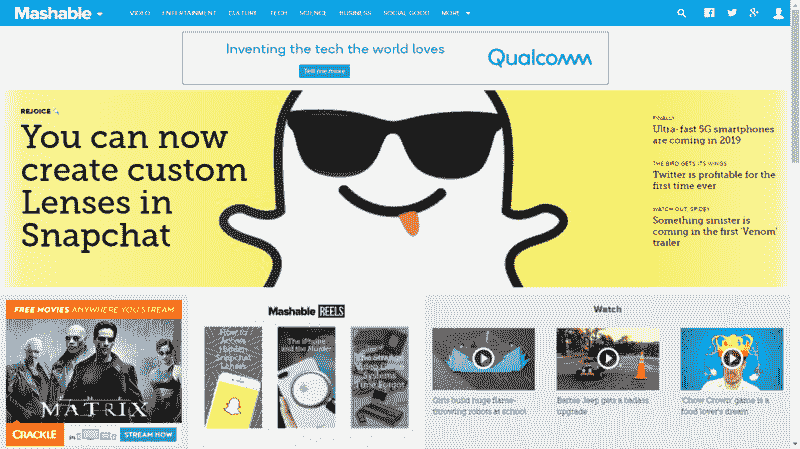
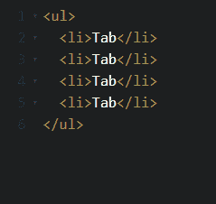
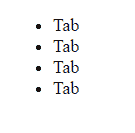
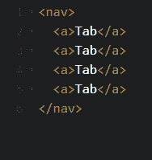
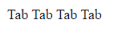
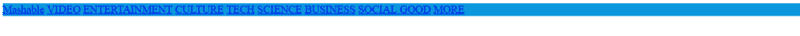
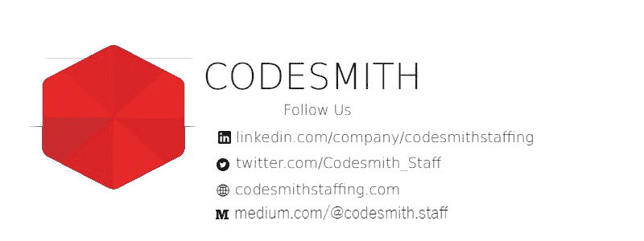

# 如何用 HTML 和 CSS 轻松构建 Mashable 的导航栏

> 原文：<https://www.freecodecamp.org/news/how-to-easily-build-mashables-navigation-bar-with-html-and-css-9e5007af786/>

作者 Codesmith

当你游览 wecodejs.com 时，你可能会想，“伙计，这导航条真不错。多么大而漂亮的导航栏啊。它赢了。”

然后你去你的代码编辑器，似乎不能让你的 HTML 元素块类似于那个大而漂亮的导航条。

你想，写 CSS 就像做根管治疗一样。见鬼，这也可能是魔法。

这不是魔法。你可以很容易的设计一个“导航条”或者任何其他的网页组件。你所要做的就是改变你看待 CSS 的方式。

### 元素，你是什么？

我们首先要摆脱的观念是，CSS 所做的一切都是美化事物。这是处理 CSS 项目的错误方式，因为它会分散你对 CSS 真正用途的注意力。在非常基础的层面上，我们使用 CSS 来组织网页上的元素。

什么是元素？MDN 是这样定义 HTML 元素的:

> 一个**元素**是网页的一部分。在 [XML](https://developer.mozilla.org/en-US/docs/Glossary/XML) 和 [HTML](https://developer.mozilla.org/en-US/docs/Glossary/HTML) 中，一个元素可能包含一个数据项、一段文本或一幅图像，或者什么都不包含。一个典型的元素包括一个带有一些[属性](https://developer.mozilla.org/en-US/docs/Glossary/Attribute)的开始标签、包含的文本内容和一个结束标签。

呸。这对我们没什么帮助。W3Schools 的定义更直白，就是:“所有的 HTML 元素都可以认为是盒子。”

太神奇了！不，说真的，怎么强调都不为过。在研究 CSS 时，很容易忽略这一点。如果我们可以将我们创建的每一个 HTML 元素概念化为一个新的盒子，我们就可以更好地理解 CSS 在排列这些盒子中的作用。

突然间，“盒子模型”变得有意义了。我肯定你以前见过。



w3schools

填充、边框和边距属性都有助于框的形状。我们使用填充来创建框的视觉图像，使用边框来围起它的周边，并使用边距来将它与其他框区分开来。

现在，这如何适用于我们的导航条难题？让我们开始编码来找出答案。我们将重新创建 Mashable 的导航条，去掉下拉菜单和社交图标(这是另一个教程的内容)。一定要跟着编码，因为这是最好的学习方式。



Look at all those quadrilaterals ! Comment below the number of boxes on this page

### 计划，计划，计划

用清单开始一个项目有助于我们编写有组织的代码。通常，我们会建立一个线框，但我们已经有了一个模型。

**HTML:**

1.  创建一个包含所有选项卡元素的 nav 元素
2.  创建选项卡元素
3.  将最上面的标签标识为徽标

**CSS:**

1.  将导航条的颜色设置为蓝色
2.  将选项卡框的颜色设置为较浅的蓝色
3.  将标签框中的字体设置为无衬线字体，并将它们涂成白色
4.  设置徽标的字体和框属性。

### 两个导航条的故事

看起来我们已经准备好编码了，但是等等！还记得我们之前提到的“HTML blob”吗？好吧，你需要考虑你想要用来创建导航条的元素。用 HTML 编写它的一种方法是创建一个无序列表:



输出:



如果您刚刚开始使用 CSS，这可能看起来像一个不可变的 blob。我们甚至没有添加链接，这意味着我们必须嵌套元素。

这里有一个更简单的方法来创建导航栏，同时保持我们的标记语义:



Everything’s arranged nicely for us thanks to anchors!

如你所见，我们只用 HTML 就黑进了一个导航条。现在我们所要做的就是实现盒子模型来分隔它们。让我们使用第二个 HTML 样板文件来创建 Mashable 的导航条，然后我们将提供一个如何正确设置其样式的演练。


Notice how we use an id to differentiate the logo.

### CSS 拯救世界

现在让我们用一些 CSS 来组织这些盒子。我们将列出完成这项任务所需的所有选择器。

```
/* we'll target the entire nav */nav {}
```

```
/*we'll target a specific tab*/  nav a { }
```

```
/*we're going to use a css pseudo-class to change the background color when we hover over a tab */  nav a:hover {  }/*we're going to target the logo for some specific styles 'cause the logo is super special*/  #logo {  }
```

首先，我们应该设置导航的宽度和高度，并添加一些颜色。色轮的一个重要资源就是这里的。

```
nav {  width: 100%; //width should be a percentage for responsiveness  height: 38px; //height should be px. Adjust to your liking  background-color: #0b98de;//hex color code should be used
```

```
}  nav a { }  nav a:hover {  }  #logo {  }
```



我们有导航条！接下来，让我们开始创建一些可以移动的盒子。我们可以通过将元素显示为块来做到这一点。

```
nav {  width: 100%;  background-color: #0b98de;
```

```
}  nav a {    display: block; 
```

```
 }  nav a:hover {  }  #logo {  }
```


好像我们弄坏了我们漂亮的导航系统。我们不一定需要这样做，但是当我们可以将每个元素视为一个块时，对齐我们的元素就容易多了。为了解决这个问题，我们简单地写道，`float: left;.`这将使我们回到起点。

**注意:**这一步可以跳过，**但是**如果你正在使用一个无序列表，那么它必须被实现。

现在让我们创建盒子。如果你回头看看盒子模型，你会注意到填充是创建这些盒子的原因。如果你想看看这是如何工作的，并测试你的盒子的大小，在`nav a`选择器中设置一个`background-color`和`border:`。

```
 nav a {    display: block;    float: left;/*We're just setting up fonts settings here*/
```

```
 font-family: sans-serif;    font-size: 9px;    color: white;
```

```
/*Box Method Test AKA handicap*/
```

```
 background-color: #17b0cf;    border: 1px solid #000; 
```

```
 /*Padding Our Box*/
```

```
 padding-top: 20px;    padding-right: 10px;    padding-bottom: 10px;    padding-left: 10px;
```

```
/Let's remove the dumb link decoration*/    text-decoration: none;
```

```
} 
```


宽度各不相同，但这符合 Mashable 的随机风格。如果你渴望一致性，你总是可以设置一个宽度。我们还调整了这里的字体，以获得整洁的外观。你可以从谷歌获得一些很棒的字体。确保将他们提供的链接标签粘贴到您的`<he` ad >标签中。

我们将删除我们的差点并将`background-color`属性移动到`nav a:hover`选择器。如果你需要调整，你可以一直保持差点。


That’s a pretty nice hover color

我们快完成了。让我们在标志上下功夫。

```
#logo { /*font*/
```

```
 font-family: 'Hind', sans-serif;  font-size: 30px;  letter-spacing: -2px;  text-shadow: 1px 1px 2px #c4c4c4;
```

```
/*box*/
```

```
 padding-left: 20px;  padding-right: 40px;  margin-right: 10px;  margin-top: -20px;  }
```

你可能已经注意到你的填充框已经超出了导航。你所要做的就是通过添加`overflow: hidden;`到你的`nav`选择器来隐藏溢出。这个小财产免除了很多挫折。

### 最终产品


### 闭幕词

CSS 似乎是一种充满魔力的语言，尤其是如果你习惯了编程语言的逻辑。但是你所要做的就是在构建网站布局的时候记住盒子方法。

当然，CSS 大师们会用一些技巧来增加额外的风格。我们将在下面列出一堆资源，让你马上成为 CSS 专家。如果你仍然对 CSS 感到恼火，那么你应该看看一些[预处理器](https://htmlmag.com/article/an-introduction-to-css-preprocessors-sass-less-stylus)，它们被设计来使设计整个网站的任务更加有效。

### 资源:

[CSS 招数](https://css-tricks.com/)

通过浏览这个网站，你将知道如何创造你梦想的任何东西。

[沉积器](http://thecodeplayer.com/)

编码器提供实时编码来帮助你理解 CSS 的细微差别。

[颜色计算器](https://www.sessions.edu/color-calculator/)

获取背景颜色的精确值。

如果本教程有所帮助，不要忘了鼓掌。在和 CSS 扯皮的时候，分享给主管 desk 的朋友。

和平编码，

拉吉·阿因拉|实习技术内容撰稿人|电子邮件:rajiayinla858@gmail.com



Icons Designed by [**Freepik**](http://www.freepik.com/) from **[www.flaticon.com](http://www.flaticon.com/)**