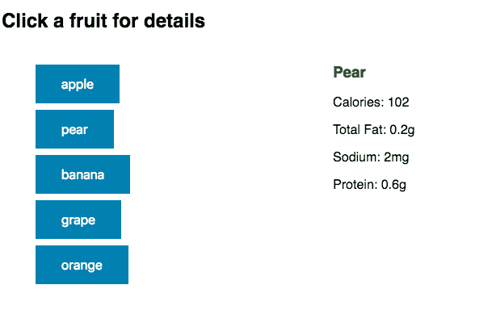
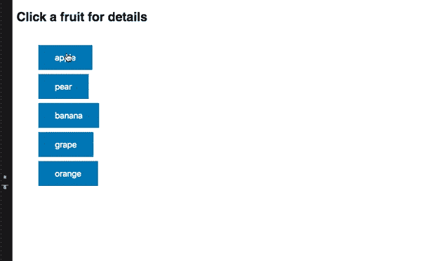
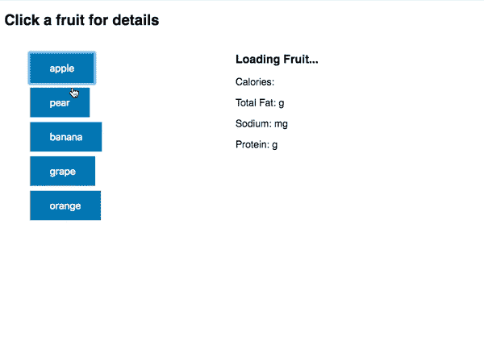

# 如何用 RxJS 轻松取消 useEffect HTTP 调用

> 原文：<https://www.freecodecamp.org/news/how-to-easily-cancel-useeffect-http-calls-with-rxjs-d1be418014e8/>

现在 [React Hooks](https://reactjs.org/docs/hooks-overview.html) 已经正式发布，互联网上出现了更多的模式。

### 使用效果

`useEffect`钩是最受欢迎的，因为它可以取代`componentDidMount`、`componentDidUpdate`和`componentWillUnmount`。

组件可能需要的大多数初始化、更新和清理逻辑都可以放在`useEffect`中。

### 丑陋的用户体验

在最近的一个项目中，我遇到了一个场景，其中`useEffect`对我不再感兴趣的 HTTP 请求进行操作。

从概念上讲，用户界面是这样的:



*   在第一次加载时，获取水果列表并为每个水果渲染一个`<button>`。
*   点击`<button>`获取该水果的详细信息。

但是看看当我连续点击多个水果时会发生什么



在我停止点击后，水果的细节部分一直在变！

### 代码

让我们来看看我利用`useEffect`的定制钩子。

如果你想继续，这里有 [Codesandbox](https://codesandbox.io/s/l5l746yll7) 和 [GitHub](https://github.com/yazeedb/useEffect-rxjs-cancel-fetch/) 链接。文件是`useFruitDetail.js`。

```
import { useEffect, useState } from 'react';
import { getFruit } from './api';

export const useFruitDetail = (fruitName) => {
  const [fruitDetail, setFruitDetail] = useState(null);

  useEffect(() => {
    if (!fruitName) {
      return;
    }

    getFruit(fruitName).then(setFruitDetail);
  }, [fruitName]);

  return fruitDetail;
}; 
```

每当`fruitName`改变时，我们将请求它的细节。我们没有办法取消请求！如此快速地重新运行会导致许多我们不再感兴趣的状态变化。

如果您将它呈现给 UI，您会得到混乱的用户体验，其中细节部分一直闪烁，直到最终请求得到解决。

### Enter RxJS

对于 RxJS 来说，忽略旧的请求是微不足道的。

它能做的比我在这里演示的要多得多，所以我强烈推荐您[深入了解它](https://www.learnrxjs.io/)！

我们代码的这一部分，即*效果*代码，需要改变。

```
() => {
  if (!fruitName) {
    return;
  }

  getFruit(fruitName).then(setFruitDetail);
}; 
```

让我们使用 RxJS `defer`函数将`getFruit`转换为可观察值，而不是承诺。我们称之为`.subscribe`，而不是`.then`。

```
import { defer } from 'rxjs';

// ...

() => {
  if (!fruitName) {
    return;
  }

  defer(() => getFruit(fruitName)).subscribe(setFruitDetail);
}; 
```

这还不能解决问题。如果`fruitName`发生变化，我们仍然需要*取消订阅*。

根据 [React 的文档](https://reactjs.org/docs/hooks-reference.html#cleaning-up-an-effect)，我们可以返回一个将在效果结束时执行的函数。这充当了清理逻辑。

大概是这样的:

```
() => {
  if (!fruitName) {
    return;
  }

  const subscription = defer(() => getFruit(fruitName)).subscribe(
    setFruitDetail
  );

  return () => {
    subscription.unsubscribe();
  };
}; 
```

### 有用！



这样的体验干净多了！

通过点击另一个水果，`useEffect`看到`fruitName`的变化，并运行前一个效果的清理逻辑。因此，我们取消了之前的 fetch 调用，并专注于当前的调用。

现在，我们的 UI 耐心地等待，直到用户点击完毕，最新水果的详细信息返回。

感谢您将本教程进行到底！