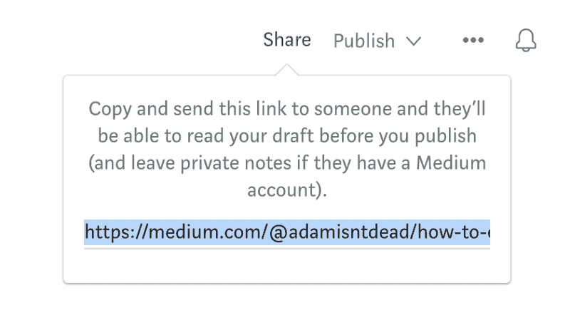
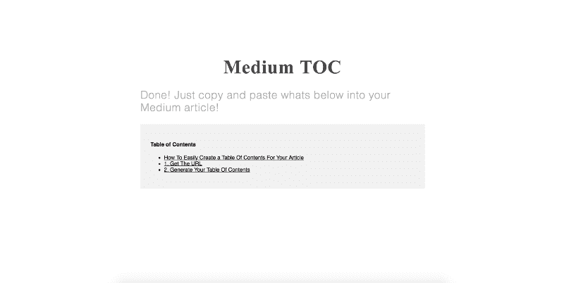

# 如何轻松地为您的文章创建目录

> 原文：<https://www.freecodecamp.org/news/how-to-easily-create-a-table-of-contents-for-your-article-507e313b2af3/>

亚当·凯利

# 如何轻松地为您的中型文章创建目录

在这篇文章中，我将讨论如何为你的中型文章创建一个目录，我将向你展示我是如何构建这个特性的。

#### 目录

*   [获取网址](https://medium.com/p/507e313b2af3#e2d0)
*   [生成您的目录](https://medium.com/p/507e313b2af3#b4b8)
*   [设计](https://medium.com/p/507e313b2af3#d9a8)
*   [开发](https://medium.com/p/507e313b2af3#dca5)
*   [获取来源](https://medium.com/p/507e313b2af3#696e)

你们中的许多人可能已经看过[这篇关于如何链接到你的媒体文章的文章](https://medium.freecodecamp.org/how-to-link-to-a-specific-paragraph-in-your-medium-article-2018-table-of-contents-method-e66595fea549)。你可能也见过[这个 chrome 扩展](https://medium.com/@castroalves/medium-anchor-a-must-have-chrome-extension-for-bloggers-c45dfdc6b91e)，它让过程变得更简单。

你可以做得更好。这就是如何为你的中型文章自动创建一个目录。

### 1.获取网址

首先，你需要你的媒体文章的网址。如果它已经发表，只需从你的地址栏中抓取链接即可

如果你还在写作，点击右上角的“分享”按钮，从那里复制链接

### 2.生成您的目录

现在是简单的部分。转到[www.mediumtoc.com](https://www.mediumtoc.com)，将你的网址粘贴到输入栏，点击“Go”

然后它应该给你你的内容，你可以复制粘贴到你的媒体文章！

你可以在这篇文章的顶部看到这一点。

### 我是如何建造这个的

#### 设计:

我最初在[草图](https://www.sketchapp.com/)中设计网站。我选择了一些来自 Medium 网站的设计线索，标题使用衬线字体，我也使用了相同的按钮设计。

我选择使用一个[https://material.io/guidelines/components/text-fields.html](https://material.io/guidelines/components/text-fields.html)输入栏，因为它的设计实用且简约，这正是我想要的风格。

#### 发展:

这款应用的架构很大程度上基于 [JAM stack](https://jamstack.org/) 。这是基于客户端 Javascript、可重用 API 和预建标记的思想。它允许网站上 cdn。

该站点的架构是:

**前端:** [React](https://reactjs.org/) 和 [Preact](https://preactjs.com/) (一个轻量级的虚拟 DOM 实现)投入生产

**后端:** Express 现在运行在[上](https://zeit.co/now)，虽然我计划迁移到 AWS Lambda，因为只有一个 API 端点。后端从中间文章中抓取标题并返回它们的链接。

**前端托管/ CDN:** 站点运行在 [Netlify](https://www.netlify.com/) 上，Netlify 有免费的 SSL 集成，从 GitHub 上的主分支自动部署。

如果有人对这些话题感兴趣，请留下评论，我会写更多关于它们的内容！

该网站的设计和开发历时两天。第一天的重点是网站的后端和设计。第二天是发展。只有 4 个 react 组件，我选择不使用 redux，因为状态没有太大变化。

#### 获取来源！

这是开源的，所以你可以在[github.com/adamisntdead/medium-toc](https://github.com/adamisntdead/medium-toc)上获得所有代码。✨

非常感谢 freeCodeCamp 社区精彩的[出版物](http://medium.freecodecamp,com)！

### 如果你喜欢这篇文章，请留下掌声！？想要更多这样的文章？跟我来。