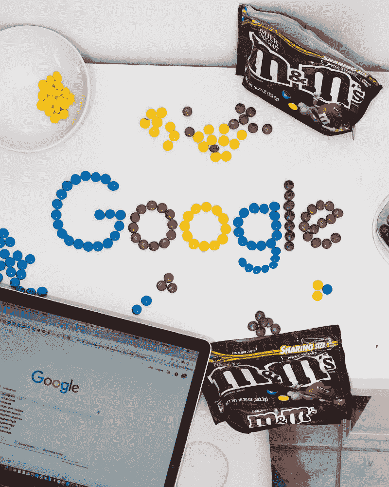
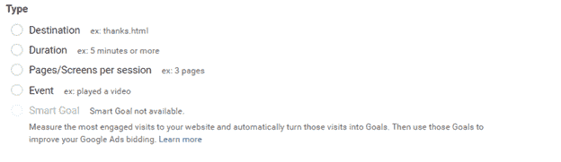
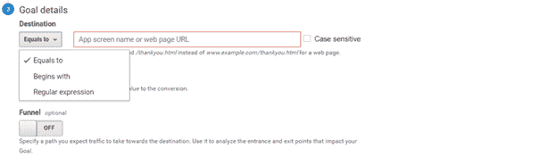
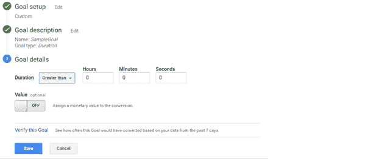
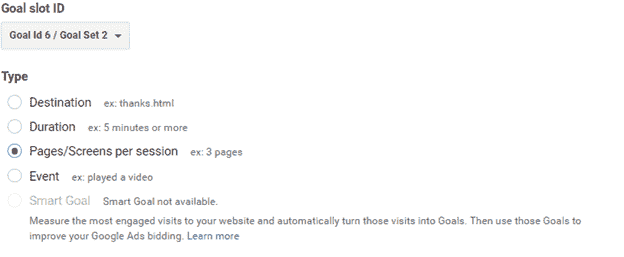
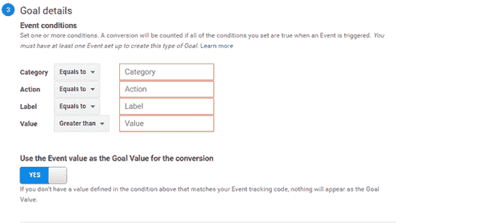
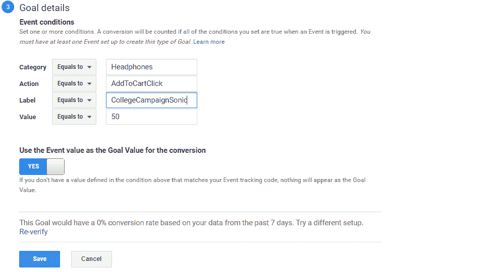

# 如何在 Google Analytics 中轻松设置自定义事件跟踪

> 原文：<https://www.freecodecamp.org/news/how-to-easily-set-up-custom-events-tracking-in-google-analytics-d1818e2ecdd0/>

潘卡杰·辛格

# 如何在 Google Analytics 中轻松设置自定义事件跟踪



[**Learn To Set Custom Goals in GA while enjoying M&Ms!**](http://www.quickcode.co/free/course/learn/Google-Analytics-Basics-For-Beginners-Free--2018/1071)

### **不断增长的定制事件跟踪需求**

五年多以来，我一直是一名由技术专家转型的分析专家。最近，一个朋友问我如何在他的小型商业网站上设置自定义事件跟踪，并更好地了解他的网站的用户行为。

直到几年前，小企业和个人博客对知道他们网站上的独立访问者和页面浏览量感到满意。但是现在每个人都想了解更多，而不仅仅是页面浏览量。他们想知道有多少用户点击了不同的按钮，观看了视频，查看了产品的细节，或者点击了第三方广告等等。越来越多的人需要了解不同的用户如何使用他们的数字资产。

你可以用你的网站实现很多目标，网站上也有很多活动需要监控。虽然大企业有专门的团队，但小公司通常有一个人管理他们的分析帐户的分析和技术设置。

> “谢天谢地，只要你知道正确的步骤，在 google analytics 中设定基本目标甚至是预先定制的目标并不困难。在本文中，我们将详细介绍这一点。在你享用咖啡的时候，我会用最简单的方式带你完成设定定制目标的步骤！”-谷歌的文档

## 概观

首先，为了修正，让我们来看看你的谷歌分析账户中可用的四种主要类型的自定义目标。如果您已经熟悉它们，并且只想了解最后一个(“活动”目标类型)，那么向下滚动到第 4 点:“设置活动目标”。看一下下面的截图，你就会明白你可以在 Google Analytics 中定制的四个主要目标。



The 4 Custom Goal Types in Your GA Goal Settings

你会注意到前三个目标非常直观，可以直接使用。一旦设置，他们会给你一个 x%的转换在过去 7 天。但是最后一个会返回 0%的转化率。让我们首先回顾三个简单的目标，然后我们将能够详细理解活动目标。

## **1。设定目的地目标**

你所需要做的就是给出你认为成功的页面的 URL。例如，在电子商务网站上，当一个人买了一件东西并进入“感谢”页面时，这就是成功的。所以访问感谢页面可以成为一个目标。

你只需要输入那个页面的网址作为目的地，*。您的网站可能有不同的查询参数，因此您可以使用类似“URL 开头为”、“URL 结尾为”或“Regex”的选项。*

*

Defining a ‘Destination’ Goal in Google Analytics* 

## ***2。设定持续时间目标***

*这是指用户在你的网站上花费的分钟(或小时)数。这个目标的用途可以根据网站的目的而有所不同。在你的网站上花更多的时间可能是可取的，但这并不意味着一定会有转化。也可能意味着你的网站不够简单，无法帮助用户快速完成任务。*

*然而，对于面向内容的网站，如报纸、博客、杂志或视频内容的网站，持续时间目标可能很重要。所以基于你的网站的目的，设定不同的持续时间目标可能是个好主意。*

*正如您在下面看到的，您可以为此目标输入一个持续时间，并且您将被设置为跟踪所有越过该标记的用户。*

*

Defining ‘Duration’ goal in Google Analytics* 

## ***3。每个会话的页面/屏幕数***

*这是在单个会话或访问中查看的页面数量。如果访问者关闭网站，然后第二天返回，或者在同一天间隔 30 分钟后，这被称为新的会话。*

*

Defining ‘Page Per Session’ in Google Analytics* 

## ***4。设置自定义事件目标类型***

*“事件”是指用户登陆网站的任何页面后，与网站进行互动的任何行为。最简单的例子就是当他们点击“立即购买”或“了解更多”这样的按钮时。它还可以用于下载 PDF 或电子书等操作。*

*点击按钮通常被称为 CTA，是“行动号召”的缩写。当您在自定义目标设置中选择此选项时，您将看到此窗口打开，有四个选项:*

*

Setting Fields for Google Analytics “Event’ Goal* 

*所有四个字段或参数都易于输入。GA 需要您用这四个字段定义每个事件，以便您可以在分析过程中轻松识别它们。*

> ***"* **您可以在这些参数中写任何东西，但是建议您以对您最有商业意义的方式定义它们。***——谷歌的文档***

例如，如果您正在管理一家销售电子产品和配件的商店，您可能希望像这样填写:

****A .类别:**** 产品的类别。例如，“耳机”

****B .动作:**** 假设用户点击了“添加到购物车”按钮。然后你可以在你的动作中写“AddToCartClick”。如果您有该产品的“功能”或“了解更多”的附加按钮，您可以有一个附加目标，并将其动作定义为该按钮的“学习更多”。

****C .标签**** :标签可以是帮助你在分析过程中更好地识别或分组事件的任何东西。它可以是“活动”或“品牌”的名称。例如，“CollegeCampaignSonic”。

****D .值:**** 这是一个可选值，多用于设置一个收入数。它可以用来设置一个特定的数字，比如$50，或者从页面的收入变量中获取一个动态值，比如$(“price variable”)。注意，这里的$是一个 jquery 标识符，而不是货币美元。选择一个 ID 取决于 HTML 中定义的价格或成本变量。

> “在这里定义活动目标类型值后，棘手的部分就开始了。由于 GA 中的所有其他目标一旦定义就可以直接使用，所以许多人都很困惑为什么事件目标没有立即开始工作。这就是为什么当您为此目标点击“验证转化率”时，您会看到 0%的转化率。”-谷歌的文档



Event goal is not directly usable after configuration

为了纠正这个 0%的转化率，你需要将这个目标的设置与实际的点击事件或你的网站上负责这个目标的自定义动作相结合。

# **将自定义事件跟踪与您网站的 HTML 整合在一起**

有时候，业务用户(尤其是非技术用户)在进行分析时，如果遇到任何与编码相关的事情，他们往往会感到焦虑。令人欣慰的是，谷歌已经使任何需要与您的网站集成的定制事件跟踪需求变得非常简单。只有当你在管理一个复杂的电子商务网站时，你才会需要开发人员的帮助，在大多数情况下，如果你在一家中型公司工作，你就可以获得帮助。

为了集成，Google 已经建立了一个标准的模板函数，它希望您在跟踪页面上的自定义事件时使用该函数。这是一行代码，您已经在 GA 帐户中为其设置了值。营销人员或编码人员通常将其称为 GA-Send 呼叫，其格式如下:

```
ga(‘send’, ‘event’, [eventCategory], [eventAction], [eventLabel], [eventValue]); 
```

HTML 页面中的实际 JS 函数可能只有一行，或者为了便于阅读，可能如下所示:

```
ga('send', {
  hitType: 'event',
  eventCategory: ‘Headphones',
  eventAction: ‘AddToCartClick',
  eventLabel: ‘CollegeCampaignSony'
});
```

请注意，在设置事件的各个参数时，此函数中的值必须与您的 GA 帐户中输入的值相匹配。 ****现在你还需要将上面的 GA 发送调用与 **按钮上的实际动作绑定。******

例如，您希望将上述功能与单击“添加到购物车”按钮联系起来。您需要添加的唯一步骤是在按钮 ID 的“onClick”动作事件中包含该函数。

```
Integrating the above cited Google Analytics Event script inside your HTML
<script>
$(document).ready(function(){
  $("#exampleAddNowButtonID").click(function(){
    ga ('send', 'event', 'Headphones' , 'AddToCartClick' , 'CollegeCampaignSonic');
  });
});
</script>
```

# 包扎

这让我想到了这篇文章的结尾。当我学习如何为我自己的需求设置定制跟踪时，我试图用简单和细节来解释我感到缺乏的东西。希望这一步一步的指南能帮助你设置最适合你需求的自定义目标的跟踪。

欢迎在评论中分享你的想法或提出任何与这篇文章相关的问题。

如果你想参加谷歌分析的免费在线课程，你可以访问[这里](http://www.quickcode.co/free/course/learn/Google-Analytics-Basics-For-Beginners-Free--2018/1071)。

本页面的 **部分是基于谷歌** **所创作的** [**作品的修改，并根据**](https://developers.google.com/readme/policies/) [**知识共享 3.0 署名许可**](http://creativecommons.org/licenses/by/3.0/) **中描述的条款使用。**