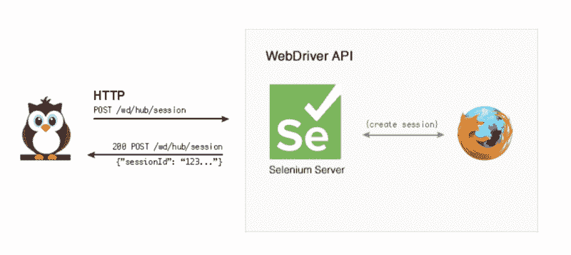
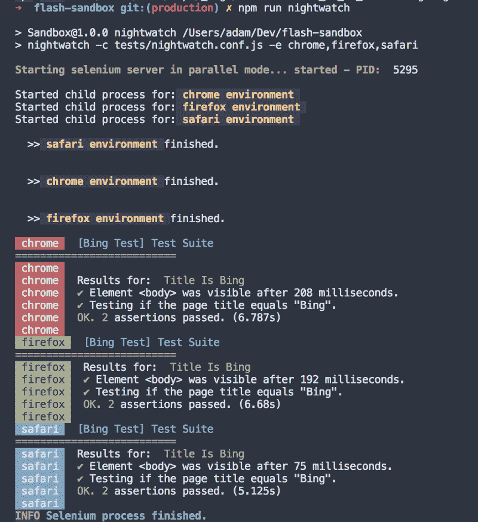

# 开始自动测试你的网站的简单方法

> 原文：<https://www.freecodecamp.org/news/how-to-easily-start-automatically-testing-your-website-8629ea8df04a/>

亚当·凯利

# 开始自动测试你的网站的简单方法


在 Chrome、Safari 和 Firefox 上多次手动运行相同的测试既耗时又繁琐。

一些测试任务可以自动化，以便更有效地处理这些任务。本文将介绍哪些类型的测试可以自动化，以及如何使用 Node.js 和 Nightwatch 实现它们。

Nightwatch 连接一个 WebDriver(比如 Selenium)。它在 REST API 上工作。例如，初始化是:



How Nightwatch connects to Selenium

### 要求

你应该安装了 Java。您可以运行以下命令来检查这一点

```
$ java -version
```

在你的终端里。如果您没有安装，请转到[安装](https://www.java.com/en/download/help/download_options.xml)它。

您必须拥有最新版本的 Safari，即版本 10 或更高版本。要使用 Safari，您还必须启用开发者菜单并启用**允许远程自动化**选项。

最后，您还必须拥有 [Node.js](https://nodejs.org/en/) 。

### 安装

> 注意:这里假设站点已经使用了 node.js。如果没有，你也必须用一个`*package.json*`文件初始化它。

#### 安装

[**Nightwatch.js**](http://nightwatchjs.org/) 是使用 Selenium 编写运行测试的更简单的方法。

要安装它，请将`cd`安装到您的项目中，然后将该模块从 npm 安装到您的开发依赖项中:

```
$ npm install --save-dev nightwatch
```

现在您需要安装 Selenium。最简单的方法是使用另一个 npm 模块，`selenium-server`:

```
$ npm install --save-dev selenium-server
```

我们想在 Chrome、Safari 和 Firefox 上测试，所以我们还必须安装它们的驱动程序。驱动程序是 Selenium 用来控制浏览器的。Safari 的驱动程序内置在 MacOS 中，Chrome 和 Firefox 的驱动程序可以使用 npm 安装:

```
$ npm install --save-dev chromedriver geckodriver
```

#### 配置

守夜人是使用配置文件配置的。配置文件是一个普通的 JavaScript 文件，我称之为`nightwatch.conf.js`。这个文件可以放在一个文件夹里，比如`tests`。

将这个基本配置复制并粘贴到您的`nightwatch.conf.js`文件中:

现在你已经有了你的自动化测试框架，你可以开始编写测试了！

### 你能/应该测试什么？

使用此设置可以进行两种类型的测试:

1.  功能测试
2.  回归测试

功能测试是一种测试，它试图看看你的网站是否符合所有的要求。通常，这意味着实现测试以确保它具有所有需要的特性。

例如，如果客户需要一个登录表单，您可以编写一个测试来检查当您登录时，您的名字在网页上是否可见。

另一种类型的测试是回归测试。这样做是为了确保您之前开发和测试的网站在发生变化后仍然以相同的方式工作。当客户可以编辑他们的网站中可能导致功能错误的部分时，这尤其有用。

例如，您可以编写一个测试来确保页面具有正确的元标签和信息。

这个测试框架的一个局限是它测试的是网站，而不是代码。例如，它不能测试是否进行了 DB 查询，但是它可以测试是否从该查询中生成了一个新行。

然而，你可以同时使用其他单元测试框架(比如 [Jest](https://facebook.github.io/jest/) 、 [Mocha](https://mochajs.org/) 和[艾娃](https://github.com/avajs/ava))，来测试你的核心逻辑和代码。

### 写作测试

欢迎来到测试的有趣部分。开个玩笑。**都很好玩**。

无论如何，Nightwatch 中的测试是使用普通的 JavaScript 模块编写的。在`nightwatch.conf.js`文件中，我们指定在`tests/features`中查找测试。

Nightwatch 将获取这个文件夹，并在其中查找所有 JavaScript 文件，然后尝试将它们作为测试运行。

让我们创建一个非常简单的测试:我们将测试[www.bing.com](http://www.bing.com)的标题是`Bing`。首先，你为什么会去 Bing 是一个更大的问题，不能在本文中解决。

在`tests/features`中创建一个名为`bing.test.js`的新文件，包含以下代码:

现在测试已经创建好了！

这里，`Title is Bing`是测试的名称。这在测试运行时显示。`.verify`用于实际执行测试。`.waitForElementVisable`期望 CSS 选择器或 Xpath 选择器指定你所引用的元素。

在同一个文件中可以有多个测试，将相关的测试保存在同一个文件中是一个很好的实践。

关于创建测试的更多信息，Nightwatch 文档非常有用。如果你想知道如何做某事，先看看这个。此外，请查看本指南的“超越”部分。

### 运行测试

要运行您现在拥有的测试，请转到`package.json`文件。添加以下内容:

```
“scripts”: {  “nightwatch”: “nightwatch -c tests/nightwatch.conf.js -e chrome,firefox,safari”}
```

这将在 Chrome、Firefox 和 Safari 上运行您的测试。

要运行您的测试，在您的终端中执行以下命令:

```
$ npm run nightwatch
```

如果您仍然有与上面相同的测试，您的输出应该如下所示:



Output of the test suite

如果您遇到错误，请查看本文的`Common Issues`部分，或者 Google 错误。

**好了**，您现在已经设置并使用了自动化浏览器测试！？

### 超越

#### 最佳实践和更深入的指南

有很多好的资源，但这里有一些我最喜欢的:

*   用 night watch . js-Page Objects |[http://Matthew roach . me/UI-Testing-with-night watch-js-Page-Objects/](http://matthewroach.me/ui-testing-with-nightwatch-js-page-objects/)
*   为 TodoMVC APP 编写 UI 测试|[https://blog . cloud boost . io/e2e-testing-with-night watch-part-two-aa 25a 4 DC 033](https://blog.cloudboost.io/e2e-testing-with-nightwatch-part-two-aaa25a4dc033)
*   了解命令队列|[https://github . com/night watch js/night watch/wiki/了解命令队列](https://github.com/nightwatchjs/nightwatch/wiki/Understanding-the-Command-Queue)
*   页面对象 API |[https://github . com/night watch js/night watch/wiki/Page-Object-API](https://github.com/nightwatchjs/nightwatch/wiki/Page-Object-API)
*   守夜人 API |[http://nightwatchjs.org/api](http://nightwatchjs.org/api)
*   night watch . js Gotchas |[https://ericheikes.com/nightwatch-js-gotchas/](https://ericheikes.com/nightwatch-js-gotchas/)
*   Nightwatch 如何断言多个元素|[https://stack overflow . com/questions/27116103/night watch-js-how-to-assert-multiple-elements？rq=1](https://stackoverflow.com/questions/27116103/nightwatch-js-how-to-assert-multiple-elements?rq=1)

#### 使用 Edge 浏览器进行测试

你可以使用[微软网络驱动](https://developer.microsoft.com/en-us/microsoft-edge/tools/webdriver/)来测试 Edge。它兼容 Windows 10 以上版本。

下载完二进制文件后，转到您的`nightwatch.conf.js`文件，在`"webdriver.gecko.driver"`下放置

```
"webdriver.edge.driver" : "location/of/binary/MicrosoftWebDriver.exe"
```

然后，转到`test_settings`并在`safari`下添加另一个对象:

```
edge: {  desiredCapabilities: {    browserName: 'MicrosoftEdge',    javascriptEnabled: true,    acceptSslCerts: true,    nativeEvents: true  }}
```

最后，转到您的`package.json`，将`nightwatch`脚本改为:

```
"nightwatch": "nightwatch -c tests/nightwatch.conf.js -e chrome,firefox,safari,edge"
```

#### 与 CI 一起使用

这超出了本文的范围，但是您可以查看:

*   [https://github.com/dwyl/learn-nightwatch/issues/8](https://github.com/dwyl/learn-nightwatch/issues/8)
*   使用流星，特拉维斯 CI 和守夜人[https://github.com/zeroasterisk/meteor-travis-ci-nightwatch](https://github.com/zeroasterisk/meteor-travis-ci-nightwatch)
*   Selenium 与 Jenkins 的集成[http://learn-automation . com/selenium-integration-with-Jenkins/](http://learn-automation.com/selenium-integration-with-jenkins/)

### 常见问题

#### 守夜人找不到硒

如果 nightwatch 找不到 selenium，请尝试使用 node 运行您的配置文件。如果您的配置文件`nightwatch.conf.js`在目录`tests`中，运行:

```
$ node tests/nightwatch.conf.js
```

#### Safari 弹出式菜单

Safari 可能会警告您它正在被控制。就允许吧。如果测试失败或超时，请再次运行。

#### Safari 不会关闭

手动关闭即可。

#### 要查看这个 web 内容，您需要安装 Java 运行时环境

我确实说过你必须安装 Java，所以去[安装它](https://www.java.com/en/download/help/download_options.xml)。

#### 错误-端口 4444 正忙，请选择一个空闲端口并使用-port 选项指定它

这意味着有东西正在使用 4444 端口。您可以停止该进程或更改该端口。

要查看哪个进程正在使用 Mac 上的端口，请使用以下命令

```
$ lsof -n -i4TCP:4444 | grep LISTEN
```

然后，您可以终止该进程。

如果您不想终止该进程，请转到`nightwatch.conf.js`文件，在`selenium`中，将`port`更改为一个未使用的端口。