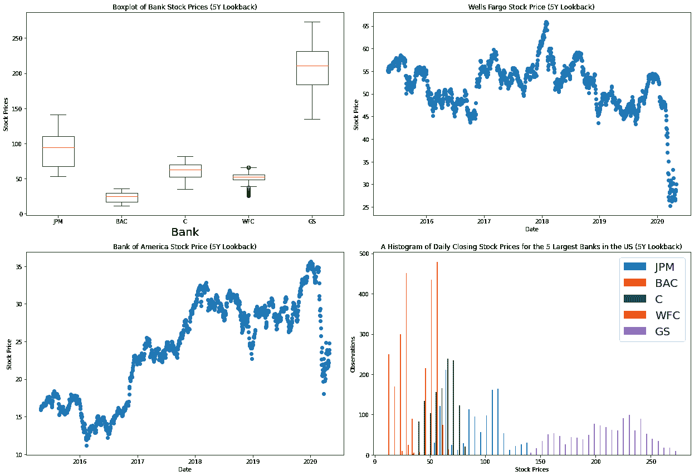

# 如何使用 Python 和 Matplotlib 在您的网站上嵌入交互式 Python 可视化

> 原文：<https://www.freecodecamp.org/news/how-to-embed-interactive-python-visualizations-on-your-website-with-python-and-matplotlib/>

在早期的 freeCodeCamp 教程中，我解释了如何用 Python 创建自动更新的数据可视化。

一些读者伸出手来询问是否有任何方法使可视化互动。幸运的是，已经有了一个简单的解决方案！

在本教程中，我将教你如何用 Python 创建交互式数据可视化。这些可视化效果非常适合嵌入到你的博客或网站上。

## 我们将使用的特定数据可视化

在本文中，我们将使用在上一篇教程中创建的可视化，而不是从头开始构建一个完整的数据可视化。

可视化使用[熊猫](https://nickmccullum.com/advanced-python/pandas-dataframes/)、 [matplotlib](https://nickmccullum.com/python-visualization/how-to-import-matplotlib/) 和 [Python](https://nickmccullum.com/advanced-python/) 来呈现来自美国 5 家最大的公开交易银行的各种数据点。

这是我们创建的可视化的静态图像:



可视化的实际代码包含在下面。我们在上一个教程中介绍了这一点，但请注意，您需要生成自己的 IEX 云 API 密钥，并将其包含在`IEX_API_Key`变量中，以便脚本能够工作。

```
########################
#Import dependencies
########################

import pandas as pd
import matplotlib.pyplot as plt

########################
#Import and clean data
########################

IEX_API_Key = ''

tickers = [
            'JPM',
            'BAC',
            'C',
            'WFC',
            'GS',
            ]

#Create an empty string called `ticker_string` that we'll add tickers and commas to
ticker_string = ''

#Loop through every element of `tickers` and add them and a comma to ticker_string
for ticker in tickers:
    ticker_string += ticker
    ticker_string += ','

#Drop the last comma from `ticker_string`
ticker_string = ticker_string[:-1]

#Create the endpoint and years strings
endpoints = 'chart'
years = '5'

#Interpolate the endpoint strings into the HTTP_request string
HTTP_request = f'https://cloud.iexapis.com/stable/stock/market/batch?symbols={ticker_string}&types={endpoints}&range={years}y&cache=true&token={IEX_API_Key}'

#Send the HTTP request to the IEX Cloud API and store the response in a pandas DataFrame
bank_data = pd.read_json(HTTP_request)

#Create an empty list that we will append pandas Series of stock price data into
series_list = []

#Loop through each of our tickers and parse a pandas Series of their closing prices over the last 5 years
for ticker in tickers:
    series_list.append(pd.DataFrame(bank_data[ticker]['chart'])['close'])

#Add in a column of dates
series_list.append(pd.DataFrame(bank_data['JPM']['chart'])['date'])

#Copy the 'tickers' list from earlier in the script, and add a new element called 'Date'. 
#These elements will be the column names of our pandas DataFrame later on.
column_names = tickers.copy()
column_names.append('Date')

#Concatenate the pandas Series togehter into a single DataFrame
bank_data = pd.concat(series_list, axis=1)

#Name the columns of the DataFrame and set the 'Date' column as the index
bank_data.columns = column_names
bank_data.set_index('Date', inplace = True)

########################
#Create the Python figure
########################

#Set the size of the matplotlib canvas
fig = plt.figure(figsize = (18,8))

################################################
################################################
#Create subplots in Python
################################################
################################################

########################
#Subplot 1
########################
plt.subplot(2,2,1)

#Generate the boxplot
plt.boxplot(bank_data.transpose())

#Add titles to the chart and axes
plt.title('Boxplot of Bank Stock Prices (5Y Lookback)')
plt.xlabel('Bank')
plt.ylabel('Stock Prices')

#Add labels to each individual boxplot on the canvas
ticks = range(1, len(bank_data.columns)+1)
labels = list(bank_data.columns)
plt.xticks(ticks,labels)

########################
#Subplot 2
########################
plt.subplot(2,2,2)

#Create the x-axis data
dates = bank_data.index.to_series()
dates = [pd.to_datetime(d) for d in dates]

#Create the y-axis data
WFC_stock_prices =  bank_data['WFC']

#Generate the scatterplot
plt.scatter(dates, WFC_stock_prices)

#Add titles to the chart and axes
plt.title("Wells Fargo Stock Price (5Y Lookback)")
plt.ylabel("Stock Price")
plt.xlabel("Date")

########################
#Subplot 3
########################
plt.subplot(2,2,3)

#Create the x-axis data
dates = bank_data.index.to_series()
dates = [pd.to_datetime(d) for d in dates]

#Create the y-axis data
BAC_stock_prices =  bank_data['BAC']

#Generate the scatterplot
plt.scatter(dates, BAC_stock_prices)

#Add titles to the chart and axes
plt.title("Bank of America Stock Price (5Y Lookback)")
plt.ylabel("Stock Price")
plt.xlabel("Date")

########################
#Subplot 4
########################
plt.subplot(2,2,4)

#Generate the histogram
plt.hist(bank_data.transpose(), bins = 50)

#Add a legend to the histogram
plt.legend(bank_data.columns,fontsize=10)

#Add titles to the chart and axes
plt.title("A Histogram of Daily Closing Stock Prices for the 5 Largest Banks in the US (5Y Lookback)")
plt.ylabel("Observations")
plt.xlabel("Stock Prices")

plt.tight_layout()

################################################
#Save the figure to our local machine
################################################

plt.savefig('bank_data.png')
```

既然我们已经了解了将要使用的特定可视化，那么让我们来讨论一下可视化的交互性意味着什么。

## 可视化的交互性意味着什么？

有两种类型的数据可视化对嵌入你的网站很有用。

第一种是静态可视化。这基本上是一个图像——想想`.png`或`.jpg`文件。

第二种是动态可视化。这些可视化通常通过平移或缩放来响应用户行为。动态可视化并不存储在`.png`或`.jpg`文件中，而是通常存储在`svg`或`iframe`标签中。

本教程是关于创建动态数据可视化。具体来说，我们想要创建的可视化将具有以下特征:

1.  您将单击左下角的按钮来启用动态模式。
2.  启用动态模式后，您可以用鼠标缩放和平移可视化效果。
3.  您还可以裁剪和缩放到可视化的特定部分。

在本教程的下一部分，您将学习如何安装和导入`mpld3`库，这是我们将用来创建交互式图表的 Python 依赖项。

## 如何导入 mpld3 库

要在我们的 Python 应用程序中使用`mpld3`库，我们首先需要完成两个步骤:

1.  在我们工作的机器上安装`mpld3`库。
2.  将`mpld3`库导入我们的 Python 脚本。

首先，让我们在本地机器上安装`mpld3`。

最简单的方法是使用 Python3 的`pip`包管理器。如果您的机器上已经安装了`pip`，您可以通过从命令行运行以下语句来完成此操作:

```
pip3 install mpld3
```

现在`mpld3`已经安装在我们的机器上，我们可以用下面的语句将其导入到我们的 Python 脚本中:

```
import mpld3
```

出于可读性的考虑，将这个导入和其余的导入一起放在脚本的顶部被认为是一个最佳实践。这意味着您的导入部分将如下所示:

```
########################
#Import dependencies
########################

import pandas as pd
import matplotlib.pyplot as plt
import mpld3
```

## 如何将静态的`matplotlib`可视化转化为交互式的数据可视化

`mpld3`库的主要功能是获取现有的`matplotlib`可视化，并将其转换成一些 HTML 代码，您可以将其嵌入到您的网站上。

我们使用的工具是`mpld3`的`fig_to_html`文件，它接受一个`matplotlib` `figure`对象作为它的唯一参数并返回 HTML。

要使用`fig_to_html`方法，只需将以下代码添加到 Python 脚本的末尾:

```
html_str = mpld3.fig_to_html(fig)
Html_file= open("index.html","w")
Html_file.write(html_str)
Html_file.close()
```

这段代码生成 HTML 并以文件名`index.html`保存在当前工作目录中。这是渲染到网页时的样子:

当您将鼠标悬停在此可视化效果上时，左下方将出现三个图标。左侧图标将可视化返回到其默认外观。中间的图标启用动态模式。右侧图标允许您裁剪和缩放到可视化中的特定点。

## 使用熊猫和 mpld3 的一个常见错误

在本教程中创建交互式可视化时，您可能会遇到由`mpld3`生成的以下错误:

```
TypeError: array([ 1.]) is not JSON serializable
```

幸运的是，在 [GitHub](https://github.com/mpld3/mpld3/issues/441) 上有一个很好的解决这个错误的方法。

您需要编辑 Lib\site-packages\mpld3 中的 _display.py 文件，并用下面的代码替换 NumpyEncoder 类:

```
class NumpyEncoder(json.JSONEncoder):
    """ Special json encoder for numpy types """

    def default(self, obj):
        if isinstance(obj, (numpy.int_, numpy.intc, numpy.intp, numpy.int8,
            numpy.int16, numpy.int32, numpy.int64, numpy.uint8,
            numpy.uint16,numpy.uint32, numpy.uint64)):
            return int(obj)
        elif isinstance(obj, (numpy.float_, numpy.float16, numpy.float32, 
            numpy.float64)):
            return float(obj)
        try: # Added by ceprio 2018-04-25
            iterable = iter(obj)
        except TypeError:
            pass
        else:
            return list(iterable)
         # Let the base class default method raise the TypeError
        return json.JSONEncoder.default(self, obj)
```

一旦进行了替换，那么您的代码应该能够正常运行，并且您的`index.html`文件应该能够成功生成。

## 最后的想法

在本教程中，您学习了如何使用 matplotlib 和 mpld3 库在 Python 中创建交互式数据可视化。以下是我们所学内容的具体总结:

1.  动态数据可视化的定义
2.  如何安装和导入 Python 的`mpld3`库
3.  如何使用`mpld3`库将`matplotlib`可视化转换成可以嵌入到你的网站上的动态可视化
4.  如何修复`mpld3`库用户遇到的一个常见错误

这篇教程是由尼克·麦卡勒姆(Nick McCullum)撰写的，他在自己的网站上教授 [Python](https://nickmccullum.com/advanced-python/) 和 [JavaScript](https://nickmccullum.com/javascript/) 开发。