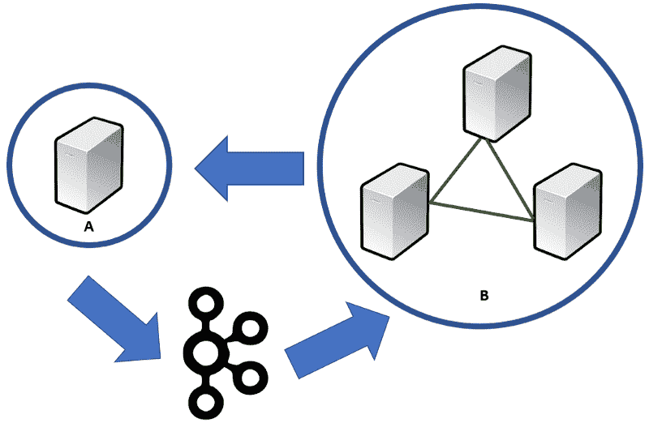
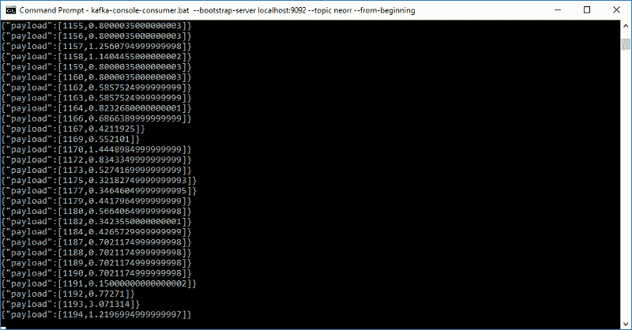
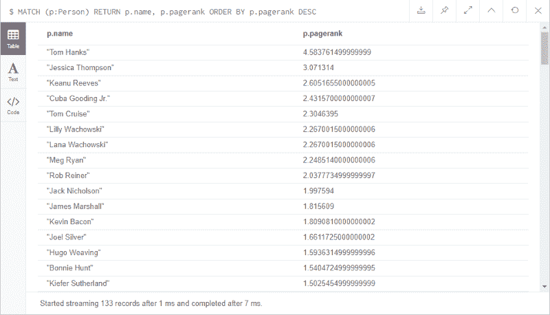

# 如何使用 Neo4j 和 Apache Kafka 进行事件驱动的图形分析

> 原文：<https://www.freecodecamp.org/news/how-to-embrace-event-driven-graph-analytics-using-neo4j-and-apache-kafka-474c9f405e06/>

作者柳比卡·拉扎列维奇

# 如何使用 Neo4j 和 Apache Kafka 进行事件驱动的图形分析


Photo by [rawpixel](https://unsplash.com/photos/xINIbQnBiWQ?utm_source=unsplash&utm_medium=referral&utm_content=creditCopyText) on [Unsplash](https://unsplash.com/search/photos/graph?utm_source=unsplash&utm_medium=referral&utm_content=creditCopyText)

### 介绍

随着新的 [Neo4j Kafka streams](https://neo4j-contrib.github.io/neo4j-streams/) 的面世，我和我的 Neo4j 同事 [**汤姆·格登斯**](https://twitter.com/tomgeudens) 都渴望尝试一下。我们有许多利用图形数据库和事件驱动架构的用例。我们探索的第一种方法将图形算法的强大功能与事务数据库相结合。

新的 Neo4j Kafka streams 库是一个 Neo4j 插件，可以添加到每个 Neo4j 实例中。它支持三种类型的 Apache Kafka 机制:

*   生产者:基于 Neo4j 配置文件中设置的主题。当指定的节点或关系类型发生变化时，将输出到所述主题
*   消费者:基于 Neo4j 配置文件中设置的主题。当选取所述主题的事件时，将执行每个主题的指定密码查询
*   过程:Cypher 中的一个直接调用，将一个给定的有效负载发布到一个指定的主题

你可以在这里更详细地了解每一个可能的样子。

### 形势概述

图形算法提供了强大的分析能力。它们通过分析关系帮助我们更好地理解数据的背景。例如，图算法用于:

*   了解网络依赖关系
*   检测社区
*   识别影响者
*   计算建议
*   诸如此类。

Neo4j 通过一个插件提供了一套现成的[图形算法](https://neo4j.com/docs/graph-algorithms/current/)，可以直接在 Neo4j 内的数据上运行。这个算法库非常受欢迎。很多次我收到反馈，说这些插件和客户以前用的一样快，甚至更快。有了这么好的反馈，我们为什么不想在 Neo4j 数据库上应用这些优化的高性能算法呢？


The Neo4j graph algorithm categories

充分利用任何分析过程都需要资源。为了获得良好的、高性能的体验，我们希望提供尽可能多的 CPU 和内存。

现在，我们可以在我们的事务集群上运行这种工作。但是在这种典型的架构中，我们会遇到一些挑战。例如，如果一台机器很大，集群中的其他机器应该是匹配的。这可能意味着建立架构是昂贵的。

我们面临的另一个挑战是，我们的集群应该管理事务——日常查询，比如处理请求。我们不想通过模型的各种迭代和排列来拖累它。理想情况下，我们希望将此与相关的分析工作一起卸载。

如果我们知道将要发生的繁重查询是只读的，那么这是一个简单的解决方案。我们可以加快读取副本的速度来管理负载。这使集群专注于它应该做的事情，支持可操作的事务性系统。

但是，作为分析处理的一部分，我们如何处理对操作图的写回呢？我们希望这些结果，如建议，尽快得到。

顾名思义，读取副本适用于只读应用程序。他们既不会参与集群领导人的选举，也不会参与书面选举。使用 Neo4j-streams，我们可以将结果从读取副本流回集群以供使用。

这种方式的巨大优势包括:

*   我们从集群中获得了高可用性/灾难恢复。
*   读取复制副本和群集上的数据将完全相同。我们不必担心更新读取副本，因为群集会为我们处理此事。
*   节点和关系的 id 在群集的服务器和读取副本上都是相同的。这使得更新变得非常容易。
*   我们可以根据需要为读取副本调配资源，这可能与群集有很大不同。

我们的架构将如下图所示。a 是我们的读取副本，B 是我们的因果聚类。A 将从 B 接收交易信息。A 计算的任何结果都将通过 Kafka 消息流回 B。



有了更新的模式，让我们继续简单的例子。

### 该示例数据集

我们将使用 Neo4j 浏览器中的`:play movie-guide`指南中提供的电影数据库数据集。在本例中，我们将使用四个 Neo4j 实例:

*   分析实例—这将是我们的读取副本，在此实例上，我们将对数据集中的所有人员节点运行 PageRank。我们将调用`streams.publish()`过程将输出发送到我们的 Kafka 主题。
*   操作实例—这将是我们的三服务器因果集群，它将监听 person 节点的任何更改。我们会及时更新。

对于 Kafka，我们将遵循[快速入门指南](https://kafka.apache.org/quickstart)中的说明，直到第 2 步。在 Kafka 启动并运行之前，我们需要在 Neo4j 配置文件中设置消费者元素。我们还将设置集群本身。请注意，目前 neo4j-streams 仅适用于 **Neo4j 版本 3.4.x** 。

为了设置三个服务器集群和一个读取副本，我们将遵循 [Neo4j 操作手册](https://neo4j.com/docs/operations-manual/current/tutorial/local-causal-cluster/)中提供的说明。遵循核心和一个读取副本的说明。

此外，我们需要为因果集群服务器向 **neo4j.config** 添加以下内容:

```
#************# Kafka Config — Consumer#************kafka.zookeeper.connect=localhost:2181kafka.bootstrap.servers=localhost:9092kafka.group.id=neo4j-core1streams.sink.enabled=truestreams.sink.topic.cypher.neorr=WITH event.payload as payload MATCH (p:Person) WHERE ID(p)=payload[0] SET p.pagerank = payload[1]
```

注意，我们想把`kafka.group.id`分别改为`neo4j-core2`和`neo4j-core3`。

对于读取副本，我们需要将以下内容添加到 **neo4j.config** :

```
#************# Kafka Config - Procedure#************kafka.zookeeper.connect=localhost:2181kafka.bootstrap.servers=localhost:9092kafka.group.id=neo4j-read1
```

您需要下载 neo4j-streams jar 并保存到**插件**文件夹中。还需要添加图形算法库，通过 Neo4j 桌面，或者[手动](https://neo4j.com/docs/graph-algorithms/current/introduction/#_installation)。

随着对各个配置文件的设置和保存以及插件的安装，我们将按以下顺序启动所有程序:

*   阿帕奇动物园管理员
*   阿帕奇卡夫卡
*   Neo4j 因果集群的三个实例
*   读取副本

一旦所有 Neo4j 实例启动并运行，并且集群发现了所有成员，我们现在可以在读取副本上运行以下查询:

```
CALL algo.pageRank.stream('MATCH (p:Person) RETURN id(p) AS id','MATCH (p1:Person)-->()<--(p2:Person) RETURN distinct id(p1) AS source, id(p2) AS target',{graph:'cypher'}) YIELD nodeId, scoreWITH [nodeId,score] AS resCALL streams.publish('neorr',res)RETURN COUNT(*)
```

这个密码查询将调用具有指定配置的 [PageRank](https://neo4j.com/docs/graph-algorithms/current/algorithms/page-rank/) 算法。一旦算法完成，我们将把返回的节点 id 和 PageRank 分数传输到指定的主题。

我们可以通过运行 [Apache Kafka 快速入门指南](https://kafka.apache.org/quickstart)(用`neorr`替换`test`)的步骤 5 来看看 neorr 主题是什么样子的:



### 摘要

在这篇文章中，我们展示了:

*   分离事务和分析数据关注点
*   轻松地将分析结果反馈回来，供实时使用

虽然我们使用了一个简单的例子，但是您可以看到复杂的分析工作是如何执行的，支持事件驱动的架构。