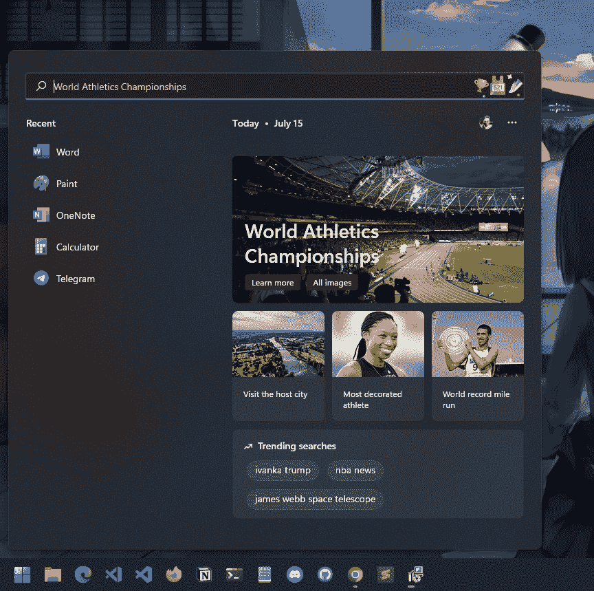
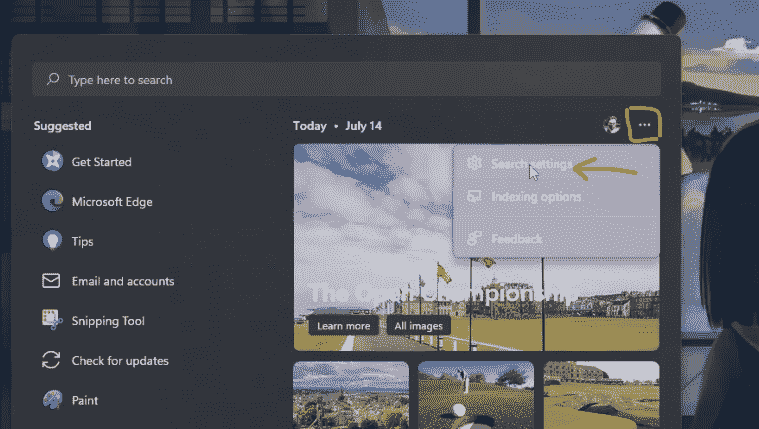
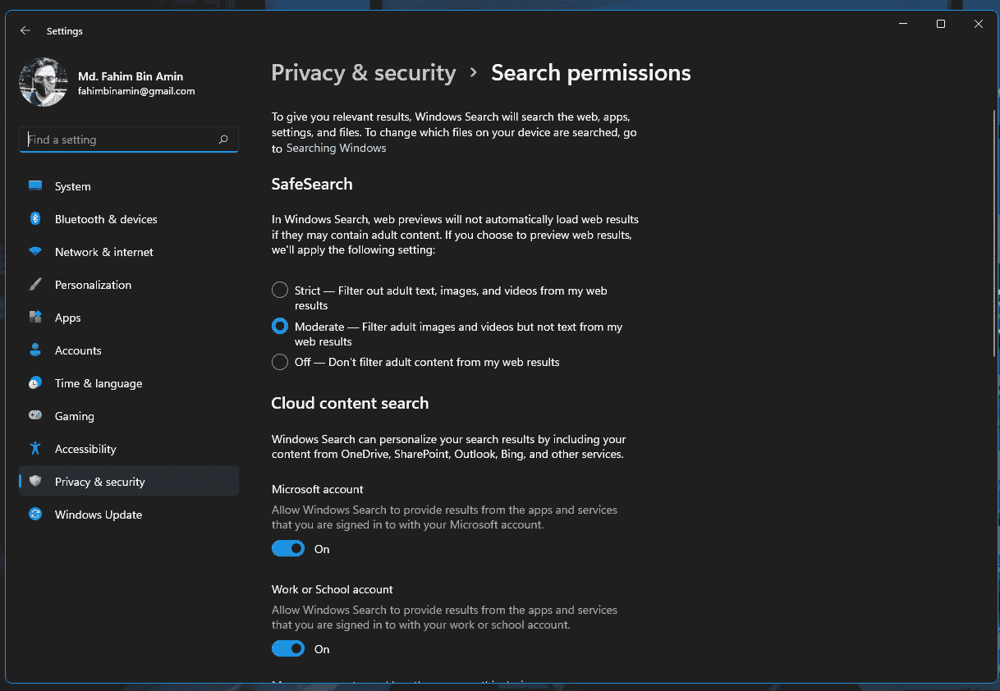
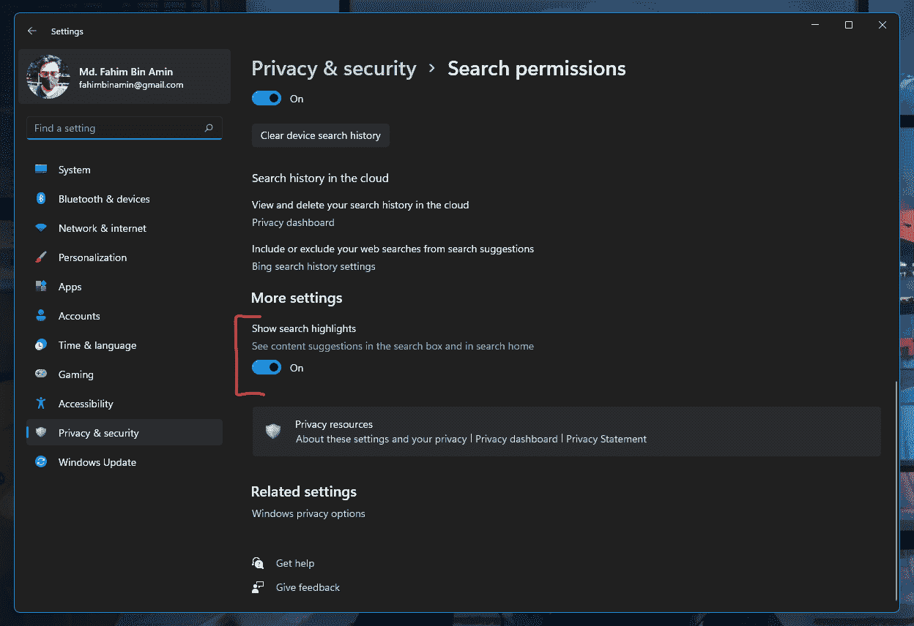
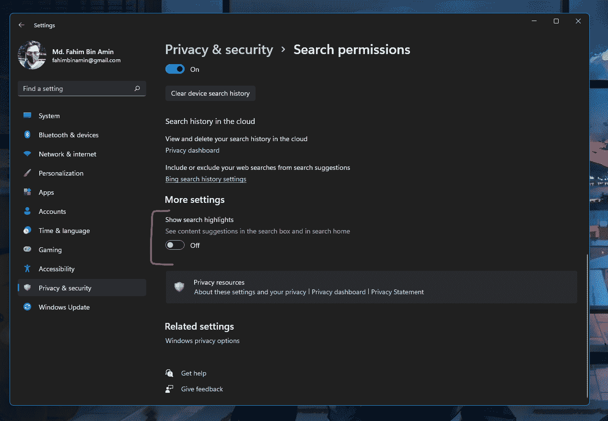
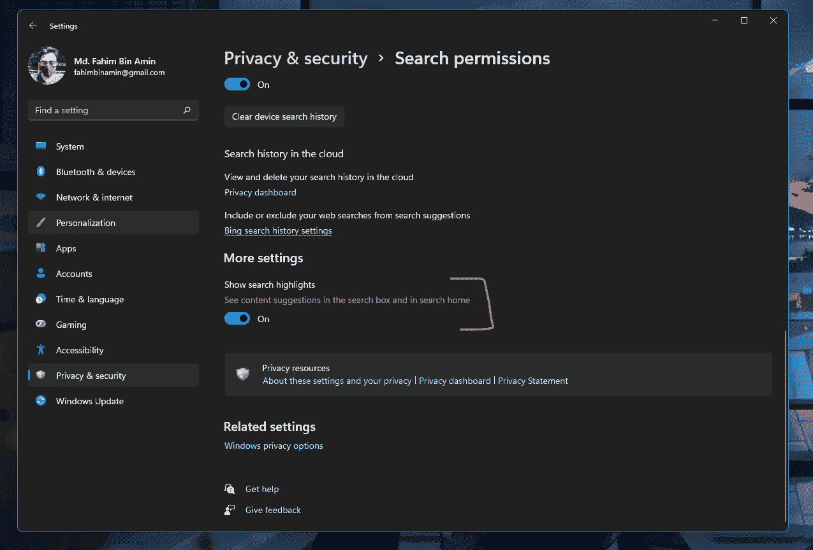

# 如何在 Windows 11 上启用和禁用搜索亮点

> 原文：<https://www.freecodecamp.org/news/how-to-enable-disbale-search-highlights-on-windows-11/>

Windows 11 是微软的新操作系统。如果你在它刚刚发布后就开始使用它，那么你已经看到了一些变化。

搜索亮点对于 Windows 操作系统来说并不新鲜，因为 Windows 10 也有同样的功能。而且你可能想去掉那个特性(不要问我为什么！每个人都有自己的选择...😅).

在 Windows 10 上启用和禁用搜索高亮非常简单。但是同样的事情对于 Windows 11 就不能说了。

所以，我写这篇文章来帮助你！我还制作了一个深度视频，一步步向你展示所有的过程。如果你喜欢视频教程，一定要去看看。

### 🎥你可以看看这个短片，看看它是如何工作的:

[https://www.youtube.com/embed/0cpZK92OnNg?feature=oembed](https://www.youtube.com/embed/0cpZK92OnNg?feature=oembed)

现在，让我们开始这个过程！

## 如何在 Windows 11 上禁用搜索高亮

首先，点击开始按钮，在那里你的视窗标志是🪟.然后点击搜索框一次。

你会在你的用户图标旁边看到选项菜单。点击那里。

点击`Search settings`。将显示“搜索权限”选项卡。

向下滚动，直到找到`Show search highlights`部分。

简单地禁用它。就是这样！

搜索突出显示将不会再次出现。

## 如何在 Windows 11 上启用搜索亮点

像前面一样打开`Search Permission`部分。然后向下滚动，直到找到`Show search highlights`部分。只需启用它！就这么简单。

## 结论

我希望这篇文章能帮助你在 Windows 11 中管理你的搜索亮点。如果你有任何建议/意见，请务必通过 [Twitter](https://twitter.com/Fahim_FBA) 或 [LinkedIn](https://www.linkedin.com/in/fahimfba/) 告诉我。

如果你喜欢编程相关的内容，你也可以订阅我的 [YouTube 频道](https://www.youtube.com/channel/UCG97GCUifMS2Vm28tgXQi0Q)(只有英文内容)，因为我尽力在那里发布优质内容。我也有[另一个品牌的 YouTube 频道](https://www.youtube.com/channel/UCEF4lxmpBKV2oYCSFH6ExIQ)，在那里我只发布孟加拉语内容。

你可以看看我的[网站](https://fahimbinamin.com/)、 [Instagram](https://www.instagram.com/fahimbinamin) 或者我的[发展集锦](https://www.polywork.com/fahimbinamin)也可以！

还有一点:我也辅导/指导其他人一些常见的编程语言。所以，如果你感兴趣，请务必通过我的 Twitter 或 LinkedIn 账户告诉我。

最后但同样重要的是——如果你对开源感兴趣，那么你可以在 GitHub 上关注我，因为我在那里非常活跃。

祝您愉快！😊