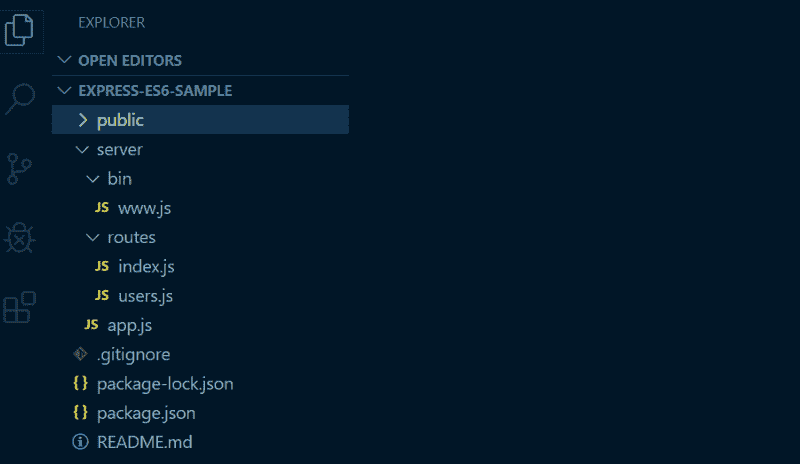
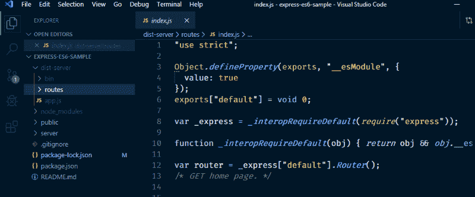
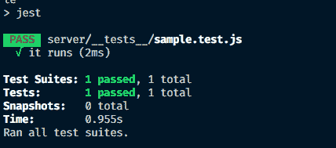

# 如何使用 Node 和 Express 启用 ES6(及更高版本)语法

> 原文：<https://www.freecodecamp.org/news/how-to-enable-es6-and-beyond-syntax-with-node-and-express-68d3e11fe1ab/>

你有没有尝试过用 ES6 语法写前端 app，但是后来决定用 Node.js 和 Express 学习后端开发的时候，才发现不能用`import from`和`export default`之类的东西？如果是这样，那你来对地方了！这是关于如何配置您的开发和生产环境、设置脚本的逐步指南，另外，我们还将学习如何添加测试！

### 目录/主题摘要

*   它是如何工作的？
*   [先决条件](#prerequisites)
*   [安装快递](#installing-express)
*   [设置脚本](#setting-up-scripts)
*   [奖金](#bonus-add-tests-)
*   [TL；博士](#tl-dr)

### 它是如何工作的？我们需要什么的高层次观点

为了在开发后端应用程序时实现类似前端开发的体验，这里有一个发生在您项目中的过程的高级视图。

#### 从 ES6+到 ES5 的代码转换器

我们需要一个将 ES6 及以上语法翻译成 ES5 代码的包。ES5 代码是 node.js 可读的 JS 语法风格，比如`module.exports`或者`var module = require('module')`。注意，在今天的时间里，几乎 99%的 ES6+语法都可以在 Node.js 中使用，这就是名为 [*babel*](https://babeljs.io/) 的包大放异彩的地方。

Babel 获取一个 js 文件，转换其中的代码，输出到一个新文件中。

#### 删除文件的脚本

每当我们改变代码中的一些东西时，我们就把它提供给编译器，它每次都会输出一个新的副本。这就是为什么我们需要一个脚本，在新的传输副本进入之前删除文件。为此，有一个名为 [rimraf](https://www.npmjs.com/package/rimraf) 的现有包。Rimraf 删除文件。我们稍后会演示这一点。

#### 文件更改的观察者

当在 Node.js 中编码时，我们的服务器不会像在 create-react-app 或 vue-cli 上做项目一样自动重启。这就是为什么我们将安装一个名为 [nodemon，](https://www.npmjs.com/package/nodemon)的包，每当我们在代码中更改一个文件时，它都会执行一些操作。我们可以利用 nodemon 在每次文件改变时重启服务器。

这就是它在引擎盖下如何工作的高级视图。至此，让我们开始讨论我们应该如何设置或投影。

### 先决条件

在我们开始之前，我们需要先设置一些东西。

1.  确保安装了 Node.js 和 npm。我建议安装他们最新的 LTS 或目前稳定的版本。可以通过 [Node.js 源码](https://nodejs.org/en/download/)或者 [NVM](https://github.com/creationix/nvm) (节点版本管理器)安装
2.  终端命令的基本知识。大多数命令都在教程中，所以你不必担心。
3.  确保您的终端已经打开，并且安装了您最喜欢的文本编辑器。

就这样，我们可以走了！

### 安装 Express

使用 Express generator，我们将使用生成的代码创建一个新项目，移动一些文件，并将一些代码转换为 ES6 语法。我们需要在这个早期阶段转换它，因为我们需要一种方法来验证我们的 ES6 代码是否有效。

#### 项目设置

在您的终端中运行此命令。你可以用你喜欢的名字来命名`your-project-name`。`--no-view` flag 表示我们不会为我们的 skeleton Express 应用程序使用任何模板引擎，如 handlebars、ejs 或 pug。

`npx express-generator your-project-name --no-view`

创建应用程序后，您需要转到应用程序目录。对于 Windows Powershell 和 Linux 终端，请使用:

`cd your-project-name`

接下来，打开你喜欢的文本编辑器。对我来说，我只是使用 VSCode，所以我只是让我的终端和文本编辑器同时打开。但是您可以使用任何您想要的文本编辑器。

#### 安装软件包以及移动和删除文件

在我们准备好生成的项目之后，我们需要`install`依赖项并移动一些文件夹。运行此命令安装 Express 和其他软件包。

npm 安装

当您等待安装依赖项时，请按照下列步骤操作。

*   创建一个`server/`文件夹
*   将`bin/`、`app.js`和`routes/`放入`server/`文件夹中。
*   将`bin`中的`www`重命名为`[www.js](http://www.js)`
*   将`public/`文件夹放在项目根目录下。

您的文件结构将如下所示:



This is how our file structure looks like. `public/` folder is at the root, and all the `.js` files are inside `server/` folder.

现在，因为我们修改了文件结构，我们的启动服务器脚本将不起作用。但是我们会一路解决的。

#### 转换为 ES6 代码

将生成的代码转换成 ES6 有点繁琐，所以我就把代码贴在这里，可以随意复制粘贴。

`bin/www.js`的代码:

现在，因为我们修改了文件结构，我们的启动服务器脚本将不起作用。下面是我们要解决的问题。在 package.json 文件中，将启动脚本重命名为在名为`"scripts"`的 json 对象中找到的`server`

```
// package.json
{
  "name": "your-project-name",
  // ....other details
  "scripts": {
    "server": "node ./server/bin/www"
  }
}
```

你会看到我们把文件路径从`./bin/www`改成了`./server/bin/www`，因为我们把文件移到了`server/`。稍后我们将使用启动脚本。

试试看！尝试在终端上键入`npm run server`来运行服务器，并在浏览器上转到`localhost:3000`。

#### 转换顶级代码以使用 ES6 导入

将生成的代码转换成 ES6 有点繁琐，所以我就把代码贴在这里，可以随意复制粘贴。

`bin/www.js`的代码:

```
// bin/www.js
/**
 * Module dependencies.
 */
import app from '../app';
import debugLib from 'debug';
import http from 'http';
const debug = debugLib('your-project-name:server');
// ..generated code below.
```

我们几乎所有的修改都只是在文件的顶部和底部。我们保留其他生成的代码不变。

`routes/index.js` 和`routes/users.js`的代码:

```
// routes/index.js and users.js
import express from 'express';
var router = express.Router();
// ..stuff below
export default router;
```

`app.js`的代码:

```
// app.js
import express from 'express';
import path from 'path';
import cookieParser from 'cookie-parser';
import logger from 'morgan';
import indexRouter from './routes/index';
import usersRouter from './routes/users';
var app = express();
app.use(logger('dev'));
app.use(express.json());
app.use(express.urlencoded({ extended: false }));
app.use(cookieParser());
app.use(express.static(path.join(__dirname, '../public')));
app.use('/', indexRouter);
app.use('/users', usersRouter);
export default app;
```

在`app.js`中，因为我们将`public/`留在了项目根，所以我们需要将 Express 静态路径向上更改一个文件夹。注意，路径`'public'`变成了`'../public'`。

`app.use(express.static(path.join(__dirname, '../public')));`

好了，我们完成了代码转换！让我们现在设置我们的脚本。

### 设置脚本

在设置脚本时，每个脚本扮演不同的角色。我们重复使用每个 npm 脚本。对于我们的开发和生产环境，它们有不同的配置。(几乎完全相同，稍后您会看到)这就是为什么我们需要编写脚本，这样我们就可以使用它们，而不用一遍又一遍地重复输入相同的内容。

#### 安装“npm-run-all”

由于一些终端命令不能在 windows cmd 上运行，我们需要安装一个名为`npm-run-all`的包，这样这个脚本就可以在任何环境下运行。在您的终端项目根目录下运行这个命令。

`npm install --save npm-run-all`

#### 安装 babel、nodemon 和 rimraf

Babel 是现代 JavaScript transpiler。transpiler 意味着您的现代 JavaScript 代码将被转换成 Node.js 可以理解的旧格式。在您的终端项目根目录下运行这个命令。我们将使用最新版本的巴别塔(巴别塔 7+)。

注意，Nodemon 是我们的文件监视器，Rimraf 是我们的文件移除器包。

`npm install --save [@babel/core](http://twitter.com/babel/core) [@babel/cli](http://twitter.com/babel/cli) [@babel/preset-env](http://twitter.com/babel/preset-env) nodemon rimraf`

#### 添加传输脚本

在 babel 开始转换代码之前，我们需要告诉它要翻译代码的哪些部分。注意，有许多配置可用，因为 babel 可以为各种不同的目的转换许多 JS 语法。幸运的是，我们不需要考虑这一点，因为有一个可用的默认设置。我们在 package.json 文件中使用名为 preset-env(我们之前安装的那个)的默认配置来告诉 Babel 我们正在以哪种格式传输代码。

在你的`package.json`文件中，创建一个`"babel"`对象并设置。

```
// package.json
{  
  // .. contents above
  "babel": {
    "presets": ["@babel/preset-env"]
  },
}
```

完成这个设置后，我们现在可以测试 babel 是否真的转换代码了。在您的`package.json`中添加一个名为 transpile 的脚本:

```
// package.json
"scripts": {
    "start": "node ./server/bin/www",
    "transpile": "babel ./server --out-dir dist-server",
}
```

这里发生了什么？首先，我们需要运行 cli 命令`babel`，指定要转换的文件，在本例中是`server/`中的文件，并将转换后的内容放在我们项目根目录下的另一个名为`dist-server`的文件夹中。

您可以通过运行以下命令来测试它

`npm run transpile`

你会看到一个新的文件夹弹出。



New folder popped up called dist-server because of the script we ran.

耶成功了！✅:如你所见，有一个文件夹与我们的服务器文件夹具有相同的文件夹结构，但其中包含转换后的代码。很酷吧？下一步是运行试试我们的服务器是否在运行！

#### 干净的脚本

为了在每次将代码传输到新文件时都有一个新的副本，我们需要一个删除旧文件的脚本。将这个脚本添加到您的 package.json 中

```
"scripts": {
  "server": "node ./dist-server/bin/www",
  "transpile": "babel ./server --out-dir dist-server",
  "clean": "rimraf dist-server"
}
```

我们制作的这个 npm 脚本意味着它删除了文件夹`dist-server/`

现在要结合 transpile 和 clean，添加一个名为`build`的脚本，它结合了这两个过程。

```
// scripts
"build": "npm-run-all clean transpile"
```

#### 运行开发脚本

现在我们有一个构建脚本，我们需要运行我们的开发服务器。我们将在 package.json 中添加一个名为`dev`的脚本，它负责将我们的节点环境设置为“开发”，删除旧的 transpiled 代码，并用新的代码替换它。

```
"scripts": {
  "build": "npm-run-all clean transpile"
  "server": "node ./dist-server/bin/www",
  "dev": "NODE_ENV=development npm-run-all build server",
  "transpile": "babel ./server --out-dir dist-server",
  "clean": "rimraf dist-server"
}
```

请注意，我们再次更改了我们在服务器脚本上运行的文件。我们正在运行带有 transpiled 代码的文件路径，在`dist-server/`中找到。

#### 添加生产脚本

如果我们有一个将节点环境设置为开发的开发脚本，我们有一个将它设置为“生产”的`prod`脚本我们在部署时使用这种配置。(Heroku、AWS、DigitalOcean 等..)我们现在再次在 package.json 中添加启动脚本和生产脚本。

```
"scripts": {
  "start": "npm run prod"
  "build": "npm-run-all clean transpile"
  "server": "node ./dist-server/bin/www",
  "dev": "NODE_ENV=development npm-run-all build server",
  "prod": "NODE_ENV=production npm-run-all build server",
  "transpile": "babel ./server --out-dir dist-server",
  "clean": "rimraf dist-server"
}
```

我们将`start`脚本默认设置为 prod，因为启动脚本总是被 AWS 或 Heroku 等部署平台用来启动服务器。

运行`npm start`或`npm run prod`进行尝试。

```
// package.json
...
"nodemonConfig": { 
  "exec": "npm run dev",
  "watch": ["server/*", "public/*"],
  "ignore": ["**/__tests__/**", "*.test.js", "*.spec.js"]
},
"scripts": { 
  // ... other scripts
  "watch:dev": "nodemon"
}
```

#### 每当文件改变时自动重启服务器怎么样？

最后一个脚本，以完成我们的开发设置。我们需要添加一个文件监视器脚本，每当文件发生变化时，它都会运行一个命令。在您的 package.json 中添加一个名为“nodemonConfig”的 JSON 对象。这是我们存储当文件更改时我们告诉观察器该做什么的地方。

另外，在 package.json 中添加一个名为`watch:dev`的脚本

```
// package.json
...
"nodemonConfig": { 
  "exec": "npm run dev",
  "watch": ["server/*", "public/*"],
  "ignore": ["**/__tests__/**", "*.test.js", "*.spec.js"]
},
"scripts": { 
  // ... other scripts
  "watch:dev": "nodemon"
}
```

Nodemon 配置包含与以下内容相关的设置

*   每当文件改变时运行哪个命令，在我们的例子中是`npm run dev`
*   要监视哪些文件夹和文件
*   以及要忽略哪些文件

关于 nodemon [配置的更多信息，请点击](https://github.com/remy/nodemon#config-files)。

现在我们已经有了文件监视器，您现在可以运行`npm run watch:dev`，编码，并保存您的文件。而且无论什么时候去`localhost:3000`，都会看到变化。试试吧！

### 额外收获:添加测试！

要在我们的项目中添加测试，只需从 npm 安装 [Jest](https://www.npmjs.com/package/jest) ，添加一些配置，并在我们的 package.json 中添加一个名为`test`的脚本

`npm i -D jest`

在 package.json 中添加一个名为“jest”的对象和一个测试脚本

```
// package.json
...
"jest": { 
  "testEnvironment": "node"
},
"scripts": {
  // ..other scripts 
  "test": "jest"
}
```

尝试一下，创建一个文件 sample.test.js，编写任何测试，然后运行脚本！

`npm run test`



Sample Screenshot of running npm run test.

### TL；速度三角形定位法(dead reckoning)

下面是如何在 Node.js 中启用 ES6 的简化步骤。我还将包括 repo，以便您可以复制和检查整个代码。

*   使用`express your-project-name`终端命令创建一个新项目。
*   将`bin/`、`routes/` 和`app`移动到一个名为`src/`的新文件夹中，并将代码转换为 ES6。另外别忘了把`bin/www`改名为`[www.js](http://www.js)`
*   安装所有依赖项和 devDependencies

```
npm i npm-run-all @babel/cli @babel/core @babel/preset-env nodemon rimraf --save
npm i -D jest
```

*   将这些脚本添加到 package.json 中

```
"scripts": { 
  "start": "npm run prod", 
  "build": "npm-run-all clean transpile", 
  "server": "node ./dist-server/bin/www", 
  "dev": "NODE_ENV=development npm-run-all build server", 
  "prod": "NODE_ENV=production npm-run-all build server", 
  "transpile": "babel ./server --out-dir dist-server", 
  "clean": "rimraf dist-server", 
  "watch:dev": "nodemon", 
  "test": "jest" 
}
```

*   将 babel、nodemon 和 jest 的配置放到您的 package.json 中

```
"nodemonConfig": {
  "exec": "npm run dev",
  "watch": [ "server/*", "public/*" ],
  "ignore": [ "**/__tests__/**", "*.test.js", "*.spec.js" ] 
}, 
"babel": { 
  "presets": [ "@babel/preset-env" ]
},
"jest": {
  "testEnvironment": "node"
},
```

*   通过运行`npm run your-script-here`来测试您的脚本
*   你会在我的 github 看到[完整的回购](https://github.com/jcunanan05/express-es6-sample/tree/master)

### 注释和免责声明

请注意，这种设置可能并不适用于所有情况，尤其是对于大型项目。(比如 1k 文件的代码)。传输步骤和删除可能会降低开发环境的速度。再加上，ES 模块，快要到节点了。但是，尽管如此，这是一个很好的教育材料来理解 transipiling 如何在幕后运行，就像我们开发前端应用程序一样:)

### 结论

好吧！我希望你学到了很多。谢谢你读到这里。

编码快乐！

点击此处查看完整的回购协议。

这篇文章发表在 freeCodecamp 新闻上。

[？推特](https://twitter.com/devJonathanC_) - [？freeCodeCamp](https://www.freecodecamp.org/jcunanan05) - [？作品集](https://jonathancunanan.com) - [⚛️ Github](https://github.com/jcunanan05)