# Windows 沙盒教程–如何在 Windows 上启用沙盒

> 原文：<https://www.freecodecamp.org/news/how-to-enable-sandbox-on-windows/>

Windows 沙盒是一个临时的轻量级桌面环境，您可以使用它在隔离的空间中安全地运行 Windows 应用程序。

您在 Windows 沙盒环境中安装的软件或应用程序保持“沙盒化”，它们都独立于主机运行。因此，无论在沙箱中发生什么，您的主机都是 100%安全的。

由于沙箱是您的主机的临时实例，当您关闭它时，所有的软件、数据、文件和状态也会被立即删除。因此，您应该在关闭沙箱之前，将以后需要的所有必要数据/软件从沙箱复制到主机上。

每当你打开沙盒，每次你都会得到一个全新的实例。这也意味着您将获得一个全新的主机实例，作为一个临时的实验实验室。在那里，您可以尝试任何您想要的 Windows 应用程序/数据，而没有破坏您的原始主机的风险。

根据[微软文档](https://docs.microsoft.com/en-us/windows/security/threat-protection/windows-sandbox/windows-sandbox-overview)，

> Windows 沙盒有以下属性:
> **Windows 的一部分:**该功能所需的一切都包含在 Windows 10 Pro 和 Enterprise 中。没有必要下载 VHD。
> **质朴:**每次 Windows 沙盒运行，都干净得像全新安装的 Windows。
> **一次性:**设备上不会保留任何东西。当用户关闭应用程序时，所有内容都会被丢弃。
> **安全:**使用基于硬件的虚拟化进行内核隔离。它依赖微软虚拟机管理程序来运行一个独立的内核，将 Windows 沙盒与主机隔离开来。
> **高效:**使用集成的内核调度程序、智能内存管理和虚拟 GPU。

💡(默认情况下，Windows 沙盒启用网络连接。可以使用 [Windows 沙盒配置文件](https://docs.microsoft.com/en-us/windows/security/threat-protection/windows-sandbox/windows-sandbox-configure-using-wsb-file#networking)将其禁用。

本文中，我使用的是 Windows 11 Pro。Windows sandbox 也像文档上说的一样可以用在 Windows 10 上，流程也差不多。

## 使用 Windows 沙盒进行虚拟化

这是沙盒的重要组成部分。因为它在高架空间上运行，所以它必须需要虚拟化功能。您必须确保已经启用了虚拟化。

如果您想知道如何知道您是否启用了虚拟化，请不要担心，我将向您展示这一点！

打开任务管理器。你可以右击 Windows 图标，点击任务管理器，或者你可以使用快捷键**`Ctrl`+`Shift`+`Esc`+**来完成。

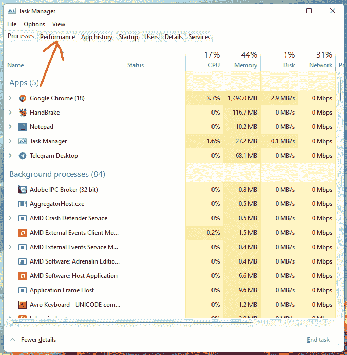

打开任务管理器后，进入**性能**选项卡。然后点击 **CPU** ，查看**虚拟化**状态，如下图。

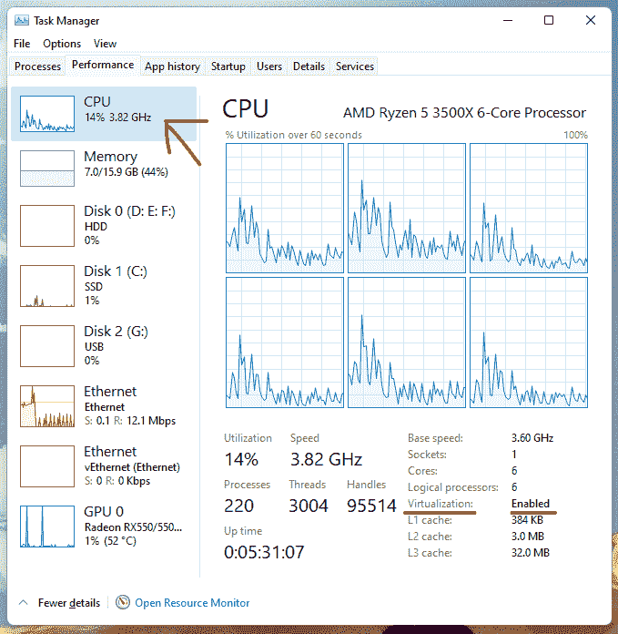

如果虚拟化状态显示已经启用，就像我的虚拟化状态一样，那么您就可以继续下一步了。

如果它说它已经被禁用，那么你需要从 BIOS 中启用它。下面我将向您展示如何启用虚拟化。

## 如何在计算机上启用虚拟化

首先，进入 BIOS。根据 BIOS 的制造商，它可以是引导时进入 BIOS 的键之一:Del、Esc、F1、F2 或 F4。

当您的屏幕在重启过程中变黑时，您必须快速点击 BIOS 键(如上所述),直到 BIOS 菜单出现。如果您正在使用的键对您不起作用，那么尝试重新启动您的计算机，并通过使用上述键中的其他键来进行完全相同的过程，直到您得到为您工作的键。

进入 BIOS 后，你必须找到你的 CPU 配置部分。您可以在 CPU、处理器、北桥或芯片组标签下找到它。在您的情况下，您可能会发现配置部分是高级或高级模式部分。

在进入 CPU 配置部分之后，您必须找到允许您启用硬件虚拟化的选项。根据您的系统，您可能会发现诸如 Hyper-V、Vanderpool、SVM(通常千兆字节的主板使用此名称)、AMD-V、英特尔虚拟化技术或简单的 VT-X 等名称

启用出现在您案例中的选项。如果您看到 AMD IOMMU 或英特尔 VT-d，也启用它们。

然后，您必须保存更改。您也可以使用快捷键，这些快捷键应该显示在您的 BIOS 上。大多数制造商使用 F10 来保存 BIOS 配置。

然后你必须退出 BIOS。您的计算机将再次重新启动。然后，如果您从您的任务管理器检查虚拟化状态，您将看到它已经被启用！

现在，我可以有把握地假设虚拟化已经在您的计算机上启用。

## 如何启用 Windows 沙盒

单击开始按钮或搜索按钮，搜索 Windows 功能。

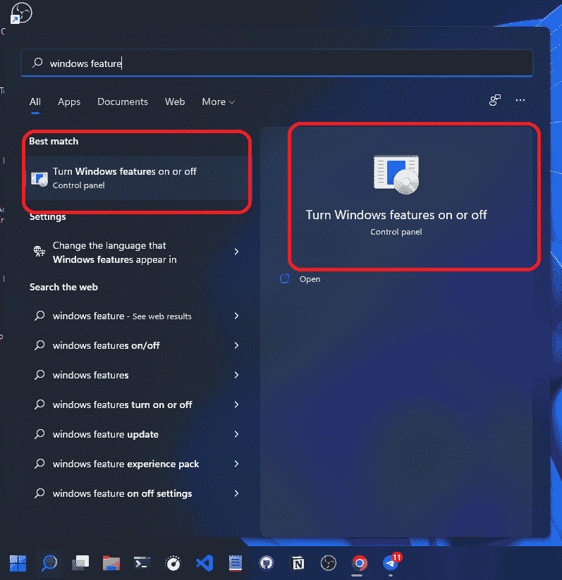

点击**打开或关闭 Windows 功能**。

它将打开**窗口功能**窗口，如上图所示。

向下滚动，直到找到 **Windows 沙盒**:

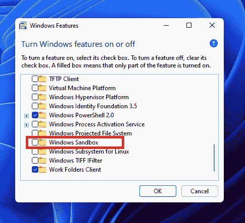

确保您已经选中了如下复选框:

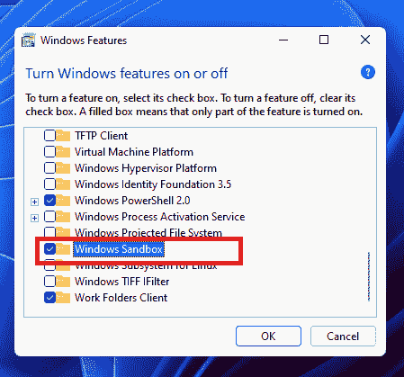

然后点击**确定**。

它将开始搜索所需的文件。

然后它会自己应用所有的更改。

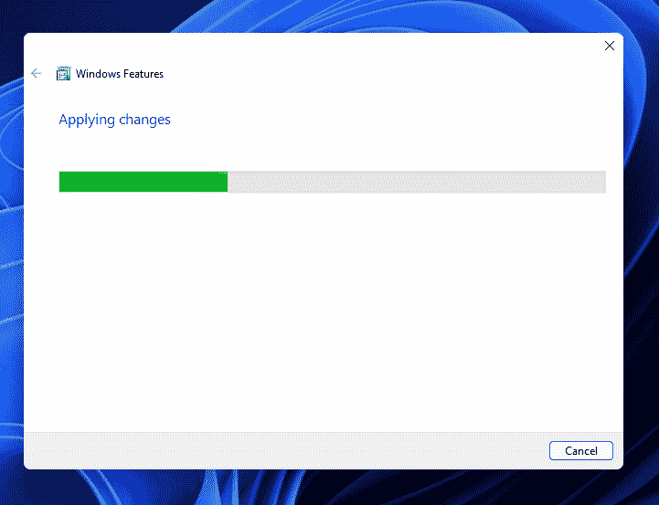

完成请求的更改后，它会要求您重新启动系统。

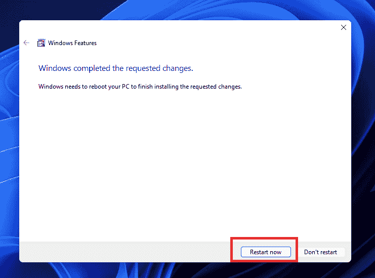

点击**立即重启**。

重新启动计算机后，您的计算机完全可以使用 Windows 沙盒了。

## 如何测试 Windows 沙盒

点击开始菜单或搜索栏，搜索 **Windows 沙盒**。

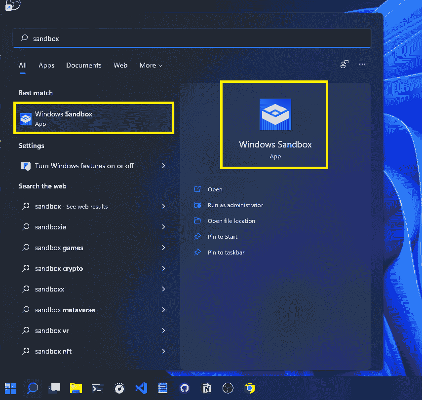

之后会打开 Windows 沙盒。不要害怕，如果你得到一个像下面这样的黑屏，因为这是正常的，当你第一次启动沙盒。

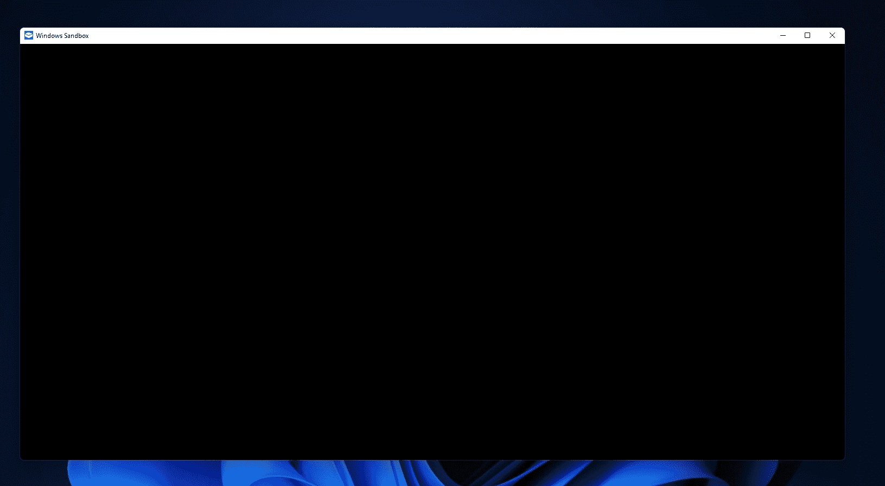

过一会儿，您会看到您的主机的一个新实例出现在您的眼前。

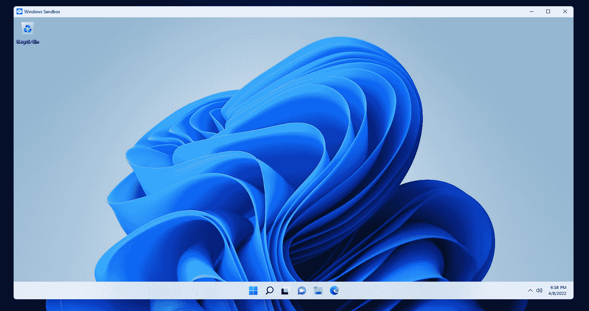

如果你愿意，你可以最大化沙盒窗口。

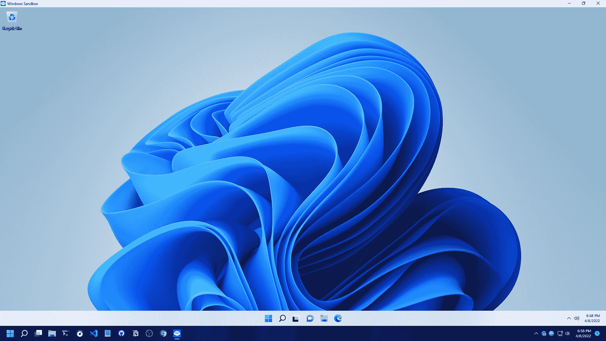

现在你可以在你的沙盒里进行实验了。感觉你在用你的主机，但你没有。您在隔离环境中使用具有提升权限的临时虚拟机，无论您在此沙盒中做什么，您的主机都将保持不变！

多酷啊，对吧！😍

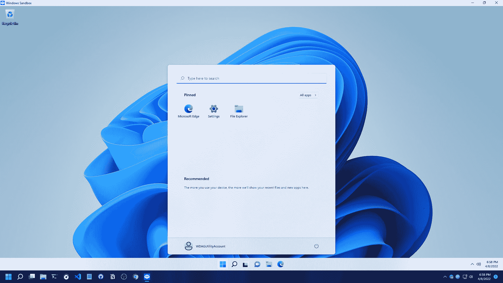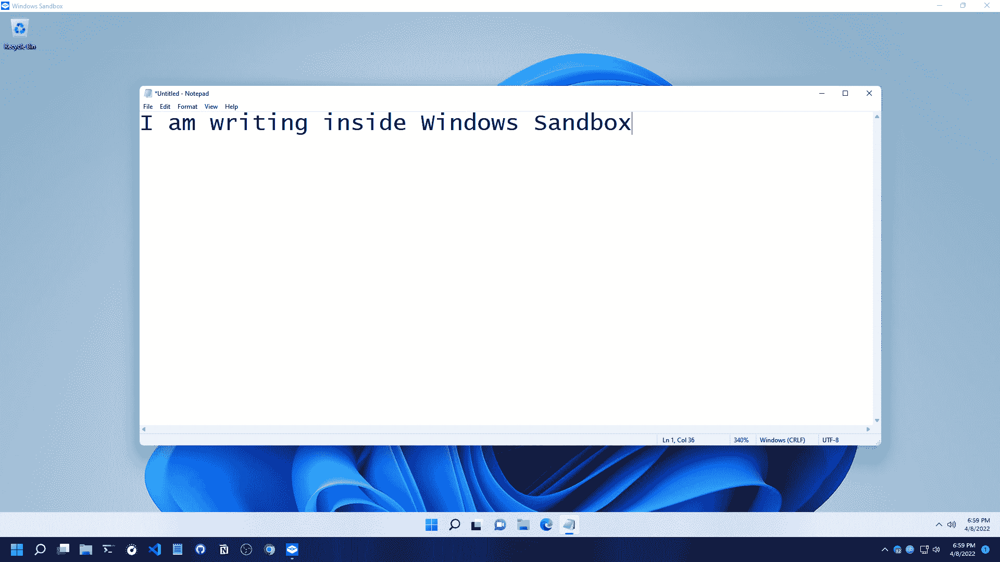

如果你想在你的沙箱中添加数据/软件，那么你必须像在你的电脑上一样复制粘贴它们。简单地复制你想在沙盒中使用的文件/软件，在沙盒窗口中，简单地粘贴它们。

## 如何关闭沙盒

在这里要小心！无论你在沙盒里做什么，都是暂时的。请记住，它不会保存在您的主机中的任何其他地方供以后使用。

一旦你关闭了沙盒，你保存在沙盒中的所有数据/应用程序都会被立即删除。

在关闭沙箱之前，您必须确保您没有在沙箱中保留任何您以后可能需要的重要内容，即使是在关闭沙箱之后。

当你想关闭沙盒，只需关闭沙盒窗口。将会出现一个提示，告诉你一旦关闭窗口，沙盒中的所有文件/应用程序都将永远消失。

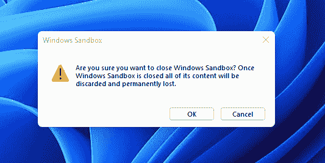

如果一切正常，那么只需点击确定。它将关闭沙箱。

如果您需要再次打开沙箱，只需像前面一样打开它，然后执行您的任务。所有的过程都完全一样。

## 结论

感谢您阅读整篇文章。如果对你有帮助，你还可以在 [freeCodeCamp](https://www.freecodecamp.org/news/author/fahimbinamin/) 查看我的其他文章。

如果你想和我联系，那么你可以使用 [Twitter](https://twitter.com/Fahim_FBA) ， [LinkedIn](https://www.linkedin.com/in/fahimfba/) ， [GitHub](https://github.com/FahimFBA) ，[英语 YouTube 频道](https://www.youtube.com/channel/UCG97GCUifMS2Vm28tgXQi0Q)，或者[孟加拉语 YouTube 频道](https://www.youtube.com/channel/UCEF4lxmpBKV2oYCSFH6ExIQ)。

💫如果你想查看我的精彩部分，那么你可以在我的 [Polywork 时间轴](https://www.polywork.com/fahimbinamin)上查看。

非常感谢！😊