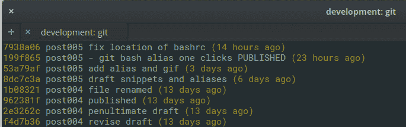

# 如何用有用的小脚本激活你吓人的终端

> 原文：<https://www.freecodecamp.org/news/how-to-energize-your-scary-terminal-with-helpful-little-scripts-c5ae92c12bfe/>

作者:Vijayabharathi Balasubramanian

# 如何用有用的小脚本激活你吓人的终端


Photo by Matt Artz on Unsplash

我将讨论三个有价值的工具，它们将最终帮助你克服对终端的恐惧:Git 别名、Bash 别名和 One click snippets。

别名和 bash 脚本的组合可以让您在开发工作流中非常高效。使用它足够长的时间，你甚至会忘记别名下面的原始命令。这实际上并不是一件坏事——直到你有了一台崭新的笔记本电脑，却不知道在旧电脑的什么地方放了你的别名:)

您可能使用了 Git 别名。您可能会发现 bash 别名是新的。**但是，不要错过**`gif`在工作接近尾声时显示一键图标。那些一键点击的桌面图标是我的防线。它们帮助我在浏览器新标签上无害的“**最常访问的**”列表让我偏离轨道之前直接投入编码/写作。

顺便说一下，我用的是 Firefox 的 nightly，很容易设置一个新标签页。好了，言归正传。

### 1: Git 别名

如果说终端是科技新手的地牢，那么 Git 则是最黑暗的通道，充满了令人生畏的长串命令。

但是，Git 是美丽的。试试这个[游戏](https://try.github.io/)。

让`git`更容易使用的一部分是设置你自己的别名。也就是说，一旦您理解了底层命令。这不是给你**所有**有用的别名。相反，我会给你指出可能性，这样你就可以**建立自己的别名列表。**

#### 单飞

比方说，你正在独自进行黑客攻击。你整天都在准备和提交，也许是你的代码或者你为博客写的东西。你会发现一堆化名非常有用。

```
git config --global alias.s statusgit config --global alias.aa 'add --all'git config --global alias.cm 'commit -am'git config --global alias.up 'push'
```

确保您有一个定义良好的`.gitignore`，以避免跟踪不必要的文件，如`node_modules`。这将有助于你使用`git aa`来存放所有文件。

所有这些别名都存储在主目录下的一个配置文件中。来看看`~/.gitconfig`。您甚至可以直接编辑配置文件——只要确保不会出错。

#### 代码协作

当您与团队协作时，一个完整的命令列表可能会很有用。记住，rebase 重写历史。只建议本地分支在远程分支上清理你的代码。

```
git config --global alias.pr 'pull --rebase upstream master'
```

这里有一个来自[哈利](https://csswizardry.com/2017/05/little-things-i-like-to-do-with-git/)的关于别名`blame`到`praise`和其他你可能会发现有用的金块。

#### 高级别名

```
git config --global alias.ls 'log --pretty=format:"%C(yellow)%h %C(green)%s %Creset(%ad)" --date=relative'
```

`%C(yellow)`用红色标记颜色代码后面的令牌。在我们上面的例子中，`%h`代表提交散列，它将在我们的终端上被涂成黄色。%Creset，不带括号，返回默认终端字体颜色。`--date=relative`告诉你`days/weeks ago`而不是实际日期。

所有这些词语都试图解释它看起来是什么样子，但事实就是这样:



color-coded git log

#### 参考

你可以在 git-scm.com 的[了解更多关于装修的知识。你可以提取一大堆信息，比如`%h`、`%n`等等。顺便说一下，**那是一本关于 Git** 的免费书籍。从第一页开始。](https://git-scm.com/docs/pretty-formats)

不久前，我从尼古拉 2014 年的亚特兰蒂斯峰会演讲中学到了很多有用的技巧。找不到视频，但是找到了[他的幻灯片](https://www.slideshare.net/GoAtlassian/becoming-a-git-master-nicola-paolucci)。不要错过别名中的匿名函数。

这是他的 G [别名](http://bit.do/git-aliases)的列表。但是，用他自己的话说，不要只是复制化名。您可以构建它们，只添加对您有用的别名。否则，这就像花几个小时整理我们永远不会读的文章/书籍。

### 2: Bash 别名

`Git`并不是唯一一个要求在终端上输入内容的`command line interface` (CLI)。想想在终端上运行的`bundle exec rails db:migrate`或者在容器上运行的`docker-compose exec npm run script`。短一点的怎么样？

如果您每天都使用较长的命令，可以考虑设置 bash 别名。

语法非常简单。

```
alias new_cmd='never-ending-command; and another command'
```

**你把这个添加到你个人文件夹中的`.bashrc`文件的末尾。**正常情况下`~/.bashrc`是它所在的位置。我最近设置的是 docker 命令。它应该成为一个榜样。

```
alias dc='docker-compose'alias de='docker-compose exec' alias up='cd ~/Projects/docker_project/; dc up'
```

我曾经注销然后重新登录，让它在终端上工作。然而，来自 S [tackoverflow](https://stackoverflow.com/questions/2518127/how-do-i-reload-bashrc-without-logging-out-and-back-in) 的这个酷酷的命令拯救了我。在你的终端上运行这个，然后马上开始使用新的别名:`source ~/.bashrc`

你和我想的一样吗？忘记 Git 别名？我们给`git pull --rebase upstream master`取什么 bash 别名？`gprum`怎么样？

去狂野吧！小心不要重用现有的命令。例如，`df`显示 Linux 中的空闲磁盘空间，所以我不会用它作为其他任何东西的别名。

### 3:一键式代码片段

我的最爱。只需点击一下您定制设计的带有您自己徽标的桌面图标，您就可以开始使用这些图标了:

*   在 VS Code/atom 中打开项目文件夹
*   在一个选项卡上运行开发服务器的终端
*   另一个选项卡运行测试/热重装
*   以 Git 状态打开的最后一个选项卡
*   最后一个标签为你打开，让你完成事情。
*   如果您的开发服务器没有打开浏览器，您可以在这里打开它

当你只需点击一个图标，整个环境就会出现在你面前，这是一件神奇的事情。一次点击，你就可以让你的文本编辑器，网络服务器和测试已经开始运行。

bash 文件`get-to-work.sh`如下所示。对了，这是在 Linux 上。

```
#!/bin/bashexport WD="~/development"code $WD gnome-terminal \ --tab --working-directory=$WD \ -e 'bash -c "export BASH_POST_RC=\"npm start\"; exec bash"' \ --tab --working-directory=$WD \ -e 'bash -c "export BASH_POST_RC=\"npm run watch\"; exec bash"' \ --tab --working-directory=$WD \ -e 'bash -c "export BASH_POST_RC=\"git status\"; exec bash"'
```

我们在变量`WD`下设置了一个工作目录。然后开始一个很长的行，在 80 个字符的终端宽度上折叠成 7 行。不要让它吓到你。如果你仔细观察，我们打开 gnome-terminal 时有三个标签，并在上面运行三个不同的命令。

运行这个命令来标记 bash 脚本可执行文件。

```
chmod +x get-to-work.sh
```

您已经可以检查脚本是否正在工作。`cd` 放入 shell 脚本所在的文件夹，并在终端上输入。

```
./get-to-work.sh
```

让我们在脚本中添加一个漂亮的桌面图标。`Exec`和`Icon`很重要。他们需要在一个`.desktop`文件中。我把我的名字命名为`get-to-work.desktop`。

对了，这是针对 Linux 的。大部分桌面使用 [freedesktop](https://specifications.freedesktop.org/desktop-entry-spec/desktop-entry-spec-latest.html) 规范。从字里行间来看，我可能违反了一些准则(比如不删除任何字段，即使它们不适用)。

```
[Desktop Entry] Name=Get To Work Comment=Start coding in an instant. GenericName=Development Environment Exec=/home/username/snippets/get-to-work.sh Icon=/usr/share/icons/logo.png Type=Application Terminal=true StartupNotify=true Categories=Utility;
```

记得用正确的路径代替`/home/username/...`。确保将`Icon`放在一个可访问的文件夹中，在那里您至少有权限读取该文件。

验证并安装`.desktop`文件。

```
desktop-file-validate get-to-work.desktop desktop-file-install get-to-work.desktop
```

如果您有权限问题，最好在本地安装它，如下所示:

```
desktop-file-install get-to-work.desktop --dir=.local/share/applications
```

就是这样。你将有你的标志准备作为一个应用程序在你的发射器。您也可以在 dock 中设置它。

#### 观看一键图标的运行

下面是一张 gif，展示了我最近的一键脚本。


如果你想仔细看看，可以在这里找到一个更大的，2.6MB 的。

这是我开始写博客的另一个方法。

*   在 VS 代码上打开博客文件夹
*   在 firefox 上加载`localhost`
*   打开终端上的`hugo server`

与前面的例子不同，在这个例子中，我使用了基本的操作系统和默认的自带的`pantheon-terminal`。但这并不能打开多个标签，我还没有想出如何让`pantheon-terminal`做到这一点(就像我们之前看到的`gnome-terminal`)。在`firefox`结尾的那个小小的`&`将控制权交还给了剧本。否则，在我关闭`firefox`之前，我的终端不会打开。

```
#!/bin/bash  export WORK_DIR="~/pineboat" /opt/firefox/firefox localhost:1313 & code $WORK_DIR pantheon-terminal -e 'bash -c "cd $WORK_DIR;hugo server -wvFD"'
```

最后，我设置了一个带有我的博客标志的桌面文件。很可爱，不是吗？

希望这是有用的，并节省一些击键。如果你认为他们会喜欢这篇文章，鼓掌/分享/发推特让你的网络知道。任何问题，记录在这个 [github 问题](https://github.com/pineboat/pineboat.github.io/issues/4)下。或者在下面的对话中。

感谢您的时间和关注！

*最初发布于[www . pine boat . in](https://www.pineboat.in/post/energize-terminal-with-git-bash-aliases-one-click-icon/)——互联网中一座未知的岛屿。*