# 如何从终端执行和运行 Java 代码

> 原文：<https://www.freecodecamp.org/news/how-to-execute-and-run-java-code/>

如果您使用 Java，您可能已经使用过一个著名的文本编辑器，如 Sublime Text、VS Code、Brackets、Atom 和 Notepad++以及 ide，如 Apache NetBeans 和 IntelliJ IDEA。

在 IDE 中运行代码很简单，但是您并不经常看到它是如何执行您的代码的(尽管您当然可以在终端中检查命令！).

然而，了解您的代码实际上是如何执行并提供输出是一个很好的实践。

你们中的许多人可能听说过有经验的专业程序员也使用终端来执行程序。这给了他们更好的清晰度，并帮助他们理解代码是如何工作的，它在哪里返回所需的值，错误可能在哪里，等等。

无论您的目的是什么，直接从终端执行 Java 代码都是一件非常容易的事情。

在本文中，我将向您展示如何从您喜欢的终端窗口直接执行 Java。不要害怕！这个过程非常简单，阅读完整篇文章后，您应该能够在终端中运行自己的 Java 代码。

## 如何在终端中运行 Java 代码

我将在本文中向您展示的过程适用于任何操作系统，无论是 Windows、MacOS 还是 Linux。

我将在下一步使用下面的 Java 代码。

```
public class Main {
    public static void main(String[] args) {
        System.out.println("Hello, World!"); 
    }
}
```

## 📦第 1 步——转到源代码所在的目录

如果您已经在编辑器中编写了 Java 代码，那么只需进入那个目录。如果你愿意，你可以通过你的文件管理器直接进入目录。

### 如何进入源代码所在的目录:对于 Windows 🪟

假设我在`This PC` > `Documents`文件夹中有源代码(`Main.java`)。我可以简单地通过我的文件浏览器。

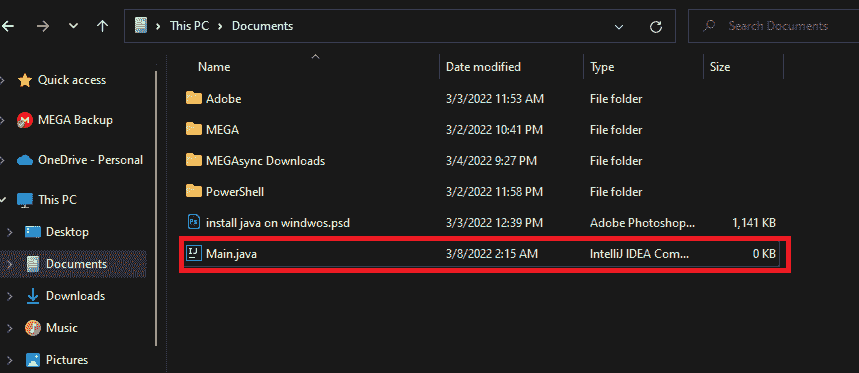

或者，如果我愿意，我也可以使用我的终端去那里。我需要用`cd`来表示我想用**改变目录**。

在这种情况下，我可以使用`cd "C:\Users\Md. Fahim Bin Amin\Documents"`。由于我的用户名包含空格，我用`"` `"`将它们括起来。

然后，如果我检查该目录下的所有文件，那么我也会得到`Main.java`文件。

这次我把`Main.java`文件放在了我的 **D** 驱动器下。所以我使用`cd`命令进入那个目录。

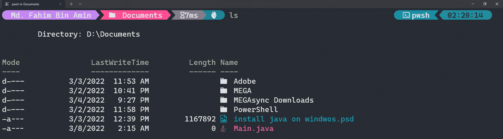

我也在终端中获取我的 Java 文件。

### 如何进入源代码所在的目录:对于 Linux🐧

您可以按照典型的 GUI 方式或者从终端使用`cd`命令进入保存源代码的目录。

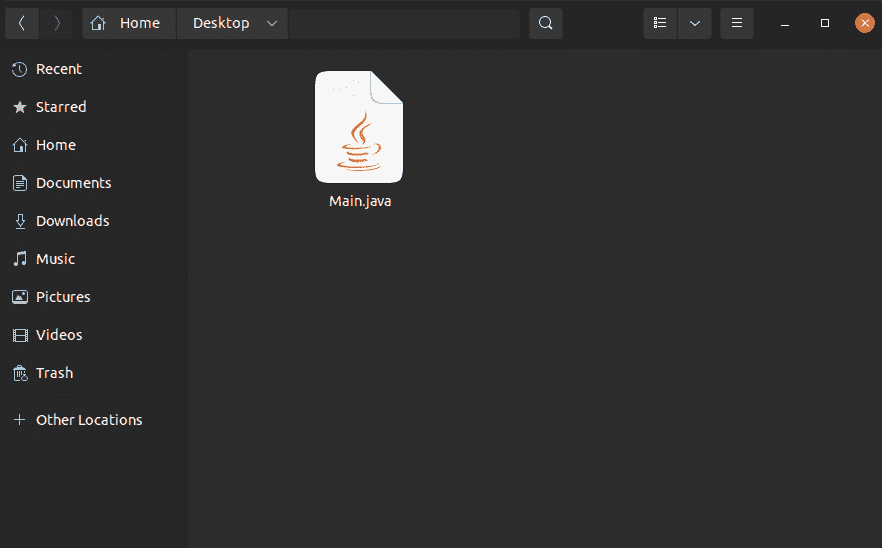

using the typical GUI way

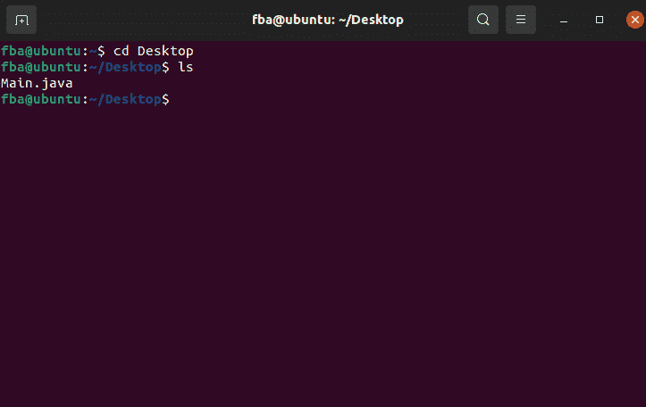

Using the `cd` command

## 🧑‍💻如何编译 Java 代码

在运行我们的 Java 代码之前，我们需要先编译它。为了编译 Java 代码/程序，我们得到类文件。然后我们需要执行/运行类文件。

### 如何使用终端编译 Java 代码

我们需要使用命令`javac file_name_with_the_extension`。例如，当我想编译我的`Main.java`时，我将使用命令`javac Main.java`。`javac`中的`c`表示编译。

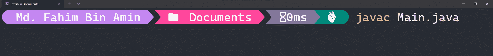

如果编译过程成功，那么我们将不会得到任何错误。

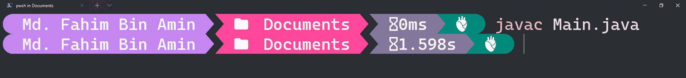

这将在同一个目录下创建我们需要的类文件。

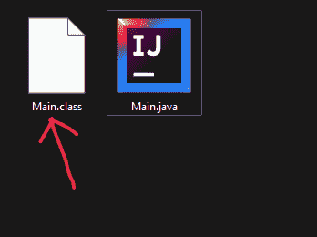

请记住，我们运行的是**类的**文件，而不是`.java`文件。

同样的过程适用于所有的操作系统。

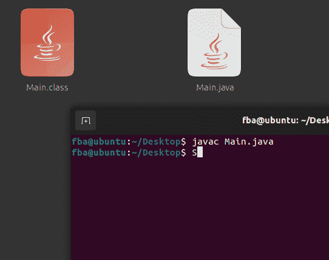

in Linux OS

## 🖥️如何运行 Java 代码

我们运行`.class`文件来执行 Java 程序。为此，我们使用命令`java class_file_name_without_the_extension`。比如，我们的`.class`文件是`Main.class`，我们的命令将是`java Main`。


Java 程序已成功执行！

完全相同的过程也适用于其他操作系统。

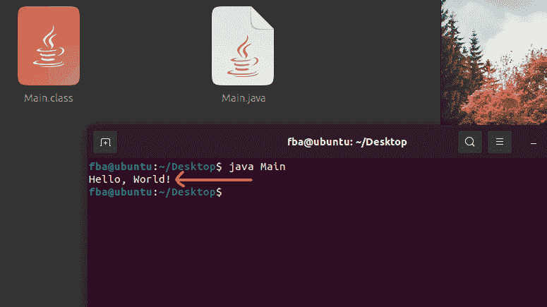

in Linux OS

## 🏅额外收获:如何用包运行 Java 程序

包基本上意味着一个文件夹。前面，我向您展示了如何使用终端来使用任何常规的 Java 代码。在这里，我没有在 Java 代码中使用任何包。

现在我将向您展示如何运行任何内部声明了包的 Java 代码。这次，我将使用下面的 Java 代码。

```
package myJavaProgram.Source;
public class Main {
    public static void main(String[] args) {
        System.out.println("Hello, World!"); 
    }
}
```

在第一行，我已经把包写成了`package myJavaProgram.Source`。这表明我想创建一个名为`myJavaProgram`的文件夹。然后，我想创建另一个名为`Source`的文件夹。最后，我想在`Source`文件夹中创建我的 Java 代码的类文件。

目录树看起来是这样的: **myJavaProgram > Source。**

为了用包编译这种类型的 Java 代码，我们使用命令`javac -d . file_name_with_the_extension`。

至于现在，我使用的是`Main.java`文件，所以我将应用命令`javac -d . Main.java`。这将创建一个名为 **myJavaProgram** 的文件夹，然后在我的源文件所在的目录下的 **myJavaProgram** 文件夹下创建另一个名为 **Source** 的文件夹。

*   目录在哪里保存我的源代码
    *   `myJavaProgram`文件夹
        *   `Source`文件夹


它立即创建了 **myJavaProgram** 文件夹。

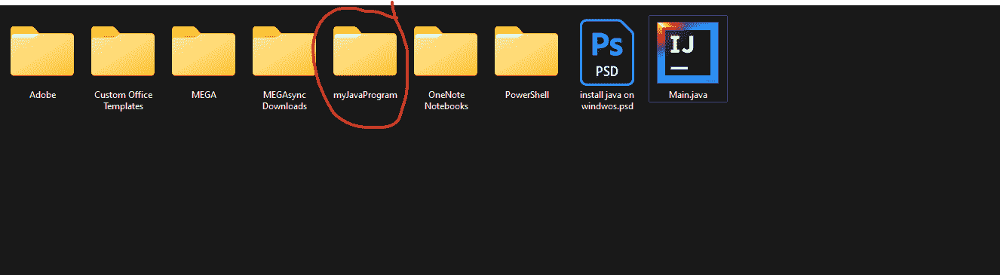

在文件夹中，它创建了**源**文件夹。

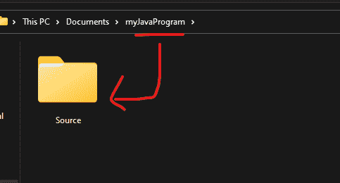

在源文件夹中，它创建了我们的`.class`文件。我们需要这个文件来运行 Java 程序。

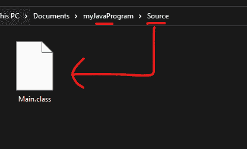

现在，如果我们想要运行`.class`文件，那么我们需要稍微修改一下命令，因为我们需要在终端窗口中提供`.class`文件的目录。

我们使用命令运行带有包的 Java 程序，`java directory_of_the_class_file.the_class_file_name_without_the_extension`。

因为我正在使用`Main.java`并且我需要运行`Main.class`文件，我的命令将是`java myJavaProgram.Source.Main`。它将运行如下所示的 Java 代码。


如果你想知道为什么我们现在要改变命令，那是因为之前我们没有声明任何包。因此，Java 编译器在我们的源代码所在的目录中创建了`.class`文件。因此，我们可以直接从那里获得`.class`文件，并执行类文件。

但是如果我们像这样在源代码中声明包，那么我们是在告诉编译器在另一个地方创建`.class`文件(不在源代码当前所在的目录中)。这意味着我们不能直接在那里获得类文件。

因为我们想要运行类文件，所以我们需要明确地告诉编译器类文件当前在哪里，这样它就可以获得类文件并执行它。

如果您认为这一步可能会搞砸，那么您可以直接从 Java 代码中复制这个目录。

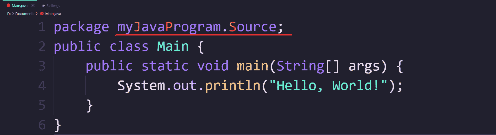

在第 1 行，我们声明了包目录(我们希望在这里生成类文件)。因此，如果我们简单地复制目录，并在后面加上不带扩展名(`.class`)的`.class`文件名，再加上一个句点(`.`)，那么它就满足了执行任何在源代码中声明了包的 Java 代码的条件。

同样的过程也适用于其他操作系统。我在这里提供了一个 Linux 操作系统的截图:

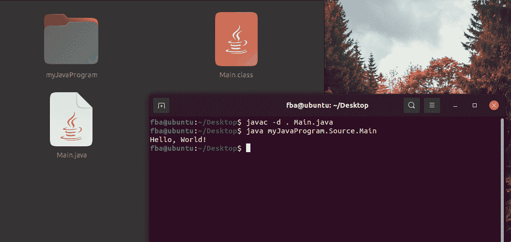

Running Java codes having packages within a Linux Machine

干得好！👏现在，您可以使用终端直接运行任何 Java 代码/程序。🥳

我还制作了一个视频，展示了上面提到的所有过程。你可以点击查看[。😁](https://www.youtube.com/watch?v=e_lmKSCH9YE)

## 💁‍♂️结论

我希望这篇文章能帮助您使用终端运行 Java 程序。我也要衷心感谢你阅读了整篇文章，直到现在。

➡️:如果你想知道如何为你的 Windows 操作系统安装 Java 编译器，你可以看看这篇文章。

➡️:如果你想知道如何为你的 Windows 操作系统安装 c 和 C++编译器，你可以看看这篇文章。

➡️如果你想知道如何在你的 Windows 操作系统上安装 Python，[那么你可以看看这篇文章](https://www.freecodecamp.org/news/how-to-install-python-in-windows-operating-system/)。

📲如果你想和我联系，那就考虑查查这些平台: [GitHub](https://github.com/FahimFBA) 、 [Twitter](https://twitter.com/Fahim_FBA) 、 [LinkedIn](https://www.linkedin.com/in/fahimfba/) 、[英文 YouTube 频道](https://www.youtube.com/channel/UCG97GCUifMS2Vm28tgXQi0Q)、[孟加拉文 YouTube 频道](https://www.youtube.com/channel/UCEF4lxmpBKV2oYCSFH6ExIQ)。

💫如果你想查看我的精彩部分，那么你可以在我的 [Polywork 时间轴](https://www.polywork.com/fahimbinamin)上查看。

编码快乐！！😁