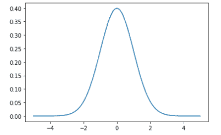
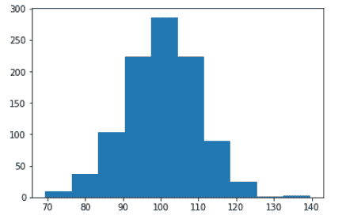
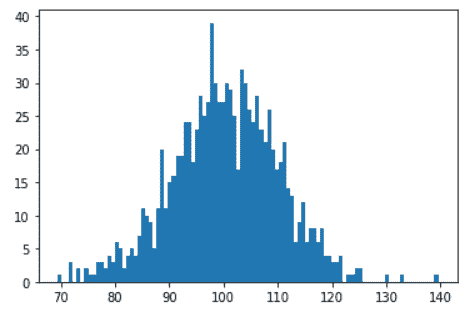
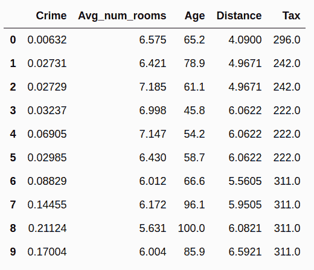
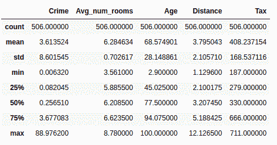
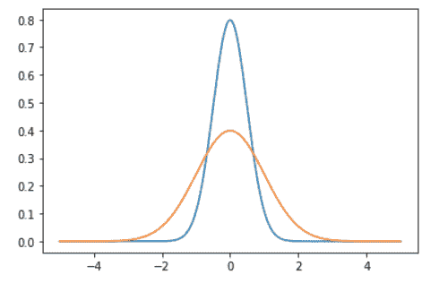

# 如何用 Python 解释使用高斯分布和汇总统计的数据

> 原文：<https://www.freecodecamp.org/news/how-to-explain-data-using-gaussian-distribution-and-summary-statistics-with-python/>

一旦你理解了数据的[分类法，你应该学会应用一些基本的基本概念来帮助使用一组统计方法描述数据。](https://towardsdatascience.com/types-of-structured-data-every-data-science-enthusiast-should-know-a656b95afbe2)

在我们深入研究数据及其分布之前，我们应该了解两个非常重要的关键词——**样本**和**总体的区别。**

一个 **样本** 是一个更大数据集的数据快照。这个更大的数据集是所有可能被收集的数据，被称为 **群体。【T6**

*在统计学中，**总体是从实验或领域中产生的所有可能的观察值的宽泛的、定义的且通常是理论上的集合。***

**样本数据集中的观测值往往符合某种分布，通常称为**正态分布，正式名称为****分布**。这是研究最多的分布，有一个完整的统计学子领域专门研究高斯数据。******

## ******我们将涵盖的内容******

******在本帖中，我们将重点了解:******

*   ******有关高斯分布以及如何使用它来描述来自机器学习模型的数据和观察值的更多信息。******
*   **********位置的估计****——一个分布的中心趋势。******
*   ********变异性的估计**** —分布中均值对数据的离差。****
*   ****使用各种 Python 包，如 [numpy](https://towardsdatascience.com/numpy-essentials-for-data-science-25dc39fae39) 、 [scipy](https://www.scipy.org/docs.html) 、 [matplotlib](https://matplotlib.org/) 等，生成正态分布数据和计算估计值的代码片段。****

****就这样，让我们开始吧。****

## ****什么是正态或高斯分布？****

****当我们绘制像直方图这样的数据集时，图表的形状就是我们所说的分布。最常见的连续值形状是钟形曲线，也称为高斯或正态分布。****

****它以德国数学家卡尔·弗里德里希·高斯的名字命名。遵循高斯分布的一些常见数据集示例如下:****

*   ****体温****
*   ****人的高度****
*   ****汽车里程****
*   ****智商分数****

****让我们尝试生成理想的正态分布，并使用 Python 绘制它。****

### ****如何用 Python 绘制高斯分布****

****我们有像 Numpy、scipy 和 matplotlib 这样的库来帮助我们绘制理想的正态曲线。****

```
****`import numpy as np
import scipy as sp
from scipy import stats
import matplotlib.pyplot as plt 

## generate the data and plot it for an ideal normal curve

## x-axis for the plot
x_data = np.arange(-5, 5, 0.001)

## y-axis as the gaussian
y_data = stats.norm.pdf(x_axis, 0, 1)

## plot data
plt.plot(x_data, y_data)plt.show()`****
```

****输出:****

********

****x 轴上的点是观察值，y 轴是每次观察的可能性。****

****我们使用`np.arange()`在范围(-5，5)内生成规则间隔的观测值。然后我们通过平均值为 0.0、标准差为 1 的`norm.pdf()`函数运行它，返回该观察的可能性。****

****0 左右的观测值最常见，而-5.0 和 5.0 左右的观测值很少见。`pdf()`函数的技术术语是[T2 概率密度函数。](https://docs.scipy.org/doc/scipy/reference/generated/scipy.stats.norm.html)****

## ****如何检验高斯分布****

****值得注意的是，并非所有数据都符合高斯分布，我们必须通过查看数据的直方图或进行一些统计测试来发现分布。****

****不符合高斯分布而可能符合指数分布(曲棍球棒形状)的一些观察结果示例包括:****

*   ****人们的收入****
*   ****国家人口****
*   ****汽车销售。****

****到目前为止，我们只是讨论了理想的钟形分布曲线，但是如果我们必须处理随机数据并计算出它的分布。****

****我们将这样进行:****

*   ****使用 numpy 的`randn()`函数为这个例子创建一些随机数据。****
*   ****使用直方图绘制数据，并分析预期形状的返回图形。****

****实际上，数据很少是完美的高斯分布，但它会有类似高斯的分布。如果样本量足够大，我们将其视为高斯分布。****

****请注意，您可能需要更改绘图配置(比例、箱数等)来寻找所需的模式。****

****让我们来看看一些代码:****

```
****`## setting the seed for the random generation
np.random.seed(1)

## generating univariate data
data = 10 * np.random.randn(1000) + 100

## plotting the data
plt.hist(data)plt.show()`**** 
```

****输出:****

****下面是上面代码的输出，带有数据的直方图:****

********

****剧情看起来更像是一组简单的积木。但是我们改变了比例，在这种情况下是直方图中任意数量的仓。****

****让我们指定箱的数量，并再次绘制它:****

```
****`plt.hist(data, bins=100)
plt.show()`****
```

********

****我们现在可以看到，曲线看起来更接近高斯钟形曲线。****

****尽管如此，请注意，我们有一些超出范围的观察结果，可以被视为噪声。****

****这指出了在处理样本数据集时的另一个重要收获——你应该总是预料到一些噪声或异常值。****

## ****位置估计****

****探索数据集的基本步骤是获取每个要素或变量的汇总值。这通常是对大部分数据所在位置的估计，或者换句话说，**的集中趋势。******

******起初，汇总数据可能听起来像是小菜一碟——取数据的平均值即可。实际上，虽然平均值很容易计算和使用，但它可能并不总是中心值的最佳度量。******

******为了解决这个问题，统计学家们开发了替代的均值估计。******

******我们将使用 sklearn 包中的波士顿数据集。******

******请注意，我删除了几列，这是数据帧现在的样子:******

************

******让我们借助实际的样本数据集，而不是希腊符号，来看看常用的位置估计:******

### ******平均******

******所有值的总和除以值的个数，也称为平均值******

******以下是如何计算`Age`变量的平均值:******

```
******`df['Age'].mean()

## output: 68.57490118577076`******
```

### ******加权平均数******

******所有值的总和乘以权重，再除以权重的总和。这也称为加权平均值。******

******以下是使用加权平均值的两个主要动机:******

*   ******一些观察值本质上比其他观察值更易变(高标准偏差)，高度易变的观察值被赋予较低的权重。******
*   ******收集到的数据并不能代表我们想要测量的不同群体。******

### ******中位数******

******将数据的一半与另一半分开的值，从而将数据分为上半部分和下半部分。这也被称为第 50 百分位。******

******下面是如何计算`Age`变量的中值:******

```
******`df['Age'].median()

## output: 77.5`******
```

### ******百分位******

******使数据的 **P** 百分比位于下面的值，也称为分位数。******

*****`describe`方法可以很容易地找到百分位数:*****

```
*****`df.describe()`*****
```

**********

*****这给出了所有数字变量的汇总统计。请注意，分类变量的度量是不同的。*****

### *****加权中位数*****

*****使权重之和的一半位于排序数据之上和之下的值。*****

### *****截尾平均*****

*****去掉固定数量的极值后所有值的平均值。*****

*****修整平均值消除了极值的影响。例如，在评判一个项目时，我们可以使用所有得分的修整平均值来计算最终得分，这样就没有裁判可以操纵结果。*****

*****这也称为截断平均值。*****

*****为此，我们将使用来自`scipy`库的统计模块:*****

```
*****`## trim = 0.1 drops 10% from each end

stats.trim_mean(df['Age'], 0.1)

## output: 71.19605911330049`*****
```

### *****局外人*****

*****异常值或极值是与大多数数据非常不同的数据值。中值被称为位置的*稳健估计，因为它不受 **异常值** 的影响，即极端情况，而平均值对异常值敏感。******

## *****可变性的估计*****

**********

*****除了位置，我们还有另一种总结特征的方法。 ****可变性**** ，也称为离差，告诉我们数据是如何分散或聚集的。*****

***使用 pandas、numpy 和 scipy 等库计算同一数据帧的可变性度量。***

### ***偏差***

***位置的观测值和估计值之间的差异。偏差有时被称为误差或残差。***

### ***差异***

***平均值的偏差平方和除以 **n** — 1 其中 **n** 为数据值的个数。这也被称为均方误差。***

```
*`df['Age'].var()`*
```

### ***标准偏差***

***方差的平方根。***

```
*`df['Age'].std()

## output: 28.148861406903617`*
```

### ***平均绝对偏差***

***平均值偏差绝对值的平均值。这也被称为 l1 范数或曼哈顿范数。***

***我已经详细介绍了这一点，并给出了数学解释:[计算向量 P-范数——数据科学的线性代数——IV](https://towardsdatascience.com/calculating-vector-p-norms-linear-algebra-for-data-science-iv-400511cffcf0)***

### ***中位数与中位数的绝对偏差***

***偏离中值的绝对值的中值。***

```
*`df['Age'].mad()

## output: 24.610885188020433`*
```

### ***范围***

***数据集中最大值和最小值之差。***

***我们可以使用数据帧的汇总统计数据中的最小值和最大值来计算变量的范围:***

```
*`df['Age'].iloc[df['Age'].idxmax] - df['Age'].iloc[df['Age'].idxmin()]

## output: 97.1`*
```

### ***次序统计***

***顺序统计数据或等级是基于从最小到最大排序的数据值的度量。***

### ***百分位***

***使**【P】**百分比的值等于或小于该值，而(100–P)百分比等于或大于该值的值。这有时被称为分位数。***

### ***四分位间距***

***四分位数范围，或称 IQR，是第 75 个百分位数和第 25 个百分位数之间的差值。***

```
*`Q1 = df['Age'].quantile(0.25)
Q3 = df['Age'].quantile(0.75)
IQR = Q3 - Q1

## Output: 49.04999999999999`*
```

***现在，您已经清楚地了解了高斯分布以及位置和可变性的常见估计，您可以使用这些统计方法轻松地总结和解释数据。***

## ***[数据科学与 Harshit](https://www.youtube.com/c/DataSciencewithHarshit?sub_confirmation=1)***

 ***[https://cdn.embedly.com/widgets/media.html?src=https%3A%2F%2Fwww.youtube.com%2Fembed%2F_ANbV9lVA-M%3Ffeature%3Doembed&display_name=YouTube&url=https%3A%2F%2Fwww.youtube.com%2Fwatch%3Fv%3D_ANbV9lVA-M&image=https%3A%2F%2Fi.ytimg.com%2Fvi%2F_ANbV9lVA-M%2Fhqdefault.jpg&key=a19fcc184b9711e1b4764040d3dc5c07&type=text%2Fhtml&schema=youtube](https://cdn.embedly.com/widgets/media.html?src=https%3A%2F%2Fwww.youtube.com%2Fembed%2F_ANbV9lVA-M%3Ffeature%3Doembed&display_name=YouTube&url=https%3A%2F%2Fwww.youtube.com%2Fwatch%3Fv%3D_ANbV9lVA-M&image=https%3A%2F%2Fi.ytimg.com%2Fvi%2F_ANbV9lVA-M%2Fhqdefault.jpg&key=a19fcc184b9711e1b4764040d3dc5c07&type=text%2Fhtml&schema=youtube)*** 

***通过这个渠道，我计划推出几个涵盖整个数据科学领域的[系列。以下是你应该订阅](https://towardsdatascience.com/hitchhikers-guide-to-learning-data-science-2cc3d963b1a2?source=---------8------------------)[频道](https://www.youtube.com/channel/UCH-xwLTKQaABNs2QmGxK2bQ)的原因:***

*   ***本系列将涵盖所有必需/要求的高质量教程，涉及每个主题和子主题，如 [Python 数据科学基础](https://towardsdatascience.com/python-fundamentals-for-data-science-6c7f9901e1c8?source=---------5------------------)。***
*   ***解释了为什么我们在 ML 和深度学习中这样做的数学和推导。***
*   ***[与谷歌、微软、亚马逊的数据科学家和工程师以及大数据驱动型公司的首席执行官的播客](https://www.youtube.com/watch?v=a2pkZCleJwM&t=2s)。***
*   ***[项目和说明](https://towardsdatascience.com/building-covid-19-analysis-dashboard-using-python-and-voila-ee091f65dcbb?source=---------2------------------)实施到目前为止所学的主题。了解新的认证、训练营以及破解这些认证的资源，如谷歌 的 [****TensorFlow 开发者证书考试。****](https://youtu.be/yapSsspJzAw)***

***如果这个教程有帮助，你应该看看我在 [Wiplane Academy](https://www.wiplane.com/) 上的数据科学和机器学习课程。它们全面而紧凑，帮助您建立一个坚实的工作基础来展示。***