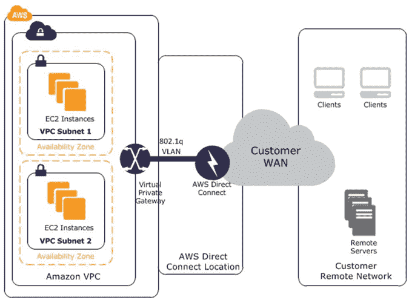
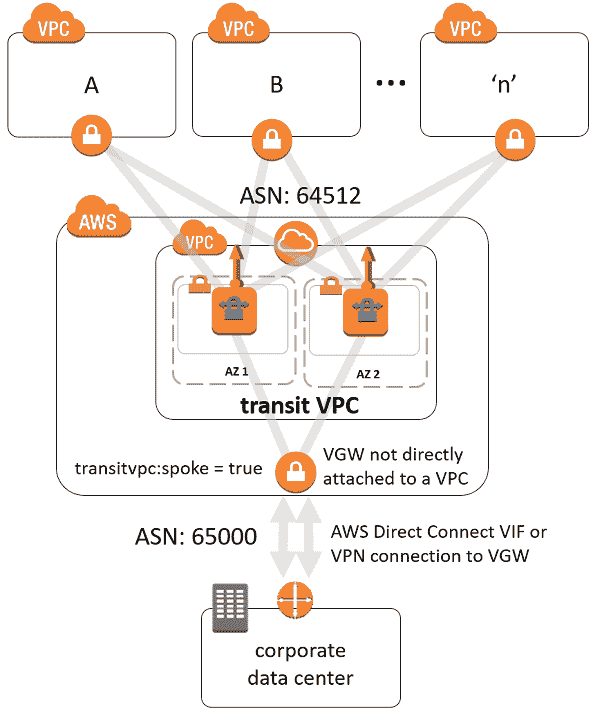
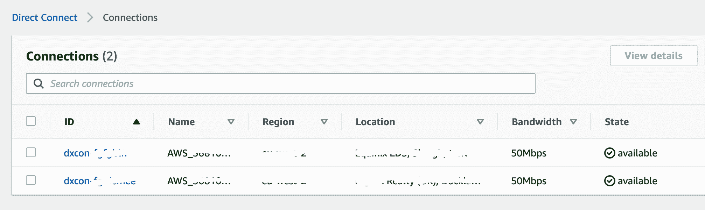
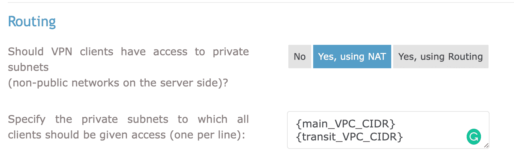
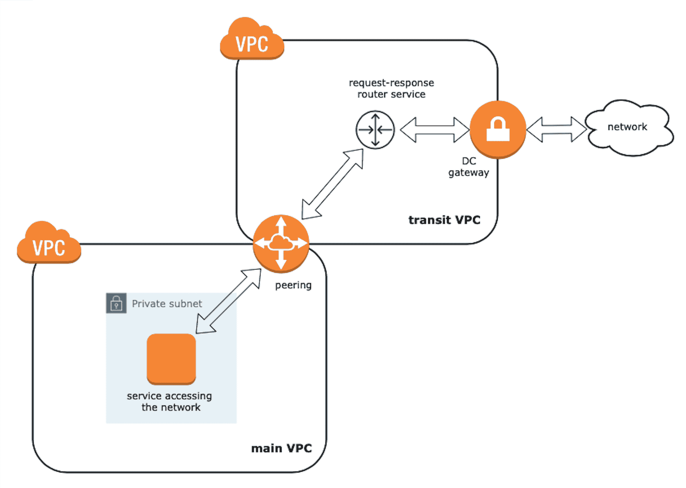

# 如何使用 Terraform 的 Direct Connect 扩展您的 AWS 基础架构

> 原文：<https://www.freecodecamp.org/news/how-to-extend-your-aws-infrastructure/>

有时候，当你面临挑战时，你也许可以用常规流程来解决它。但是其他时候你需要尝试一些全新的，你一无所知的东西。

通常在这些情况下，你应该运用工程思维。对我来说，这些时刻是最有见地的，我想与社区分享我的一些。

在这里，我将指导您完成我和我的团队在使用 [Direct Connect](https://docs.aws.amazon.com/directconnect/latest/UserGuide/WorkingWithConnections.html) 将现有 AWS 基础设施连接到大型私有网络时所采取的步骤。

在这一过程中，我将提供 [Terraform](https://www.terraform.io) [代码片段](https://github.com/povisenko/terraform-aws-direct-connect)，向您展示如何将所有这些组件实现为代码的[基础设施，以及附带的设计方案。](https://en.wikipedia.org/wiki/Infrastructure_as_code)

## 我们将涵盖的内容

1.  要解决的问题
2.  什么是直连？
3.  如何嵌入
4.  使用 Terraform 过境 VPC
5.  使用 Terraform 直接连接
6.  主 VPC 和中转 VPC 之间的对等
7.  你使用 OpenVPN(可选)吗？
8.  路由器服务
9.  结束语

## 要解决的问题

我们的 [VPC](https://docs.aws.amazon.com/vpc/latest/userguide/what-is-amazon-vpc.html) 中的服务应该能够与独立虚拟专用网络中的其他服务进行通信

为了建立连接，我们需要接受来自网络提供商的 AWS 托管连接，作为使用 AWS Direct Connect 授权访问 VPN 的已签署合同的一部分。

那么，我们如何实现这一切呢？我们如何将它嵌入到使用 Terraform 管理的当前解决方案中？有没有这样做的最佳实践？

## 什么是直连？

> AWS Direct Connect 可以轻松建立从您的场所到您的亚马逊 VPC 或亚马逊 VPC 之间的专用网络连接。与其他 VPC 到 VPC 的连接选项相比，此选项可能会降低网络成本，增加带宽吞吐量，并提供更一致的网络体验。([来源](https://docs.aws.amazon.com/whitepapers/latest/aws-vpc-connectivity-options/aws-direct-connect-network-to-amazon.html))

实际上，您有一个在共享数据中心拥有 AWS 设施的网络提供商。然后，你们都可以使用提供商的硬件(实际上是嵌套中的跳线)在 AWS 网络组件和网络之间建立直接连接，并进行后续访问。

AWS 方面的一般实现如下所示:

*   您可以在控制台中配置一个或两个(保留的)直接连接，这将创建一个直接连接网关。
*   然后，您将一个专用 VIF(每个连接一个)连接到网关。
*   一旦你与提供商的网络工程师打了几个电话，并交换了路由策略，就完成了。

通常，所有关于如何启用连接的说明都会由提供商发送给您。

## 如何嵌入

我们的第一个假设是，我们将在 VPC 中启用连接，并为所需的请求创建指向 direct connect gateway 的路由配置(例如，我们将通过报头“Host”或 IPs 来区分它们)。

从高层次上看，它应该是这样的:



AWS Direct Connect

在与提供商的网络工程师通话时，他们询问了我们向网络公布的 IP 范围。我们想知道为什么。这是因为直连工作是由一个叫做 [BGP](https://en.wikipedia.org/wiki/Border_Gateway_Protocol) 的协议声明的。如果你想了解更多的信息，有很多视频可以教你运行在引擎盖下的主要互联网协议之一。

我们最初的想法是，它需要是一个子网，包含我们想要访问网络的服务。之后，我们被要求在直连配置中将子网`10.1.2.0/24`配置为[允许的前缀](https://docs.aws.amazon.com/directconnect/latest/UserGuide/allowed-to-prefixes.html)。

长话短说，这里的“允许的前缀”代表一个 IP 范围，我们将向网络提供商通告该范围，他们将在路由策略中注册。

好吧，说了这么多，也不管用。提供商没有“看到”我们公布的路由，尽管我们可以看到它们。

一点点[调查，瞧](https://aws.amazon.com/directconnect/faqs/#V1,):

> AWS 将在 169.x.x.x 范围内为 BGP 会话分配私有 IP(/30)，并将通过 BGP 通告 VPC CIDR 块。您可以通过 BGP 通告默认路由。

此外，我们发现[其他人](https://forums.aws.amazon.com/thread.jspa?threadID=130577)似乎面临着同样的问题:

> 我们最终创造了一个新的 VPC，它拥有我们的合作伙伴想要的较小的 CIDR。

所以基本上，你可以通过直接连接广告的 IP 范围被限制在`/30`以内。此外，您不能通告子网，而是应该通告整个 VPC CIDR。

我们的网络 CIDR 是`10.1.0.0/16`，我们有一个问题——*它太大了，网络提供商*无法接受。最重要的是，在通话过程中，我们发现了连接网络时必须做的另一件事:*我们需要联系网络 IP 访问管理部门(如果网络足够大，我想)要求他们为我们提供网络内的唯一范围。随后，它应该是我们的新 VPC CIDR。*

我们决定创建一个独立的 VPC。为了得到一些工作证明，我们从 AWS 找到了一些官方指南，比如这个。此后不久，我们得知 AWS 社区将开始用不同的词来称呼那个独立的 VPC——他们称之为**过境 VPC。**



****Direct Connect using transit VPC****

在收到对网络中唯一 IP 范围请求的回复之前，我们向提供商询问了当前未使用的 IP 范围，以便我们可以在我们这边快速实施。这将为我们提供解决方案所需的工作证据。一切都很完美。

下一步是在我们现有的 Terraform 配置中实现一切(直接连接配置+ VPCs 对等)。

## 使用 Terraform 过境 VPC

首先，在我们开始挖掘代码之前，我想说你可以在 GitHub [这里](https://github.com/povisenko/terraform-aws-direct-connect)找到下面所有的代码。

让我们先回顾一下我们之前讨论的内容。我们有现有 VPC 的条件。我们希望其中的一些服务能够通过我们使用直接连接连接的网络进行通信。

我们被授予了两个 AWS 托管的连接(主要和次要，以确保连接回退)。主要想法是以某种方式扩展我们现有的基础设施。不知何故，意味着[过境 VPC](https://docs.aws.amazon.com/solutions/latest/cisco-based-transit-vpc/appendix-d.html)——帮助我们整合这些连接的解决方案。

现在让我们看一些代码来表示我们所讨论的内容。首先要定义的是我们的主 VPC。我只是出于说明的目的来展示它，因此它使所有进一步的步骤看起来更加一致。

```
variable "main_vpc_name" {
  description = "Name of your main VPC"
}
variable "main_vpc_cidr" {
  description = "CIDR of your main VPC, e.g. 10.1.0.0/16"
}
variable "public_subnet" {
  description = "pubic subnet of your main VPC (if you have), e.g. 10.1.1.0/24"
}
variable "private_app_subnet" {
  description = "private subnet of your main VPC (if you have), e.g. 10.1.2.0/24"
}
variable "main_vpc_key_name" {
  default     = "main-vpc-key"
  description = "Name of SSH key of your main VPC"
}
variable "aws_availability_zone" {
  description = "Your AWS AZ of your main VPC"
}

provider "aws" {
  profile = "your-profile"
  region  = "your-region"
}

terraform {
  backend "s3" {
    bucket  = "your-terraform-states-bucket"
    key     = "terraform.tfstate"
    profile = "your-profile"
    region  = "your-region"
  }
}

module "vpc" {
  version = "~> v2.0"
  source  = "terraform-aws-modules/vpc/aws"
  name    = var.main_vpc_name
  cidr    = var.main_vpc_cidr

  azs = [
    var.aws_availability_zone,
  ]

  private_subnets = [
    var.private_app_subnet
  ]

  public_subnets = [
    var.public_subnet,
  ]

  single_nat_gateway     = true
  one_nat_gateway_per_az = false
  enable_nat_gateway     = true
  enable_vpn_gateway     = false

  tags = {
    Terraform = "true"
  }
}
/***********************************************************************
bellow could be defined any other resources from you infrastructure
e.g. OpenVPN server, instances, security configuration, key pairs etc.

...
***********************************************************************/
```

main VPC configuration

接下来，VPC 的一些主要参数将用于过境 VPC。所以让我们把它们定义为输出:

```
output "main_vpc_id" {
  value = module.vpc.vpc_id
}
output "main_vpc_range" {
  value = module.vpc.vpc_cidr_block
}
output "main_vpc_az" {
  value = module.vpc.azs.0
}
output "main_vpc_key_name" {
  value = var.main_vpc_key_name
}
output "main_public_routing_table_id" {
  value = module.vpc.public_route_table_ids.0
}
output "main_private_routing_table_id" {
  value = module.vpc.private_route_table_ids.0
}
```

main VPC output parameters

现在我们可以开始配置我们的中转 VPC。只是为了好的设计，我们决定在单独的文件夹下以单独的状态管理它(例如 *tranist-vpc/* )。先把上面的*导入*输出*为*本地:**

```
locals {
  main_private_routing_table = data.terraform_remote_state.main.outputs.main_private_routing_table_id

  main_public_routing_table  = data.terraform_remote_state.main.outputs.main_public_routing_table_id

  main_vpc_id                = data.terraform_remote_state.main.outputs.main_vpc_id

 main_vpc_range              = data.terraform_remote_state.main.outputs.main_vpc_range

  main_vpc_az                = data.terraform_remote_state.main.outputs.main_vpc_az

  main_vpc_key_name          = data.terraform_remote_state.main.outputs.main_vpc_key_name
}
```

imported main VPC outputs as locals

接下来，我们可以开始定义中转 VPC 配置。首先，我要列出我们需要的所有变量(*注意我们要连接的网络中 DNS 服务器的 IP。你应该知道它们指定为 VPC 中转的 DNS 服务器*):

```
variable "transit_vpc_name" {
  default = "transit-vpc"
}
variable "transit_vpc_cidr" {
  description = "Transit VPC CIDR. Your unique IP range in the network e.g. 10.10.14.0/24"
}
variable "transit_private_subnet" {
  description = "Transit VPC private subnet e.g 10.10.14.0/25"
}
variable "transit_public_subnet" {
  description = "Transit VPC public subnet for the NAT gateway e.g. 10.10.14.128/25"
}
variable "network_dns_server" {
  description = "IP of one of DNS servers in the network. Distributed by provider"
}
variable "network_dns_server_2" {
  description = "IP of one of DNS servers in the network. Distributed by provider"
}
variable "dhcp_options_domain_name" {
  description = "DHCP option domain name depending on your AWS region e.g. {your_region}.compute.internal"
}
```

variables for transit VPC

其次是配置:

```
module "transit-vpc" {
  version = "~> v2.0"
  source  = "terraform-aws-modules/vpc/aws"
  name    = var.transit_vpc_name
  cidr    = var.transit_vpc_cidr

  azs = [
    local.main_vpc_az,
  ]

  private_subnets = [
    var.transit_private_subnet,
  ]

  public_subnets = [
    var.transit_public_subnet,
  ]

  single_nat_gateway               = true
  one_nat_gateway_per_az           = false
  enable_nat_gateway               = true
  enable_vpn_gateway               = false
  enable_dhcp_options              = true
  dhcp_options_domain_name         = var.dhcp_options_domain_name
  dhcp_options_domain_name_servers = [var.network_dns_server, var.network_dns_server_2]

  tags = {
    Terraform = "true"
  }
}
```

transit VPC configuration

## 使用 Terraform 直接连接

让我们继续直接连接配置。首先，让我们定义我们需要的所有变量，以便继续。您应该从您的网络提供商那里获得所有这些值。我假设它们会以一个单独的文档(如电子表格)的形式发送给您(对我们来说也是如此):

```
variable "bgp_provider_asn" {
  description = "BGP autonomous system number of the provider. Distributed by provider"
}
variable "provider_vln_id" {
  description = "BGP VLN ID of the provider. Distributed by provider"
}
variable "primary_bgp_key" {
  description = "BGP auth key for primary virtual interface. Distributed by provider"
}
variable "secondary_bgp_key" {
  description = "BGP auth key for secondary virtual interface. Distributed by provider"
}
variable "primary_connection_id" {
  description = "BGP auth key for primary virtual interface. Distributed by provider"
}
variable "secondary_connection_id" {
  description = "IP range distributed by provider"
}
variable "primary_amazon_address" {
  description = "IP range distributed by provider"
}
variable "secondary_amazon_address" {
  description = "IP range distributed by provider"
}
variable "primary_customer_address" {
  description = "IP range distributed by provider"
}
variable "secondary_customer_address" {
  description = "IP range distributed by provider"
}
```

Direct Connect BGP parameters

现在我们可以进行剩下的配置了:

```
resource "aws_dx_gateway" "provider-gateway" {
  name            = "provider-dc-gateway"
  amazon_side_asn = "64512" // usually it's a default value
}

resource "aws_dx_gateway_association" "transit" {
  dx_gateway_id         = aws_dx_gateway.provider-gateway.id
  associated_gateway_id = aws_vpn_gateway.transit_vpn_gw.id
  allowed_prefixes = [
    var.transit_vpc_cidr
  ]
}

resource "aws_dx_private_virtual_interface" "primary" {
  connection_id    = var.primary_connection_id
  name             = "provider-vif-primary"
  vlan             = var.provider_vln_id
  address_family   = "ipv4"
  bgp_asn          = var.bgp_provider_asn
  amazon_address   = var.primary_amazon_address
  customer_address = var.primary_customer_address
  dx_gateway_id    = aws_dx_gateway.provider-gateway.id
  bgp_auth_key     = var.primary_bgp_key

}

resource "aws_dx_private_virtual_interface" "secondary" {
  connection_id    = var.secondary_connection_id
  name             = "provider-vif-secondary"
  vlan             = var.provider_vln_id
  address_family   = "ipv4"
  bgp_asn          = var.bgp_provider_asn
  amazon_address   = var.secondary_amazon_address
  customer_address = var.secondary_customer_address
  dx_gateway_id    = aws_dx_gateway.provider-gateway.id
  bgp_auth_key     = var.secondary_bgp_key
}
```

Direct Connect gateway and virtual interfaces

现在，如果您转到 AWS 控制台，在直接连接旁边，您应该会看到类似这样的内容:



configured direct connections

## 主 VPC 和中转 VPC 之间的对等

要解决的最后一个问题是配置我们的服务和 VPC 中转之间的连接，以便建立对网络的访问。

为了实现这一点，我们决定使用 [VPC 对等](https://docs.aws.amazon.com/vpc/latest/peering/what-is-vpc-peering.html)。这里我们需要一些我们之前导入的*本地*变量:

```
resource "aws_vpc_peering_connection" "main-to-transit" {
  peer_vpc_id = module.transit-vpc.vpc_id
  vpc_id      = local.main_vpc_id
  auto_accept = true

  tags = {
    Name = "VPC Peering between main and transit VPC"
  }
}

resource "aws_route" "from-main-to-transit" {
  route_table_id            = local.main_private_routing_table
  destination_cidr_block    = var.transit_vpc_cidr
  vpc_peering_connection_id = aws_vpc_peering_connection.main-to-transit.id
}

resource "aws_route" "from-main-public-to-transit" {
  route_table_id            = local.main_public_routing_table
  destination_cidr_block    = var.transit_vpc_cidr
  vpc_peering_connection_id = aws_vpc_peering_connection.main-to-transit.id
}

resource "aws_route" "from-transit-to-main" {
  route_table_id            = module.transit-vpc.private_route_table_ids.0
  destination_cidr_block    = local.main_vpc_range
  vpc_peering_connection_id = aws_vpc_peering_connection.main-to-transit.id
}
```

peering between main and transit VPCs

接下来，我们需要允许来自主 VPC 的入站 HTTP 流量。该配置可以这样完成:

```
resource "aws_security_group" "transit_vpc_sg" {
  name        = "transit-vpc-sg"
  description = "Transit VPC SG"
  vpc_id      = module.transit-vpc.vpc_id

  ingress {
    description = "Allow HTTP from main VPC"
    from_port   = 80
    to_port     = 80
    protocol    = "tcp"
    cidr_blocks = [local.main_vpc_range]
  }

  egress {
    from_port   = 0
    to_port     = 0
    protocol    = "-1"
    cidr_blocks = ["0.0.0.0/0"]
  }

  tags = {
    Name = "transit-vpc"
  }
}
```

transit VPC security group

太好了。现在我们有了两个对等共存的 VPC。

## 你使用 OpenVPN(可选)吗？

在我们的例子中，我们有一个 OpenVPN 服务器来管理对主 VPC 内部资源的访问(SSH)。我们希望以同样的方式访问 transit VPCs 资源。为了做到这一点，我们需要在 VPC 公交系统内创造一些额外的资源:

```
resource "aws_vpn_gateway" "transit_vpn_gw" {
  tags = {
    Name = "transit-vpn-gw"
  }
}

resource "aws_vpn_gateway_attachment" "vpn_attachment" {
  vpc_id         = module.transit-vpc.vpc_id
  vpn_gateway_id = aws_vpn_gateway.transit_vpn_gw.id
}

resource "aws_vpn_gateway_route_propagation" "transit" {
  vpn_gateway_id = aws_vpn_gateway.transit_vpn_gw.id
  route_table_id = module.transit-vpc.private_route_table_ids.0
}
```

additional configuration if you have OpenVPN

然后将在上一步中创建的*入口规则*添加到`transit-vpc-SG`中:

```
ingress {
    description = "Allow SSH from main VPC"
    from_port   = 22
    to_port     = 22
    protocol    = "tcp"
    cidr_blocks = [local.main_vpc_range]
}
```

allow SSH from main VPC

要完成所有这些工作，您需要在 VPN 设置部分下的 OpenVPN 服务器路由设置中指定中转 VPC 的 CIDR 和主要 VPC 的 CIDR:



OpenVPN server routing settings

所以现在我们就快到了。最后要做的事情是设计和配置我们在主 VPC 中的服务如何以编程方式访问网络。

## 路由器服务

概括地说，我们这样做的主要原因是我们需要能够访问网络中的其他服务(例如请求或提交数据)。我们发现了两种可能的方法来实现这一点:

*   将所需的服务迁移到中转 VPC 并在那里使用，同时分配新的私有 IP。主 VPC 内部路由应该调整。除此之外，对数据库服务器、日志存储等的任何访问也应该得到管理。
*   在 VPC 中转区创建路由器服务(运行 HAproxy 或 NGingx)。将路由器私有 IP 添加到主 VPC 中想要访问网络的每个服务的`hosts`文件中，以便在所需域名之后解析 IP。

我们选择第二个选项，因为它似乎最符合[开闭原则](https://en.wikipedia.org/wiki/Open–closed_principle)。这大概是这样的:



transit VPC router service

让我们在 Terraform 中配置它:

```
variable "router_private_ip" {
  description = "Private IP of router instance in transit VPC t route request back and forward e.g. 10.10.14.90"
}

resource "aws_instance" "router" {
  ami               = "ami-0eb89db7593b5d434" // any AMI you prefer
  instance_type     = "t2.micro" //any type you prefer
  availability_zone = local.main_vpc_az
  key_name          = local.main_vpc_key_name
  subnet_id         = module.transit-vpc.private_subnets.0
  private_ip        = var.router_private_ip

  vpc_security_group_ids = [
    aws_security_group.router_sg.id,
  ]

  user_data = file("router_init.sh")

  associate_public_ip_address = false
  tags = {
    Name    = "transit-vpc-router"
    Managed = "terraform"
  }
}

resource "aws_security_group" "router_sg" {
  name        = "router_security_group"
  description = "router_security_group"

  ingress {
    from_port = 80
    to_port   = 80
    protocol  = "tcp"

    cidr_blocks = [
      local.main_vpc_range,
      var.transit_private_subnet
    ]
  }

  ingress {
    from_port = 22
    to_port   = 22
    protocol  = "tcp"

    cidr_blocks = [
      local.main_vpc_az,
    ]
  }

  egress {
    from_port = 0
    to_port   = 0
    protocol  = "-1"

    cidr_blocks = [
      "0.0.0.0/0",
    ]
  }

  vpc_id = module.transit-vpc.vpc_id

  tags = {
    Managed = "terraform"
  }
}
```

transit VPC router service

这里的`router_init.sh`包含一个在容器中配置和启动 HAproxy 服务的脚本。为了便于说明，让我们假设我们想要访问网络中的两个内部域名:

*   `domain-name-1.internal.com`
*   `domain-name-2.internal.com`

```
#! /bin/bash

# Install Docker
apt-get update

apt-get install -y \
    apt-transport-https \
    ca-certificates \
    curl \
    software-properties-common

curl -fsSL https://download.docker.com/linux/ubuntu/gpg | apt-key add -

apt-key fingerprint 0EBFCD88

sudo add-apt-repository \
   "deb [arch=amd64] https://download.docker.com/linux/ubuntu \
   $(lsb_release -cs) \
   stable"

apt-get update

apt-get install -y docker-ce

usermod -a -G docker ubuntu

chown -R ubuntu:ubuntu /home/ubuntu/.docker/

# Create HAproxy configuration
cat > /home/ubuntu/haproxy.cfg <<- "EOF"
       global
           log stdout local0
           daemon
           maxconn 4000

       defaults
           log               global
           mode              http
           option            httplog
           timeout connect   5s
           timeout check     5s
           timeout client    60s
           timeout server    60s
           timeout tunnel    3600s

       frontend http-in
           bind *:80

           #hosts acls
           acl domain1_acl             hdr(host) -i domain-name-1.internal.com
           acl domain2_acl             hdr(host) -i domain-name-2.internal.com

           use_backend domain1         if domain1_acl
           use_backend domain2         if domain2_acl

       backend domain1
           mode http
           option forwardfor
           http-request replace-header Host .* domain-name-1.internal.com
           server domain1 domain-name-1.internal.com:443 ssl verify none

       backend domain2
           mode http
           option forwardfor
           http-request replace-header Host .* domain-name-2.internal.com
           server domain2 domain-name-2.internal.com:443 ssl verify none
EOF

#Launch router
docker run -d --restart always --name haproxy --net=host -v /home/ubuntu:/usr/local/etc/haproxy:ro haproxy:2.1-alpine
```

transit VPC router service HAproxy initialisation

最后一步是检查我们的域是否被添加到主 VPC 实例上的`hosts`文件中，并开始通过 HTTP 发出请求。

## 结束语

在本文中，我向您展示了如何将 Direct Connect 集成到您现有的 AWS 基础设施中。我还谈到了如何使用 Terraform 有效地管理它。

然后，我讨论了什么方法适合网络路由配置，使解决方案尽可能透明和易于维护。

AWS 推荐的解决此类挑战的 VPC 公交系统确实很容易配置。我们在 VPC 公交公司的路由器服务中尝试的访问专用网络的方法证明是有效的。但它似乎并不比其他选择更好。

最后，我介绍了 Terraform 代码片段，希望对想做类似事情的人有用。

我希望你喜欢这篇文章，并发现它很有帮助！