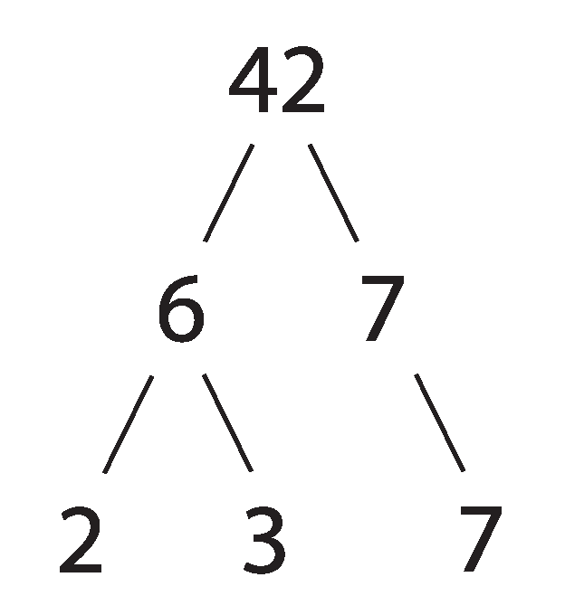

# 如何求一个数的所有因子

> 原文：<https://www.freecodecamp.org/news/how-to-find-all-factors-of-a-number/>

## **一个数的所有因子**

你可以把因数看作是你要乘以另一个数的数。

在这种情况下，2、3、6 和 7 都是可以相乘得到 42 的数字。所以，都是 42 的因子。然而，它们并不是 42 的全部因素。要找到所有的因素，我们可以使用下面的算法或一步一步的过程。

从 1 开始。

1 * 42 = 42

因子:1…42

试试 2。

2 * 21 = 42

因数:1，2…21，42

试试 3。

3 * 14 = 42

因数:1，2，3…14，21，42

试试 4。

没有一个整数可以乘以 4 得到 42，所以我们跳过它。

试试 5。

没有一个整数能乘以 5 得到 42，所以我们跳过它。

试试 6。

6 * 7 = 42

1, 2, 3, 6…7, 14, 21, 42

因为没有介于 6 和 7 之间的整数，所以所有的积极因素都被发现了。上面所有的数字都可以转换符号，并且仍然是 42 的因数。总之，42 的所有因素如下。

1, 2, 3, 6, 7, 14, 21, 42, -1, -2, -3, -6, -7, -14, -21, -42

## **确认因素数量是否正确**

我们可以通过以下步骤快速确认我们已经确定了所有积极因素:

1.  以质因数分解为例(由上面的树提供)

2¹* 3¹* 7 *¹

1.  给每个指数加一:

2 的指数:1 + 1 = 2
3 的指数:1 + 1 = 2
7 的指数:1 + 1 = 2

1.  将上面的每个数字相乘:

2 * 2 * 2 = 8

1.  确认 42 有 8 个因子:

1, 2, 3, 6…7, 14, 21, 42