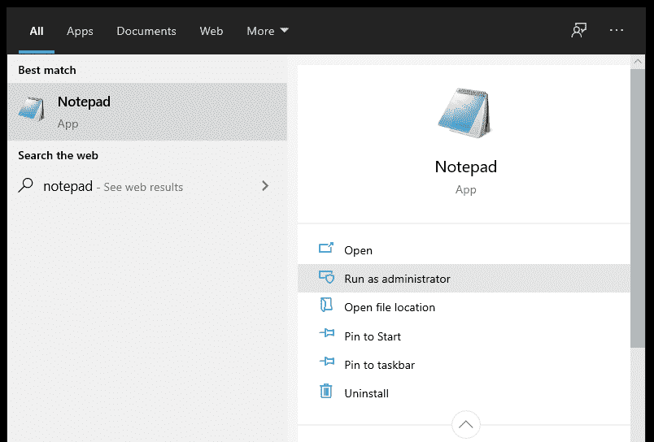
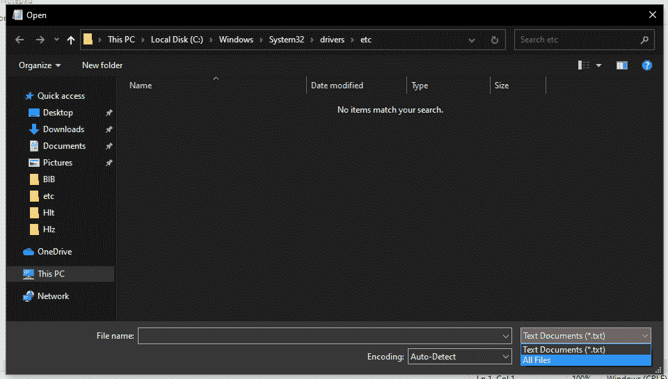
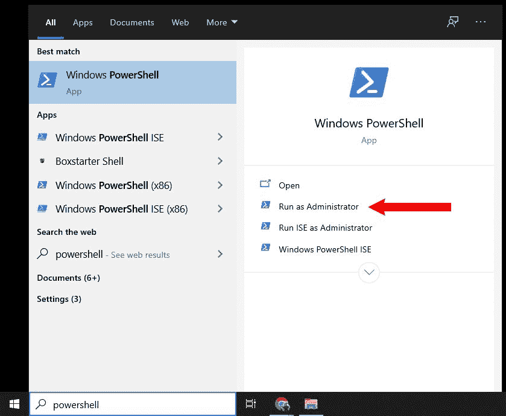
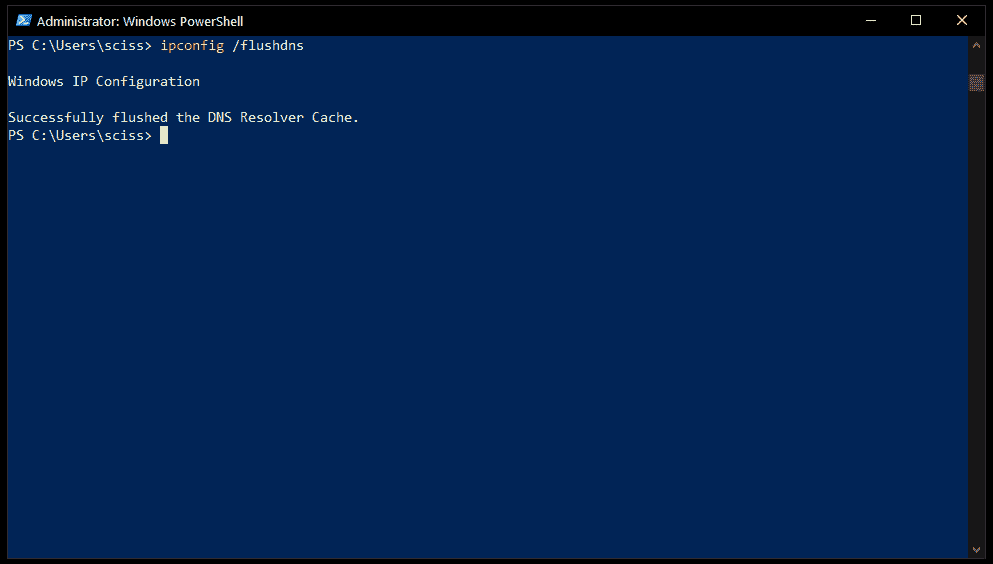
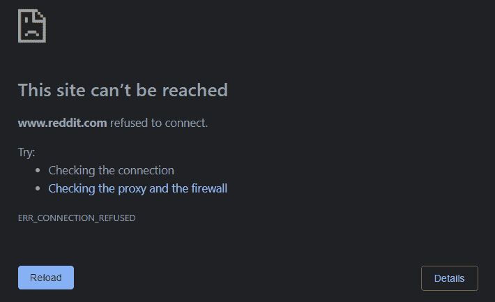

# 如何查找和编辑 Windows 主机文件

> 原文：<https://www.freecodecamp.org/news/how-to-find-and-edit-a-windows-hosts-file/>

虽然互联网只有大约 30 年的历史，但在许多方面，hosts 文件是它(不那么古老)过去的遗迹。

在大多数情况下，您可能不需要更新 Windows 上的 hosts 文件。但是知道它在哪里以及如何工作会有帮助，如果:

*   你在地方发展上遇到了麻烦
*   您怀疑恶意软件篡改了主机文件
*   你想要一个快速简单的方法来阻止一些网站
*   或者如果您想设置一些有用的内部 IP 地址的快捷方式

在这篇文章中，我们将介绍什么是主机文件、如何在 Windows 上编辑主机文件、如何在 Windows 上编辑主机文件、如何在 Windows 上编辑主机文件、如何在 Windows 上编辑主机文件、如何在 Windows 上编辑主机文件、如何在 Windows 上编辑主机文件、如何在 Windows 上编辑主机文件、如何在 Windows 上编辑主机文件、如何在 Windows 上编辑主机文件、如何在 Windows 上编辑主机文件、如何在 Windows 上编辑主机文件、如何在 Windows 上编辑主机文件，以及如何在 Windows 上编辑主机文件。

## 什么是主机文件？

在互联网普及之前的早期，计算机使用 hosts 文件来映射长而难记的 IP 地址和短得多、容易记的主机名。

例如，您会在 Windows、Linux 和 macOs 上的许多主机文件中找到这样一行:

```
127.0.0.1       localhost
```

这样，你不必记住一个很长的 IP 地址，你所要做的就是访问本地主机。

### 主机文件为何失宠

hosts 文件系统在早期的互联网上运行良好，但是有几个主要的问题。

随着互联网的发展，主机文件的长度和复杂性也在增加。此外，每个 hosts 文件只适用于它所在的计算机，使它们与主机名和 IP 地址的变化保持同步是一件非常痛苦的事情。

例如，假设您有两台计算机，A 和 b。它们的主机文件包含 google.com 的映射:

```
172.217.26.46       google.com
```

Computer A and B's hosts file

但是当 Google 更新它们的 IP 地址时，只有计算机 A 更新它的 hosts 文件来匹配:

```
172.217.175.78       google.com
```

Computer A's updated hosts file

因此，在有人更新 hosts 文件之前，计算机 B 上的每个人都无法使用 Google。当那个人更新 hosts 文件时，他们添加了另一个条目来处理带有 www 子域的 Google。

```
172.217.175.78       google.com
172.217.175.78       www.google.com
```

Computer B's newly updated hosts file

现在，计算机 B 上的每个人无论是访问 google.com 还是 www.google.com，都会被带到正确的网站。

并且计算机 A 上的每个人都只能访问 google.com，而不能访问 www.google.com，至少在它自己的 hosts 文件更新到匹配之前是如此。

可以想象，主机文件会变得很复杂，很快。

### 解决方案

如果您认为有人应该创建一个中央存储库来映射所有的 IP 地址和所有的主机名，这正是所发生的事情。

早期，中央主机文件由斯坦福研究所手工维护和共享。这个系统导致了域名和顶级域名的发明。com 和。edu，Whois，它变得越来越自动化。

最终，卑微的主机文件和创新者如[伊丽莎白·j·费因勒](https://en.wikipedia.org/wiki/Elizabeth_J._Feinler)导致了今天仍在使用的域名系统的发明。

## 如何在 Windows 上编辑主机文件

要在 Windows 10 上编辑主机文件，您需要以管理员身份打开它。

首先，以管理员身份打开记事本，方法是按 Windows 键，键入“记事本”，然后单击“以管理员身份运行”:



Note: You may need to click the arrow button to expand the dropdown to see the "Run as administrator" option

要在记事本中打开主机文件，单击“文件”、“打开”，并导航至`C:\Windows\System32\drivers\etc`。

您将看不到此目录中的任何文件，因为它们不是文本文档。要更改文件类型，请单击打开菜单右下角的下拉菜单，然后单击“所有文件”:



您将看到一个名为`hosts`的文件。双击该文件将其打开。

然后，您将看到类似于以下内容的主机文件:

```
# Copyright (c) 1993-2009 Microsoft Corp.
#
# This is a sample HOSTS file used by Microsoft TCP/IP for Windows.
#
# This file contains the mappings of IP addresses to host names. Each
# entry should be kept on an individual line. The IP address should
# be placed in the first column followed by the corresponding host name.
# The IP address and the host name should be separated by at least one
# space.
#
# Additionally, comments (such as these) may be inserted on individual
# lines or following the machine name denoted by a '#' symbol.
#
# For example:
#
#      102.54.94.97     rhino.acme.com          # source server
#       38.25.63.10     x.acme.com              # x client host

# localhost name resolution is handled within DNS itself.
#	127.0.0.1       localhost
#	::1             localhost
```

Windows 10's default hosts file

请注意，所有内容都用`#`字符注释掉了，这意味着实际上没有从主机文件中读取任何内容。现代版本的 Windows 已经包含了一种 DNS 系统，所以如果你访问本地主机，它会自动将你重定向到`127.0.0.1`。

解决了这个问题后，您可以对 hosts 文件做一些事情。

## 如何在 Windows 10 上更新 hosts 文件，如果你有本地主机的问题

如果您正在进行一些本地开发，并且在使用 localhost 时遇到了问题，您可以从 hosts 文件中删除注释:

```
...
# localhost name resolution is handled within DNS itself.
127.0.0.1       localhost
::1             localhost
```

保存 hosts 文件后，关闭记事本。

然后，通过按 Windows 键打开 powershell，搜索“PowerShell”，然后单击“以管理员身份运行”:



在 PowerShell 窗口中，输入`ipconfig /flushdns`刷新内置的 Windows DNS:



之后，您应该能够在浏览器中访问 localhost，并查看您正在入侵的内容。如果仍有问题，请尝试完全关闭浏览器，然后打开新的浏览器窗口，再试一次。

## 如何在 Windows 10 上更新你的主机文件，如果你认为它已经被篡改

尽管 hosts 文件在 DNS 等新系统中已经失宠，但由于传统原因，它们仍然可以工作。黑客过去肯定利用了这一点。

他们会做的是将一个像 google.com 这样的普通网站指向一个不安全的 IP 地址。这个 IP 地址可能服务于一个看起来像谷歌的网站，但实际上是试图窃取你的敏感信息。

虽然这在过去是一个问题，但大多数安全软件(如 Windows 安全套件)可以自动识别并修复 hosts 文件的问题。

也就是说，如果您打开 hosts 文件并看到许多奇怪的条目，那么您可能希望恢复到默认的 Windows hosts 文件。

只需将本文前面的默认 hosts 文件复制并粘贴到您的 hosts 文件中，然后保存即可。然后，打开 PowerShell 并使用`ipconfig /flushdns`命令刷新 Windows DNS。

请注意，一些第三方安全软件使用 hosts 文件来阻止危险的网站。如果是这种情况，不用担心——您的安全软件应该会将所有这些条目添加回您的主机文件中。我们将在下一节讨论这是如何工作的。

## 如何在 Windows 10 上使用 hosts 文件屏蔽网站

不希望朋友或家人访问您电脑上的某些网站？或者你和我一样，被网上所有的猫照片弄得心烦意乱？

如果是这样，那么您可以使用 hosts 文件来完全阻止网站。

例如，如果您想要阻止 Reddit，只需将其添加到您的 hosts 文件的底部:

```
127.0.0.1     reddit.com
127.0.0.1     www.reddit.com
```

然后，打开 PowerShell，运行`ipconfig /flushdns`刷新 Windows 10 DNS。此外，关闭打开的浏览器窗口，然后重新打开它们。

从那以后，每次你试图访问 Reddit，或者点击像[https://www.reddit.com/r/FreeCodeCamp/](https://www.reddit.com/r/FreeCodeCamp/)这样的 Reddit 网址，你的浏览器都会被重定向到`127.0.0.1`，或者本地主机。

由于那里没有网站，您的浏览器将显示一条错误消息:



一个缺点是，这只能在一种设备上使用——你可以直接用手机浏览 Reddit。不过，这是在你的工作电脑上制造一些摩擦的好方法。

这很好地引出了最后一个技巧，即使用 hosts 文件使您的生活变得稍微轻松一些。

## 如何在 Windows 10 上使用 hosts 文件设置有用的快捷方式

如果你花很多时间调整你的路由器设置，或者你有一个很酷的项目在 [Raspberry Pi](https://www.freecodecamp.org/news/build-a-personal-dev-server-on-a-5-dollar-raspberry-pi/) 上运行，你会知道键入一个长 IP 地址是一件很麻烦的事情。

相反，您可以使用 hosts 文件来更快地连接到本地网络上的其他设备。

例如，如果您的路由器处于`192.168\. 0.1`，您可以将以下内容添加到您的主机文件中:

```
192.168.0.1       my.router
```

然后，用`ipconfig /flushdns`刷新你的 Windows 10 DNS，重启浏览器。

然后任何时候你访问 my.router，你都会被重定向到`192.168.0.1`。

只是注意，你可能需要访问 http://my.router，至少第一次需要。否则，您的浏览器可能无法识别。路由器作为有效的顶级域(TLD)，并将尝试搜索术语 my.router。

要解决这个问题，您可以使用如下主机名:

```
192.168.0.1       router.my
```

这应该马上就能奏效因为。我的是马来西亚人和公司的 TLD。

幸运的是，现在有很多有效的顶级域名。这里列出了一些最常见的顶级域名:[https://en . Wikipedia . org/wiki/List _ of _ Internet _ top-level _ domains](https://en.wikipedia.org/wiki/List_of_Internet_top-level_domains)

同样，这种方法的一个缺点是它只能在一个设备上工作。您必须更新其他设备上的主机文件才能启用相同的快捷方式。

这应该就是你需要知道的关于 Windows 10 上的 hosts 文件的所有信息了。很多这方面的知识应该可以移植到 Linux 和 macOS 上。

因此，就像互联网的先驱们曾经做过的那样，走出去定制您的 hosts 文件吧。

你觉得这有帮助吗？你还知道其他的主机文件技巧吗？在推特上让我知道。

保持安全和快乐的主机文件编辑！