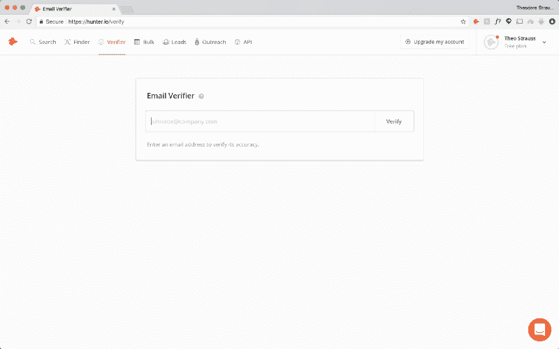
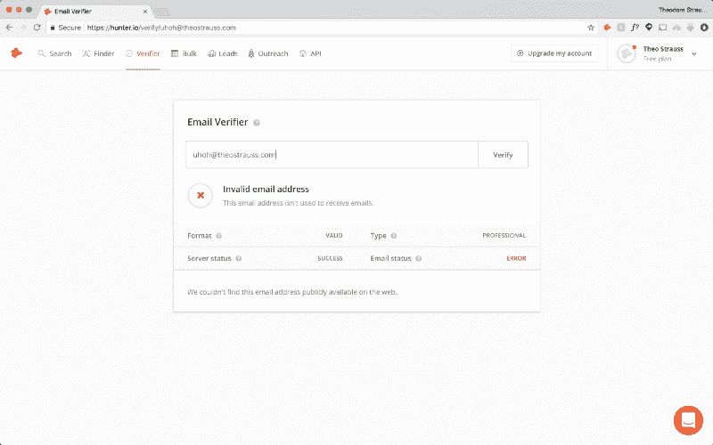
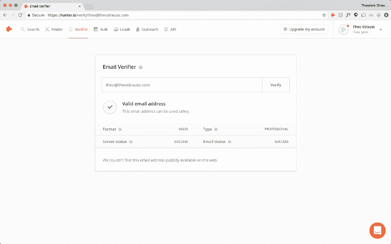
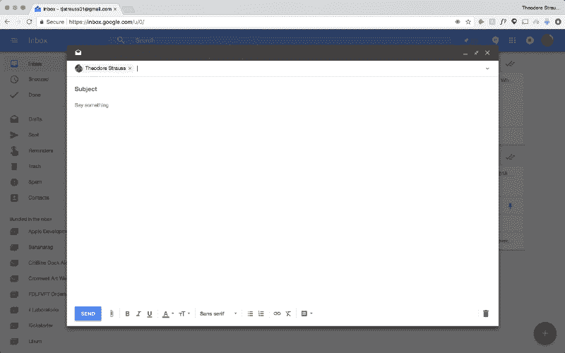
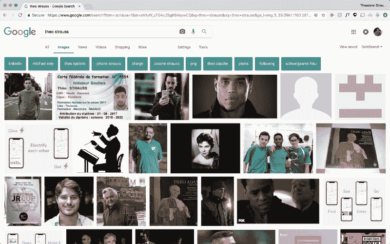
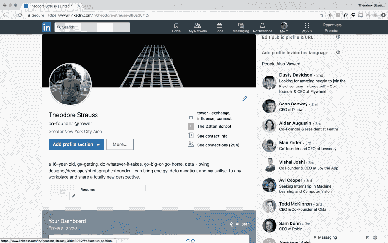
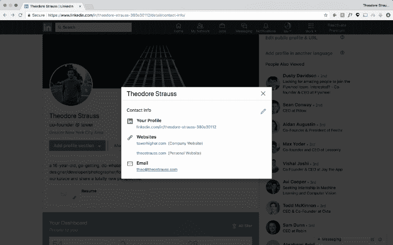
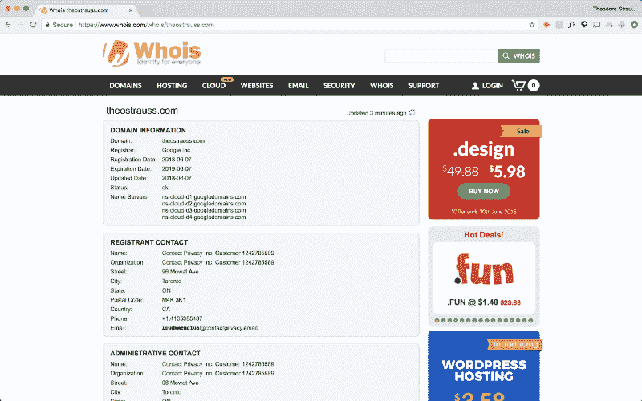
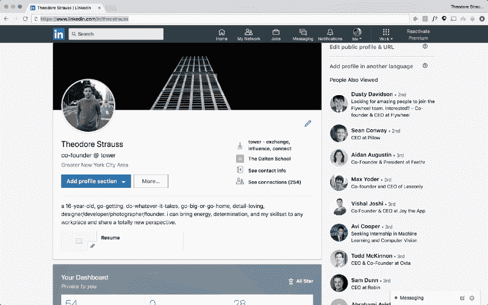
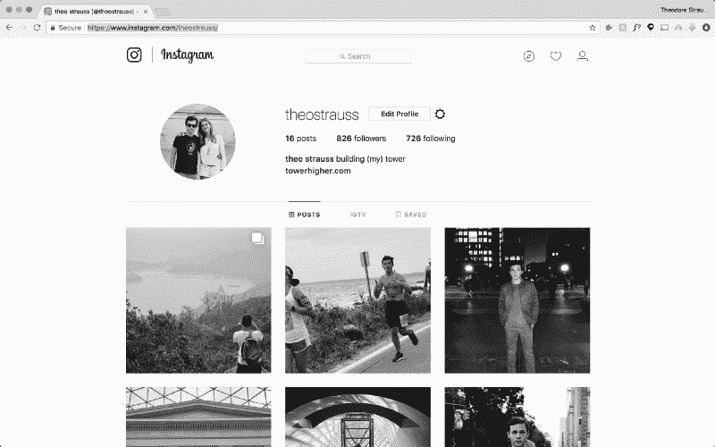

# 如何在几分钟内找到任何 CEO 的电子邮件地址

> 原文：<https://www.freecodecamp.org/news/how-to-find-any-ceos-email-address-in-minutes-70dcb96e02b0/>

作者西奥·施特劳斯

#### 电子邮件人银河指南:第一部分

我 17 了，所以我的关系网还不算太大，只是暂时的。对我来说，冷冰冰的邮件是联系创始人最简单、最直接的方式。在过去的一年里，我不仅发现了如何找到一个技术领导者的工作邮箱，还发现了他们的私人邮箱。

在这篇文章中，我将教你在 tech 的电子邮件地址中搜索任何人的来龙去脉。所以，坐下来，下载谷歌浏览器，打开你的 Gmail，让我们开始工作吧。

### 第 1 部分:简单的出路

最容易找到的邮件是工作邮件，但这是一把双刃剑。虽然更容易找到，但这个人可能:

1.  每天成百上千的电子邮件涌入他们的收件箱
2.  过滤掉你的邮件，或者
3.  行政助理(EA)亲自选择他们应该阅读的电子邮件。

如果这是一封严格意义上的业务相关邮件，或者你知道这位创始人一天不会收到超过 400 封邮件，下面介绍的方法是适合你的。

记住，发电子邮件是出于尊重，所以要仔细权衡这两种选择。此人是否希望您通过他们的个人收件箱向他们发送电子邮件？

#### **第一步:使用 Hunter.io 查找电子邮件**

去[猎人网站](http://hunter.io)注册一个账号(还有[下载他们的 Chrome 插件](https://chrome.google.com/webstore/detail/hunter/hgmhmanijnjhaffoampdlllchpolkdnj?hl=en))。

亨特是一个非常强大的工具。在这篇文章中，我们将不止一次地使用它。它可以让你找到所有附在某个网站上的电子邮件，验证邮件是否被他们的服务器接受，甚至可以存储你的线索以备后用。

#### **第二步:搜索相关信息**

进入你的猎人仪表盘，在中搜索你想要的信息。你可以输入你的公司的网址。亨特很方便地找到了所有与服务器相关的电子邮件。

你的人的电子邮件可能不在那里，但重要的是你发现的模式。它很可能是以下任何一种模式:

*   [first_name]@company.com
*   [first_initial][last_name]@company.com
*   [first_name][last_name]@company.com。

现在你有了一个模式，是时候尝试一下了。

#### **第三步:在 Hunter** 中验证邮件

转到 Hunter 中的[验证器](http://hunter.io/verify)选项卡:

通过这个模式输入你认为你的人的电子邮件是什么。您将看到三种结果之一。

1.  服务器**接受了**✅的电子邮件地址
2.  服务器**接受**✅的所有电子邮件地址
3.  服务器**拒绝了**❌的邮件地址

如果是 3 号，你就遇到了障碍。你可能应该跳到**第二部分:艰难但尝试过的真实出路**。

如果是 1 号或 2 号，你就在正确的轨道上。是时候进入您的 Gmail 帐户了！

#### 第四步:仔细检查你的邮件

我们将使用 Gmail 的一个被低估的功能来再次检查我们发现的电子邮件是否真的有效。此时，我们处于最后一步。创建一个新的草稿，并输入您在 Hunter 中尝试的电子邮件。

如果你按下回车键，将鼠标悬停在你输入的电子邮件上，你会看到一个用于个人资料图片的位置和一个用于他们名字的空间。

如果你看到一张个人资料照片，并能证明这是你的人，你就可以走了。如果你看到一个名字，而且是你想要的，那就更好了！如果这些都不是真的，试着将电子邮件地址复制粘贴到谷歌搜索中。可能会发生一些事情来证实你的猜测。

Look, it’s me!

如果出现一张个人资料照片，但你不确定是不是他们，回到谷歌搜索他们的名字。浏览**图片** ，看看你是否能找到那张图片。你可能会，它会附在他们的一个账户上，可能是一张旧的 Twitter 个人资料图片或什么的。

还是找不到照片？截屏 Gmail 上的小个人资料图片，并将其放入 Google Images 进行反向图片搜索。它可能会给你想要的结果！

#### 第五步:发送你的邮件！

等等，不要！发之前，你要先看下本系列的下一个帖子， [*如何给一个 CEO 设计一封阅读、点击、回复率 100%的冷冰冰的邮件*](https://medium.freecodecamp.org/how-to-design-a-cold-email-for-a-ceo-with-a-100-read-click-and-response-rate-84edb1b2603b) *。*

现在，如果这些都不起作用，一点也不用担心。让我们进入正题。

### 第二部分:**艰难，但尝试和真正的出路**。

因此，你无法进入一位首席执行官的个人收件箱，不被过滤器、行政助理或每天 100 多封电子邮件所触动。

和大多数人想的不一样，这个超级容易。这都是为了不放弃。

以下是你需要的:一个 LinkedIn 账户，一个 Hunter 账户，Google Chrome，5 分钟到半小时。

#### **第一步:找到他们的 LinkedIn**

你可以打开谷歌，尝试输入他们的名字(如果他们有共同的名字，也可以输入他们的公司)，或者直接搜索 LinkedIn。

那么，为什么选择 LinkedIn 呢？这可能是一座信息的金矿。

随着 CEO 职位的上升，他们可能会忘记更新他们的 LinkedIn，在联系信息中保留他们的个人链接。

#### **第二步:** **点击自己的联系方式**

如果你够幸运，他们忘记更新他们的 LinkedIn 个人资料，他们的个人邮箱可能也在那里。

#### 第三步:如果你看到一个个人链接，也许是[名字][姓氏]。点击它。

会发生两件事之一:

1.  您将被带到他们的个人网站。
2.  你会看到一个“DNS 未找到”的页面。

如果发生了第一种情况，你就在正确的道路上。在网站的导航栏中寻找联系页面，或者滚动到底部找到电子邮件图标，或者更好的是，找到电子邮件本身。

找到一封[first_name]@domain.com 或 hello@domain.com 的邮件是很棒的。那些总是会重定向到他们的个人电子邮件。

如果你找不到电子邮件，甚至是写着“我的全名是. com”的东西，但是你可以找到一个联系方式，那也没关系。我说这“很好”，因为**你将无法跟踪你的电子邮件的进展，我将在本系列的最后一篇文章**中讨论这个问题。但是，这些几乎总是进入他们的个人邮箱，所以如果你想把你的邮件发送出去，就去吧！

如果发生第二种情况，那也没关系。这时你拿出互联网的目录，由蒂姆·伯纳斯·李爵士和温顿·瑟夫转交。

#### 第三步(有点):前往 WHOIS.com

这是一个我们可能会多次提到的步骤。进入 Chrome 顶部的网址/搜索栏，输入 whois.com/whois/[their_domain]。

当互联网刚刚起步时，DARPA(创建其早期版本的政府机构)需要一个地方来存储域名所有者的信息。很多购买域名的人，通常是在 GoDaddy.com 以外的地方(顺便说一句，我强烈建议你使用谷歌域名)，并没有利用域名私有化，这将他们的个人信息都放在那里。

Google Domain offers domain privatization for free!

如果你看到他们所有的信息，而不是上面的照片，你很幸运。滚动直到你找到你要找的东西。

如果不是这样，不要担心。

#### **步骤 4:寻找用户名模式**

许多人做的，但不经常想到的事情是，在每个社交媒体账户上使用相同的用户名。

认识到这一点后，你的下一个任务就是找出你能找到的所有社交媒体。除非他们是像杰克·多西一样的社交媒体 OG，到处都有“杰克”,否则你会找到成功的关键。

Look at the URL in each. Both usernames are @theostrauss

找出至少两个账户。第一个应该是 Twitter，第二个可以是 Instagram、脸书或 LinkedIn，看看他们是否有后两者的用户名(注册时可选)。

现在，我们可以重复第一部分**、**、**第四步**。转到 Gmail，输入他们的用户名@gmail.com。按照步骤判断用户名是否有效。如果是对的，你就可以发邮件了！

#### **第五步:在全力以赴之前尝试猜谜游戏**

如果这不起作用，你还可以在 Gmail 上试试别的方法。

Gmail 给你的线索是这个谜题的关键部分。利用该功能的第二个最简单的方法是猜测最常见的电子邮件模式，直到你强行进入。他们在这里:

1.  [first_name][last_name]@gmail.com
2.  [first_name].[last_name]@gmail.com(这实际上是上一封邮件，Gmail 不关心句号，句号。)
3.  [first_name]_[last_name]@gmail.com
4.  [first_initial][last_name]@gmail.com
5.  [first_initial][middle_initial][last_name]@gmail.com

现在，有些人可能和你试图联系的创始人同名。因此，你必须通过使用**第 1 部分第 4 步**中的所有步骤来确定这是正确的人选。

如果这些步骤都不起作用，你就到了最后一步，也可能是最不常见的一步，但这是目前最好的选择。

#### 第五步:gooooooooogle

回到我们值得信赖的朋友 google.com 那里，输入这个人的名字(如果他们的名字很常见，还要输入他们公司的名字)。现在，开始滚动。

有一次，在谷歌的第三页，我发现了一个作家的 [about.me](http://about.me) 链接到一个旧的 Tumblr，它链接到一个旧的 Twitter，Twitter 也使用了他的 Gmail 的用户名。

在此，祝大家好运。这取决于你，你非常接近找到你的创始人的电子邮件。但是，如果其他方法都失败了，你可以随时回到第一部分。

### 第三部分:何去何从

现在你有了你要找的电子邮件地址，你必须写电子邮件！

我在这个系列中的下一篇文章将会讲述如何写能让我获得 100%阅读率、100%点击率和 80%回复率的电子邮件。

如果你喜欢这篇文章，按住它。icon(可以到 50，你懂的)。请继续关注下一篇和之后的文章，它们会记录你邮件的进展。

[跟随我的媒介](http://medium.com/@theostrauss)从新的角度了解更多关于设计的知识。在接下来的几个月里，我将深入研究设计将如何与未来相交。在这一页上，你会看到关于自动驾驶汽车的案例研究，以及强调打破 UI/UX 世界界限的界面的帖子。

你也可以在 Instagram @theostrauss 和 Twitter@ Theodore Strauss[上找到我！](http://twitter.com/theodorestrauss)