# 如何找到远程工作——25 个帮助你在家在线工作的网站

> 原文：<https://www.freecodecamp.org/news/how-to-find-remote-jobs/>

在家工作有它的挑战，但也有很多好处。很多员工喜欢灵活的时间表，你可以不用出去吃饭或开车上班，从而节省开支。

我已经为远程工作策划了 25 个站点。无论你是在找兼职，全职，还是自由职业者，这些都是最好的网站。

这是完整的清单。一旦你找到一个你感兴趣的网站，点击那个链接，它会让你跳转到那个网站更详细的描述。

1.  [电弧](#arc)
2.  [我们远程工作](#we-work-remotely)
3.  [跳过驱动](#skip-the-drive)
4.  [飞翔的力量](#power-to-fly)
5.  [远程正常](#remote-ok)
6.  [移除](#remotive)
7.  [弹性工作](#flexjobs)
8.  [运球](#dribble)
9.  [AngelList](#angellist)
10.  [Remote.co](#remote-co)
11.  [JustRemote](#justremote)
12.  [虚拟职业](#virtual-vocations)
13.  [盘古](#pangian)
14.  [劳动游牧民族](#working-nomads)
15.  [Jobspresso](#jobspresso)
16.  [外包](#outsourcely)
17.  [着陆。乔布斯](#landing-jobs)
18.  [正宗的工作](#authentic-jobs)
19.  [堆栈溢出](#stack-overflow)
20.  [Gun.io](#gun-io)
21.  [理想主义者](#idealist)
22.  五个
23.  [向上工作](#upwork)
24.  [自由职业者](#freelancer)
25.  自由职业者地图

## 弧

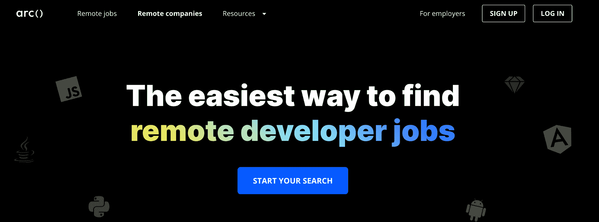

Arc 是一个致力于远程开发者工作的网站。Arc 提供许多免费资源，包括 tech stack 的求职、[、简历指南](https://arc.dev/resume)、[薪资浏览器](https://arc.dev/salaries)、[虚拟事件](https://arc.dev/virtual-events)和[面试问题](https://arc.dev/interview)。

你也可以浏览 Arc 列出的正在招聘的顶级远程公司名单。

## 我们远程工作

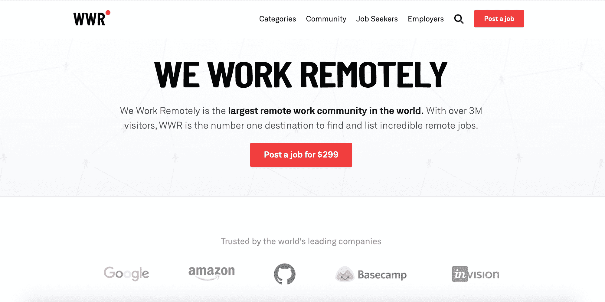

[我们远程工作](https://weworkremotely.com/)提供前端、后端、全栈、移动、设计等方面的免费职位发布。您还可以访问他们的[活动](https://learn.weworkremotely.com/community-calendar?utm_source=wwr-nav)、[论坛](https://forum.weworkremotely.com/)和[休闲小组](https://wwrcommunity.slack.com/join/shared_invite/zt-rgdyfy2v-sRTnAG8iIQF1GRZjlFSU4g#/shared-invite/email)。

## 跳过驱动器

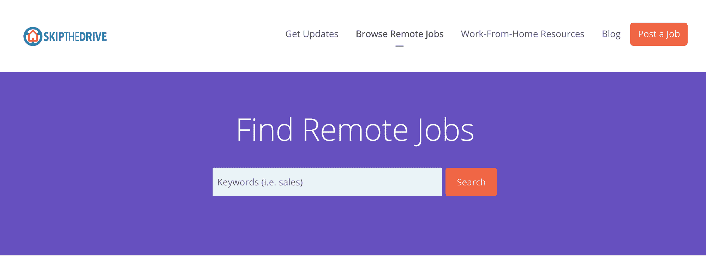

[Skip The Drive](https://www.skipthedrive.com/) 提供开发、项目管理、销售等领域的免费工作列表。这个网站还提供了一个[微型求职网站列表](https://www.skipthedrive.com/list-of-micro-job-sites/)，一个[远程工作节省计算器](https://www.skipthedrive.com/how-much-money-can-you-save-by-telecommuting/)，以及一个[工作申请跟踪电子表格](https://www.skipthedrive.com/job-application-tracking/)。

## 飞翔的力量

飞的力量专门为来自代表性不足的背景的候选人和潜在雇主牵线搭桥。创建帐户后，您将可以访问工作列表、职业活动、辅导课程、导师等。

## 远程正常

[Remote Ok](https://remoteok.io/) 提供开发、在线教学、设计等方面的免费工作列表。这个网站也有一个专为[自由职业者](https://remoteok.io/workers)准备的单独页面，你可以在那里创建个人资料并获得数千份工作。

## 雷莫蒂

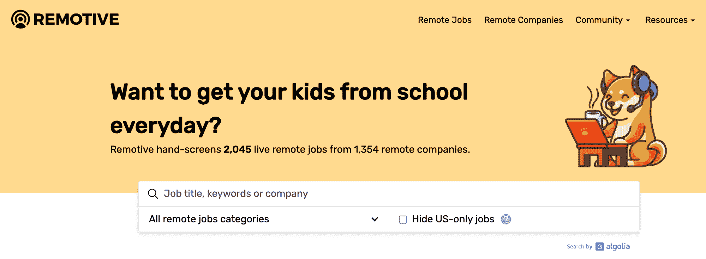

Remotive 提供 IT、开发、设计、质量保证等领域的免费招聘信息。Remotive 还提供[职业指南](https://remotive.io/guides)、[网络研讨会](https://remotive.io/webinar)，以及 [Remotive 社区](https://remotive.io/community)的付费访问。

## 弹性工作

FlexJobs 是一个远程兼职、全职和自由职业者的订阅网站。如果你对为招聘信息付费持怀疑态度，那么看看他们的[更好的商务局评级和评论。](https://www.bbb.org/us/co/boulder/profile/employment-agencies/flexjobs-1296-90091095/customer-reviews)

这是 FlexJobs 订阅的当前价格列表。

成员可以访问他们的工作列表、活动和文章。FlexJobs 还提供职业指导、简历审查和模拟面试，但需要额外付费。

## 运球

虽然 Dribble 主要是作为自由设计师发布作品的地方而闻名，但也有一个部分用于[远程图形设计工作](https://dribbble.com/jobs)。

## 天使列表

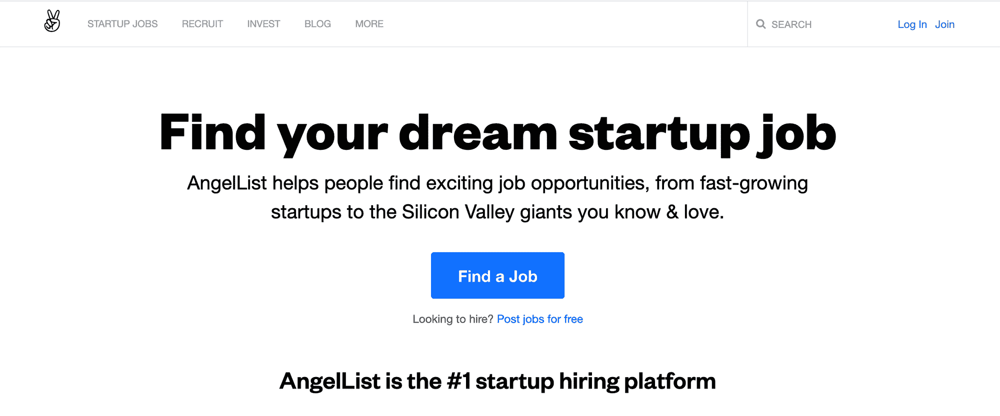

AngelList 提供初创公司的软件工作列表。你需要创建一个帐户，以便阅读完整的工作描述和申请。

## Remote.co

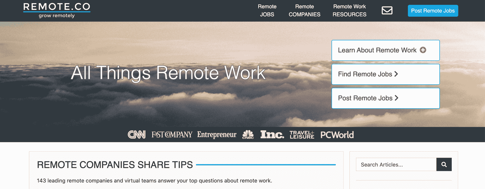

Remote.co 提供 IT、开发、设计、质量保证等领域的免费招聘信息。如果您升级到高级服务，那么您可以获得更多的职位发布、职业指导和简历评论。

## 只是远程的

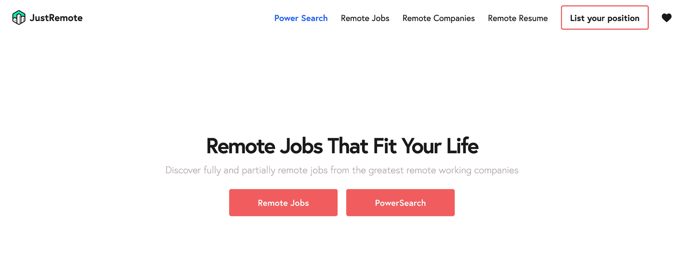

JustRemote 提供开发、开发、设计等领域的免费招聘信息。他们还提供在线简历生成器，帮助你进入面试阶段。

只需额外付费，JustRemote 就有一个名为 [PowerSearch](https://justremote.co/power-search) 的功能，为你提供通常对公众隐藏的额外职位发布。

## 虚拟职业

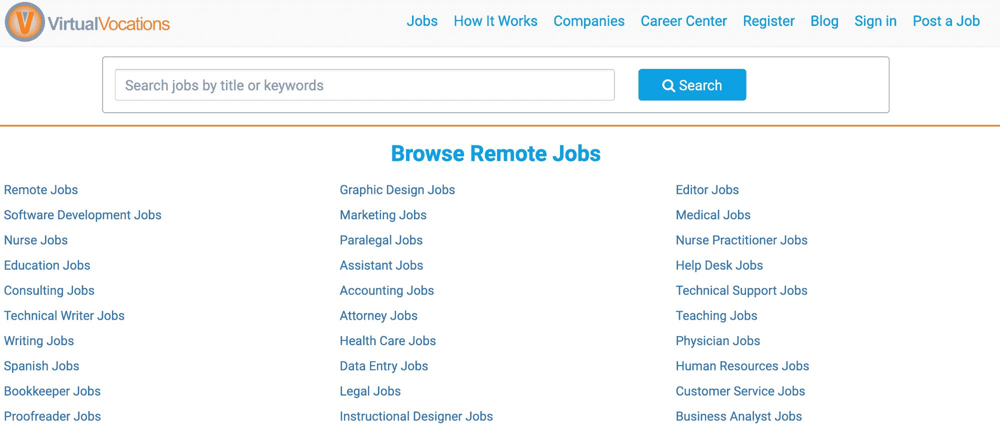

虚拟职业是一项免费服务，为你提供开发、技术写作、质量保证、项目管理等方面的远程工作列表。

虚拟职业还提供付费订阅服务，包括课程、网络研讨会和职业辅导课程。

## 潘吉安

Pangian 提供开发、IT、销售等领域的免费远程工作列表。您需要创建一个免费帐户来访问工作详细信息。

Pangian 还提供免费的职业建议和一个社区论坛。额外支付 149.99 美元，你就可以访问[一对一简历和简历审核](https://pangian.com/resume-cv-remote-audit-revamp-rework/)。

## 劳动游牧者

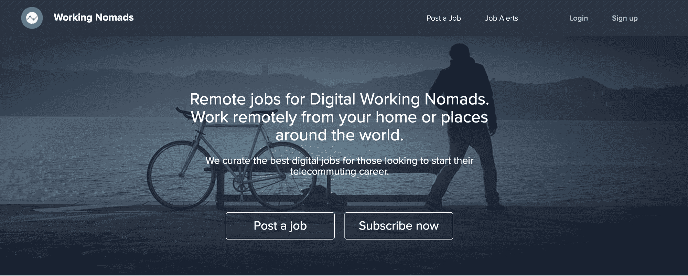

[工作游民](https://www.workingnomads.co/jobs)提供开发、设计、开发、项目管理等方面的免费工作列表。

## Jobspresso

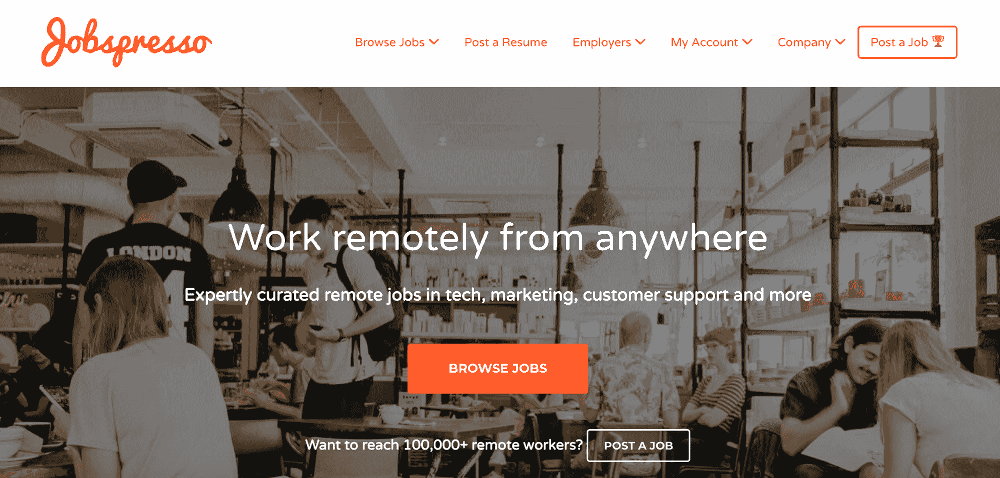

[Jobspresso](https://jobspresso.co/) 提供数以千计的开发、设计、开发、客户服务等方面的免费信息。

## 外包

[外包](https://www.outsourcely.com/remote-workers)确保求职者与正确的公司配对。创建一个帐户，浏览 web 开发、移动、设计、客户服务等领域的数千个帖子。

## 着陆。乔布斯

[Landing.jobs](https://landing.jobs/remoteworking) 连接独立承包商和远程工作。创建一个帐户，通过 Landing.jobs 评估流程，然后开始申请远程工作。

## 真实的工作

Authentic jobs 提供网页开发、移动、项目管理、设计等方面的免费列表。

## 堆栈溢出

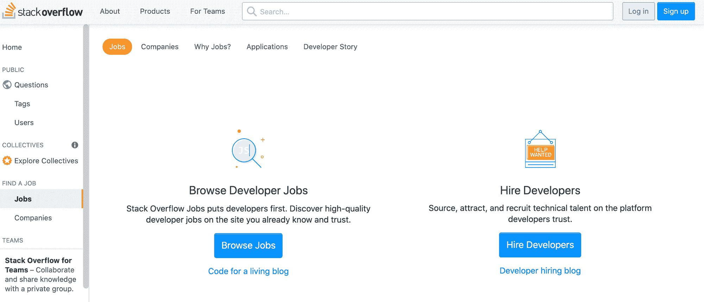

栈溢出主要是作为一个技术问题和答案的地方，但他们也有一个[作业部分](https://stackoverflow.com/jobs/get-started)。对于远程工作，只需在搜索参数中选择远程选项。

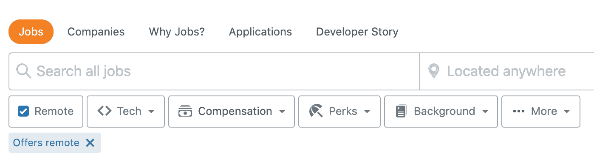

## Gun.io

[Gun.io](https://www.gun.io/) 专门连接开发者和软件公司。创建一个账户，申请工作，通过面试，开始工作。

## 理想主义者

理想主义者是一个为非营利组织和希望改变世界的组织发布数百个职位的网站。对于远程工作，请确保在搜索参数中选择该选项。

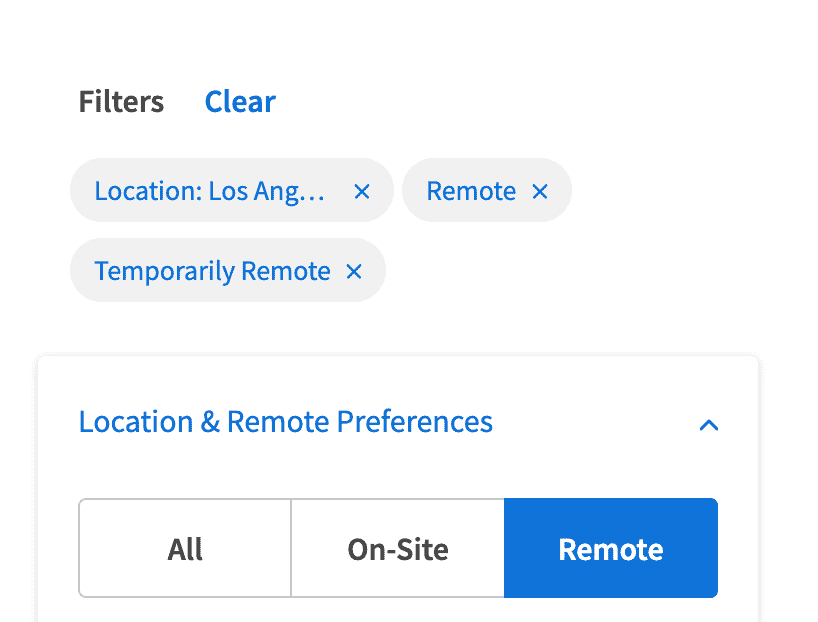

## 自由职业项目和微型工作

## 五元

Fiverr 是一个你可以创建服务列表并提供给 Fiverr 全球用户的网站。

## 向上工作

Upwork 是自由职业者竞标工作、销售项目、联系招聘人员的地方。

## 自由记者

自由职业者专门为客户和自由职业者牵线搭桥。自由职业者可以搜索数以千计的项目并出价。

## 自由职业者地图

自由职业者地图专门为自由职业者和世界各地的客户牵线搭桥。自由职业者可以创建一个帐户，并对符合他们技能和经验的项目进行投标。