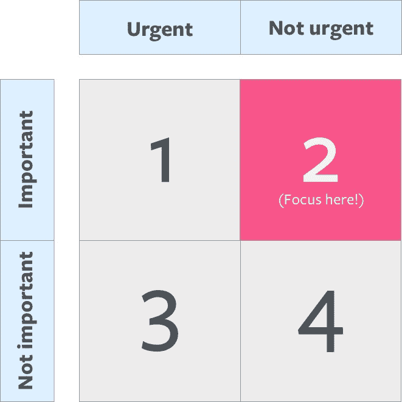

# 如何在百忙之中挤出时间来学习

> 原文：<https://www.freecodecamp.org/news/how-to-find-time-in-your-busy-schedule-to-learn-de1b641a8377/>

作者 Zell Liew

# 如何在百忙之中挤出时间来学习

Photo by [Aron Visuals](https://unsplash.com/photos/BXOXnQ26B7o?utm_source=unsplash&utm_medium=referral&utm_content=creditCopyText) on [Unsplash](https://unsplash.com/search/photos/learn?utm_source=unsplash&utm_medium=referral&utm_content=creditCopyText)

下班后你筋疲力尽。你只想在沙发上放松。在周末，你想与朋友和家人共度时光。

你知道学习很重要。你想做这件事，但似乎找不到时间。

你是如何找到时间学习的？我会在这篇文章中告诉你。

### 你在哪里度过你的时间？

缺乏时间经常被认为是学习的主要障碍。但是时间不是问题。每个人一天都有 24 小时。重要的是你怎么花。

Image [source](https://www.amazon.com/Habits-Highly-Effective-People-Powerful-ebook/dp/B01069X4H0/ref=mt_kindle?_encoding=UTF8&me=).

有四种事情你可以花时间去做:

*   **重要和紧急:**这些可以是有期限的工作相关的事情。它们可能会让你陷入危机状态。
*   重要，但不紧急:你没有必要马上去做这些事情，但如果你去做了，你的生活会变得更好。学习往往在这个第二象限。
*   **不重要，但很紧急:**如果你不做，它们对你的生活影响不大。您希望减少象限 3 中的活动。一个例子是跟上 Twitter。
*   **不重要，也不紧急:**可能的话你就不要做这些事了。

**审视自己。你大部分时间在哪里度过？**

理想情况下，你想把大部分时间花在象限 1 或象限 2，这是重要的东西。如果你目前没有这样做，你需要问自己:为什么你花这么多时间在象限 3 和象限 4(不重要的东西)？

### 你的首要任务是什么？

你希望你的生活怎么走？

重要的工作是引导你的生活朝着你想要的方向前进的工作。其他一切都是干扰。

不要和消耗你精力的人混在一起。那是象限 4 的时间(不重要，不紧急)。花时间和给你充电的人在一起，这样你就能找到精力去做象限 1 或象限 2 的事情。

不要在你讨厌的工作上加班。这是象限 3 中的时间(不重要，紧急),因为工作不能帮助你到达你想去的地方。

不要为了自己热爱的工作加班。即使它可能在象限 1(重要和紧急)，你可能热爱你的工作，你也会筋疲力尽。没有什么工作值得你为之耗尽精力。

审视你的生活，确保你把时间花在对你来说重要的事情上。如果时间不够，就需要削减。你甚至可能需要减少工作。格雷斯，一个注册了我的一门课程的学生，接受了降薪学习。在这里阅读她为什么[那样做](https://medium.com/@graceaesnow/why-ive-taken-a-massive-pay-cut-to-study-front-end-design-development-91fd663a0dc6)。

你可以阅读[高效人士的 7 个习惯](https://www.amazon.com/Habits-Highly-Effective-People-Powerful-ebook/dp/B01069X4H0/ref=mt_kindle?_encoding=UTF8&me=)来了解更多关于四个象限的信息。

### 尽管有重要的承诺，还是要挤出时间

如果你有更多的承诺，你留给自己的时间就更少了。但是这些承诺并不一定会阻止你学习。

尽管你有承诺，你还是能找到时间。

怎么会？两种方式:

1.  关注(并优先考虑)最重要的事情
2.  划出学习时间

让我们逐一讨论这些问题。

#### 专注于重要的事情

你不必一下子学会所有的东西。你不需要知道所有的最新信息。

了解让你进入下一阶段的重要因素。其他事情可以等。

比如我想学 Vue。我也想学画画。但是我不会花时间在 Vue 或者画画上，因为它们现在对我来说并不重要。

相反，我把时间花在营销、写作和开发优质课程上。

#### 划出学习时间

留出学习的时间。不要让任何人分散你的注意力。即使是你自己。

如果你的配偶(或家庭成员)不同意你的观点，与他们沟通。你需要他们的支持。你需要他们在你学习的时候不打扰你。

如果你还没有得到他们的支持，你需要花时间和他们在一起，直到你得到他们的支持。肖恩·麦凯布在[重叠](http://overlapbook.com/)中解释了如何做到这一点。

### 包扎

你如何在生活中导航取决于你大脑中的知识。这是你的主要武器。

每天学点新东西。

你可以通过以下方式找到时间来学习:

1.  从不重要的活动中削减时间
2.  专注于学习什么是重要的
3.  划出学习时间

你将如何找到时间去学习？我很想听听你的想法。请在下面的评论中告诉我:)

感谢阅读。这篇文章对你有什么帮助吗？如果我有，[我希望你考虑分享它](http://twitter.com/share?text=Finding%20time%20to%20learn%20by%20@zellwk%20?%20&url=https://zellwk.com/blog/finding-time-to-learn/&hashtags=)。在阅读这篇文章之前，你可能只是帮助了和你有同样感受的人。谢谢你。

*最初发表于[zellwk.com](https://zellwk.com/blog/finding-time-to-learn/)。*