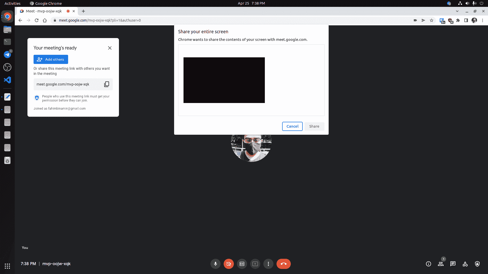
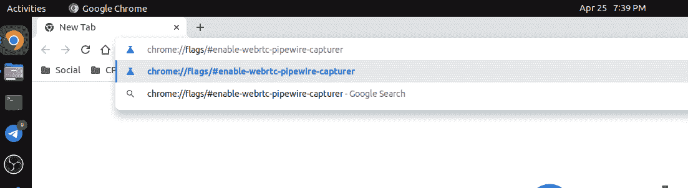
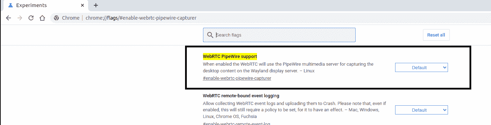
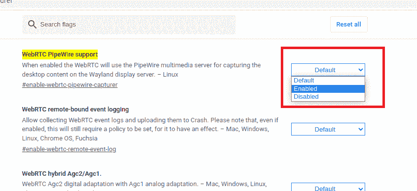
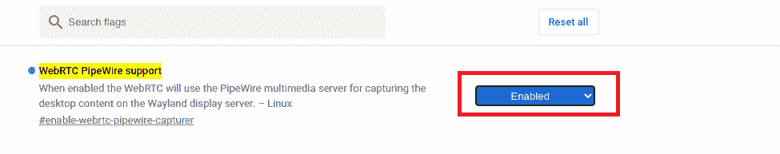
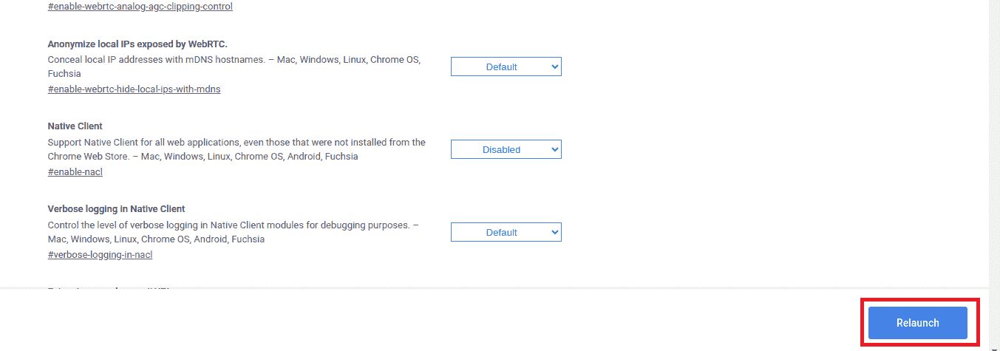
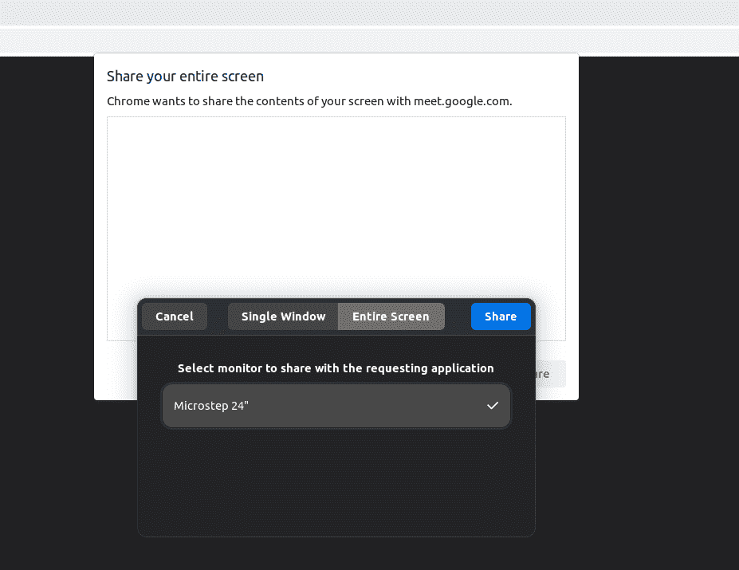
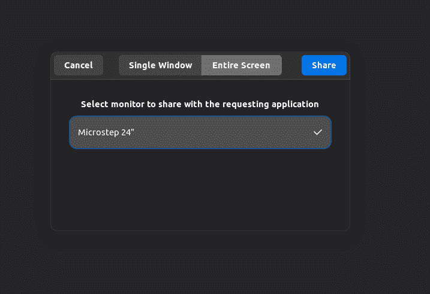
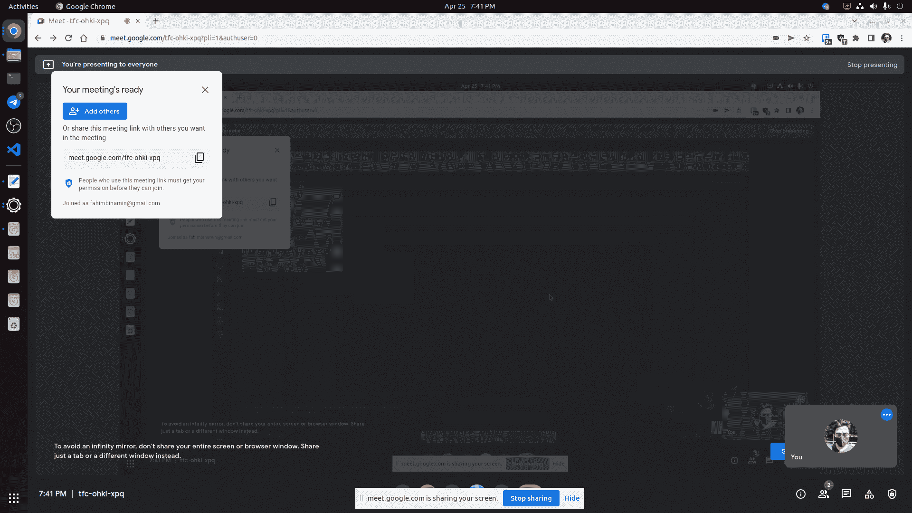

# 如何修复 Linux OS 上的谷歌 Chrome 黑屏(Wayland)

> 原文：<https://www.freecodecamp.org/news/how-to-fix-black-screen-on-google-chrome-on-linux-os/>

如果您是 Linux 用户，那么您可能至少使用过一次 GNOME 桌面环境。

现在最新的 GNOME DE(桌面环境)用的是 Wayland。虽然如果你愿意，可以删除 Wayland 并选择 Xorg，但大多数用户都开始将 Wayland 作为他们的日常司机。

如果你仍然使用 Chrome 或 Chrome 浏览器，你会经常在屏幕共享时遇到黑屏问题。

如果你通常在桌面上使用 Wayland，你会在屏幕共享时遇到这些问题，尤其是在 Google Meet 中。

在本文中，我将向您展示一个非常简单的技巧，帮助您解决在任何类型的 Chromium 浏览器(包括最流行的浏览器 Google Chrome)上共享屏幕时出现的黑屏问题。

我是用 Ubuntu 写这篇文章的，但是同样的过程也适用于 Wayland 上运行的所有其他 Linux 操作系统发行版。

## 黑屏问题

如果您在 Chromium 浏览器(Chrome、Brave、Vivaldi 等)中遇到 Google Meet 黑屏问题，可能是这样的:

有时，这可能是因为 Wayland 中的屏幕共享被破坏或其他问题。许多用户也表示，当开发者努力提高安全级别时，会发生这种情况。

对于许多人来说，屏幕共享的问题可能会变得很常见。许多用户回到 X11 只是为了这个问题，或者尝试 pipewire 解决方案来解决这个问题。

我将向您展示使用 pipewire 技术的解决方案，这样您就不需要仅仅为了解决这个问题而回到 X11。😊

使用浏览器的地址栏转到 **`chrome://flags/#enable-webrtc-pipewire-capturer`** 。

你会得到一个很长的列表，但是我们感兴趣的是 **WebRTC PipeWire 支持**。您将看到该选项现在处于默认模式。

我们需要把它改成**使能**。

只需点击下拉菜单，然后点击**启用**。

现在你会在右下方看到一个提示，要求重新启动浏览器，这样就可以生效了。

点击**重新启动**。它将简单地重启你的浏览器。

问题已经解决！✌️

## 如何测试屏幕共享

现在，如果你想像往常一样分享你的屏幕，你肯定可以这样做。

每当您想要共享屏幕时，会出现一个提示，要求您选择显示器。你必须分享监视器。如果你像我一样只有一台显示器，那么你就会得到一台显示器。只需点击它，然后点击**分享**。

您还将看到屏幕共享的预览。

您可能需要在提示中再次选择显示器。如前所述，只需选择显示器并点击共享即可。

从现在开始，你可以从 Wayland 在 Google Meet 上分享你的屏幕。

## 结论

如果这篇文章能帮助你解决 Linux DE 的黑屏问题，那么我已经成功了。😊

我还要感谢你阅读了整篇文章。

如果你想关注我，那么你可以通过 **[Twitter](https://twitter.com/Fahim_FBA)** 和 **[LinkedIn](https://www.linkedin.com/in/fahimfba/)** 来关注我。

如果你喜欢为开源做贡献，那么你也可以在 [**GitHub**](https://github.com/FahimFBA) 上关注我，因为我会定期在那个平台上做贡献。也许你会注意到我已经为你最喜欢的项目做了贡献，谁知道呢！😅

还有一件事，我有两个 YouTube 频道，在那里我谈论编程的东西。[如果你喜欢那些英文的内容，那么你可以去看看我的英文品牌频道](https://www.youtube.com/channel/UCG97GCUifMS2Vm28tgXQi0Q)。

如果你是孟加拉人，那么我还有另外一个孟加拉社区的品牌渠道。你也可以[看看我的孟加拉品牌频道](https://www.youtube.com/channel/UCEF4lxmpBKV2oYCSFH6ExIQ)。

非常感谢！😋