# 如何修复 Linux 中耳机和扬声器的坏音频

> 原文：<https://www.freecodecamp.org/news/how-to-fix-broken-audio-in-headphones-and-speakers-linux/>

如果您在桌面上使用的是 Linux 操作系统，您以前可能会遇到一些音频问题。就像当耳机连接到音频插孔时，你试图让扬声器发出声音。

如果是这样，不用担心！这是一个很常见的问题，你可以很快解决。在这篇文章中，我将帮助你彻底解决这个问题。我将使用一个众所周知的名为 [Manjaro Linux](https://manjaro.org/) 的发行版，但是我相信同样的方法适用于所有的 Linux 发行版。

### 步骤 1–打开终端/控制台

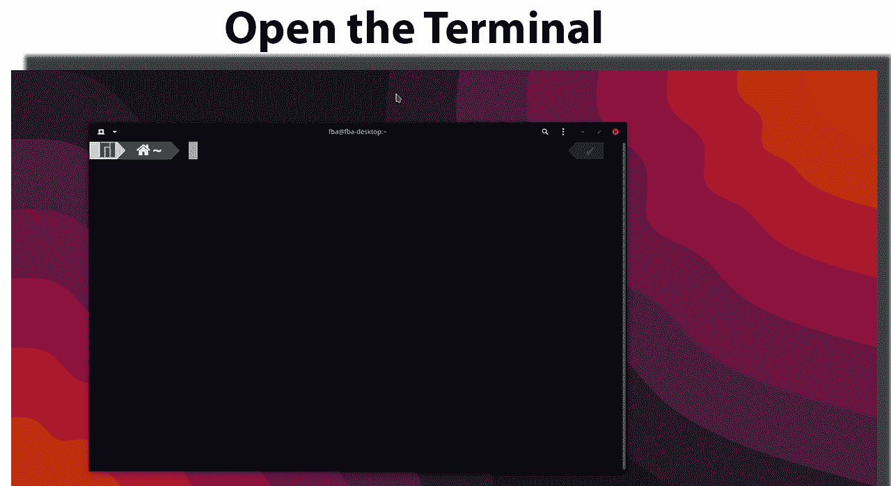

### 步骤 2–打开 Alsamixer

我们将使用 alsamixer 来调整音频设置。键入`alsamixer`并按下键盘上的 **Enter** 键。

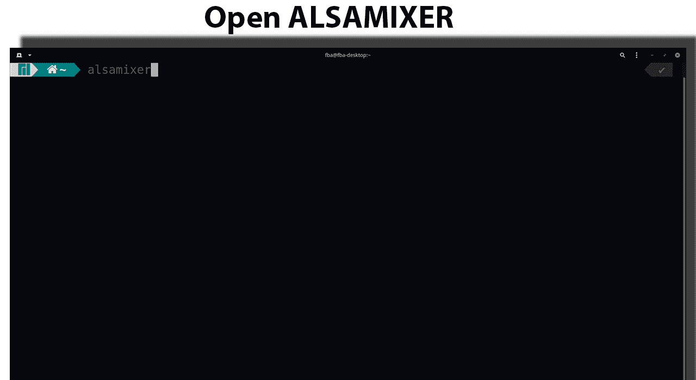

Alsamixer 将在您的终端中打开。

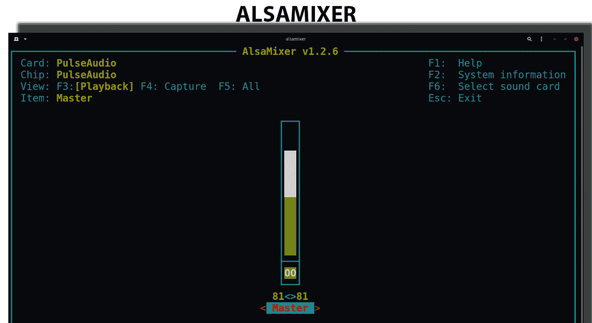

### 步骤 3–设置首选声卡

现在你需要选择你喜欢的声卡。为此，只需按下键盘上的`F6`键。选择适合您的声卡。

如果您不确定，那么您可以简单地一次选择其中一个(选择声卡后按下 **Enter** 键),并尝试其余的方法来查看该声卡是否合适。对我来说，它是**默认:1 高清音频通用**。

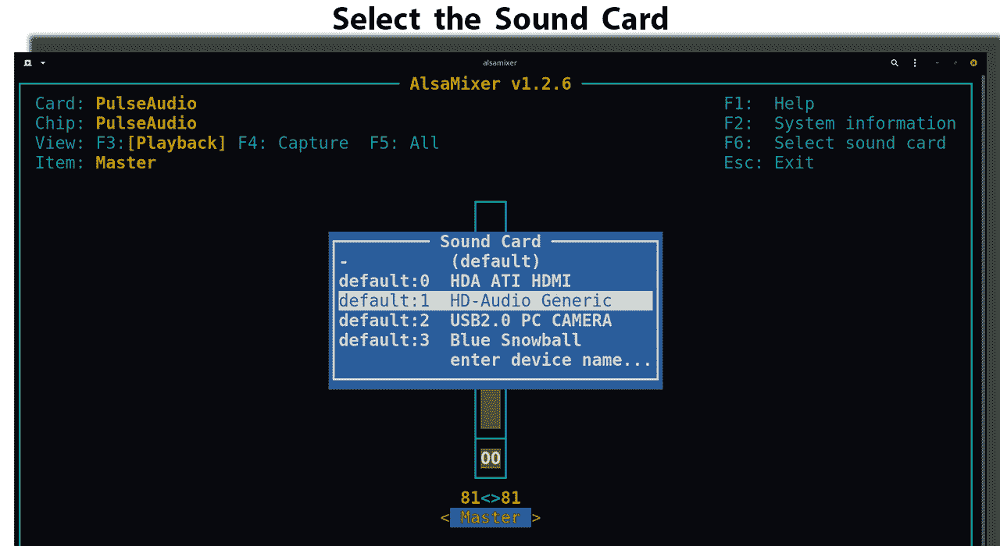

AlsaMixer 窗口将根据您选择的声卡而变化。

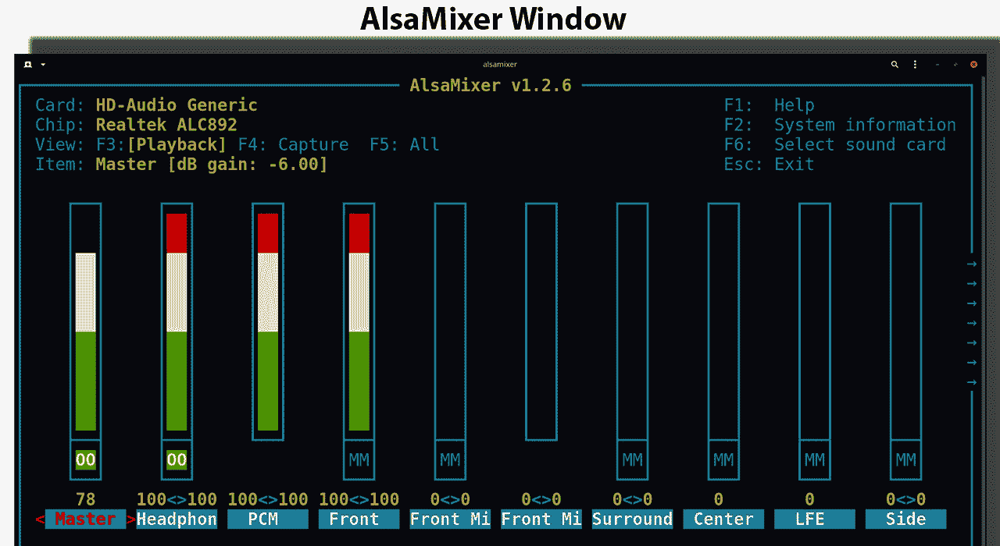

然后按右箭头(`➜`)键，直到找到**自动静音模式**。

你会看到它目前**启用**。

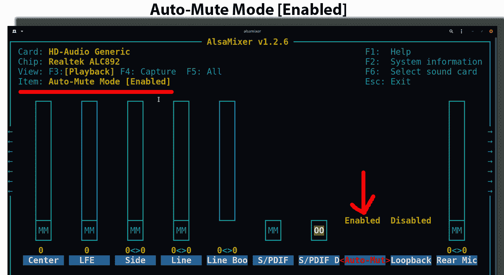

我们需要把它变回**残疾人**。您必须按下向下箭头(`↓`)键来禁用它。

然后按`Esc`键退出 AlsaMixer。

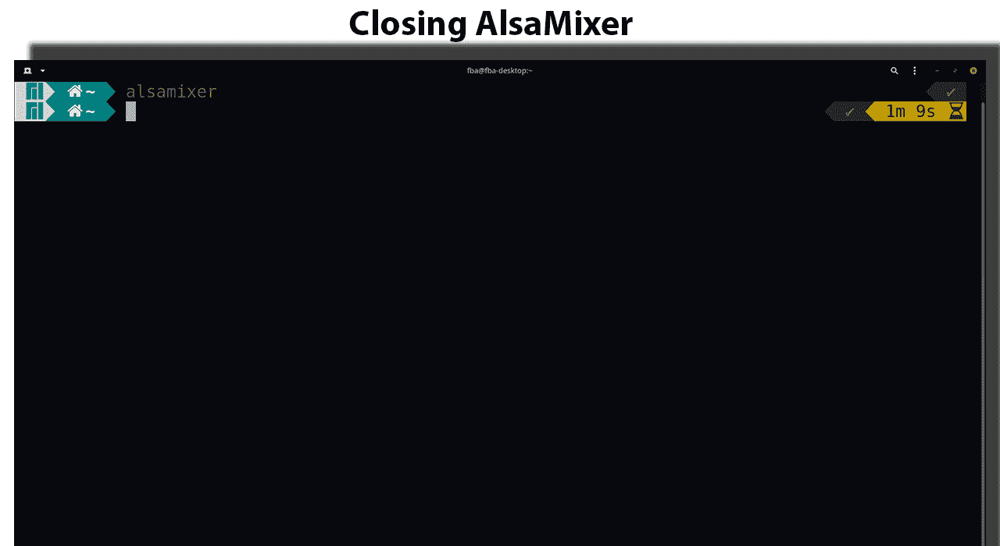

### 步骤 4–保存设置

现在我们需要保存刚才在 AlsaMixer 中调整的设置。为此，键入`sudo alsactl store`。现在按下**回车**键。

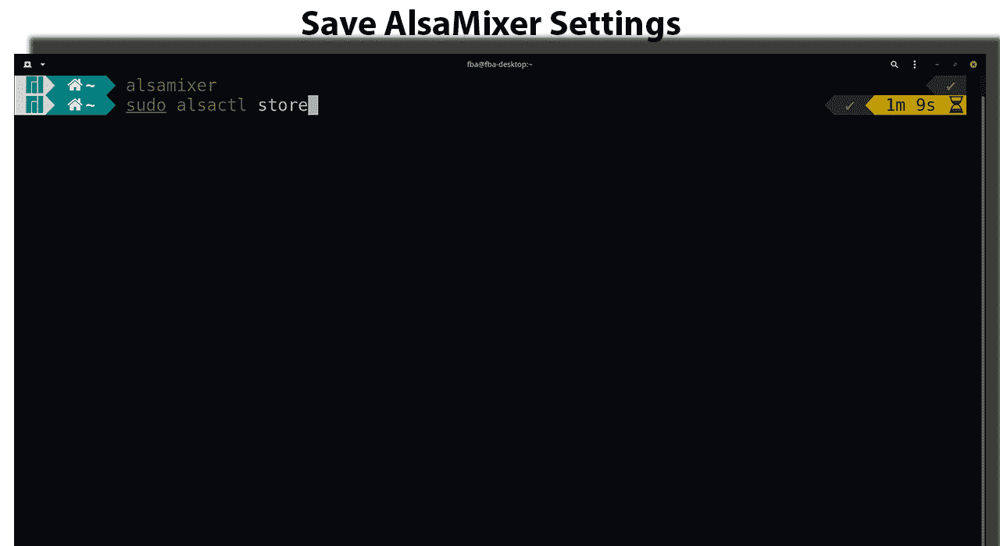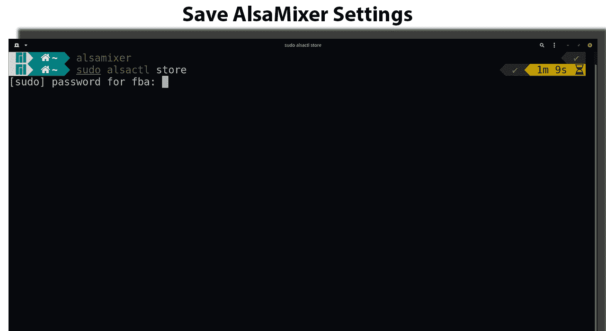

现在你可以走了！

如果你想检查音频是否在你的扬声器中工作，那么你可以进入**设置**。

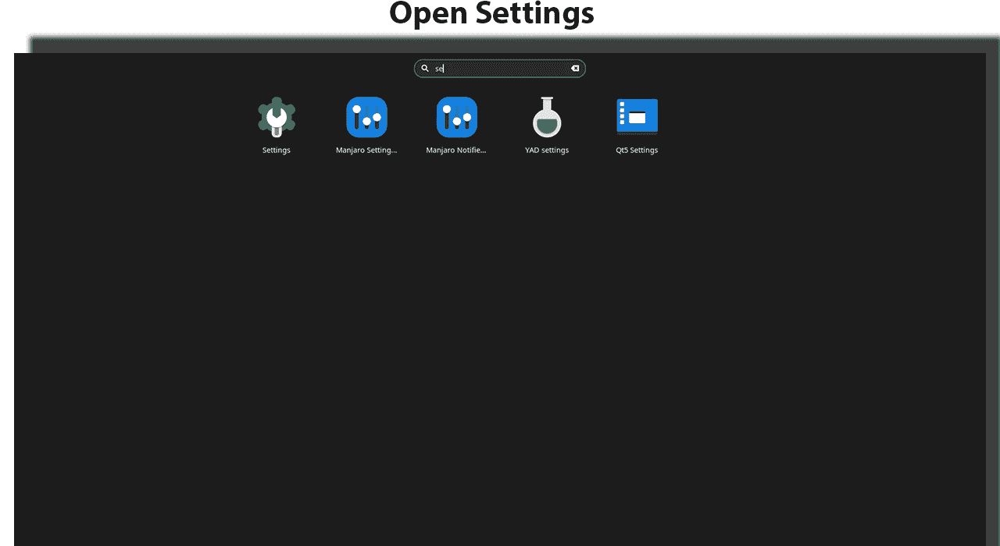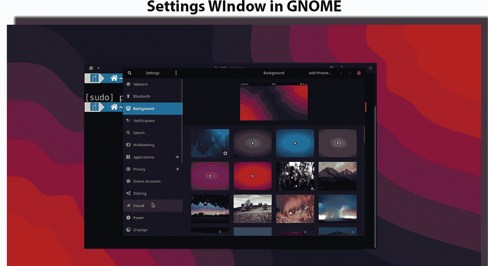

然后到**音**。

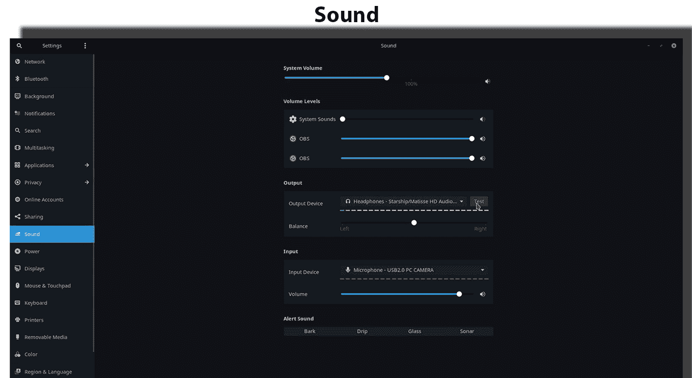

如果您改变您的**输出设备**，那么您应该看到扬声器音频工作正常。我在我的工作站上使用了**线路输出**选项。

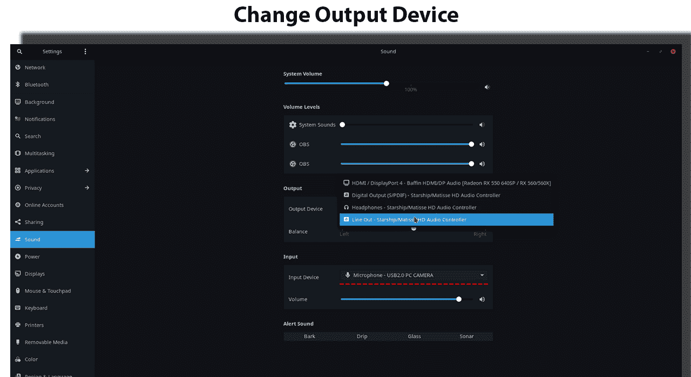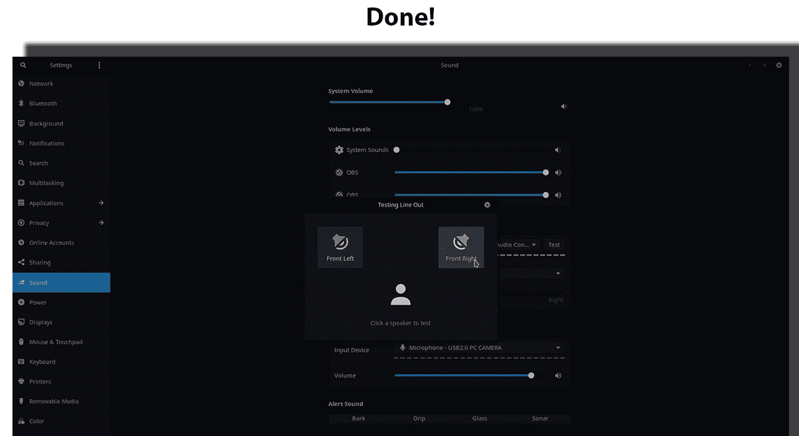

现在你应该看到音频问题已经解决了！

**额外收获**:我还为此制作了一个完整的视频教程，并在我的新 YouTube 频道上发布了[视频](https://youtu.be/zCaJ6lcaSOg)。

[https://www.youtube.com/embed/zCaJ6lcaSOg?feature=oembed](https://www.youtube.com/embed/zCaJ6lcaSOg?feature=oembed)

## 结论

如果你的扬声器也面临这种音频问题，我希望这个技巧可以帮助你。非常感谢你阅读了整篇文章。

如果你对开源感兴趣，可以在 [GitHub](https://github.com/FahimFBA) 上关注我，获取更新。我真的对开源很感兴趣，而且我会定期投稿。

我也有两个 YouTube 频道——我在一个频道定期发布孟加拉语内容，我已经开始在我的新品牌频道定期发布英语内容[。](https://www.youtube.com/channel/UCG97GCUifMS2Vm28tgXQi0Q)

此外，如果你想与我讨论，或者如果你想与我联系，那么我也可以在 [Twitter](https://twitter.com/Fahim_FBA) 和 [LinkedIn](https://www.linkedin.com/in/fahimfba/) 上找到我。你也可以查看我的网站 https://fahimbinamin.com/[和查看我在](https://fahimbinamin.com/) [Polywork](https://www.polywork.com/fahimbinamin) 上的精彩片段。

非常感谢大家！