# DNS 服务器没有响应–如何修复 Windows 10 中的错误

> 原文：<https://www.freecodecamp.org/news/how-to-fix-dns-server-not-responding-error-windows-10/>

我认为可以肯定地说，如今绝大多数专业人士都依赖于互联网。

因此，当你试图从你的首选网站中挖掘有价值的信息时，被拒绝访问互联网可能是一场相当严峻的考验。尤其是当你在压力下完成一件急需的工作时。

拒绝访问互联网的一个特别不受欢迎的原因是“DNS 服务器没有响应”错误。这就像那个古老的寓言，一个巨魔坐在桥下说“你不能通过！”，或者关于吞噬那些希望过桥的人。

我很高兴地告诉你，通过遵循本文中讨论的简单故障排除步骤，你应该能够击败巨魔，并跨过通向互联网接入快乐的桥梁。

## 什么是“DNS 服务器没有响应”错误？

“DNS 服务器没有响应”错误是一个相当常见的问题，通常很容易修复。出现此问题的原因有很多。但从根本上说，这是因为在加载网页的过程中联系的 DNS 服务器无法找到包含您所请求的网页的站点。

本文探讨了是什么导致了这个问题的发生，以及如何解决这个问题。

首先，我认为至少对“DNS 服务器没有响应”错误有一个基本的了解是一个好主意。要做到这一点，我们先来了解一下 DNS。

DNS 代表域名系统。对 DNS 的简单解释是，它是人类可读互联网地址的分散存储，就像你几乎肯定会熟悉的那些地址(例如 www.netlix.com 或 www.netlix.com)。

DNS 将这些人类可读的 URL 映射到它们适当的 IP(互联网协议)地址。

IP 地址不太容易被人阅读，但是对于互联网的内部运作是必不可少的。IP 地址唯一地标识互联网上的计算机。例如，与 URL www.netflix.com 关联的 IP 地址可能如下所示:69.53.224.255。

当你想在网飞上访问你最喜欢的内容时，你显然更容易记住“[www.netflix.com](http://www.netflix.com)”，而不是用句号分隔的一串数字。因此，DNS 为您提供了便利，这样您就不必每次访问网站时都要记住或手动查找不友好的数字数据字符串。

解释 DSN 的常见类比是电话簿。基本上，当你在电话簿中用你想呼叫的人的名字查找电话号码时，当你在浏览器中键入你想浏览的网址(如 www.amazon.com)时，也会进行类似的查找。

值得庆幸的是，您不必手动查找 www.amazon.com 的相应 IP 地址，因为这是在后台自动为您执行的。

因此，每当您在浏览器中键入 URL 时，就会自动检索到相应的 IP 地址。然后，此 IP 地址用于联系适当的服务器，该服务器托管与您在浏览器中输入的 URL 相关联的相关网站。

当出现“DNS 服务器没有响应”错误时，这意味着负责根据您在浏览器中输入的相关主机名自动查找适当 IP 地址的分散式命名系统没有响应。

出现此错误的原因有很多，但幸运的是，也有很多解决方案可供您修复该问题。

一个简单的解决方法可能是简单地改变你正在使用的浏览器，或者更简单，简单地重启你的电脑。是的，简单地关闭它，然后再打开它可以解决这个问题。

然而，如果你没有那么幸运，问题仍然存在，不要绝望——你可以采取许多步骤来找出问题的原因并随后解决它。

在本文中，您将了解到“DNS 服务器没有响应”错误的一些可能的解决方案。

## 如何修复“DNS Serger 不响应”

下面，我列出了一些方法，你可以尝试使用来修复“DNS 服务器没有响应”的错误。本文的后续部分提供了这些方法的详细信息:

*   使用不同的 Web 浏览器
*   尝试用不同的设备访问网站
*   重启路由器
*   调查可能的网络问题
*   手动设置您的 DNS 服务器
*   清除 DNS 缓存
*   禁用 Internet 协议版本 6
*   暂时关闭你的防火墙和杀毒软件
*   重置您的 DNS 设置
*   更新网络适配器驱动程序
*   禁用除用于访问互联网的连接之外的所有网络连接
*   在安全模式下重新启动计算机

### 使用不同的 Web 浏览器

“DNS 服务器没有响应”问题的一个潜在解决方案非常简单，就是尝试使用不同的浏览器访问相关网站。

例如，如果问题发生时您正在使用 Microsoft Edge 或 Mozilla Firefox 作为浏览器，请尝试使用不同的浏览器(如 Google Chrome)访问相关网站。

如果使用不同的浏览器可以解决问题，那么请将适用的浏览器作为您的默认浏览器。但是，如果问题仍然存在，那么我们至少知道您一直使用的浏览器不是问题的根源，我们必须继续调查以找到解决 DNS 服务器不响应问题的方法…

### 尝试使用不同的设备访问网站

尝试使用连接到家庭网络的不同设备来访问您在收到错误时试图访问的网站。

例如，使用手机 Wi-Fi 访问相关网站。如果问题仍然存在，您知道问题不仅仅出在您的主设备上，问题可能出在您的路由器上。

### 重启路由器

“DNS 服务器没有响应”问题可能只是因为数据流量而出现。也许简单地重启你的路由器就能解决这个问题。

您可以通过按下路由器上的电源按钮来重新启动路由器。然后，您可以拔掉路由器的电源线。等待大约 30 秒，然后将路由器再次插入电源插座，并按下电源按钮重新启动。

### 调查可能的网络问题

运行网络诊断可能会指出网络问题是问题的根本原因。

在 Windows 10 操作系统上运行网络诊断非常简单。您可以通过以下步骤完成此操作:

*   打开控制面板。一种方法是按下 **Windows 键+ R** 激活“运行”框，然后在“运行”框中的文本框中键入“控制”并按下回车键。

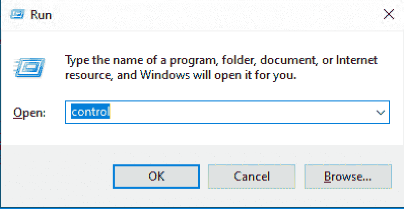

*   选择控制面板窗口中出现的**网络和互联网**选项。
*   在“网络和互联网”窗口中点击**网络和共享中心**选项。
*   单击“网络和共享中心”窗口中“更改您的网络设置”标题下的**故障排除问题**选项。
*   点击**附加故障诊断程序**->-**互联网连接**->-**运行故障诊断程序**

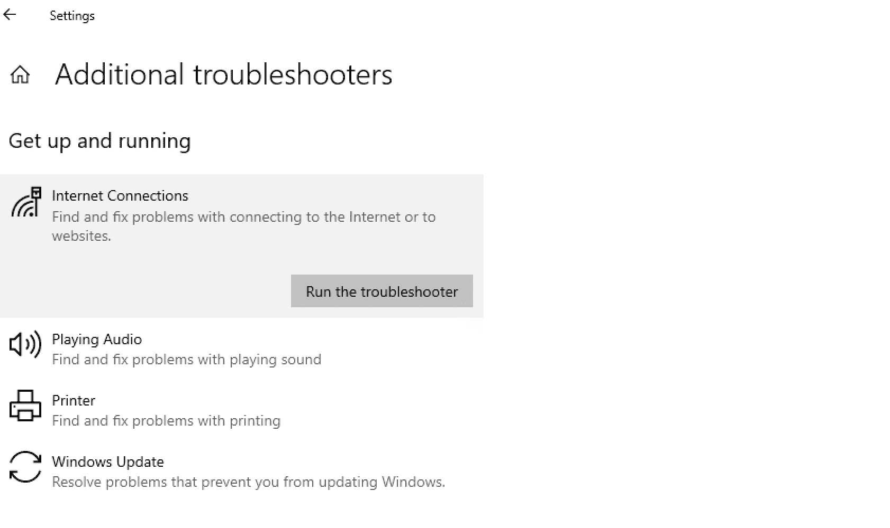

下一步是等待疑难解答任务完成。如果出现任何错误信息，只需按照如何修复相关网络问题的步骤进行操作。

### 手动设置您的 DNS 服务器

问题的根源可能是您的 DNS 服务器已关闭。在这种情况下，您会很高兴知道您可以手动更改您的 DNS 服务器。

例如，您可以将 DNS 服务器更改为 Googles 的公共 DNS 或 CloudFlare 的公共 DNS。要更改 DNS 服务器，请按照下列步骤操作:

*   调用您的控制面板。调用控制面板的一种方法是激活开始菜单并搜索控制面板。
*   在控制面板窗口中点击**网络和互联网**选项。
*   在**网络和互联网**窗口中，点击**网络和共享中心**选项。
*   在**网络和共享中心**窗口中点击您的活动连接。例如，如果这是当前正在使用的连接，请单击“以太网”选项；如果这显然是您的活动连接，请单击“Wi-Fi”选项。
*   在出现的对话框中，单击“属性”按钮。
*   在显示给您的对话框中，您会看到在“连接使用下列项目”标题下显示了一个列表。
*   在此列表中，选择标有“互联网协议版本 4 (TCP/IPv4)”的列表项，然后单击“属性”按钮。

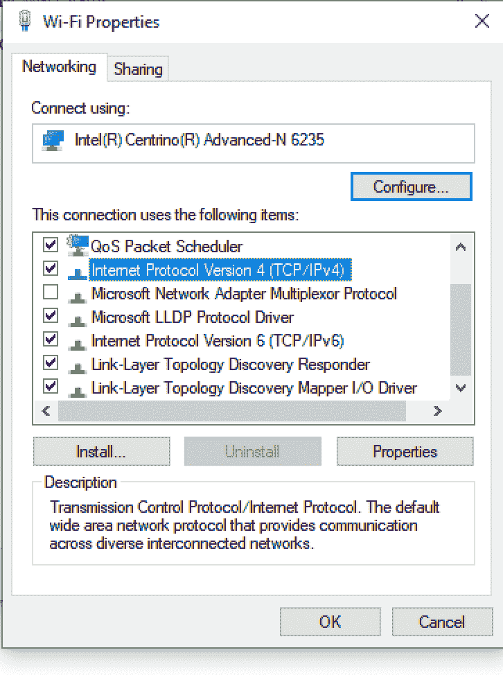

*   您将看到另一个对话框，其中有两个字段。一个将被标记为“首选 DNS 服务器”，而直接位于该字段下的另一个将被标记为“备用 DNS 服务器”。
*   首先点击**使用下面的 DNS 服务器地址**单选按钮。
*   要使用谷歌的公共 DNS 服务器，在标签为“首选 DNS 服务器”的字段中输入 8.8.8.8，在标签为“备用 DNS 服务器”的字段中输入 8.8.4.4。

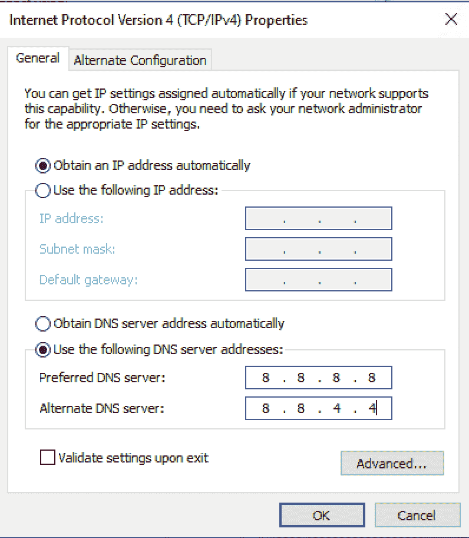

*   您也可以将 CloudFlare 的 DNS 服务器用于相同的目的。CloudFlare 的 DNS 地址就是 1.1.1.1
*   输入所需的 DNS 服务器设置后，确保选中“退出时验证设置”复选框。
*   单击“确定”按钮保存新的 DNS 服务器设置。
*   重新启动计算机。

### 清除 DNS 缓存

您可以刷新 DNS 缓存，这可能会解决“DNS 服务器没有响应”的问题。此操作将从您的缓存中清除 IP 地址和其他 DNS 相关数据。

您可以通过使用命令提示符运行命令来清除 DNS 缓存。

调用命令提示符的一种方法是按下**窗口键+ R** 来调用“运行”框。在“运行”框中键入“cmd”并按下 **shift+ctrl+enter** 以管理员身份运行命令提示符。

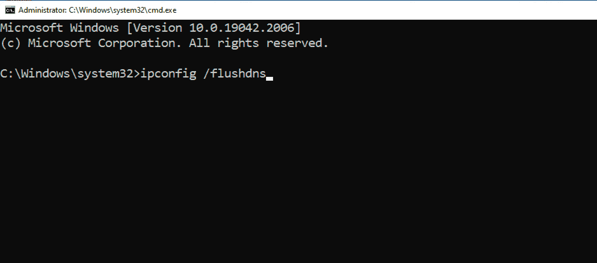

在命令提示符下，键入以下命令:“ipconfig /flushdns”，然后按 enter 键。如果命令执行成功，您将在命令窗口中看到相应的消息。

### 禁用 Internet 协议版本 6

在撰写本文时，internet 协议版本 6 是 Internet 协议的最新版本。禁用互联网协议版本 6 不会对您的计算机的操作产生不利影响，但它可以修复“DNS 服务器没有响应”的问题。

要在 Windows 10 操作系统上禁用互联网协议版本 6，只需按照以下步骤操作:

*   进入**控制面板** - > **网络和互联网** - > **网络和共享中心**
*   点击相关连接，例如“Wi-Fi”
*   在显示给您的对话框中，单击“属性”按钮。
*   在“此连接使用下列项目”标题下的列表中，取消选中标记为“Internet 协议版本 6 (TCP/IPv6)”的项目。

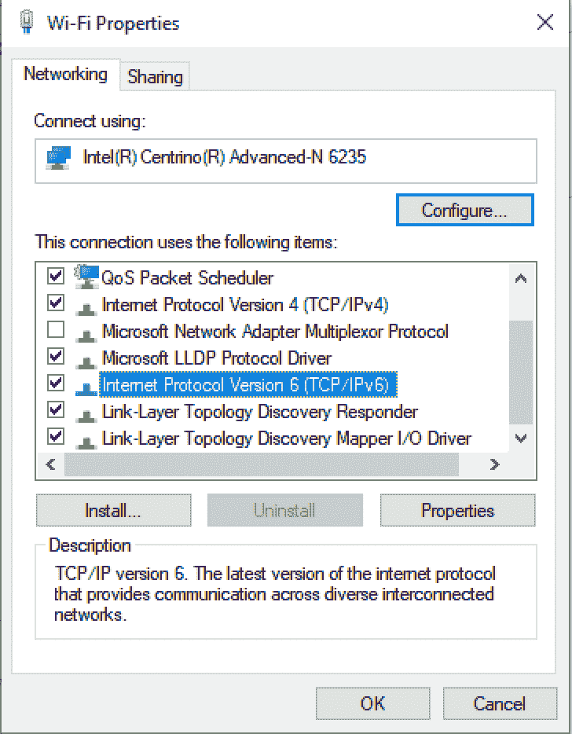

*   按下“确定按钮”

### 暂时关闭防火墙并禁用防病毒软件

如果您的防火墙是 Defender，您可以按照以下步骤禁用它:

*   要打开控制面板，按下 **Windows 键+ R** 激活“运行”框，然后在“运行”框中的文本框中键入“控制”并按回车键。
*   在右上角的文本框中，键入“win”

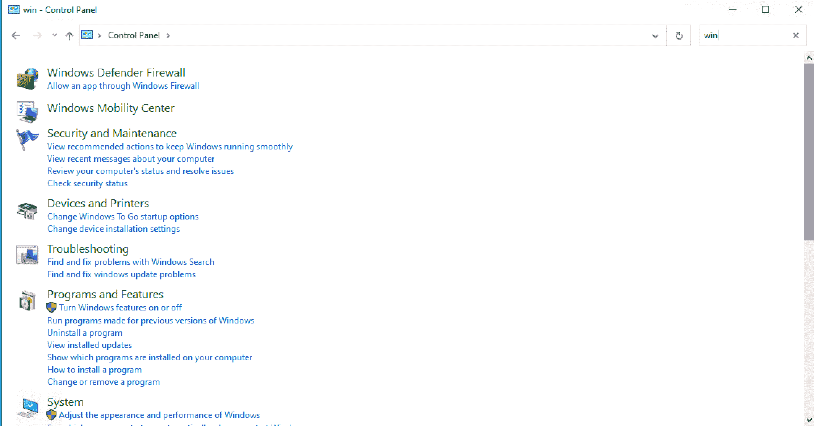

*   一个标有“Windows Defender 防火墙”的选项应该会出现在搜索结果中。单击“Windows Defender 防火墙”选项。
*   单击“允许应用程序或功能通过 Windows Defender 防火墙”选项。

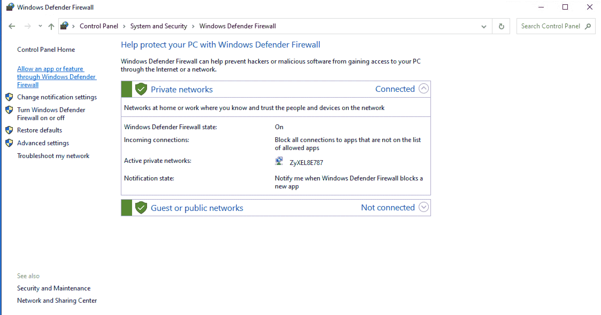

*   单击“更改设置”按钮。

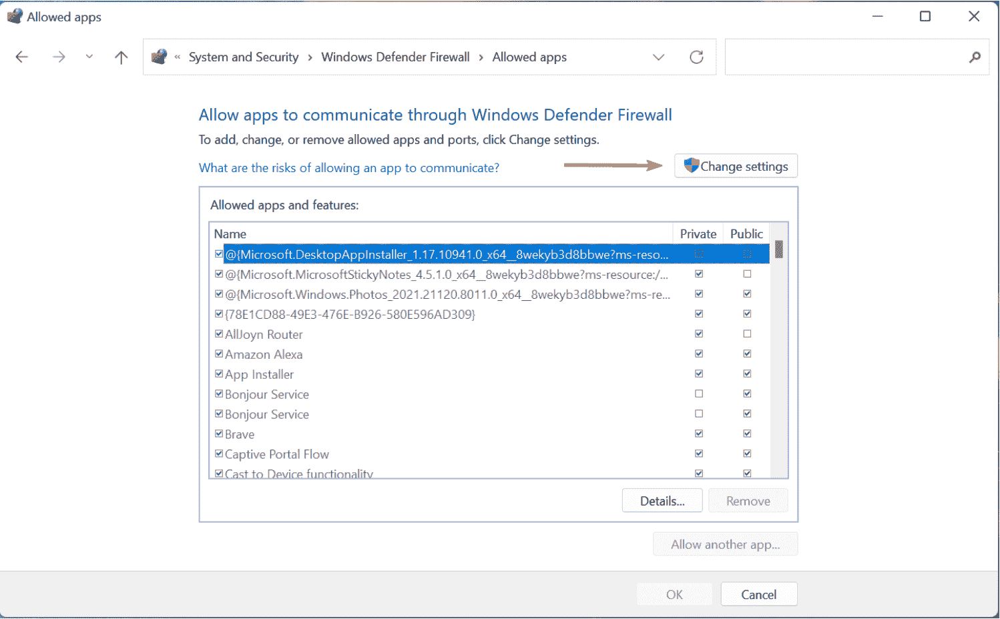

*   从刚刚调用的对话框中显示的列表中，找到您正在使用的浏览器，例如 Google Chrome。然后确保选中相关项目旁边的私有和公共复选框。

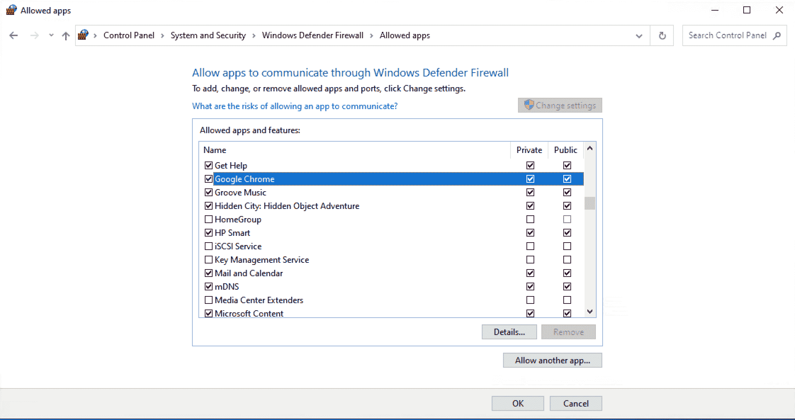

*   完成此操作后，尝试使用相关浏览器访问相关网站，查看问题是否已解决。

您的防火墙可能会阻止您通过浏览器访问外部数据。

请注意，不建议让您的操作系统无限期地不受可靠的防病毒软件的保护。在这种情况下，如果相关的防病毒软件是“DNS 服务器没有响应”问题的原因，建议仅在测试时禁用防病毒软件。

要暂时关闭 Microsoft Defender 防病毒保护，请按照下列步骤操作:

*   选择开始，然后输入“Windows 安全”,以搜索相关的应用程序。
*   从搜索结果中选择 **Windows 安全应用**。
*   转到**病毒&威胁防护**。
*   在**病毒&威胁防护设置**下选择**管理设置。**
*   关闭**实时保护**。

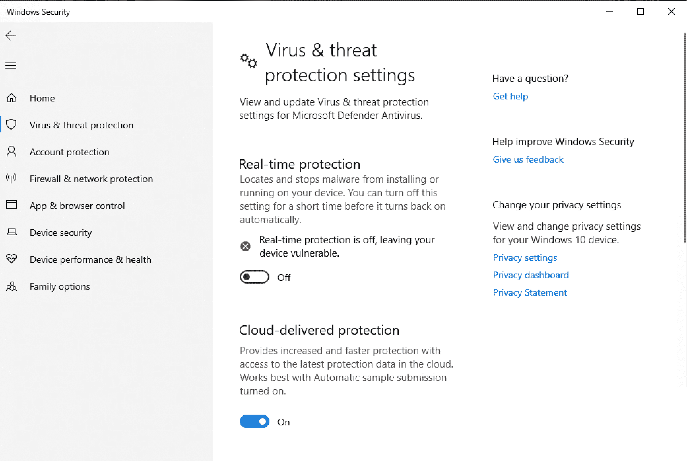

尝试通过相关浏览器访问相关网站，以测试“DNS 服务器没有响应”问题是否仍然存在。

### 重置 DNS 设置

要重置 DNS 设置，请按照下列步骤操作:

*   以管理员身份运行命令提示符。为此，按下 **Windows 键+ R** 激活“运行”框。
*   在运行框中键入“cmd”并按下 **shift + ctrl + enter**
*   在命令提示符下键入以下命令。输入每个命令后，按 enter 键，以便每个命令单独运行。

`ipconfig /registerdns`

`ipconfig /release`

`Ipconfig /renew`

`netsh winsock reset`

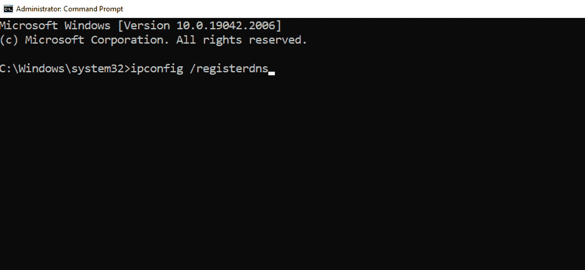

运行完这些命令后，关闭命令提示符并重新启动计算机。

### 更新网络适配器驱动程序

您可以手动更新您的网络适配器驱动程序，但是自动执行这项任务要容易得多。

您可以通过使用“Driver Easy”(https://www . Driver Easy . com/download-free-version/)这样的免费软件来实现这一点。只需下载这个软件的免费版本。

确保在运行 Driver Easy 软件的免费版本之前，您创建了一个系统还原点。这为您提供了保险，因此万一您遇到对您的计算机产生负面影响的令人不快的意外事件，您可以将 Windows 操作系统恢复到运行 Driver Easy 软件并遇到意外问题之前的状态。

要使用 Driver Easy 软件，请按照下列步骤操作:

*   运行软件
*   单击“立即扫描”按钮
*   按下任何过期驱动程序旁边的“更新”按钮。

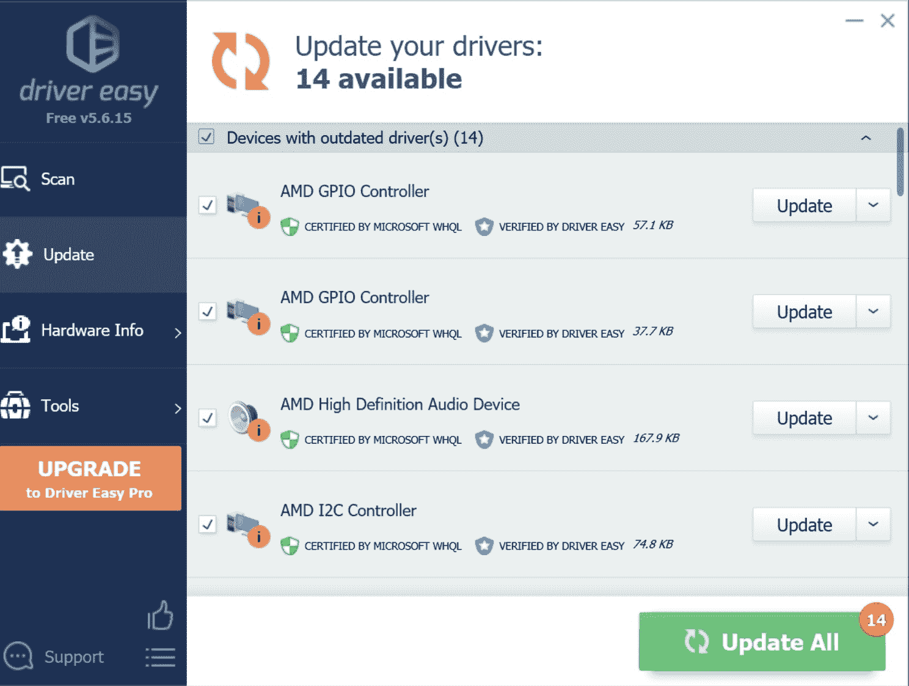

### 禁用除正在使用的连接之外的所有网络连接

停用您可能在电脑上设置的附加网络连接(例如，您用来访问互联网的 Wi-Fi 连接除外)可能会解决“DNS 服务器没有响应”的问题。

要禁用相关的网络连接，请按照下列步骤操作:

*   首先，你必须访问你的网络连接。要访问您的网络连接，请按 **Windows 键+ R** 调用“运行”框
*   在“运行”框中键入“ncpa.cpl ”,然后按回车键。
*   右键单击相关的网络连接，并从相关的上下文菜单中选择“禁用”。重复此操作，直到除了您正在使用的 Wi-Fi 连接之外的所有连接都被禁用。

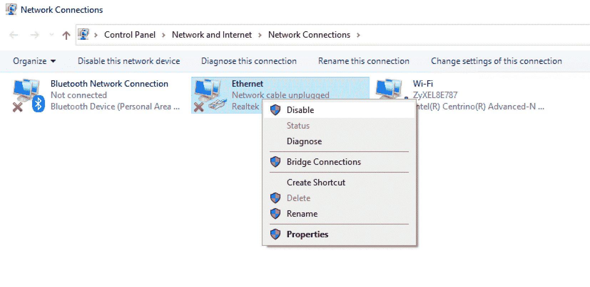

### 在安全模式下重新启动计算机

当您以安全模式启动计算机时，这意味着 Windows 操作系统会加载有限的驱动程序和文件。这可以通过一个照明过程(可以这么说)来帮助您诊断是什么导致了您的“DNS 服务器没有响应”问题。

因此，要在安全模式下启动您的电脑，请遵循以下步骤:

*   按下**窗口键+ I** 打开设置。
*   选择**更新&安全** - > **恢复**
*   在**高级启动**下，选择**立即重启**
*   一旦你的电脑启动到“选择一个选项”屏幕，选择**故障排除**->-**高级选项**->-**启动设置**->-**重启**
*   一旦你的电脑重新启动，你会看到一个选项列表
*   选择 **5** 或按 **F5** 进入联网安全模式。

尝试访问导致您遇到“DNS 服务器没有响应”问题的网站。如果问题在安全模式下没有出现，这意味着其他软件可能是问题的原因。

您可以从电脑中逐个卸载任何附加软件，然后测试问题是否仍然存在。如果卸载特定软件后问题没有出现，这意味着该软件可能干扰了您的互联网访问。

## 结论

“DNS 服务器没有响应”的问题是相对常见的，谢天谢地，它也相对容易修复。

被拒绝访问互联网可能会非常不方便，但希望本文中概述的潜在解决方案将帮助您再次访问您最喜爱的网站。