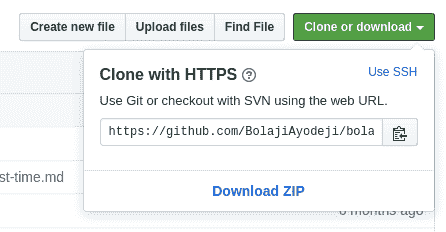

# 如何修复 Git 总是询问用户凭证

> 原文：<https://www.freecodecamp.org/news/how-to-fix-git-always-asking-for-user-credentials/>

你有没有遇到过 Git 在你每次尝试与 GitHub 交互时，甚至在配置好之后，还要求你输入用户名和密码的情况？这是使用 HTTPS 克隆 URL 作为存储库的用户中的一个常见问题。在本文中，我将向您展示如何解决这个问题。

所有公共和私有存储库上都有克隆 URL。这些 URL 在任何地方都有效，即使你在防火墙或代理后面。



当你在命令行上使用 HTTPS URL 与远程存储库交互时，你会被要求输入你的 GitHub 用户名和密码，这很糟糕吧？

使用 HTTPS 远程 URL 有一些优势:它比 SSH 更容易设置:)，并且通常可以通过严格的防火墙和代理。但是，它还会在每次拉或推存储库时提示您输入 GitHub 用户凭证:(。

#### 您可以通过配置 Git 为您存储密码来解决这个问题。

方法如下:

*   使用 SSH 而不是 HTTPS 更新源远程的 URL

```
git remote set-url origin git@github.com:username/repo.git 
```

或者

*   让 Git 存储用户名和密码，它永远不会要求它们。

```
git config --global credential.helper store 
```

*   保存会话的用户名和密码(缓存)；

```
git config --global credential.helper cache 
```

*   您也可以为上述设置设置超时

```
git config --global credential.helper 'cache --timeout=600' 
```

宾果，你刚刚修好了，Git 再也不会要求你的凭证了。

* * *

# 结论

然而，出于安全原因，建议您使用 SSH 与 GitHub 交互，尤其是如果您为一家公司工作或者您使用的计算机不是您的。

使用 SSH 协议，您可以连接到 GitHub，而无需每次都提供用户名或密码。

在这里了解如何用 SSH [连接 GitHub。](https://help.github.com/en/articles/connecting-to-github-with-ssh)