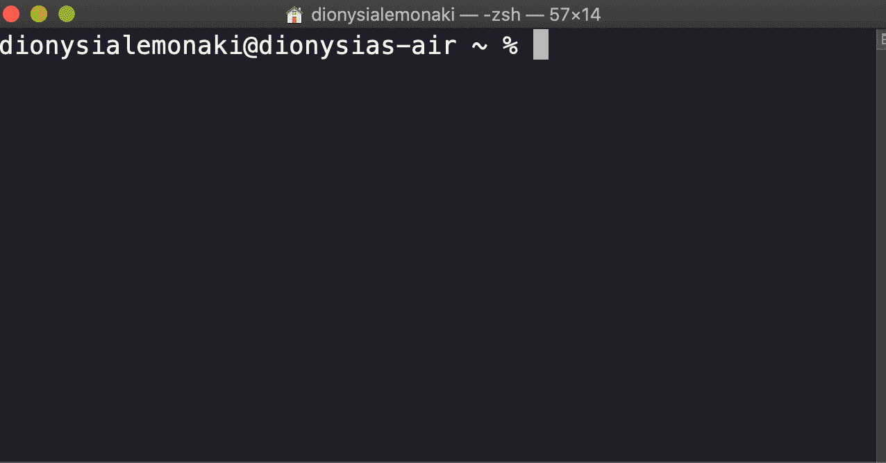

# 如何刷新 Mac 上的 DNS–Mac OS 清除 DNS 缓存

> 原文：<https://www.freecodecamp.org/news/how-to-flush-dns-on-mac-macos-clear-dns-cache/>

在本教程中，您将了解为什么刷新 DNS 缓存很重要，以及如何清除本地系统上的缓存。

我们将在本指南中讨论以下内容:

1.  [什么是 DNS 缓存？](#intro)
    1.  [为什么刷新 DNS 缓存很重要](#why)
2.  [如何刷新 MacOS 上的 DNS 缓存](#howto)
    1.  [如何在 MacOS 上访问终端应用](#terminal)
    2.  [如何为您的 MacOS 版本清除 DNS 缓存](#version)

## 什么是 DNS 缓存？

DNS 的行为很像互联网电话簿。想想电话本的作用——它将一个人的名字映射到他所尊敬的电话号码上。

DNS(域名系统的缩写)将域名映射到其关联的 IP 地址。

一个域名，比如`freecodecamp.org`，很容易被人类阅读、理解和回忆。

IP 地址(IP 是互联网协议的缩写)是一个机器可读的地址，由一系列唯一的数字组成。这些数字标识连接到互联网的设备。

它们的格式不是那么人性化，因为每次你想访问一个网站时，很难记住一个准确的数字序列。

然后，DNS 将`freecodecamp.org`映射到其关联的 IP 地址- `104.26.3.33`。

将 DNS 缓存视为 Mac 上的本地存储区域。

它会临时存储并跟踪您计算机的活动记录，如最近的网站访问。

每次您通过键入 URL(统一资源定位器的缩写)访问网站时，DNS 缓存都会保存与该网站相关联的 IP 地址。

当您第二次访问同一个网站时，查找过程会更高效，查找时间也会更短。

它有助于节省大量时间。

### 为什么刷新 DNS 缓存很重要

出于几个原因，您应该刷新 DNS 缓存。

两个最重要的是:

1.  **刷新 DNS 有助于解决互联网连接问题**。

您的浏览器中可能会出现 DNS 错误，例如在尝试访问网站并建立连接时出现“DNS 服务器没有响应”的消息。

请记住，随着时间的推移，您的本地缓存信息可能会过时。

当网站上发生 DNS 更新时，您的 Mac 仍在使用旧的、不准确的信息来加载请求的页面。

刷新 DNS 缓存可确保缓存信息是最新的。

2.  **刷新 DNS 缓存可以防止网络安全威胁、恶意攻击和 DNS 缓存中毒**。

黑客可以访问并破坏您保存的 DNS 缓存记录。

例如，他们可以操纵和更改与您已经访问过的网站的域名相关联的 IP 地址，并将其映射到恶意网站。

下一次你请求访问同一个网站时，将会重定向到一个虚假和损坏的网址。

黑客可以要求个人和敏感信息，如信用卡号码，并窃取它。

频繁刷新 DNS 缓存将有助于防止这种情况发生。

## 如何刷新 MacOS 上的 DNS 缓存

清除 Mac 上的 DNS 缓存是一个相对简单的过程，即使你没有太多的技术知识。

以下是你需要的:

*   对命令行的访问，
*   你的电脑密码，
*   输入文本命令(该命令将取决于您运行的 macOS 版本)。

### 如何在 MacOS 上访问终端应用程序

macOS 有一个名为`Terminal.app`的内置 CLI(命令行界面)，允许你输入操作系统将执行的基于文本的命令。

有几种方法可以打开终端。

最简单的方法是通过 Spotlight 搜索。

为此，您可以:

*   或者导航到屏幕的右上角，单击看起来像放大镜的图标。
*   或者，您也可以使用`Command Space`快捷键。

两者都将打开以下窗口:

从那里开始输入`terminal`并点击出现的`Terminal.app`选项。

您应该会看到一个类似如下的窗口打开:

### 如何为您的 MacOS 版本清除 DNS 缓存

在终端窗口中，您需要输入一个命令。

该命令因您运行的 macOS 版本而异。

macOS 的每个版本都有版本号和版本名。

要找到你电脑上的 macOS 版本，点击屏幕左上角的苹果图标。从出现的下拉菜单中，选择`About This Mac`。

在`Overview`选项卡中，您将首先看到版本名称。然后，在它下面，你会看到版本号。

在下表中，您将看到 macOS 版本按时间倒序排列——从最新的到最早的。

导航到您的 Mac 版本，并拷贝相应的命令。

| MacOS 版本 | 命令 |
| --- | --- |
| 马科斯 12(蒙特雷) | `sudo dscacheutil -flushcache; sudo killall -HUP mDNSResponder` |
| 马科斯 11 号 | `sudo dscacheutil -flushcache; sudo killall -HUP mDNSResponder` |
| macOS 10.15(卡塔利娜语) | `sudo dscacheutil -flushcache; sudo killall -HUP mDNSResponder` |
| macOS 10.14 (Mojave) | `sudo killall -HUP mDNSResponder` |
| macOS 10.13(高塞拉) | `sudo killall -HUP mDNSResponder` |
| macOS 10.12 (Sierra) | `sudo killall -HUP mDNSResponder` |
| OS X 10.11(埃尔卡皮坦) | `sudo killall -HUP mDNSResponder` |
| OS X 10.10(约塞米蒂) | `sudo discoveryutil udnsflushcaches` |
| OS X 10.9(小牛) | `sudo killall -HUP mDNSResponder` |
| OS X 10.8(山狮) | `sudo killall -HUP mDNSResponder` |
| 麦克 OS X 10.7(狮子) | `sudo killall -HUP mDNSResponder` |
| 苹果 OS X 10.6(雪豹) | `sudo dscacheutil -flushcache` |
| Mac OS X 10.5 (Leopard) | `sudo lookupd -flushcache` |
| 麦克 OS X 10.4(老虎) | `lookupd -flushcache` |

键入命令并按 enter 键后，将会出现输入计算机密码的提示。

请记住，当您键入密码时，您将无法查看您键入的内容，甚至无法查看任何星号。

看起来好像什么都没发生，但请放心，有些事情正在发生。

一旦您输入了密码并按下回车键，您将不会看到指示该过程已完成的消息。

相反，您将看到一个新的终端提示符。

## 结论

现在你已经知道了——你的本地 DNS 缓存已经清空了。

希望这有助于解决您可能遇到的任何连接问题。

经常清除 DNS 始终是一个好主意，有助于修复麻烦的互联网连接，并确保您的系统免受潜在威胁。

感谢阅读！