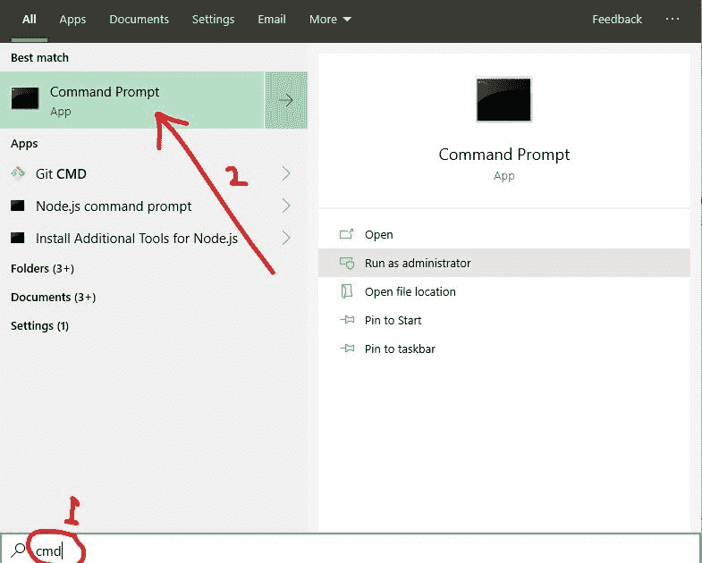
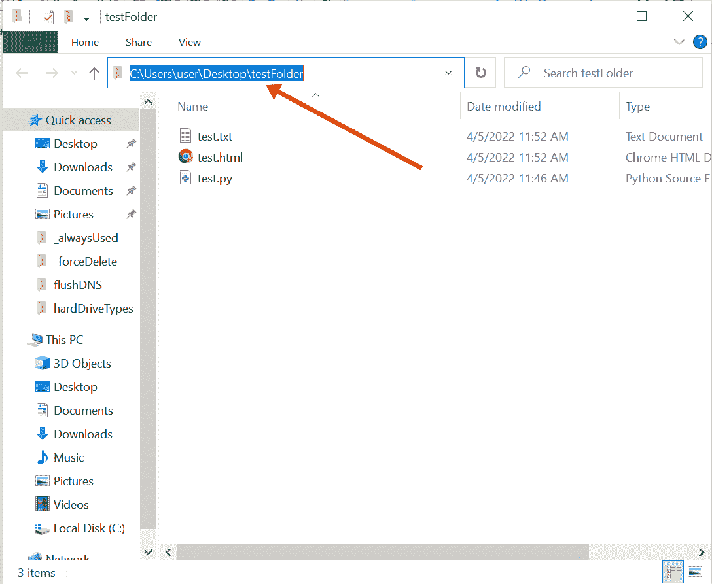
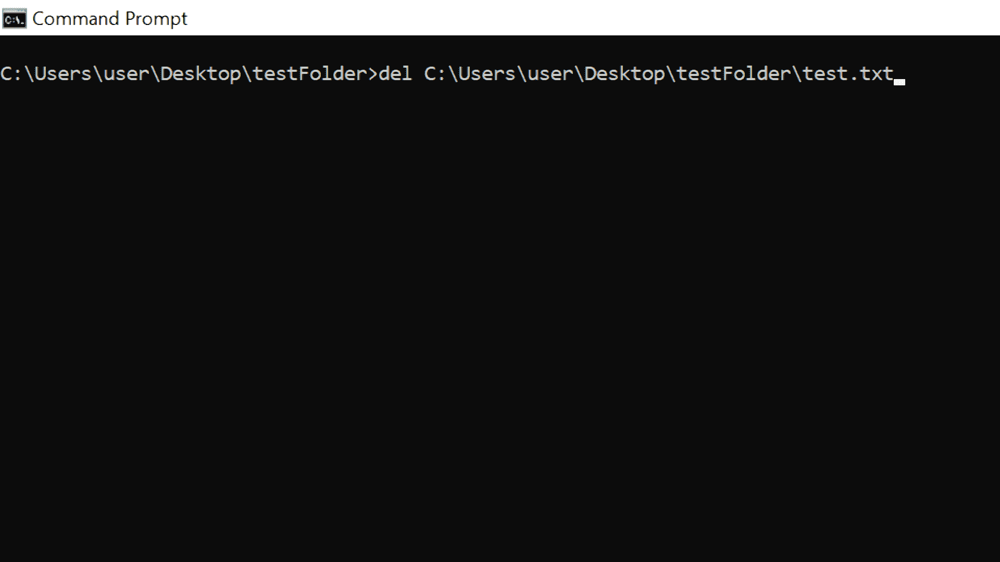
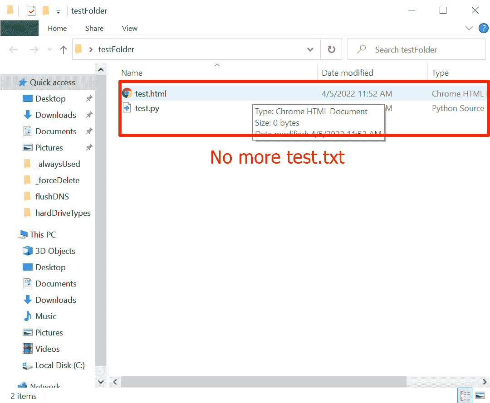

# 如何强制删除文件–Windows 命令提示符 cmd delete

> 原文：<https://www.freecodecamp.org/news/how-to-force-delete-a-file-windows-command-prompt-cmd-delete/>

在 Windows 电脑上，您可能想要删除文件以释放磁盘空间，或者因为您不再需要电脑上的文件。

但是有时候，由于各种原因，删除一个文件似乎是不可能的。这些情况包括文件在另一个程序中打开、缺少写权限、恶意软件攻击、回收站损坏或空间不足、文件是系统文件等等。

在本文中，我将向您展示如何使用命令提示符强制删除文件，这样您就可以清除顽固的、不需要的文件。

## 如何使用 Windows 命令提示符强制删除文件

以下步骤将帮助您使用`del`命令强制删除文件。

**第一步**:点击开始(或点击键盘上的 Windows logo 键)打开命令提示符，搜索“cmd”，然后点击`Enter`:

**第二步**:前往包含文件的文件夹，点击文件夹地址栏，复制地址:

**第三步**:在命令提示符下，键入`del`，右键点击粘贴所在的文件夹地址，并添加文件名及其扩展名(`.html`、`.txt`、`.py`等)。

这将类似于`del C:\Users\user\folder-name\filename.extension`:

**第四步**:点击`ENTER`运行命令。然后再次检查文件夹，您应该不会再看到该文件:

## 结论

`del`命令将删除一个文件，即使它在另一个程序中打开，但 Office 程序如 MS Word 除外。

因此，如果您仍然发现很难强制删除文件，请确保它没有在其他程序中打开，尤其是 Office 程序。

感谢您的阅读。