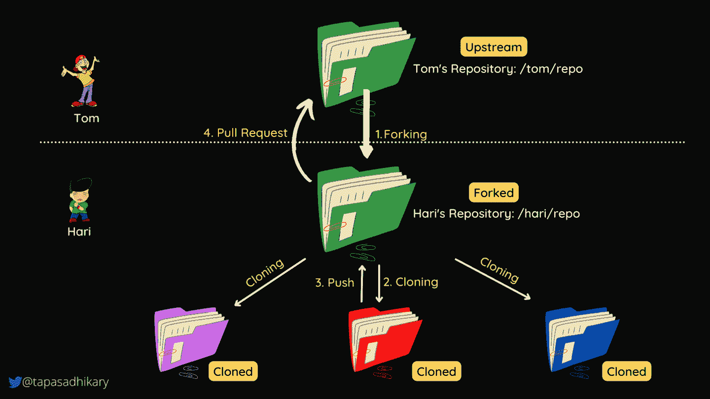

# 如何派生 GitHub 库——一个完整的工作流程

> 原文：<https://www.freecodecamp.org/news/how-to-fork-a-github-repository/>

是一个很棒的应用程序，可以帮助你管理你的 Git 库。您还可以使用它来为开源生态系统做出贡献，并与其他贡献者协作。

GitHub 上的公共存储库经常得到贡献者的大量关注，这有助于增强项目。

那么，如何才能轻松地进行公共回购呢？repository `forking`工具允许贡献者在本地复制源代码库，并做出他们想要的任何更改。

但是如果您打算作为初学者使用这个工具，那么您需要理解存储库分叉的工作流，这样您就可以无缝地与其他公共存储库一起工作。

在本文中，我们将学习如何通过实际例子和讲故事来实现回购。如果你喜欢从视频内容中学习，这篇文章也可以作为 YouTube 视频。

[https://www.youtube.com/embed/h8suY-Osn8Q?start=2&feature=oembed](https://www.youtube.com/embed/h8suY-Osn8Q?start=2&feature=oembed)

## 什么是 GitHub 资源库分叉？

假设您喜欢使用 React.js 这样的特定框架或库，某一天，您发现了一种可以增强 React 功能的方法。

React 的源代码可以在 GitHub 上作为公共存储库获得，所以你可以通过`forking`它来制作它的本地副本。

一旦您获得了代码的本地副本，您就可以进行相关的更改，并要求 React 社区审查您的更改。

在审查您的代码更改后，React 社区可能会批准它们或要求您进行更多的更改。他们最有可能在批准后接受您的代码更改。

所以，让我们用两个开发人员 Tom 和 Hari 的故事来理解整个`forking`工作流程。

## 完整的分叉工作流程

Tom 和 Hari 是两位开发者，他们都有自己的 GitHub 帐户。Tom 正在做一个杰出的项目，他在一个名为`/tom/repo`的公共存储库中管理它的源代码。Hari 对这个想法感到惊讶，并希望为该项目做出贡献。

现在哈里有两种方法可以接近它。

*   哈里问汤姆，“嘿，汤姆，我想为你的项目做点贡献。可以请你加我为投稿人吗？”。汤姆可能同意也可能不同意。由于该项目已经可以作为公共存储库使用，他可能只需要请求派生并使用它。
*   第二种方式是，如果哈里只是叉回购自己，并开始工作。他不必等着与汤姆交谈，并让汤姆专门将他添加为贡献者。

第二种方法是直接建立存储库，这对任何贡献者来说都更方便。那么它是如何工作的呢？让我们分步骤来理解工作流程。

1.  哈里分叉资源库`/tom/repo`。我们称这个`/tom/repo`库为`Upstream Repository`。
2.  这个库现在可以在 Hari 的 GitHub 账户中以`/hari/repo`的名字获得。我们把 T1 叫做 T2。此外，它是上游存储库的精确副本。这个存储库完全独立于 Tom 的回购，Hari 可以开始进行任何他想要的更改。Hari 将首先克隆存储库，并开始为此进行修改。
3.  Hari 进行所需的更改，并将更改推送到分叉的存储库。
4.  最后，Hari 创建一个从分叉的存储库到上游存储库的`Pull Request`。Tom 在方便的时候检查拉取请求，如果一切顺利，就批准并合并它。

这就是整个工作流程——为公共存储库做贡献的简单明了的方法。一张图胜过千言万语。这是我们讨论过的工作流程的演示。

Workflow - Forking a Repository

## 如何在 GitHub 中分叉一个回购

派生存储库只需点击一个按钮。

要跟进，请浏览到您想要派生的公共存储库。在页面的右上角，您会找到`Fork`按钮。点击按钮，等待几秒钟。您将看到新分叉的存储库是在您的 GitHub 帐户下创建的。

Fork Button

在分叉存储库之后，按照我们在上面学到的步骤开始贡献。

## 让我们练习分叉

作为新手，要不要练习`forking`才能更自信？就这么办吧。您可以执行这些任务来练习分叉。

*   浏览到这个公共存储库:[https://github.com/atapas/fork-me](https://github.com/atapas/fork-me)
*   创建一个与你的 GitHub user-id 同名的文件夹(对我来说是 atapas)。
*   在文件夹中添加一个`Readme.md`文件，包含您选择的任何文本。
*   创建一个`Pull Request`上游。如果一切顺利，我将审查和合并它。

走错了也不用担心。继续努力，你会成功的。这就像是一个为开源库做贡献的练习场。

## 概括起来

*   Git 是一个被开发者社区广泛使用的版本控制工具。如果你是 Git 的初学者，从这里了解一下它[。](https://www.youtube.com/watch?v=vWtu4mzUgQo)
*   GitHub 是一个流行的管理 Git 仓库的应用程序。任何人都可以向公共知识库投稿。
*   分叉是一个很好的工具，可以将源代码从某人的存储库中复制到您的存储库中，并对其做出贡献。
*   分叉工作流易于学习和开始。

## 在结束之前...

我希望这篇文章对你有所帮助。请练习分叉并为开源项目做贡献。如果您想进一步讨论，我的 DMs 将于`Twitter`开放。

我们来连线。我也在这些平台上分享我在 JavaScript、Web 开发、职业和博客方面的学习:

*   [在 Twitter 上关注我](https://twitter.com/tapasadhikary)
*   [订阅我的 YouTube 频道](https://www.youtube.com/tapasadhikary?sub_confirmation=1)
*   [GitHub 上的侧项目](https://github.com/atapas)

我的下一篇文章再见。在那之前，请照顾好自己，保持快乐。