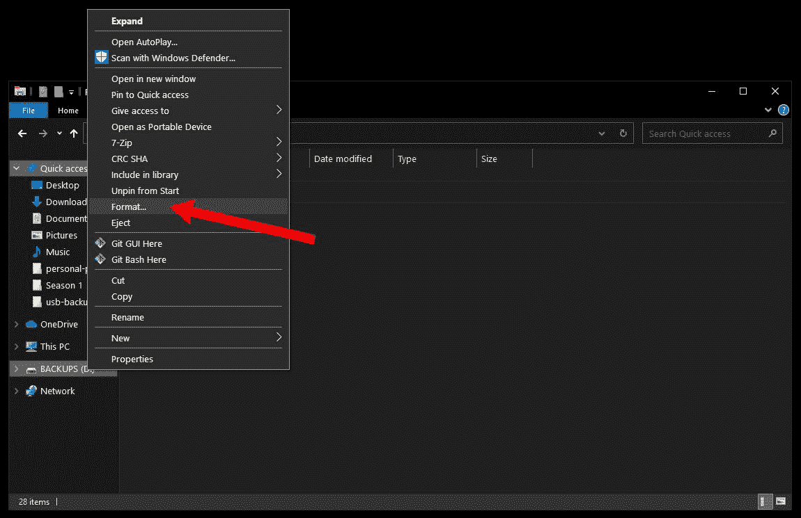
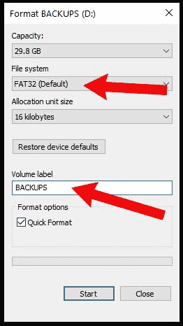
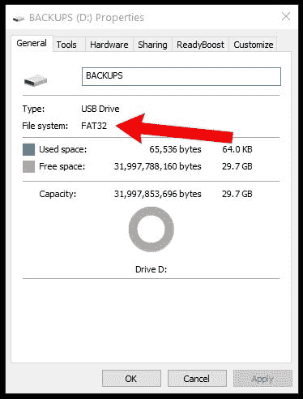
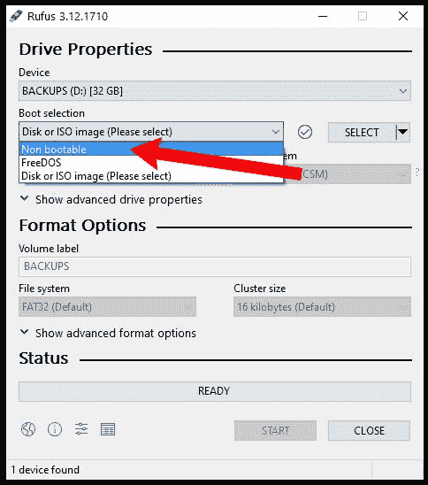
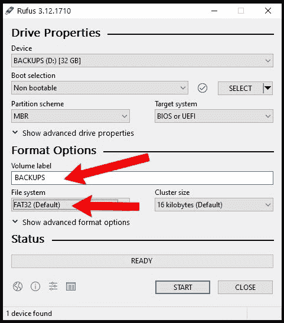
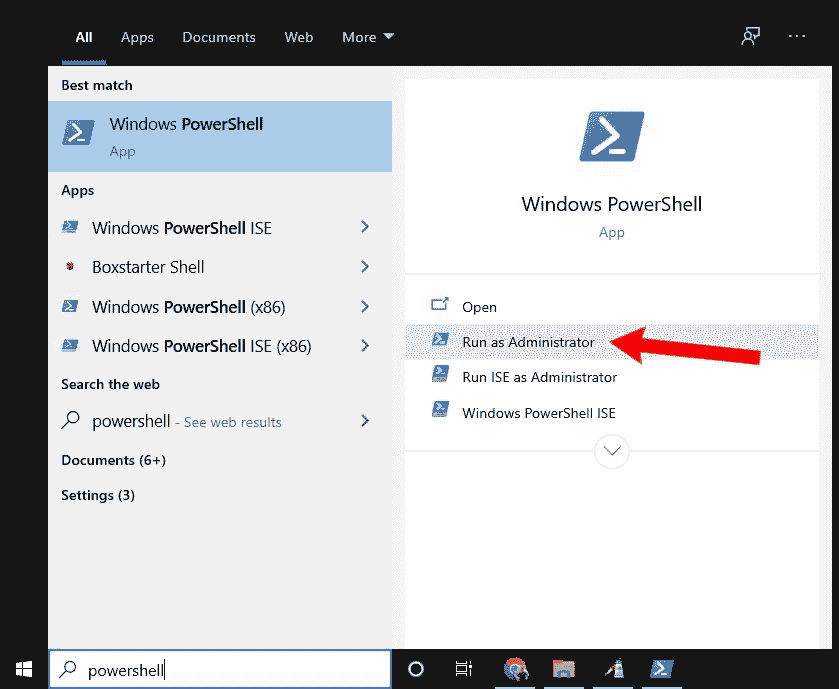
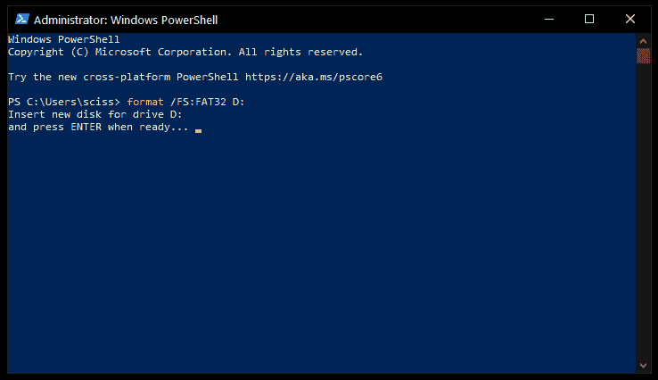

# 如何在 Windows 10 上将 USB 驱动器格式化为 FAT32

> 原文：<https://www.freecodecamp.org/news/how-to-format-a-usb-drive-to-fat32-on-windows-10/>

如果您需要将 u 盘、硬盘、SDD 或其他形式的存储设备格式化为 FAT32，那么您来对地方了。

在本文中，我们将了解什么是文件系统，FAT32 标准，以及在 Windows 10 上将存储设备格式化为 FAT32 的几种方法。

## 什么是文件系统？

文件系统是一种在计算机存储设备(如闪存驱动器或硬盘驱动器)上组织数据的标准化方式。

文件系统将存储设备分成虚拟的隔间，几乎就像一堵邮局信箱墙，并跟踪每个信箱中存储的所有信息。

便携式存储设备最常见的文件系统格式有 FAT32、NTFS 和 ExFAT。

## FAT32 与其他格式相比

在这三种常见格式中，FAT32 是最古老的，也是得到最广泛支持的。每个主要的操作系统都允许你从格式化为 FAT32 的 USB 闪存驱动器中读写数据。

同时，macOS 只能读取 NTFS 驱动器，你需要安装第三方软件来写回驱动器。

然而，尽管 FAT32 得到了很好的支持，但与 NTFS 和 ExFAT 等新格式相比，它的最大驱动器和文件大小受到了严重限制:

|  | 最大驱动器大小 | 最大文件大小 | Windows 操作系统 | 马科斯 | Linux 操作系统 |
| --- | --- | --- | --- | --- | --- |
| FAT32 | 32 GB (Windows)，最高 16TB(其他操作系统) | 4 GB | 读/写 | 读/写 | 读/写 |
| Windows NT 文件系统(NT File System) | 8 PB* | 16 EB** | 读/写 | 阅读 | 读/写 |
| ExFAT | 128 PB* | 16 EB** | 读/写 | 读/写 | 读/写 |

* 1 Pb 约为 1 千 TB
* * 1 EB 约为 100 万 TB

请注意，NTFS 和 ExFAT 的最大驱动器和文件大小非常大，基本上没有限制。(不过要是有个 128 PB 的 u 盘就好了不是吗？)

另一方面，由于手机可以录制 4K 视频，FAT32 的最大文件大小 4 GB 几乎不算什么。此外，在 Windows 10 上，将大于 32 GB 的驱动器格式化为 FAT32 有点困难。

如今，你选择将硬盘格式化为 FAT32 的唯一原因是为了兼容性。例如，如果你需要启动一台旧电脑，可能使用不同的操作系统，并备份其中的一些文件。但是您需要确保这些文件都不超过 4 GB。

如果你确定你想使用 FAT32，下面是如何在 Windows 10 上格式化存储驱动器。

**重要提示:**格式化硬盘之前，请确保备份所有重要文件。事实上，做两个备份，一个保存在远程服务上，比如 Google Drive 或者 Dropbox。

格式化驱动器将删除当前驱动器上的所有数据。

## 如何使用 Windows 文件资源管理器将 USB 驱动器格式化为 FAT32

关于这种方法的一个简短说明:它只适用于小于 32 GB 的 USB 闪存驱动器。如果您的 USB 驱动器大于 32 GB，请使用后面的一种方法。

解决这个问题后，将你的 USB 驱动器插入电脑，打开 Windows 文件资源管理器。

接下来，右键单击文件资源管理器窗口左侧的驱动器，然后单击“格式化”:

在弹出的窗口中，确保选择了“FAT32”。此外，您可以随意重命名 USB 驱动器:

您可以不考虑其他选项。只需点击开始格式化您的驱动器。

完成后，您的 USB 驱动器应该格式化为使用 FAT32 文件系统。

要仔细检查这一点，打开文件资源管理器，右键单击您的 USB 驱动器，然后单击“属性”。

将弹出一个窗口，您应该看到文件系统现在是 FAT32:

## 如何使用 Rufus 将 USB 驱动器格式化为 FAT32

如果你的 u 盘大于 32 GB，你需要使用第三方程序来格式化它。

有很多其他的程序可以格式化 USB 驱动器，但是 Rufus 真的很小很便携。这意味着你可以把 Rufus 放在一个 USB 驱动器上，插入任何 Windows 电脑，并随时格式化其他驱动器。

下载 Rufus 后，双击`.exe`文件启动应用程序。

确保选择了您的 USB 驱动器。然后，单击“引导选择”下拉菜单，选择“不可引导”:

接下来，单击“文件系统”下拉菜单并选择“FAT32”。

此外，您也可以在“卷标”下随意更改 USB 驱动器的名称:

然后，单击“开始”按钮格式化您的驱动器。几秒钟后，它将被格式化为 FAT32。

## 如何使用 PowerShell 将 USB 驱动器格式化为 FAT32

虽然这种方法适用于大于 32 GB 的驱动器，但它非常慢，甚至格式化 32 GB 的驱动器也可能需要一个小时，具体取决于您的计算机。

但是，如果你由于某种原因不能使用前两种方法，这将在紧要关头发挥作用。

首先，点击 Windows 搜索栏，输入“powershell”。然后，单击“以管理员身份运行”以提升权限启动 PowerShell:

在 PowerShell 终端中，输入以下命令:

`format /FS:FAT32 DRIVE_LETTER:`

使用文件资源管理器仔细检查您的驱动器号。我的驱动器号是 D，所以我输入了`format /FS:FAT32 D:`。

按 Enter 键，确保您的 USB 驱动器已插入，然后再次按 Enter 键开始该过程:

然后去办点事什么的——这需要一段时间。

一旦`format`命令完成，你的驱动器应该被格式化为 FAT32。

## 最后

现在，您应该能够在 Windows 10 上将任何大小的 USB 驱动器格式化为 FAT32。只要稍加修改，这些方法中的任何一种都可以用来将您的驱动器格式化为另一种文件系统，如 NTFS 或 ExFAT。

现在出去格式化你所有的 u 盘。(但必须在备份所有重要内容之后！)

这有帮助吗？你知道有更好的方法吗？给我发推文，让我知道你是如何在 Windows 10 上格式化的。