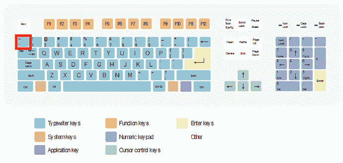
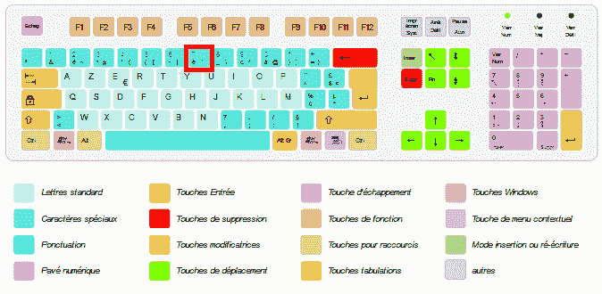
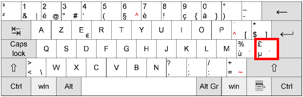

# 如何在 Markdown 中格式化代码

> 原文：<https://www.freecodecamp.org/news/how-to-format-code-in-markdown/>

在 Markdown 中有两种格式化代码的方法。您可以通过在一行的各个部分加上反勾号(`)来使用内联代码，也可以使用代码块，一些渲染器会对代码块应用语法高亮显示。

## **内联代码**

您可以使用内联代码格式来强调您正在编写的一行中的一个小命令或一段语法。

比如你可能希望提到 JavaScript 的`Array.protoype.map()`方法。通过使用内联代码格式，很明显这是一段代码。你也可以用它来说明一个终端命令，比如`yarn install`。

要使用内联代码格式，只需将您想要格式化的代码用反斜杠括起来。在标准的美式 QWERTY 键盘上，这可以在“1”的左边，Tab 键的上面找到。下面提供了有关国际键盘上反勾位置的更多信息。

例如，在 markdown 中编写“Array.prototype.map()”将呈现为`Array.prototype.map()`。

## **代码块**

要编写更长或更详细的代码片段，通常最好将它们放在代码块中。代码块允许您使用多行代码，markdown 将在它自己的框中以代码类型字体呈现它。

要做到这一点，从三个反勾线开始。这向 markdown 发出信号，表明您正在创建一个代码块。你需要用另外一行三个反勾号来结束。例如:

` ``
var add2 =函数(数字){
返回数字+2；
}
` ' '

将在 markdown 中呈现为:

```
var add2 = function(number) {
  return number + 2;
}
```

### 语法突出显示

虽然 markdown 本身不支持，但许多 markdown 引擎，包括 GitHub 使用的引擎，都支持语法高亮显示。这意味着通过告诉 markdown 你在代码块中使用什么语言，它会像 ide 一样添加颜色。

您可以在开始的三个反勾号所在的同一行添加语言名称。在上面的例子中，如果第一行不是“js ”,那么 JavaScript 突出显示将应用于该块。

```
var add2 = function(number) {
	return number + 2;
}
```

不过，语法高亮显示不仅仅适用于 JavaScript。您可以使用` ` html:

```
<div class="row">
  <div class="col-md-6 col-md-offset-3">
    <h1>Hello World</h1>
  </div>
</div>
```

``红宝石:

```
"Hello World".split('').each do |letter|
  puts letter
end
```

或者`` python:

```
a, b = 0, 1
while b < 10:
    print(b)
    a, b = a, a + b
```

请记住，不是所有的降价引擎都会应用语法高亮。

## 国际键盘上的勾号

不同键盘上反勾键的位置可能不同，如果您使用的不是美式 QWERTY 键盘，可能很难找到。[这份](http://superuser.com/a/254077/122424)有用的指南列出了一些找到您的反勾号键的方法，我们在下面收集了这些方法:

### QWERTY 和 QWERTZ:



### 阿泽蒂:

