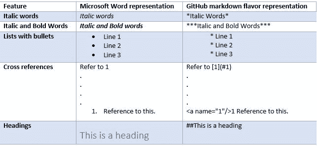

# 如何使用 TypeScript 从 Microsoft Word 生成 GitHub markdown 文件

> 原文：<https://www.freecodecamp.org/news/how-to-generate-a-github-markdown-file-from-microsoft-word-using-typescript-a8976ea958c3/>

作者马尼什·班萨尔

什么？为什么要从 Microsoft word 文档生成 MD 文件呢？如果这是你读完这个标题后的第一个想法，那么让我给你一个强有力的用例。

考虑这样一种情况，您使用 Git 或任何其他版本控制系统(VCS)来管理项目的源代码和工件。现在，像大多数项目一样，您决定使用 Microsoft word 进行文档处理，并将其签入 Git。同样，多个团队成员编辑同一个文档。编辑后，他们将文档签入到存储库中。

现在，Git 将能够维护文档的历史。您将如何查看自上次签入以来对文档所做的更改？可以，可以用微软 word 的变轨模式，但是那不是很乱吗？或者看在上帝的份上，您能使用 Git diff 实用程序快速检查差异吗？我会说，没有。

那解决办法是什么？是否应该停止使用 Microsoft Word 进行文档处理？或者你应该换成其他的 VCS？

我会说都不是。你用微软 word 维护你的文档怎么样？然后在构建阶段把它改成 markdown (MD)文件(通俗点说就是文本文件)并检入？如果那个解决方案让你兴奋，那么继续读下去。

但是在开始转换之前，让我先告诉你什么是 markdown 文件。

### 什么是降价或 MD 文件？

Markdown 是一种语法语言，旨在轻松阅读和编写结构化文本。此外，它很容易学习，只需要一个文本编辑器来创建一个文档。

现在，这种语言有多种实现方式(比如 [GFM](https://github.github.com/gfm/) 又名 Github 风味的 Markdown)。这些实现中的每一个都有自己的改进和特性，不一定相互兼容。

每个实现都支持各种常见的特性，如段落、块引号、标题和列表。这有助于像 Microsoft Word 一样以结构化的方式维护文本。但是，MD 文件没有使用内部二进制代码，而是使用纯文本字符来实现这些功能。这使得 MD 文件成为文本文件，而不是像 docx 文件那样的二进制文件。

例如，在 GitHub 的 markdown 版本中，与 word 文档相比，这里有各种功能和以文本形式表示它们的方式。

关于 MD 文件相对于 word 文档的详细优势，也可以参考[这篇](https://hackernoon.com/say-yes-to-markdown-no-to-ms-word-be4692e7a8cd)文章。

### 好吧！我确信。给我看看代码。

声明:这个项目的灵感来自于 TypeScript 源代码。在浏览的时候，我发现了这个把 word 文档转换成 MD 文件的想法。你可以在这里看到它的源代码[。](https://github.com/manishbansal8843/TypeScript/blob/1b880f8ad445c778911a71b8cdec94ae885299bf/scripts/word2md.ts#L407)

为了简单起见，我已经删除了我的存储库中的一些代码。原始代码旨在将 TypeScript 规范文档转换为 MD 文件。这个文件包含许多定制的样式。因此，一旦您完成了本文，您就可以仔细阅读 TypeScript 转换器代码，并欣赏它执行更复杂转换的能力。

本文提到的完整代码可以参考[这里的](https://github.com/manishbansal8843/word2mdconverter)。整个代码可以分为 3 个部分:

1.  吞咽配置。
2.  CScript 执行。
3.  TypeScript 主函数

如前所述，您可以在构建阶段将 word 文档转换为 MD 文件。这可以由任何任务运行者来完成。在这里，我选择了吞咽。

在吞咽配置中，我定义了 3 个任务。首先是清理构建目录，这是非常标准的。其次是编译类型脚本代码。最后一个是调用 CScript 来执行 JavaScript。

### CScript 是什么？

CScript.exe(位于 C:\Windows\System32 中)是一个基于控制台的可执行程序，用于运行脚本的脚本主机。它可以解释脚本语言，如 VB Script 或 JavaScript。类似地，我们有 WScript，但它用于 windows 应用程序。在这种情况下，控制台没有连接。因此，如果您需要创建基于控制台的应用程序，我们可以使用 CScript。

现在，在我们的项目中，CScript 的主要工作是为我们的脚本(即 JavaScript)提供一个运行时环境。现在，你一定在想，为什么我没有用 node 代替 CScript 来运行我的 JavaScript 呢？

两者都为 JavaScript 提供了运行时环境。CScript 为 windows 组件对象模型技术提供了内在支持。因此，如果您试图通过 Node 运行这个脚本，您将会得到这样的错误。

> var fileStream = new ActiveX object(" ADODB。stream”)；

> ReferenceError:未定义 ActiveXObject

什么是组件对象模型技术？

组件对象模型是微软开发的一项技术。它不是一种语言，而是一种二进制标准。根据定义，

> 微软组件对象模型( [COM](https://docs.microsoft.com/en-us/windows/desktop/com/the-component-object-model) )是一个独立于平台的、分布式的、面向对象的系统，用于创建可以交互的二进制软件组件。COM 是微软的 OLE(复合文档)、ActiveX(支持互联网的组件)以及其他组件的基础技术。

通俗地说，COM 对象是各种运行时对象的接口。(这就是为什么定义中有一个术语叫做“二进制软件组件”)。它不是一种语言，而是一种与编程语言无关的技术。

对 COM 的唯一语言要求是，代码是用能够创建指针结构的语言生成的。通过指针显式或隐式地调用函数。C++和 Smalltalk 等面向对象的语言提供了简化 COM 对象实现的编程机制

之后，我们可以使用任何其他语言，如 Java、VB 或 JavaScript 来与这些 COM 对象进行交互。这将进一步让我们访问运行时应用程序。在我们的例子中，是 Microsoft word 应用程序。

那么，你是说我们在这里根本不能使用 Node？

不，那不是真的。我们也可以用 Node 代替 CScript。但是为了支持 com，我们需要安装另一个名为 win32com 的包来支持 COM。详情可以在这里找到[。](https://helloacm.com/using-com-object-in-nodejs/)

### 最终代码

现在，为了与 word 应用程序进行交互，已经使用了各种 API。由于我们使用了 COM 对象模型，我引用了 [word 对象模型](https://docs.microsoft.com/en-us/visualstudio/vsto/word-object-model-overview?view=vs-2017)。

Word 提供了数百个可以与之交互的对象。这些对象按照紧密遵循用户界面的层次结构进行组织。层次结构的顶部是应用程序对象。此对象代表 Word 的当前实例。Application 对象包含 Document、Selection、Bookmark 和 Range 对象。这些对象中的每一个都有许多方法和属性，您可以访问这些方法和属性来操作对象并与之交互。

现在，在我们的脚本中，我们首先使用 ActiveXObject 创建了一个 word 应用程序对象。一旦获得了应用程序对象，就通过传递文档的名称(从 cscript 调用的命令行参数中获得)来创建文档对象。

现在，这代表了实际文档的活动对象。这个对象能够解析和操作 word 文档。然而，在我们的用例中，我们只需要解析文档并编写一个文本文件。

这段代码非常通用，用于转换 word 文档的基本功能，如交叉引用、列表、下标文本、粗体和斜体字符等。转换成 GFM 格式。但是，您可以编写自己的代码，将 word 文档的自定义样式转换为所需的格式。

你可以在这里找到实际的打字稿代码[。代码很容易读懂。以下是它的几个主要亮点:](https://github.com/manishbansal8843/word2mdconverter/blob/master/src/word2mdconverter.ts)

1.  [首先](https://github.com/manishbansal8843/word2mdconverter/blob/4acca1877451c7929eddbdce09c2ea113525769e/src/word2mdconverter.ts#L357)，一个文档对象被传递给 convertDocumentToMarkdown 函数，该函数返回要写入 MD 文件的文本。
2.  此外，在 convertDocumentToMarkdown 中，调用 document 对象的方法和属性来查找相关的单词特征并用相应的 GFM 语言语法替换它们。例如，首先，搜索下标和粗斜体文本。之后，该文本被 GFM 特定代码所取代。最后，移除单词样式。这一切都在[这里](https://github.com/manishbansal8843/word2mdconverter/blob/4acca1877451c7929eddbdce09c2ea113525769e/src/word2mdconverter.ts#L332-L334)完成。
3.  此后，交叉引用由[替换为](https://github.com/manishbansal8843/word2mdconverter/blob/4acca1877451c7929eddbdce09c2ea113525769e/src/word2mdconverter.ts#L336-L338)。然而，这是棘手的。首先，调用 toggleShowCodes 函数。这与 word 文档中的 alt+F9 具有相似的影响。这将使用代码替换文档中的所有交叉引用。之后，调用查找和替换方法来查找和替换所有具有 GFM 样式的交叉引用。这里，“19 REF”作为参数传递给函数。这是在 word 文档中查找所有交叉引用的标准搜索条件。最后，在替换之后，再次调用 toggleShowCodes 函数将文档恢复到原始形式。
4.  最后，调用 writeDocument 函数来完成主要工作。它逐段读取文档，然后使用大小写切换来查找段落的样式(比如它是标题、表格、列表段落还是图像)。现在，根据找到的样式，将所需的文本写入 MD 文件。

**关于嵌入图像的一两句话:**将图像嵌入到 MD 文件中有点棘手。

首先，您需要将图像存储在 git 存储库中。然后，链接必须在 MD 文件中给出，以便嵌入其中。语法是！[备选文本](路径/in/the/repository/image1.jpg)。

现在，为了在将 word 转换为 MD 文件时自动生成图像的链接，创建了隐藏文本(就在图像后面，没有任何空格),内容作为链接本身。然后在[代码](https://github.com/manishbansal8843/word2mdconverter/blob/4acca1877451c7929eddbdce09c2ea113525769e/src/word2mdconverter.ts#L258-L263)中，这个隐藏的文本被剥离并插入到 MD 文件中。

现在，你可能会发现做所有这些事情的实际代码非常乏味，但这都是按照 Word 应用程序公开的 [API](https://docs.microsoft.com/en-us/dotnet/api/microsoft.office.interop.word._document?view=word-pia) 进行的。所以不要担心这个。绝对可以参考我的代码或者 TypeScript 的原代码。两者都将是你下一个项目的良好开端。

哦等等！！就是这样。你坚持到最后了？。那好吧。恭喜你！？如果你喜欢这篇文章，请鼓掌？下面的按钮。这对我意义重大，也有助于其他人了解这个故事。干杯！？