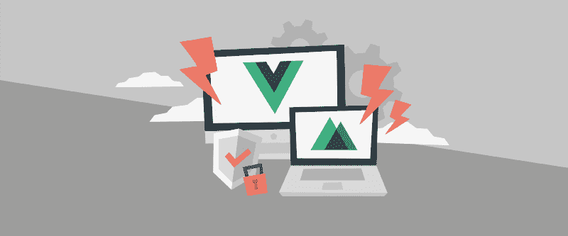
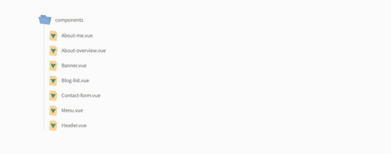
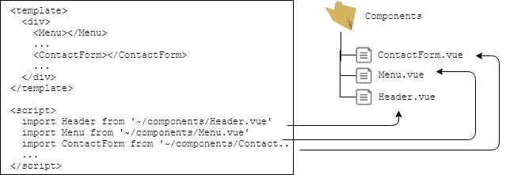
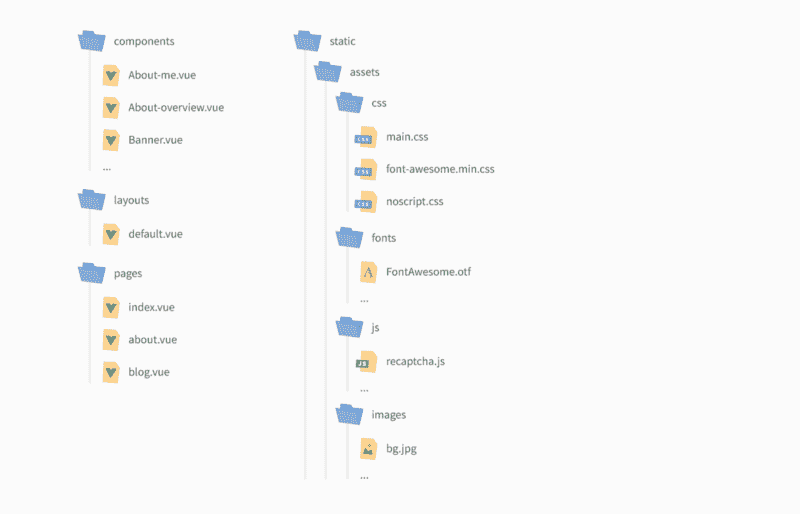

# 如何用 Vue.js 快速生成一个静态网站

> 原文：<https://www.freecodecamp.org/news/how-to-generate-a-static-website-with-vue-js-in-no-time-e74e7073b7b8/>

by Ondřej Polesný

# 如何用 Vue.js 快速生成一个静态网站



您已经决定构建一个静态站点，但是从哪里开始呢？在没有经验的情况下，如何为工作选择合适的工具？如何确保第一次就成功，同时避免最终对你没有帮助的工具？

在本文中，您将学习如何将 Vue.js 网站调整为自动生成的静态网站。

### 介绍

在我的[上一篇文章](http://bit.ly/2QVSm9a)中，我总结了基于 API 的网站和静态网站的主要区别。快速提醒一下，静态站点包括:

*   速度极快
*   安全(因为它们只是一组静态页面)
*   每次编辑更新内容时重新生成
*   兼容额外的动态功能

#### 什么是静态站点生成器？

静态网站生成器是一种工具，它从网站的实现和内容中生成静态网站。

内容可以通过 REST API 来自一个无头内容管理系统。网站实现使用一个 JavaScript 框架，如 Vue.js 或 React。静态站点生成器的输出是一组构成网站的静态文件。


#### 静态站点实现

我选择 Vue.js 作为要使用的 JavaScript 框架。因此，我将使用 [Nuxt.js](http://bit.ly/2Aiaggm) ，它是 Vue.js 的静态站点生成器。

如果你正在使用一个不同的框架，寻找一个构建在该框架之上的静态站点生成器(例如[Gatsby](http://bit.ly/2ypBwZ7)for[react . js](http://bit.ly/2PGeCTL))。

本质上，Nuxt 是多个工具的组合，这些工具使您能够创建静态站点。这些工具包括:

*   view 2-核心 vue . js library。
*   Vue 路由器—处理网站内页面的 URL 路由。
*   Vuex —组件共享数据的内存存储。
*   Vue 服务器渲染器—在实际静态文件生成之前启用页面的服务器端渲染
*   vue-Meta-管理页面元数据信息

Nuxt 还定义了如何建立网站，以生成静态文件。

#### 装置

为了开始用 Nuxt 建立网站，你需要安装它。详细安装说明见 [Nuxt.js 网页](http://bit.ly/2R0LTJH)。简而言之，您需要安装并运行`npx`(默认情况下随 NPM 一起提供):

```
npx create-nuxt-app <website-name>
```

您可以只使用默认选择，除非您有其他偏好。

#### 成分

在[我以前的一篇文章](http://bit.ly/2zLRE8a)中，我解释了如何创建模板布局和组件。所有这些都在单个文件`components.js`中定义。这需要用 Nuxt 来改变。所有组件需要从`components.js`文件提取到`components`文件夹下的单独文件中。看看我的`blog-list`组件及其先前的实现:

```
Vue.component('blog-list', { props: ['limit'], data: function(){  return {   articles: null  } },
```

```
 created: function(){  var query = deliveryClient   .items()   .type('blog_post')   .elementsParameter(['link', 'title', 'image_url', 'image', 'teaser'])   .orderParameter('elements.published', SortOrder.desc);   if (this.limit){   query = query.limitParameter(this.limit);  }  query   .getPromise()   .then(response =>    this.$data.articles = response.items.map(item => ({     url: item.link.value,     header: item.title.value,     image: item.image_url.value != '' ? item.image_url.value : item.image.assets[0].url,     teaser: item.teaser.value    }))   ); },
```

```
 template: `  <section class="features">   <article v-for="article in articles">    ...   </article>  </section> ` });
```

要分离它，您还需要更改组件的语法以匹配以下模板:

```
<template> HTML of the component</template><script> export default {  Vue.js code }</script>
```

因此，我调整后的`Blog-list`组件如下所示:

```
<template> <section class="features">  <article v-for="article in blogPosts">   ...  </article> </section></template><script> export default {  props: ['limit'],  computed: {   blogPosts: function(){    return this.$store.state.blogPosts && this.limit && this.$store.state.blogPosts.length > this.limit ? this.$store.state.blogPosts.slice(0, this.limit) : this.$store.state.blogPosts;   }  } }</script>
```

你可以看到模板保持不变。改变的是现在在`export default`部分中的实现。此外，以前有一个从 headless CMS Kentico Cloud 收集数据的功能。

该内容现在存储在 Vuex store 中。这部分我以后再解释。以这种方式转换你的所有组件，在`<templa` te >标签和实现 w `ithin &l` t 中包含模板；脚本>标签。您最终应该得到一个与我相似的文件结构:



请注意，这里我有两个新组件——菜单和标题。因为我的目标也是提高性能，所以我决定从我的网站上删除 jQuery。jQuery 是一个非常大而笨重的库，只用于小的 UI 效果。我可以只用 Vue.js 重新创建它们。因此，我将表示 header 的静态 HTML 转换为 component。我还在这个组件的`mounted`函数中加入了 UI 相关的功能。

```
mounted: function(){ window.addEventListener(‘scroll’, this.scroll); …},methods: { scroll: function(){  … }}
```

### 用 Nuxt 处理 Vue.js 事件

我曾经在我的网站中利用 Vue 事件。主要原因是用于表单验证的 reCaptcha 控件。初始化时，它会广播事件，以便表单组件可以解锁联系人表单的提交按钮。

有了 Nuxt，我不再使用`app.js`或`components.js`文件。因此，我创建了一个新的`recaptcha.js`文件，其中包含一个简单的函数，当 reCaptcha 准备就绪时，该函数将发出事件。注意，不是仅仅为事件创建新的 Vue.js 实例(在我的旧代码中是`let bus = new Vue();`，而是可以简单地以同样的方式使用`this.$nuxt`。

```
var recaptchaLoaded = function(){ this.$nuxt.$emit('recaptchaLoaded');}
```

### 布局和页面

页面的主框架是`index.html`，每个页面都在交给 Vue router 的常量中定义了自己的布局。

使用 Nuxt，任何 HTML 页面的主框架包括`<ht` ml > `tag`、meta 标签和其他要素都由 Nuxt 处理。实际的网站实现只处理内容 w `ithin` <正文>标签。移动所有 `pages into layouts` /default.vue 的通用布局，并遵循与组件相同的模板。我的布局看起来像这样:

```
<template> <div>  <Menu></Menu>  <div id="page-wrapper">   <Header></Header>   <nuxt/>   <section id="footer">    <div class="inner">     …     <ContactForm></ContactForm>     …    </div>   </section>  </div> </div></template><script> import ContactForm from ‘~/components/Contact-form.vue’ import Menu from ‘~/components/Menu.vue’ import Header from ‘~/components/Header.vue’  export default {  components: {   ContactForm,   Menu,   Header  } } </script>
```

布局基本是我老`index.html`的 HTML 标记。但是，请注意`<scri` pt >部分。我想在此布局模板中使用的所有组件都需要从它们的位置导入，并在导出的对象中指定。



页面组件之前在`app.js`中被定义为常量。以我以前的主页为例:

```
const Home = { template: `  <div>   <banner></banner>   <section id="wrapper">    <about-overview></about-overview>    ...    <blog-list limit="4"></blog-list>    <ul class="actions">     <li><a href="/blog" class="button">See all</a></li>    </ul>    ...   </section>  </div> `}
```

所有这些页面都需要在`pages`文件夹内的单独文件中定义。主页面总是被称为`index.vue`。这是我的新`pages/index.vue`(我的主页)的样子:

```
<template> <div>  <Banner></Banner>  <section id="wrapper">   <AboutOverview></AboutOverview>   ...   <BlogList limit="4"></BlogList>   <ul class="actions">    <li><a href="/blog" class="button">See all</a></li>   </ul>   ...  </section> </div></template><script> import Banner from ‘~/components/Banner.vue’ import AboutOverview from ‘~/components/About-overview.vue’ import BlogList from ‘~/components/Blog-list.vue’  export default {  components: {   Banner,   AboutOverview,   BlogList  }, }</script>
```

### 在哪里存储资产

每个网站上都有 CSS 样式表、图像、徽标和 JavaScripts 等资产。使用 Nuxt，所有这些静态文件都需要存储在文件夹 static 下。因此，目前的文件夹结构如下所示:



当您从 CSS 样式表中引用任何资源(如字体或图像)时，您需要使用静态文件夹作为根:

```
background-image: url("~/assets/images/bg.jpg");
```

### 获取内容

有了所有的组件和页面，我们终于可以开始了:将内容放入组件。

使用 Nuxt 获取内容与以前有所不同。使用静态站点生成器时，这个过程的重要方面是需要在生成所有页面之前收集内容。否则，你最终会得到一个静态的网站，但对内容的请求仍然是动态的，从每个访问者的浏览器中点击无头 CMS，你将失去主要的好处。

Nuxt 包含两个特殊的方法，它们在适当的时候处理异步数据获取，也就是在页面生成之前。这些方法是`asyncData` 和`fetch`。它们只适用于页面组件(即`pages` 文件夹中的文件),它们的用途是一样的，但是`asyncData` 会自动将接收到的数据存储在组件数据集中。

如果在一个页面上有许多组件使用相同的数据集，这是非常有益的。在我的例子中，我甚至有多个包含许多组件的页面需要共享相同的数据。因此，我要么需要在每个页面上请求相同的数据，要么使用所有页面和组件都可以访问的共享空间。

我选择了后者。Nuxt 让我们变得非常容易。它自动包含 Vuex 商店，使我们的组件和页面能够访问商店中的任何数据。要开始使用商店，你需要做的就是在`store`文件夹中创建一个`index.js`文件。

```
import Vuex from 'vuex'
```

```
const createStore = () => { return new Vuex.Store({  state: () => ({}),  mutations: {},  actions: {}, })}export default createStore
```

您会看到该实例有几个属性:

*   **状态**
    状态类似于组件中的数据。它包含用于存储数据的数据字段的定义。
*   **突变**
    突变是允许改变数据状态的特殊函数(使状态突变)。
*   **动作**
    动作是简单的方法，例如，使您能够实现内容收集逻辑。

让我们回到`Blog-list`组件。该组件需要一组博客文章来呈现其标记。因此，博客帖子需要存储在 Vuex 商店中:

```
…const createStore = () => { return new Vuex.Store({  state: () => ({   blogPosts: null  }),  mutations: {   setBlogPosts(state, blogPosts){    state.blogPosts = blogPosts;   }  },  actions: {   getBlogPosts (context) {    logic to get content from Kentico Cloud   }  }, })}
```

以这种方式调整 Vuex 存储后，`Blog-list`组件可以使用它的数据:

```
<article v-for="article in $store.state.blogPosts"> …</article>
```

我已经在上面分享了这个组件的整个实现。如果你注意到了，它使用`computed`函数作为组件标记和 Vuex 存储之间的中间层。中间层确保组件只显示在`limit`字段中配置的特定数量的文章。

### 查询无头 CMS

也许你还记得`deliveryClient`被用来从 [Kentico Cloud](http://bit.ly/2QzUALM) 获取数据到组件中。

*免责声明:我在 Kentico 工作，这是一家 CMS 供应商，提供传统(耦合)CMS 和一种新的云优先的无头 CMS——Kentico Cloud。*

同样的逻辑也可以用在 Vuex store 操作中，只需稍加修改。Kentico Cloud 有一个用于 Nuxt.js 的[模块，使用以下命令安装它:](http://bit.ly/2Qiovur)

```
npm i kenticocloud-nuxt-module — savenpm i rxjs — save
```

有了这个模块，你可以像以前一样继续使用`deliveryClient`，只是要加上一个`$`前缀。所以在我的例子中，获取博客帖子的逻辑是这样的:

```
…getBlogPosts (context) { return this.$deliveryClient  .items()  ...  .orderParameter('elements.published', SortOrder.desc)  .getPromise()  .then(response => {   context.commit('setBlogPosts', response.items.map(item => ({    url: item.link.value,    header: item.title.value,    image: item.image_url.value != '' ? item.image_url.value : item.image.assets[0].url,    teaser: item.teaser.value   })))  }); },…
```

如果您想使用`orderParameter`进行排序，您可能需要在`store/index.js`文件中包含另一个导入:

```
import { SortOrder } from 'kentico-cloud-delivery'
```

现在，当实现内容收集逻辑时，就该使用我之前提到的特殊异步函数 fetch 了。在`index.vue`页面查看我的实现:

```
async fetch ({store, params}) { await store.dispatch('getBlogPosts')}
```

对`store.dispatch`的调用自动调用`getBlogPosts`动作。在`getBlogPosts`内实现注意对`context.commit`的调用。`context`指 Vuex 商店，`commit`会把博文数据交给`setBlogPosts`突变。用博客文章更新数据集会改变存储的状态(使其变异)。我们就要完成了！

#### 其他内容存储选项

我在这里使用了 [Kentico Cloud](http://bit.ly/2QzUALM) headless CMS 及其 API，因为我在本系列的所有文章中都使用它。如果你也想看看其他选项，你可以在 headlesscms.org 的[找到一个独立的无头 CMS 列表和它们的特性。](http://bit.ly/2S8gxSi)

如果您不想使用 headless CMS 及其 API，您可以决定以其他方式存储您的内容——通常作为一组直接存储在您的项目或 Git 存储库中的 markdown 文件。您可以在[nuxt-markdown-example GitHub repository](http://bit.ly/2R5PQAo)中找到这种方法的一个很好的例子。

### Nuxt 配置

需要使用`Nuxt.config.js`文件正确配置整个应用程序。这个文件包含关于使用的模块，它们的配置和网站的基本信息，如标题或搜索引擎优化标签的信息。我的网站的配置如下所示:

```
export default { head: {  title: 'Ondrej Polesny',  meta: [   { charset: 'utf-8' },   ...   { hid: 'description', name: 'description', content: 'Ondrej Polesny — Developer Evangelist + dog lover + freelance bus driver' }  ],  script: [   { src: 'https://www.google.com/recaptcha/api.js?onload=recaptchaLoaded', type: "text/javascript" },   { src: 'assets/js/recaptcha.js', type: "text/javascript" }  ], }, modules: [  'kenticocloud-nuxt-module' ], kenticocloud: {  projectId: '*KenticoCloud projectId*',  enableAdvancedLogging: false,  previewApiKey: '' }, css: [  {src: 'static/assets/css/main.css'}, ], build: {  extractCSS: {   allChunks: true  } }}
```

标题部分描述了网站的基本要素，比如你想在标题中包含的`title` 和`meta` 标签。

注意`modules` 和`kenticocloud`配置。第一个列表列出了应用程序依赖的所有模块，第二个列表是特定的模块配置。这是您需要放置项目 API 密钥的地方。

要查看元标签的所有选项，请参考[https://github.com/declandewet/vue-meta](http://  https://github.com/declandewet/vue-meta)

### 运行和发电

静态站点需要在任何人可以访问它们或者将它们上传到 FTP 服务器之前生成。然而，在开发阶段，每次进行更改时都要重新生成站点，这是非常耗时的。因此，您可以使用以下命令在本地运行应用程序:

```
npm run dev
```

这将为您创建一个开发服务器，并使您能够在 http://localhost:8000(或类似的)上访问您的网站。当您的控制台运行此命令时，您在脚本中所做的每个更改都会对网站产生即时影响。

要生成真正的静态站点，请执行以下命令:

```
npx nuxt generate
```

输出，也就是你的静态站点，将会在`dist`文件夹中。在您喜欢的文本编辑器中随意打开任何页面，看看源代码是否包含来自 headless CMS 的内容。如果是，则表示已成功提取。

### 结论

拥有一个生成的静态网站将极大地提高网站的性能。与传统网站相比，网络服务器不需要执行任何 CPU 繁重的操作。它只提供静态文件。

与基于 API 的网站相比，客户端可以在第一时间收到请求的数据。这就是它们如此快速的原因——它们不需要等待外部内容通过额外的异步请求来交付。内容已经存在于服务器的第一个响应中。这极大地改善了用户体验。

将站点从 Vue.js 实现转换为 Nuxt 定义非常简单，并且不需要深入了解所有使用的组件和包。

你成功创建了你的第一个静态站点吗？有没有经历过什么挣扎？请留言评论。

在下一篇文章中，我将关注静态站点的自动再生以及在哪里托管它们，敬请关注。

#### 该系列的其他文章:

1.  [第一次如何开始创建一个令人印象深刻的网站](http://bit.ly/2Duglu1)
2.  如何为你的网站决定最好的技术？
3.  [如何用 Vue.js 和最少的努力启动你的网站](http://bit.ly/2zLRE8a)
4.  [如何将无头 CMS 与一个 Vue.js 网站混合，并且零付费](http://bit.ly/2CyDnhX)
5.  [如何在 API 网站上安全提交表单](http://bit.ly/2P0gidP)
6.  用 CMS 建立一个超级快速安全的网站没什么大不了的。或者是？
7.  **如何用 Vue.js 快速生成静态网站**
8.  [如何快速建立静态站点的构建流程](http://bit.ly/2Dv2UGS)