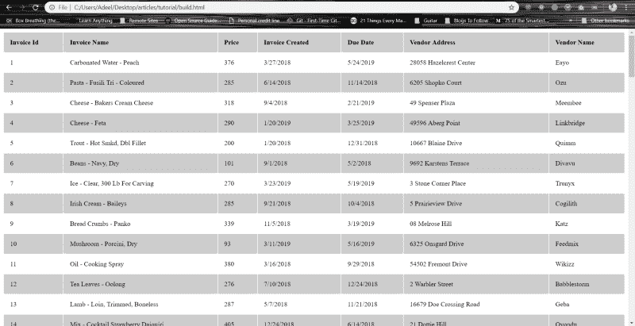
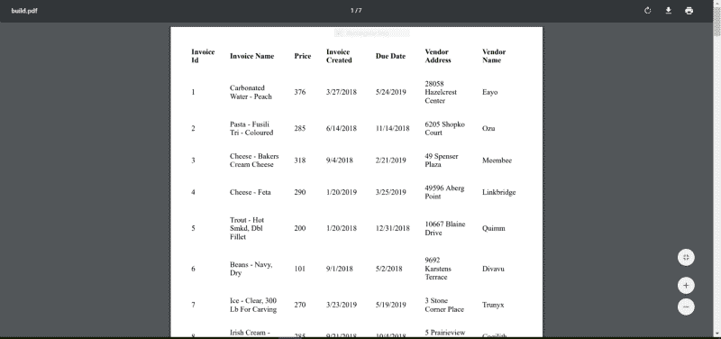

# 如何用 Node & Google Puppeteer 生成 HTML 表格和 PDF

> 原文：<https://www.freecodecamp.org/news/how-to-generate-an-html-table-and-a-pdf-with-node-google-puppeteer-32f94d9e39f6/>


Photo by [Nicolas Lobos](https://unsplash.com/@lobosnico?utm_source=ghost&utm_medium=referral&utm_campaign=api-credit) / [Unsplash](https://unsplash.com/?utm_source=ghost&utm_medium=referral&utm_campaign=api-credit)

在内部理解 NodeJS 可能有点令人畏惧(我知道曾经对我来说是这样)。Node 是一种非常强大的语言，它可以做很多事情。

今天我想揭示 Node 的内置实用工具 [fs](https://nodejs.org/api/fs.html) ( [文件系统](https://nodejs.org/api/fs.html))的威力

根据 [fs](https://nodejs.org/api/fs.html) 文件:

> `fs`模块提供了一个 API，以一种紧密围绕标准 POSIX 函数的方式与文件系统交互。

这只是一种奇特的说法，即[文件系统](https://nodejs.org/api/fs.html)是 Node 中与文件进行读写操作的一种方式。

现在[文件系统](https://nodejs.org/api/fs.html)是 NodeJS 中一个庞大的实用程序，它有许多奇特的特性。然而，在本文中，我将只讨论 3:

*   获取文件信息: ***fs.statSync***
*   删除文件:***fs . unlink sync***
*   将数据写入文件:***fs . writefilesync***

我们将在本文中涉及的另一件事是[谷歌木偶师](https://developers.google.com/web/tools/puppeteer/)这是一个非常酷、非常巧妙的工具，由谷歌的一些了不起的人创造。

那么什么是木偶师呢？根据文件，他们说:

> 木偶师是一个节点库，它提供了一个高级 API 来控制[无头](https://developers.google.com/web/updates/2017/04/headless-chrome) Chrome 或通过 [DevTools 协议](https://chromedevtools.github.io/devtools-protocol/)的 Chrome。它也可以配置为使用全(非无头)铬或铬。

所以它基本上是一个让你在服务器上做所有酷的浏览器相关事情的工具。比如获取网站截图、抓取网站、为单页应用生成预渲染内容。您甚至可以通过 NodeJS 服务器提交表单。

再说一次，木偶师是一个巨大的工具，所以我们将只介绍木偶师的一个很小但很酷的特性。我们将看看如何基于我们生成的 HTML 表格文件生成一个漂亮的 PDF 文件。在这个过程中，我们将学习 puppeteer.launch()并对 page() & pdf()有所了解。

#### 再次简要概述一下，我们将涉及的内容:

*   使用在线工具生成存根数据(用于发票)。
*   使用自动化的节点脚本创建一个 HTML 表，其中包含一点样式和生成的数据。
*   了解如何使用 fs.statSync 检查文件是否存在
*   了解如何使用 fs.unlinkSync 删除文件
*   了解如何使用 fs.writeFileSync 编写文件
*   创建一个使用谷歌木偶师生成的 HTML 文件的 PDF 文件
*   将它们制作成 npm 脚本，供以后使用？？

> 在我们开始之前，这里是教程的全部[源代码，供大家跟随。你不用写任何东西，但是你应该跟着这个教程写代码。那会证明更有用你会了解更多。](https://github.com/adeelibr/understaning-node-fs-and-puppeteer) [***源代码教程***](https://github.com/adeelibr/understaning-node-fs-and-puppeteer)

在我们开始之前，请确保您的计算机上至少安装了以下软件

*   节点版本 8.11.2
*   节点程序包管理器(NPM)版本 6.9.0

您不需要这样做，但是您也可以观看一个介绍性视频(我的第一个视频),它讲述了在 NodeJS 中读取、写入和删除文件的基础知识。这将有助于你理解本教程。(请务必给我反馈)。？

[https://www.youtube.com/embed/7tc_lYelc-U?feature=oembed](https://www.youtube.com/embed/7tc_lYelc-U?feature=oembed)

### 我们开始吧

#### **第一步:**

在您的终端中键入以下内容:

```
npm init -y
```

这将为您初始化一个空项目。

#### 第二步:

第二，在同一个文件夹中，创建一个名为`data.json`的新文件，并在其中放置一些模拟数据。您可以使用下面的 JSON 示例。

你可以从 [**这里**](https://gist.github.com/adeelibr/69d2ca9d40642aaf99721796da0aaa64) **获得被嘲讽的 JSON 存根数据。为了生成这些数据，我使用了一个名为[https://mockaroo.com/](https://mockaroo.com/)的强大工具，这是一个在线数据生成工具。**

我要使用的 JSON 数据具有这样的结构:

```
[
  {},
  {},
  {
   "invoiceId": 1,
   "createdDate": "3/27/2018",
   "dueDate": "5/24/2019",
   "address": "28058 Hazelcrest Center",
   "companyName": "Eayo",
   "invoiceName": "Carbonated Water - Peach",
   "price": 376
  },
  {
   "invoiceId": 2,
   "createdDate": "6/14/2018",
   "dueDate": "11/14/2018",
   "address": "6205 Shopko Court",
   "companyName": "Ozu",
   "invoiceName": "Pasta - Fusili Tri - Coloured",
   "price": 285
  },
  {},
  {}
]
```

> 你可以从 [**这里**](https://gist.github.com/adeelibr/69d2ca9d40642aaf99721796da0aaa64) **下载本教程的完整 JSON 数组。**

#### 第三步:

接下来创建一个名为`buildPaths.js`的新文件

```
const path = require('path');
const buildPaths = {
   buildPathHtml: path.resolve('./build.html'),
   buildPathPdf: path.resolve('./build.pdf')
};
module.exports = buildPaths;
```

所以`path.resolve`将接受一个相对路径，并返回给我们这个特定目录的绝对路径。

例如，`path.resolve('./build.html');`将返回如下内容:

```
$ C:\\Users\\Adeel\\Desktop\\articles\\tutorial\\build.html
```

#### **第四步:**

在同一个文件夹中创建一个名为`createTable.js`的文件，并添加以下代码:

```
const fs = require('fs');
// JSON data
const data = require('./data.json');
// Build paths
const { buildPathHtml } = require('./buildPaths');

/**
 * Take an object which has the following model
 * @param {Object} item 
 * @model
 * {
 *   "invoiceId": `Number`,
 *   "createdDate": `String`,
 *   "dueDate": `String`,
 *   "address": `String`,
 *   "companyName": `String`,
 *   "invoiceName": `String`,
 *   "price": `Number`,
 * }
 * 
 * @returns {String}
 */
const createRow = (item) => `
  <tr>
    <td>${item.invoiceId}</td>
    <td>${item.invoiceName}</td>
    <td>${item.price}</td>
    <td>${item.createdDate}</td>
    <td>${item.dueDate}</td>
    <td>${item.address}</td>
    <td>${item.companyName}</td>
  </tr>
`;

/**
 * @description Generates an `html` table with all the table rows
 * @param {String} rows
 * @returns {String}
 */
const createTable = (rows) => `
  <table>
    <tr>
        <th>Invoice Id</td>
        <th>Invoice Name</td>
        <th>Price</td>
        <th>Invoice Created</td>
        <th>Due Date</td>
        <th>Vendor Address</td>
        <th>Vendor Name</td>
    </tr>
    ${rows}
  </table>
`;

/**
 * @description Generate an `html` page with a populated table
 * @param {String} table
 * @returns {String}
 */
const createHtml = (table) => `
  <html>
    <head>
      <style>
        table {
          width: 100%;
        }
        tr {
          text-align: left;
          border: 1px solid black;
        }
        th, td {
          padding: 15px;
        }
        tr:nth-child(odd) {
          background: #CCC
        }
        tr:nth-child(even) {
          background: #FFF
        }
        .no-content {
          background-color: red;
        }
      </style>
    </head>
    <body>
      ${table}
    </body>
  </html>
`;

/**
 * @description this method takes in a path as a string & returns true/false
 * as to if the specified file path exists in the system or not.
 * @param {String} filePath 
 * @returns {Boolean}
 */
const doesFileExist = (filePath) => {
	try {
		fs.statSync(filePath); // get information of the specified file path.
		return true;
	} catch (error) {
		return false;
	}
};

try {
	/* Check if the file for `html` build exists in system or not */
	if (doesFileExist(buildPathHtml)) {
		console.log('Deleting old build file');
		/* If the file exists delete the file from system */
		fs.unlinkSync(buildPathHtml);
	}
	/* generate rows */
	const rows = data.map(createRow).join('');
	/* generate table */
	const table = createTable(rows);
	/* generate html */
	const html = createHtml(table);
	/* write the generated html to file */
	fs.writeFileSync(buildPathHtml, html);
	console.log('Succesfully created an HTML table');
} catch (error) {
	console.log('Error generating table', error);
}
```

**createTable.js script (github gist:** [https://gist.github.com/adeelibr/70936277d38f3c77d3910e417581e98a#file-createtable-js](https://gist.github.com/adeelibr/70936277d38f3c77d3910e417581e98a#file-createtable-js)**)**

我知道这是一大堆代码，但是让我们把它分成几个部分，开始一部分一部分地理解它。

转到 ***第 106 行*** *( [github 要诀](https://gist.github.com/adeelibr/70936277d38f3c77d3910e417581e98a#file-createtable-js) )*

在我们的`try/catch`块中，我们首先检查 HTML 的构建文件是否存在于系统中。这是我们的 NodeJS 脚本将在其中生成 HTML 的文件的路径。

调用 doesFileExist()方法，该方法只返回真/假。为此，我们使用

```
fs.statSync(filePath);
```

这个方法实际上返回了关于文件的信息，比如文件的大小、文件的创建时间等等。然而，如果我们为它提供一个无效的文件路径，这个方法将返回一个空错误。我们在这里使用它，并将`fs.statSync()`方法包装在`try/catch`中。如果 Node 能够成功读取 try 块中的文件，我们返回`true`——否则它抛出一个错误，我们在 catch 块中得到这个错误并返回`false`。

如果系统中存在该文件，我们将使用

```
fs.unlinkSync(filePath); // takes in a file path & deletes it
```

删除文件后，我们需要生成一些行放入表中。

#### 第五步:

因此，首先我们导入`data.json`，我们在 ***第 3 行*** &进行导入，然后在 ***第 115 行*** 使用 map()迭代每个项目。你可以在这里阅读更多关于 [Array.prototype.map()的内容。](https://developer.mozilla.org/en-US/docs/Web/JavaScript/Reference/Global_Objects/Array/map)

map 方法采用一个方法`createRow`,该方法通过每次迭代接收一个对象，并返回一个包含如下内容的字符串:

```
"<tr>
  <td>invoice id</td>
  <td>invoice name</td>
  <td>invoice price</td>
  <td>invoice created date</td>
  <td>invoice due date</td>
  <td>invoice address</td>
  <td>invoice sender company name</td>
</tr>"
```

> `const row = data.map(createdRow).join('');`

这里的`join('')`部分很重要，因为我想把所有的数组连接成一个字符串。

几乎类似的原理用于在第 117 行 &上生成表格，然后在第 119 行 ***上生成 html 表格。***

#### **第六步:**

重要的部分是我们在第 121 行 上的 ***处写入文件:***

```
fs.writeFileSync(buildPathHtml, html); 
```

它接受两个参数:一个是构建路径(字符串)和 html 内容(字符串),并生成一个文件(如果没有创建；并且如果它被创建，它将覆盖已经存在的文件)。

> 这里需要注意的一点是，我们可能不需要第 4 步，在这一步中，我们检查文件是否存在&如果存在，就删除它。这是因为 writeFileSync 为我们做了这件事。我只是出于学习的目的在代码中添加了这一点。

#### 第七步:

在您的终端中，进入您有`createTable.js`的文件夹路径并键入

```
$ npm run ./createTable.js
```

一旦你运行这个脚本，它将在同一个文件夹中创建一个名为`build.html`的新文件，你可以在浏览器中打开这个文件，它看起来就像这样。



Generated HTML table.

> 酷吧？到目前为止一切顺利。*？*

您还可以在 package.json 中添加一个`npm script`，如下所示:

```
"scripts": {
  "build:table": "node ./createTable.js"
},
```

这样不用写`npm run ./createTable.js`，直接输入`npm run build:table`就可以了。

接下来:从生成的`HTML`文件生成 PDF。

#### 第八步:

首先，我们需要安装一个奇特的工具，所以进入你的终端，在你的应用程序文件夹中输入

```
npm install puppeteer
```

#### **第九步:**

在保存有文件`createTable.js`、`buildPaths.js`、&、`data.json`的同一个文件夹中，创建一个名为`createPdf.js`的新文件，并向其中添加内容，如下所示:

```
 const fs = require('fs');
const puppeteer = require('puppeteer');
// Build paths
const { buildPathHtml, buildPathPdf } = require('./buildPaths');

const printPdf = async () => {
	console.log('Starting: Generating PDF Process, Kindly wait ..');
	/** Launch a headleass browser */
	const browser = await puppeteer.launch();
	/* 1- Ccreate a newPage() object. It is created in default browser context. */
	const page = await browser.newPage();
	/* 2- Will open our generated `.html` file in the new Page instance. */
	await page.goto(buildPathHtml, { waitUntil: 'networkidle0' });
	/* 3- Take a snapshot of the PDF */
	const pdf = await page.pdf({
		format: 'A4',
		margin: {
			top: '20px',
			right: '20px',
			bottom: '20px',
			left: '20px'
		}
	});
	/* 4- Cleanup: close browser. */
	await browser.close();
	console.log('Ending: Generating PDF Process');
	return pdf;
};

const init = async () => {
	try {
		const pdf = await printPdf();
		fs.writeFileSync(buildPathPdf, pdf);
		console.log('Succesfully created an PDF table');
	} catch (error) {
		console.log('Error generating PDF', error);
	}
};

init();
```

[createPdf.js github gist](https://gist.github.com/adeelibr/57081ec24b634b4d161e405ae3bf6d78#file-createpdf-js) 

正如我们对`createTable.js`脚本所做的那样，让我们把它分成几个部分，开始一步一步地理解这个脚本。

先从 **[第 40 行:](https://gist.github.com/adeelibr/57081ec24b634b4d161e405ae3bf6d78#file-createpdf-js-L40)** 这里我们调用一个方法 ***init()*** 该方法调用 **[第 30 行](https://gist.github.com/adeelibr/57081ec24b634b4d161e405ae3bf6d78#file-createpdf-js-L30)的方法。**需要注意的一点是，我们的 init()方法是一个异步方法。阅读更多关于这个[异步函数](https://developer.mozilla.org/en-US/docs/Web/JavaScript/Reference/Statements/async_function)的信息。

首先在 init()方法中我们调用 ***printPdf()*** 方法，这也是一个异步方法，所以我们必须等待它的响应。printPdf()方法返回给我们一个 Pdf 实例，然后我们将它写到第 33 行**的一个文件中。**

那么`printPdf()`方法是做什么的呢？让我们深挖一下。

```
const browser = await puppeteer.launch();
const page = await browser.newPage();
await page.goto(buildPathHtml, { waitUntil: 'networkidle0' });
const pdf = await page.pdf({
  format: 'A4',
  margin: {
   top: '20px', right: '20px', bottom: '20px', left: '20px'}
});
await browser.close();
return pdf;
```

我们首先通过执行以下操作，使用 puppeteer 启动一个无头浏览器实例:

```
await puppeteer.launch(); // this returns us headless browser
```

然后我们用它打开一个网页:

```
await browser.newPage(); // open a blank page in headless browser
```

打开空白页后，我们可以导航到某个页面。因为我们的网页在我们系统的本地，我们简单地

```
page.goto(buildPathHtml, { waitUntil: 'networkidle0' });
```

这里`waitUntil: 'networkidle0;`很重要，因为它告诉木偶师等待 500/ms，直到不再有网络连接。

> ***注:*** 这就是为什么我们使用 path.resolve()来获取绝对路径，因为为了用 puppeteer 打开网页，我们需要一个绝对路径。

在服务器上的无头浏览器中打开网页后，我们将该网页保存为 pdf 格式:

```
await page.pdf({ });
```

一旦我们有了 pdf 版本的网页，我们需要关闭由 puppeteer 打开的浏览器实例，这样做可以节省资源:

```
await browser.close();
```

然后我们返回保存的`pdf`,然后写入文件。

#### 第十步:

在您的终端类型中

```
$ npm ./createPdf.js
```

注意:在运行上面的脚本之前，确保你的`build.html`文件是由`createTable.js`脚本生成的。这确保了我们在运行`createPdf.js`脚本之前总是拥有`build.html`。在你的`package,json`里做以下事情。

```
"scripts": {
  "build:table": "node ./createTable.js",
  "prebuild:pdf": "npm run build:table",
  "build:pdf": "node ./createPdf.js"
},
```

现在，如果你运行`**$** npm run build:pdf`，它将首先执行`createTable.js`脚本，然后执行`createPdf.js`脚本。你可以在他们的官方文件[上阅读更多关于](https://docs.npmjs.com/misc/scripts) [NPM 剧本](https://docs.npmjs.com/misc/scripts)。

当你跑步的时候

```
$ npm run build:pdf
```

它将运行并创建一个类似如下的`build.pdf`:



Generated .pdf file on running **createPdf.js** script

就这样，我们结束了。

您已经了解了以下内容:

*   如何检查文件是否存在/测试文件信息(在节点中)
*   如何删除节点中的文件
*   如何写入文件
*   如何使用谷歌木偶师生成 PDF 文件

快乐学习，我很想听听你对这篇文章的看法。你也可以通过 [***推特***](https://twitter.com/adeelibr) 联系我。