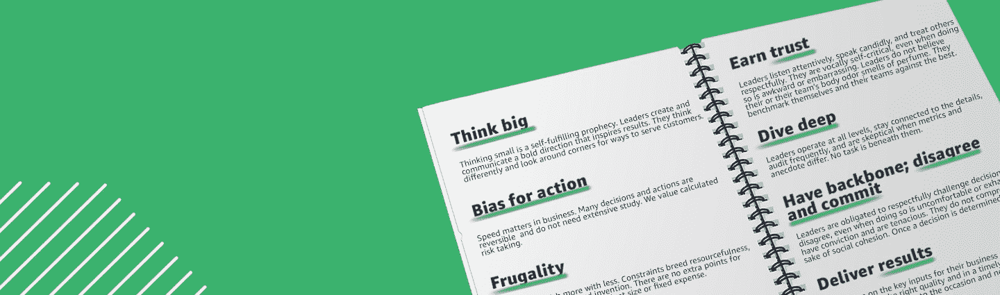

# 如何获得网络安全工作——招聘经理的建议

> 原文：<https://www.freecodecamp.org/news/how-to-get-a-cybersecurity-job-tips-from-hiring-manager/>

网络安全是技术发展最快的领域之一。预计到 2021 年底，将有 350 万个职位空缺，自 2011 年以来，T2 的失业率为 0%，2020 年的支出将达到 1230 亿美元(T4，T5)。

无论你是一名应届毕业生，还是正在寻求职业转变并获得其中一份工作，知道如何在面试中最好地定位自己可以给你带来优势。

我从事网络安全工作已经超过 10 年，专业是商业信息系统和古典语言&文学(我讨厌数学，所以计算机科学作为一个专业已经过时了)。你不需要计算机科学的学术背景来开始你的网络安全，你只需要好奇和学习。

以下是我总结的 10 条建议，可以帮助你为自己的第一份或下一份网络安全工作做好准备。

## 0.申请工作

忘记招聘启事上列出的资格(嗯，可能不完全是)。这份工作看起来有趣吗？你愿意在公司工作吗？你有一些标准吗？**那就申请吧！**

我经常看到非常合格的人不申请工作，因为他们觉得他们不会满足列出的每一个标准。但是如果你认为你能满足某些要求，那么就申请吧，至少要有一次对话。

招聘经理通常会在职位描述中列出他们能想到的所有要求，而不是职位所需的最低要求。完全忘记学位要求——世界上一些最大的公司不再要求学位了。

## 1.加入网络安全社区

加入当地的聚会团体，或者参加夺旗比赛，比如由国家网络联盟主办的比赛。这些活动对初学者和有经验的人都开放，并有助于展示您对网络安全发展的热情和承诺。

我经常指示我们的招聘人员，在他们看到的任何简历中，突出显示候选人参加过网络安全活动的地方。

在我进行的每一次面试中，我总是会问候选人如何跟上网络安全的发展——这是一个谈论你的阅读清单、项目以及你参加的活动和团体的好时机。

## 2.做你的研究

我看到候选人脱颖而出的一个方面是，当他们证明他们研究过我的公司，以及我的公司所在的行业。

每个候选人都应该准备好回答“你认为我的公司面临什么威胁，你会给领导层什么建议来减轻这些威胁？”。更好的是，如果你在面试前知道面试官的名字，花些时间在 LinkedIn 上研究他们，了解他们的背景。

我进行的最好的面试之一是，一位候选人在面试前实际上对我的公司进行了一些考察。他们在 Shodan、Google 和其他渠道查找我公司的信息，以了解潜在的曝光率和对我们公众形象的理解。

*注意:请不要试图在面试时主动扫描公司的基础设施和报告漏洞。这种活动充其量处于合法性的灰色地带，可能不会让面试官喜欢你。*

## 3.跟上时事

我面试的任何候选人都应该能够告诉我网络安全最新趋势的基本信息。这包括能够讨论什么是“ [WannaCry](https://www.csoonline.com/article/3227906/what-is-wannacry-ransomware-how-does-it-infect-and-who-was-responsible.html) ”、对最近入侵的想法(例如最近的[网络安全管理软件产品攻击](https://www.businessinsider.com/solarwinds-hack-explained-government-agencies-cyber-security-2020-12))以及关于如何预防、遏制、响应和恢复勒索软件的建议。

根据资历，我可能不期望详细的技术信息，但粗略的了解是必需的。

## 4.展示很重要

虽然这可能会很乏味，但你应该确保定制你的简历和求职信，让你感兴趣的领域与招聘信息保持一致。

根据你申请的工作量身定制你的简历——不要添加一长串不必要的信息。

### 介绍

简历的第一部分，除了你的名字和联系信息，应该是一个简短的介绍性段落，真正向我推销你。解释你能带来什么——这一部分有助于你从那些只列出工作经历而不给出背景的简历中脱颖而出。

### 工作经验

列出你目前的职位，然后往回找。准备好讨论就业中任何明显的差距。

如果你已经在职业舞台上呆了很长时间，你不需要列出每一个职业——10-15 年是一个很好的展示范围。没有人想看十页纸的简历，所以要确保每一个要点都是相关的。

尽可能避免首字母缩略词，尽量为简历上列出的每份工作提供至少三个要点。确保这些项目符号列出了你的成就，并在可能的情况下提供**硬数字**而不是模糊的文字。例如，“实现了 60%的成本节约”听起来比“节约了资金”更好。

语法提示:对你正在从事的工作使用现在时，对所有先前的角色使用过去式。另外，请在你的文字处理程序中使用语法和拼写检查。一份写得很差的简历*经常会在送到招聘经理面前就被拒绝。*

### 专业会员资格、出版物、演讲和认证

如果适用，请使用此部分列出您所属的任何董事会、社区或专业组织，以及您的成员身份(例如，成员、董事、创始人等)。).

这有助于向招聘经理展示你在日常工作之外对社区的参与，总体上让你成为更有吸引力的候选人。

随意添加网络安全组织之外的相关或有趣的成员——比如女童子军的队长或非营利组织的董事会成员。如果你的出版物或演讲可以在网上获得，包括内容的链接。

最后，列出你的认证，包括颁发机构和你何时获得认证。

### 技术

小心这一部分。在这里列出每一个技术术语是很诱人的，但是你应该把重点放在那些你认为会让你成为你所申请职位的资产的技能上。

在这一部分，我最大的烦恼是当候选人写下诸如“OSI 模型”、“TCP”、“IP”、“SSH”、“Windows 操作系统”、“Mac 操作系统”，甚至只是一个安全工具的列表。

当招聘经理看到技术技能部分只列出了安全工具时，他们的第一个想法通常是“如果没有这些工具，这个候选人能胜任吗？”

*注意* : *如果你在*简历*上列出一项技能，准备好讨论它。我自己在一次面试中了解到这一点，当时我被问了一系列关于 Python 语言的非常技术性的问题，因为我把它放在了我的简历上。*

## 5.发展你的硬技能

### 编码/脚本技能

虽然许多职位并不要求，但我确实会关注表明候选人具有某种形式的开发或编码经验的简历。

如果你没有正式的开发经验，但是你可以做一些基本的编码(我所有的编码几乎都涉及到在浏览器窗口中打开 StackOverflow(堆栈流),你绝对应该把它放在你的简历中。

如果你为任何开源项目做出过贡献，或者自己也从事过代码工作，确保这一点也在你的简历中得到强调——这是我试图在简历中寻找的东西。像 [freeCodeCamp](https://freecodecamp.org/) 、 [CodeBashing、](https://codebashing.com)和 [LeetCode](https://leetcode.com) 这样的网站可以帮助提供一个坚实的脚本和编码基础。

### 技术基础

了解系统的工作原理是有效保护系统的基础。根据你申请的职位，确保你能谈论相关的技术，并对与该技术相关的攻击和防御有深刻的见解。

例如，如果我要招聘一名网络安全工程师，我会希望候选人解释什么是 DNS，[它是如何工作的](https://www.verisign.com/en_US/website-presence/online/how-dns-works/index.xhtml)，以及它使用什么协议(UDP。只有当具体使用 TCP 时，您才有资格说 TCP)。

## 6.发展你的软技能

### 通讯技能

沟通好****是任何一个网络安全专业人员能够拥有的最重要的技能之一。大多数组织的网络安全团队规模有限，因此您可能需要与不具备您的技术背景的高层领导交谈。****

****我在任何简历中寻找的一个要素是候选人是否列出了公开演讲活动，例如在一次会议上介绍一个主题。我希望任何团队成员都能够与员工交流，并将复杂的网络安全话题分解为易于理解、可操作的信息。****

### ****领导技能****

****这些技能真的很难写在纸上。然而，我期望任何候选人(最终)都能够领导网络安全倡议和项目。****

****参加面试时，准备好讨论任何项目——无论是你的职业生涯，还是兼职项目或活动(例如，辅导、家教等)——你必须采取主动的地方，以及你从经历中学到了什么。****

### ****组织技能****

****有条理是一个成功候选人应该具备的关键技能。无论你的技术技能有多好，如果你很难在截止日期前完成任务，或者能够完成多项任务(网络安全的节奏很快，很难不间断地专注于一项任务)，那么获得这份工作将会很困难，尤其是在一个小团队中。****

## ****7.展示实践经验****

****申请网络安全工作不需要有正式的职业经验。但是，您可以通过展示您所学的与网络安全相关的项目和技能，让自己在竞争中领先一步。****

****如果你有一个 GitHub 链接到你参与的项目，或者你决定在几个 Raspberry Pis 上测试构建一个 Kubernetes 集群，把它添加到你的简历中吧！****

## ****8.保持你的简历的相关性****

****我经常收到这样的简历，当候选人已经在这个领域工作了 5 年多的时候，简历上列出了完成的与网络安全相关的大学课程。****

****确保你的简历只列出相关信息——虽然它可能不需要与网络安全相关(经验的多样性总是令人愉快的),但大学课程和 GPA 真的不相关，除非你是在申请大学毕业后的第一份工作。****

****虽然我并不认为一份简历无论如何都必须只有一页，但内容不应该让人觉得松散。我很少认为简历需要超过一页，除非你已经在这个领域担任过不同的角色。****

## ****9.专业点****

****总体而言，网络安全往往是一个相对非正式的行业(在数字采访时代更是如此)。然而，第一印象是非常重要的，所以确保在面试时穿着和行为都很专业(如果你也被录用了，那就更好了!)).****

****我见过应聘者穿着脏兮兮的汗衫、不合适的图案 t 恤和其他不专业的服装参加面试。这是你给人留下印象的机会，虽然我不会说你需要穿西装打领带，但至少你应该穿商务休闲装，就像你去办公室时穿的一样。****

****除了穿什么，说话方式也极其重要。我们过去都有过糟糕的经理，或者为糟糕的公司工作过。然而，不要在面试中诋毁以前的雇主或公司。****

****如果有人问你为什么要离开，或者你在工作中遇到了什么问题，最好直接说这份工作“不适合”，然后就此打住。你不希望面试官认为你会这样谈论他们。****

****候选人如何表现自己，以及他们的外交手腕如何，是极其重要的。鉴于许多网络安全团队规模很小，你会发现自己在与高层领导交谈，面试官会留意他们认为你在这些情况下会如何表现。****

****最后，不用说，永远保持礼貌。无论是对人力资源招聘人员、外部招聘人员、面试官还是接待员，都要有礼貌。人们不想雇用他们觉得粗鲁或不尊重的人，也不想和他们一起工作。****

## ****10.星形方法****

****网络安全是一个高风险、快节奏的领域，批判性和分析性思维、自我(你的和他人的)管理、冲突解决和领导力在团队的成功中发挥着关键作用。****

****面试官通常会寻找具有黑客思维的人，这种人具有创新精神，能够用批判性思维来解决问题。****

****准备好讨论你不得不处理冲突优先事项的情况，解决复杂的问题，向非技术观众解释技术信息，甚至讨论你认为你的表现有机会增长的领域。****

****虽然我不会在这篇文章中探讨各种场景，但我寻求的一个关键结果是候选人是否了解如何构建网络安全风险。****

****有时需要承担风险，我们的工作就是提供正确的信息，以便做出明智的决定。候选人分析问题的能力比写在简历上的经历更有价值。****

****尤其是在回答行为面试问题时, [STAR 方法](https://www.themuse.com/advice/star-interview-method)提供了一个很好的框架，说明如何提供答案:****

*   ****描述一下你当时的情况。****
*   ****你在执行什么任务，期望的目标是什么？****
*   ****描述你为解决这种情况所采取的行动。具体一点，专注于你的贡献。****
*   ****你行动的结果是什么？****

****网络安全领域的工作很多，涵盖了从技术、动手操作键盘到治理和设计等众多专业领域。使用这些提示来获得你的完美工作，欢迎来到网络安全！****

## ****进一步阅读****

****[Cyber Security Skills Roadmap | SANS Institute: Cyber Security Skills RoadmapDesign your cyber security training path with the SANS interactive cyber skills roadmap!The SANS InstituteSANS Institute: Cyber Security Skills RoadmapCybersecurity Skills Roadmap](https://www.sans.org/cyber-security-skills-roadmap)********[Category: How to Break Into SecurityIf you’ve ever wanted career advice on how to make a shift into the security industry, look no further.](https://krebsonsecurity.com/category/how-to-break-into-security/)********[How To Start A Career in Cybersecurity | Hacking Tools & Growth Marketing ToolsWelcome To Our Resource Designed To Help YOU Get Started in Cybersecurity In this resource, you’ll learn that you can absolutely have a career in…Henry, aka “HMFIC”Hacking Tools & Growth Marketing Tools](https://www.concise-courses.com/how-to-start-your-career/)********[10 Do’s and Don’ts for Writing a Winning Cybersecurity ResumeYou can land a job in cybersecurity even if you didn’t study it. Here are 10 do’s and don’ts for writing a winning cybersecurity resume, even if you’re not a traditionally qualified candidate.Jasmine HenrySecurity Intelligence](https://securityintelligence.com/articles/10-dos-and-donts-for-writing-a-winning-cybersecurity-resume/)********[In-person interviewNOTE: Amazon is closely following the Coronavirus Disease (COVID-19), and implementing processes that promote candidate and employee safety. Out of an abundance of caution, our default process for on site interviews will now be conducted virtually. Learn more about our virtual interview process. …amazon.jobs](https://www.amazon.jobs/en/landing_pages/in-person-interview)

Great advice for interviewing anywhere****