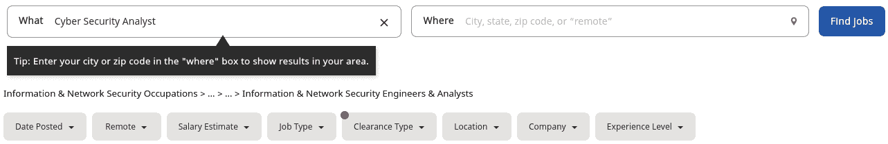
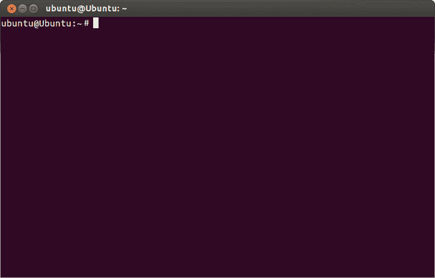
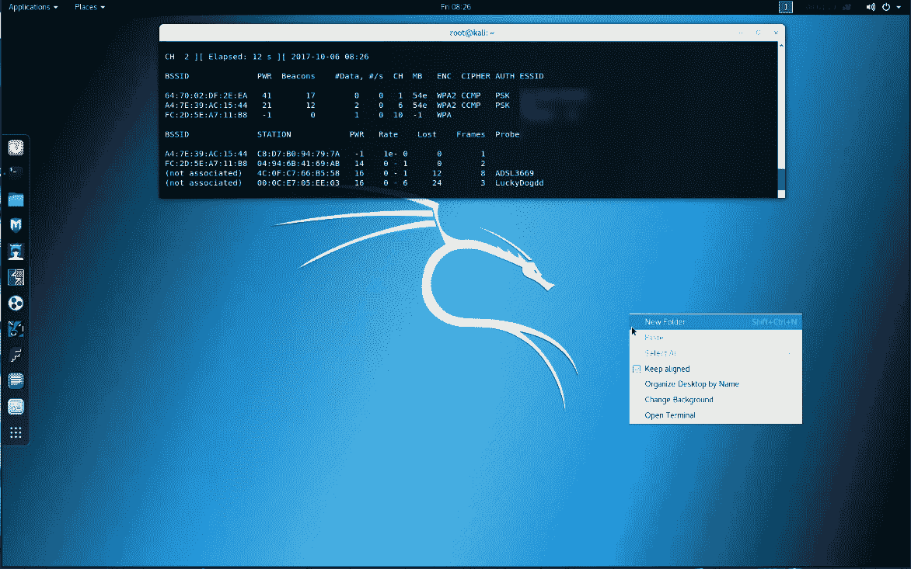

# 如何在 2021 年获得一份网络安全工作

> 原文：<https://www.freecodecamp.org/news/how-to-get-a-cybersecurity-job/>

你可能听说过一些大型网络攻击，比如最近发生的太阳风黑客攻击。

或者你可能已经读到了其他对发电厂或水处理厂的未来攻击，这些攻击被远程修改以使它们离线。

随着世界日益数字化，网络攻击带来的风险和回报也与日俱增。

这反映在对网络安全角色的需求上——即使是入门级的网络安全分析师角色，年薪也往往超过 10 万美元。

But at the moment, There is an estimated current gap of [3.5 million unfilled cybersecurity roles](https://cybersecurityventures.com/jobs/) .

网络安全是一个有利可图和受欢迎的职业道路，看起来不会很快消失。然而，与通往数据科学和软件工程的老路相比，进入这一职业的有用提示有点罕见。

我花了一些时间在我自己的创业公司从事网络安全方面的工作，我还帮助发起了一个网络安全训练营。根据我的研究，以及与我共事的人的一些坦率见解，如果你正在考虑你的网络安全前景，这里有一些有用的提示。

## 寻找入门级或中级蓝色团队角色

Screenshot of Indeed Search for Cyber Security Analyst (provided by author)

蓝队和红队角色的区别是许多网络安全职业生涯的关键转折点。

你可能会对黑客窃听的故事和令人难以置信的黑客天才进入五角大楼系统的电影着迷。但现实是，入门级的网络安全角色通常涉及获得防御经验(“蓝队”)和防止攻击，而不是发动攻击。

您将从分析师的角色开始，与公司合作防止攻击，而不是大部分时间模拟或尝试攻击。

如今，大多数涉及渗透测试的[“红队”/攻击性角色](https://www.springboard.com/blog/cybersecurity/red-teaming-blue-teaming-cybersecurity/)都由代理或外部团队处理。即使是雇佣内部团队来做这项工作的公司，也希望你在成为进攻团队的一员之前，已经打了几年防守战。

与攻击性方面相关的认证，如[认证道德黑客](https://www.eccouncil.org/programs/certified-ethical-hacker-ceh/)(CEH)，往往是以多年的工作经验为先决条件的。例如，你需要至少 2 年的安全相关经验，才能通过 CEH 考试。

如果你有军事背景，像微软的[这样的倡议将帮助你在入门级网络安全角色中获得成功，并将帮助你从军事生活过渡到平民生活。](https://military.microsoft.com/2017/02/mssa-expands-to-offer-cybersecurity-training-to-service-members/)

## 协会内的网络

当地的专业协会和聚会是了解整个网络安全社区的好方法。把它作为开始和建立网络安全知识和网络的重要一步。

这也是发展你软技能的好方法——网络安全角色的一个关键需求是与多个团队沟通。

下面的文章列出了与网络安全相关的[协会](https://cybersecurityventures.com/cybersecurity-associations/)，还有一个章节专门介绍了致力于让更多女性参与网络安全的[协会](https://cybersecurityventures.com/list-of-women-in-cybersecurity-associations-in-the-u-s-and-internationally/)。

## 证书是好的，但是经验比黄金更有价值

有一堆认证，从 [CompTIA 的 Security+](https://www.comptia.org/certifications/security) 到其他认证，将有助于表明你对网络安全工作的准备情况。有些是入门级的，需要 IT 能力[，比如 A+](https://www.monster.com/career-advice/article/a-certification) 。但有些会要求你有网络安全方面的工作经验(比如 CISSP)。

这是一个先有鸡还是先有蛋的问题，你可能会想——如果你首先需要工作经验来获得这份工作，那么你如何获得工作经验呢？

在这里，相邻的工作经历往往会有所不同。许多人从 IT 角色过渡到网络安全，如网络管理、系统管理或 IT 服务台，这是一个入门级的角色。你可以在这里获得经验，然后过渡过来。

还有为退伍军人和有执法背景的人量身定制的项目，以进入网络安全领域。最后，有许多网络安全实习机会可以弥补这一差距——尽管有了合适的支持、培训和合适的经验，你可以直接跳到初级分析师岗位。

## 寻找安全运营中心分析师角色

[SOC 分析师角色](https://blog.eccouncil.org/become-a-soc-analyst-job-role-expectation-and-salary/)是打入网络安全行业的好方法。安全运营中心需要分析师来分析不同的威胁。这一初级职位的平均薪酬为 71，000 美元，在进入更高级的职位之前，这是一个展示你能力的好方法。

你需要技术知识，但这里要求的经验深度并不深。这标志着它是自学成才的开发人员的一个很好的方式，他们熟悉 SQL、Python、web 应用程序和终端，可以进入网络安全角色并开始他们的职业生涯。

就像我们之前谈到的，这是一个防御性的“蓝队”角色，它将帮助你开始更高级的角色。这里有一个[职位描述示例，概述了角色](https://jooble.org/job-description/math/soc-analyst/)。

从工作描述中可以看出，你需要熟悉特定行业工具，如 SEIM(安全信息和事件管理工具)和 SOAR(安全协调、自动化和响应工具)。您还需要命令行和脚本的经验，以及网络安全框架的知识。

虽然这一特定大纲要求 2 年以上的安全运营相关经验，但也有不少不需要太多入门级经验的。

SOC 分析师角色通常被认为是一个很好的入门级职位，适合那些希望更深入地转向网络安全职业的人。

## 练习您的脚本技能，尤其是在 Linux 上

Image from Wikimedia Commons

为了在网络安全方面完全有效，了解如何编码和系统地查看日志是至关重要的。

对于活跃的大型企业网站，每分钟可能会有数千甚至数万次点击。筛选并能够识别威胁行为者需要一些编程知识来破译这一切。

如果你想进入网络安全领域，了解如何以编程方式工作并分析随之而来的大量数据是很好的。

这将包括熟悉终端、使用 Python 和 shell 脚本以及其他编程技能。你会想要考虑部署能够准确可靠地筛选数据的实时算法。

一般来说，您需要足够强大的 Linux 命令或其他终端命令来完成以下任务:

1.  查看关键系统信息和状态
2.  能够检测正在运行的进程和程序，并启动/停止它们
3.  安装软件并能够安全地更新软件(可能需要配置自动安装)
4.  使用 SSH 等工具连接到远程系统
5.  浏览事件日志，能够系统地了解系统发生了什么
6.  以这样一种方式设置事件日志，您可以最有效地响应威胁
7.  查看网络如何设置，并根据需要进行更改，还可以根据需要对系统进行更改

除了这些技能，几个编程支柱会给你很大帮助。

正则表达式是在大块代码中寻找模式的一种方法，正则表达式的知识将快速帮助您浏览日志，找出正在发生的事情。BASH 脚本有助于以更系统的方式与终端交互，

你可以通过[玩游戏](https://mediacenter.ibm.com/media/%22Cybersecurity+OpsA+Terminal%22+the+Cyber+Breach+Video+Game/1_61aqcyca/163777102)或者[通读资料](https://www.comptia.org/blog/5-linux-skills-for-cybersecurity-professionals)来提高这些技能。如果你在 Mac 或 Linux 电脑上，你已经有了一个包装成默认应用的类似 Linux 或 Linux 终端。不然可以用[微软 Powershell](https://docs.microsoft.com/en-us/powershell/scripting/overview?view=powershell-7.1) 来练习。

也有专门针对终端的课程，从 Udemy 上的[柯尔特·斯蒂尔课程](https://www.udemy.com/course/the-linux-command-line-bootcamp/)到专门针对该主题的 [Codecademy 的互动专业课程](https://www.codecademy.com/learn/learn-the-command-line)。或者，如果你更喜欢一种更系统的方法，将这些技术技能以及你需要考虑的工具和合规措施结合起来，那么看看类似于[跳板的网络安全训练营](https://www.springboard.com/courses/cyber-security-career-track/)。

## 了解常用的网络安全工具

Image of Kali Linux from Wikimedia Commons

有一套网络安全专用工具，如 [Kali Linux](https://www.kali.org/) ，对任何有抱负的分析师都很有用。使用它们可以让您对现代网络安全体系进行大量的实践和理解。

以下是网络安全分析师应该熟悉的几个工具示例:

1.  NMap 是一个开源工具，可以让你轻松地映射出不同的网络端口，并允许你进行基本的漏洞扫描。
2.  Wireshark 让你从网络中嗅探信息包。您可以使用它来分解实时网络数据，为您提供网络内数据传输的详细信息。
3.  开膛手约翰是一个密码破解程序，用于检测何时存在脆弱的 Unix 密码。这是一项重要的检查，以确保具有管理员权限的用户拥有安全的帐户，从而使外部攻击者无法获得升级攻击所需的系统权限。
4.  Snort 是一款开源软件，可以让你检测网络入侵。它可以进行实时流量分析，并判断入站请求中是否有恶意软件，使您可以更轻松地保护网络免受恶意行为者的攻击。
5.  Metasploit 允许对来自 NMap 和 Wireshark 等工具的结果进行更深入的分析。虽然它主要用作渗透测试工具，但您可以用它来为良好的网络防御奠定基础。它曾经是开源的，完全免费，直到一家公司收购了该软件。但是，您仍然可以使用免费的社区版来练习熟悉它。

## 了解常用的合规框架

网络安全不仅仅是一项技术努力。你必须理解不同的法规遵从性框架，并严格遵循它们。

毕竟，网络安全不仅仅是技术技能。它是关于标准和审计，以及定义过程，以便安全可以有效地应用于整个组织。

您将希望熟悉一些通用的合规性框架以及特定于行业的框架，尤其是对于高度敏感和受监管的行业，如军事或卫生工作。

以下是一些需要考虑的因素:

*   [CMMC](https://www.acq.osd.mil/cmmc/) ，专门针对那些想和美国国防部打交道的军事承包商。
*   OWASP 十大安全风险列表是公开发布的十大网络应用安全风险列表——这是思考网络安全风险的一种很好的结构化方式。
*   [HIPAA](https://www.hhs.gov/hipaa/index.html) 管理医疗保健行业的数据安全实践。违反美国法律规定的这些标准会受到严厉的罚款和后果。
*   GDPR 是欧盟通过的一套数据和网络安全法律，推动了网站收集和处理数据的标准。
*   [SOC-1 和 SOC-2 审计](https://kirkpatrickprice.com/video/understanding-your-soc-1-audit-report-what-are-control-objectives/)主要集中在向大型银行和其他金融机构销售产品的初创公司或其他公司。检查具体的规则和流程，以便向大型金融机构保证他们正在与可信的合作伙伴打交道。

关于这最后一点，跟上不断发展的技术标准、工具和合规性框架至关重要。

虽然当涉及到新的法律和新的攻击应对措施时，最值得关注的可能是新闻，但对技术更新、合规更新和社区更新的全面网络安全兴趣是真正打造有意义和持久的网络安全职业生涯的最佳选择。

在这方面可以提供帮助的资源有时事通讯，如[安全周刊](https://securityweekly.com/)和 [Sophos Naked Security](https://nakedsecurity.sophos.com/) 网站，以及一般新闻网站，如[黑客新闻。](https://thehackernews.com/)

## 包扎

拥有技术兴趣和一些编程技能并不仅仅局限于数据科学、web 开发和 IT 领域。作为一名网络安全分析师，你可以保护重要的系统和数据，并过渡到一个利润丰厚、面向未来的网络安全职业。

如果你觉得需要行业专家一对一的指导和招聘经理设计的课程，那么 [Springboard 有一个网络安全训练营](https://www.springboard.com/courses/cyber-security-career-track/),它有一份工作保证，确保你可以利用这一切实有用的建议在网络安全领域开始新的职业生涯。