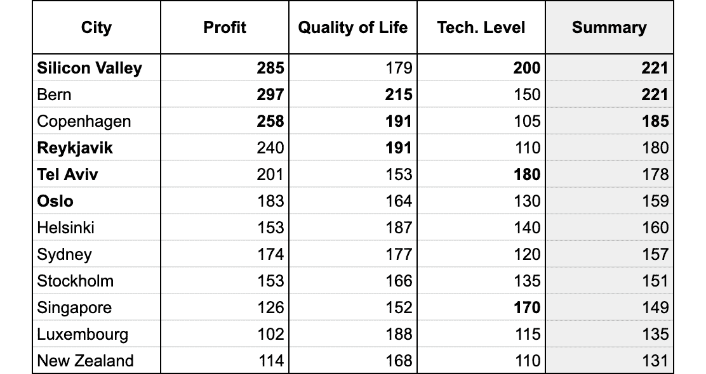
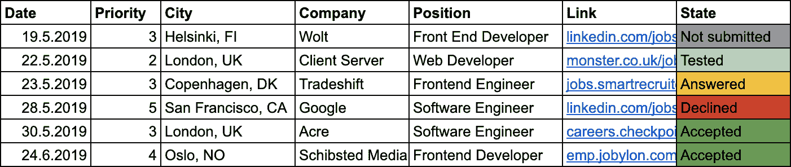

# 如何在国外获得一份开发者的工作

> 原文：<https://www.freecodecamp.org/news/how-to-get-a-developer-job-abroad/>

许多人梦想在国外从事他们的行业。但他们通常不确定如何轻松地做到这一点，或者如何吸引正在招聘的公司的兴趣。

我正在寻找一个软件工程师的职位，在我的招聘过程中，我每天都会接到大约三个潜在公司的电话。幸运的是，我最终有很多选择。

所以让我给你讲个故事，这样你就可以从我的成功和错误中吸取教训。

在这篇文章中，我将分享一些关于你为什么以及如何在职业生涯中采取下一步行动的建议，尤其是如果你没有被束缚在一个特定的位置。

拥有优秀产品或服务的强势公司有很多强有力的候选人可供选择。但是我也会告诉你如何让自己成为一个强有力的候选人。

## 你为什么想出国？

如果你不确定如何回答这个问题，或者你的“为什么”不够有力，你很可能会在被雇用几周或几个月后辞职。

花点时间深入考虑这个问题。有多种原因可以解释你为什么想搬到国外去工作。

*   你可能会找到更多的工作机会
*   你可能想在一个冲突较少的国家工作
*   你也许能在不同的地方拿到更高的薪水
*   你可能会觉得你更适合那里
*   或者你可能喜欢在国内或周边旅游

原因有很多——只要确保你知道自己的就行了。

知道自己为什么要去某个特定的公司工作，也是很有帮助的。他们的“为什么”和你的“为什么”相符吗？做你的研究来找出确切的答案。

## 简单的方法还是正确的方法

### 简单的方法

首先，让我们来看看如何让这个过程对你来说更容易。如果你在国外学习过，在“工作和旅行”项目中工作过，或者从事类似的工作，那么适应国外的工作会容易得多。

你会有更深刻的经验去说其他语言，旅行，接触不同文化的人，从零开始建立社会生活，学习不同的法律。

如果你在你学习过的国家申请工作——或者任何有相似文化的地方——应该会更容易。与同样申请国外 It 工作的人一起完成整个过程对我也很有帮助。

### 正确的方式

但是最后真的要看你找什么，为什么要出国。

也许你正在寻找一个大的挑战，而不是一个安全的旅程。所以，多想想什么符合你的要求，然后找出如何在不牺牲你的需求的情况下让它变得更容易。我认为这是正确的处理方式。

对我来说，我想直接与不同国籍和思维方式的高技能和快速学习的人一起工作。因此，我更关注多样性，而不是相似性。

## 评估你自己

重要的事情先来:你需要分析你想要的职位所需的技能，不管你是否想出国工作。

你正在寻找一个要求有点超出你能力的职位吗？花一两年的时间学习这些技能，当你准备充分的时候再试一次。

这是一个在某个领域需要高水平专业知识的职位，一个市场上不经常出现的职位吗？确保你的技能与这些要求非常匹配。

在最初的几个月里，你会有很多机会证明你有能力胜任这个职位，并与公司达成一致。

### 为自己设定雄心勃勃的目标

这只是你现在在哪里以及你想去哪的问题。如果你想成为一个更强的团队中的一员，拥有比现在更高的标准，那么在开始面试之前增加你的知识和技能是很好的。

请记住，一些招聘过程可能需要 5-8 轮，他们会从许多不同的角度测试你。所以别忘了分析每个具体公司的招聘流程。

这部分可能需要几个月。在此期间，你可以从像 Udemy、T2、哈佛大学或 T4 Coursera 这样的地方学习一些在线课程。

然后你可以在像 [Topcoder](https://www.topcoder.com/) 和 [HackerRank](https://www.hackerrank.com/) 这样的网站上继续[学习挑战](https://www.topcoder.com/thrive/articles/List%20of%20awesome%20learning%20resources)。

最后，你可以开始准备一些网站上常见的面试问题，如[、平衡职业](https://www.thebalancecareers.com/)、 [FlexJobs](https://www.flexjobs.com/) 和 [HubSpot](https://blog.hubspot.com/) 。

### 建立你的比率或理想工资

更客观地评估自己的最简单的方法之一就是让一位资深的前同事来评估你的表现。

使用诸如 [Devskiller](https://devskiller.com/) 和 [Codility](https://www.codility.com/) 这样的网站来测试自己也是一个好主意。在这种情况下，你可能会发现你的表现比你预期的要好，能够在面试中获得更好的合同和薪水。

说到面试，你很可能会被问到你对薪水的期望。这个问题可能很难回答。

许多潜在员工使用诸如“布拉格一名开发人员的平均工资”等关键词在互联网上搜索平均工资。然后，他们查看 [Glassdoor](https://www.glassdoor.com/) 、 [PayScale](https://www.payscale.com/) 、 [Jobindex](https://www.jobindex.dk/) 或 [Reddit](https://www.reddit.com/) ，根据他们多年的经验，他们试图在一个想象的尺度上找到他们的价值，其中最低代表初级，最高代表首席开发人员。

聊胜于无，但不一定符合你的真实价值。大多数时候，你必须自己想出来。

## 做你的研究

### 生活质量

根据你打算待多久来考虑你的优先事项。在半年合同和长期雇佣的情况下，我会对它们进行不同的设置。

我在基于以下因素和价值观的国家寻找机会:

1.  直觉
2.  利润
3.  生活质量
4.  工作文化
5.  经济增长(国内总产值)
6.  技术水平
7.  旅游和自然

分析与你职业相关的国家需要时间。然而，如果你正考虑在国外工作几年，那么几天或几周的研究就能给你带来无比高的长期幸福值。

为了帮助自己找出最适合我的地方，我收集了数据，并把它放在一个电子表格中。

评分最高的位置(表。1)是基于我的主观偏好，所以我会建议你自己制作电子表格，因为你的需求和偏好可能会非常不同。

Tab. 1 Results of analysis for developers

你可以在 [Numbeo](http://numbeo.com/) 、 [Expatistan](https://www.expatistan.com/cost-of-living/country/ranking/) 、 [WorldData](https://www.worlddata.info/cost-of-living.php) 等网站找到一些指数，比如生活质量或成本。索引必须采用相同的标度，例如，1–100。然后，您可以根据您的优先级将每个索引相乘，例如 1–3。

你应该为招聘人员和公司准备好你计划申请的所有国家的期望工资，以当地货币计算(包括月工资和年工资)。

然后，总工资和净工资都需要转换为本国货币，以计算国家比较电子表格的利润指数。1).

利润可以通过你期望职位的每月预期净工资除以特定国家的每月总成本来计算。利润指数可以用比较法来创建。

### 进入壁垒

检查可能存在的进入壁垒也非常重要。你也应该了解当地的法律。我想强调其中一些可能令人惊讶的领域。

1.  签证要求
2.  赞助要求
3.  语言障碍
4.  无效的驾照
5.  因短暂停留而错过养老金
6.  第一年的无薪假期
7.  开立银行账户的问题
8.  新公民的医疗保健费用更高
9.  税额和提交纳税申报表的难度

至于这些亮点，我想提一些具体的用例。

例如，假设你被一家德国公司雇佣。你可能不得不依赖英语(根据要求)，但是你所有的同事都说德语，即使这违反了公司的政策。这和公司的民族多样性有关。

当我住在美国、芬兰或挪威时，总是需要几个月才能拿到社会保险号。有了这份文件，往往能让你的生活更轻松。例如，挪威的 [Nabobil](https://nabobil.no/en) 是一个让你更舒适、更便宜地租车的应用程序。

此外，即使你使用 Revolut 或类似的应用程序进行货币兑换，在短期内仍然会花费很多。

或许与其他问题相比，纳税申报似乎并不重要。但如果你曾经在荷兰花了整整一周的时间处理税务，那么你就会知道半年合同的成本有多高。

### 公司研究

将你的优先事项与公司的优先事项进行比较。是快速成长的团队吗？平均工资多少？你认为你会融入公司文化吗？

以上所有的和更多的都值得考虑，但是你应该决定哪些对你和你的目标是重要的。

例如，我问自己以下问题:

*   我能为这家公司做些什么？他们的期望是什么？
*   我在那里能学多快？我将直接与之共事的人资历如何？
*   我将从事什么项目？他们用什么技术解决什么问题？
*   就时间而言，他们对项目开发的平均估计是多少？这些项目评估有多准确？有多少用户使用该应用程序？

你也可以使用多种策略来申请工作。例如，你可以向许多公司提交申请，以增加你的选择。在这种情况下，跟踪您的应用程序是一个好主意(表。2).

Tab. 2 Companies in an interview process

因为我和许多不同的公司打交道，所以我习惯记下基本信息。

但是也许你很挑剔，你不想申请一长串的公司。

在这种情况下，首先尝试在你目前的职位上获得足够的经验，并展示你的成果。如果你没有脱颖而出，大的、令人向往的公司很可能不会注意到你的申请。

## 面试过程

许多人把参加工作面试比作约会。如果你离开约会场所几年后去参加第一次约会，你可能不会很自信。你会紧张，整个约会都会不愉快。

求职面试也是一样。把你的第一次面试安排在你想工作的公司，然后再安排那些你想工作的公司。

此外，你的面试经历部分取决于你申请的职位。对于销售人员来说，这可能是一件大事，因为他们已经随着时间的推移发展了软技能。就像他们以前多次做过的那样展示自己。

但是，对于那些自信地展示他们的编码技能，却不善于在个人面试中展示自己的开发人员，该怎么办呢？

意识到你花了半年时间提高技术知识，却忘了练习回答诸如“说说你自己吧”这样的问题，这将是很不幸的。

对于大公司来说，如果你已经到了招聘过程的最后阶段——大部分面试都是在办公室进行的，这是一个很好的信号。

即使你没有通过面试，你也可以在一次商务旅行中安排多次面试。在其他公司的面试中，你通常必须在实际面试前进行其他步骤，但现在你可以通过拜访其他候选人留下良好的第一印象并提高你的机会。

### 与招聘人员打交道

一些招聘人员试图强迫开发人员受雇于与其领域和需求无关的职位。不幸的是，他们可能只是根据你的社交媒体简介标题给你发邮件。

但是也有一些人会在你的求职信中读到你的期望，并提供一些相关的东西。

即使你没有得到一份工作或选择一家特定的公司，与招聘人员保持联系也是有用的。尤其是如果你决定将来换工作或者在国外找工作，你可以联系多个人力资源专员，获得额外的帮助。

最有可能的是，它不会花费你任何东西，因此你也不会有任何损失。在决定不回应相关的专业邀请之前，请记住这一点。

### 获得有竞争力的报价

即使你得到了一家公司的最终报价，你仍然有可能得到其他公司的更多报价。你听说过竞争性报价这个术语吗？就招聘流程而言，流程如下:

你完成了另一家公司的职位面试，在那里你得到了更高的薪水。但这不是你最喜欢的公司。因此，你将最初的电子邮件连同提议一起发送给你选择的公司，看看你是否能争取到更高的薪水(或者你想要的任何东西)。

有时这可以带来更好的利益或更多的钱，分享这一要求通常不会让你有任何损失。

## 结论

你不需要承诺在国外工作一辈子。尝试一下，如果不成功，你可以随时后退一步。这就是工作中试用期存在的原因。

我听过很多故事，比如“我年轻时很害怕，现在有太多的承诺”——所以不要错过。

现在让我们再一次总结这个过程，看看它不是火箭科学。

1.  决定你为什么想去国外工作
2.  根据停留时间考虑与国家相关的要求，并对其进行优先排序。
3.  通过比较需求找到你想去的地方，并以法律和限制为重点做更深入的研究。
4.  通过提升你的软技能和硬技能来准备面试。
5.  研究公司并申请。
6.  发送有竞争力的报价并**获得您应得的东西**！

请记住，这个过程可能需要几个月的时间。在此期间，你可以从像 Udemy、T2、哈佛大学或 T4 Coursera 这样的地方学习一些在线课程来增加你的技能。

如果你需要一些提高学习技能的建议，你可以看看我的另一篇关于如何在学习中取得成功的文章。

如果你喜欢这篇文章，你可以在这里查看我的其他故事。

游牧民族朱利安在 Unsplash 上拍摄的封面照片。