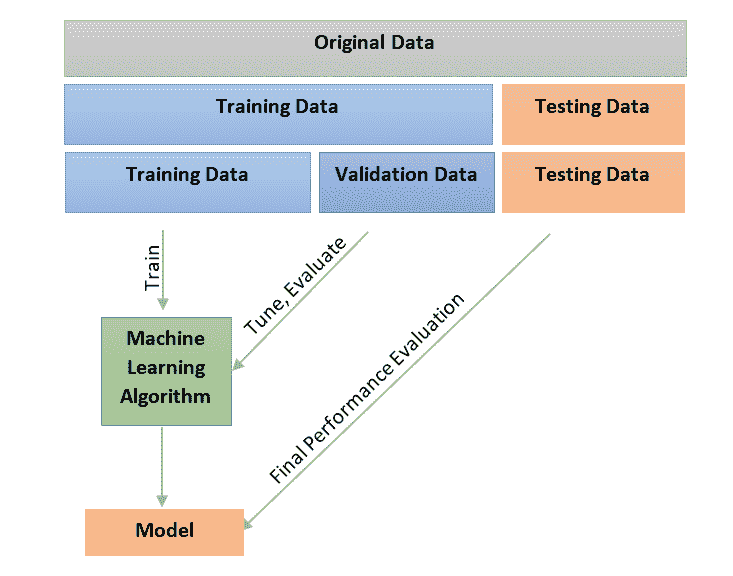
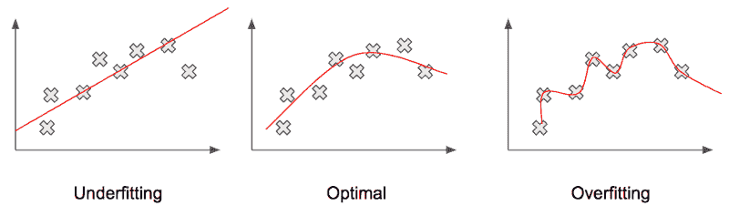
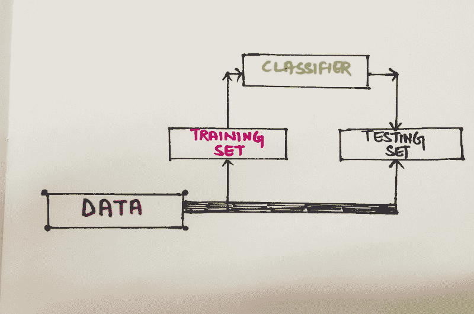
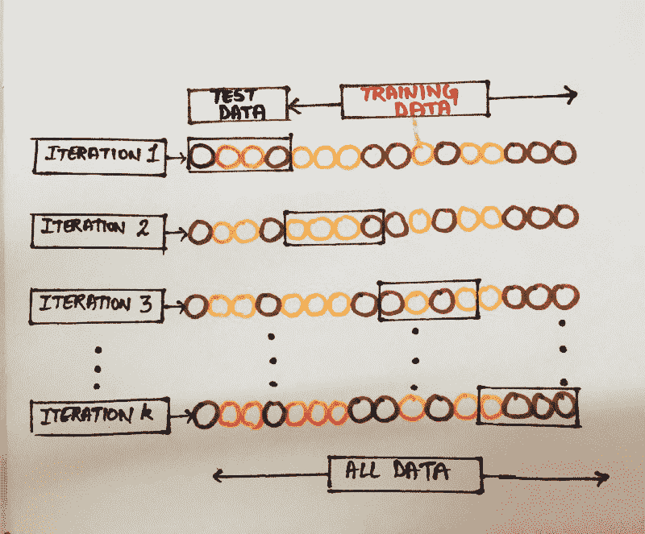

# 如何掌握机器学习中的交叉验证

> 原文：<https://www.freecodecamp.org/news/how-to-get-a-grip-on-cross-validations-bb0ba779e21c/>

Shruti Tanwar

最近，我有机会参与构建一个旨在加速企业采用 ML/AI(机器学习/人工智能)的产品。在开发如此令人兴奋的产品的过程中，我学到了一些东西。

虽然 ML/AI 是一把太大的伞，无法在一篇文章中涵盖，但我借此机会阐明其中一个概念，这将帮助您建立一个有弹性的预测模型。一个能够在现实世界中可靠运行的模型，并且对看不见的数据表现“公平”。

你永远无法 100%确定你的机器学习模型的行为。总是有改进的空间，或者进步，或者某个调整？。仅仅让模型适合您的训练数据，并期望它在现实世界中准确地执行，将是一个糟糕的选择。在将模型部署到生产环境之前，需要考虑某些可以保证或至少向您保证合理性能的因素。

您需要确保您的模型了解数据中的不同模式，而不是欠拟合或过拟合，并且模型的偏差和方差在较低端。

"**交叉验证** " ✔是一种帮助你验证模型性能的技术。这是一种统计方法，用于评估机器学习模型的技能。这是给你的定义:

> **[交叉验证](https://en.wikipedia.org/wiki/Cross-validation_(statistics))** ，有时也称为**旋转估计**，或**样本外测试**是各种类似的[模型验证](https://en.wikipedia.org/wiki/Model_validation)技术中的任何一种，用于评估[统计](https://en.wikipedia.org/wiki/Statistics)分析的结果将如何推广到独立的数据集。它主要用于以预测为目标的设置中，人们希望估计[如何准确地](https://en.wikipedia.org/wiki/Accuracy)预测模型[在实践中的表现。](https://en.wikipedia.org/wiki/Predictive_modelling)

简单地说，上述术语的实际实现如下:

为模型定型时，在定型开始前会删除一些数据。
完成训练后，被移除的数据用于测试学习模型的性能，并调整参数以改善模型的最终性能。

这是被称为*交叉验证*的整个评估方法系列的基本思想。

Model validation and tuning lifecycle.

在讨论验证技术之前，让我们快速看一下上面使用的两个术语。过配合和欠配合。模型的欠拟合和过拟合究竟是什么，它如何影响模型在真实数据中的性能？

通过下图我们可以很容易的理解。

当模型在训练数据上表现不佳时，称其为**欠拟合**(高偏差)。正如我们在左图中看到的，这条线没有覆盖图上的大多数数据点，这意味着它无法捕捉输入(比如说`X`)和要预测的输出(比如说`Y`)之间的关系。

一个**过拟合**模型，(高方差)另一方面，在训练数据上表现良好，但在评估数据上表现不佳。在这种情况下，模型正在记忆它已经看到的数据，而不是学习，并且不能推广到看不见的数据。

右图表示过拟合的情况。我们看到预测线覆盖了图表中的所有数据点。虽然这看起来似乎应该使模型工作得更好，但遗憾的是，这与实际情况相去甚远。由于其复杂性，覆盖所有点的预测线(也包括噪声和异常值)会产生较差的结果。

让我们继续讨论各种类型的交叉验证技术。

#### **维持方式**

最简单的交叉验证。这里，数据集被分成两组，称为训练集和测试集。模型只允许适合训练集。然后对测试集中的数据进行预测(这是模型从未见过的)。它所产生的误差被聚集以给出用于评估模型的平均绝对测试集误差。

Holdout cross-validation

这种类型的评估在一定程度上取决于哪些数据点最终出现在训练集中，哪些数据点最终出现在测试集中，因此可能会影响评估，这取决于如何进行划分。

#### **K 倍交叉验证**

最流行的验证技术之一是 K-fold 交叉验证。这是由于其简单性，与其他方法(如简单的训练/测试分割)相比，它通常产生更少的偏差或更不乐观的模型技能估计。

这里，数据集被分成`k`个子集，并且保持方法被重复`k`次。每次， *k 个*子集之一作为测试集，其他`k-1`子集构成训练集。然后计算所有`k`试验的平均误差。

一般程序如下:

1.  随机打乱数据集，并将其分成`k`组
2.  将一组作为维持或测试数据集，其余组作为训练数据集。
3.  在训练集上拟合模型，并在测试集上评估它。
4.  保留评估分数并丢弃模型。
5.  使用模型评估分数的样本总结模型的技巧。

K-fold cross-validation

与其他方法相比，这种方法的优势在于数据如何划分无关紧要。每个数据点将恰好出现在测试集中一次，并将恰好出现在训练集中`k-1`次。随着`k`的增加，我们看到结果估计的方差下降。

这种方法的一个缺点是训练期间需要计算。训练算法必须从零开始重新运行`k`次，这意味着要花费`k`倍的计算量来进行评估。

#### **留一交叉验证**

留一个有点像 K 重交叉验证的表亲，其中`k`等于集合中数据点的总数`n`。这基本上是 K 倍验证的逻辑极端版本。它的实际工作方式是在每次迭代中只留下一个数据点，并使用该数据点进行预测。

除了一个点之外，函数近似器在所有数据上被训练了正好`n`次，并且对该点进行了预测。如前所述，计算平均误差并用于评估模型。

好了，我们到此为止。希望你喜欢阅读它，就像我喜欢创作它一样。❤️让我知道你的想法？，评论？还是建议？在下面的评论里。当你在做这件事的时候，为什么不去看看我和我的团队在 T2 的 sky [l.ai 做了什么，然后和我聊聊或者分享你的反馈。干杯。](https://skyl.ai/)