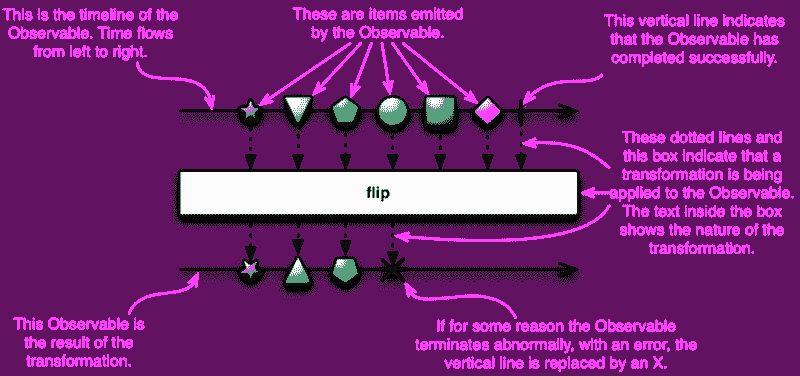
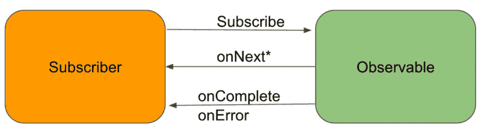

# 如何掌握 RxJava 例程的四个构造

> 原文：<https://www.freecodecamp.org/news/how-to-get-a-grip-on-the-four-constructs-of-an-rxjava-routine-32addd16349e/>

作者:阿尤施·贾恩

# 如何掌握 RxJava 例程的四个构造


> [*本文原贴于此*](https://www.ayusch.com/understanding-rxjava-basics) *。*

RxJava 已经成为 android 开发武库中最重要的武器。2019 年的每个开发者都必须开始在他们的应用中使用它，如果他们还没有这样做的话。根据 RxJava 的官方定义:

> *“rx Java 是[反应式扩展](http://reactivex.io/)的 Java VM 实现:一个通过使用可观察序列来组成异步和基于事件的程序的库。”*

这个定义对于所有的技术术语来说听起来有些吓人，比如 Java VM、反应式扩展、基于异步事件的、可观察序列等等。但是你猜怎么着？你已经在你的日常 android 开发任务中不知不觉地使用了所有这些东西。

> *注意:我假设如果你想深入研究 RxJava，那么你应该对 Java 编程语言有很好的了解。如果没有，你可以找各种[网校](https://www.microverse.org/)帮你搞定。*

### 入门指南

让我们从 **Java VM(或 JVM)开始。曾经想知道你用英文字母写的代码是如何被翻译成屏幕上的像素的吗？代码中的颜色变化如何转化为屏幕上的颜色变化？嗯，都是 JVM 做的。**

首先，你的源代码被编译器编译成字节码。现在出现了 JVM，它接受字节码并将其转换成机器可以理解的东西。在其他[语言](https://www.ayusch.com/understanding-rxjava-basics)中，编译器为特定系统转换代码，但 Java 的编译器将源代码转换成字节码，字节码可以在任何装有 JVM 的机器上运行。

现在，你明白为什么 Kotlin 可以用来编写 Android 应用程序了吧？如果没有，请留意我的下一篇文章。

### **反应式扩展**

Reactive Extensions 或 ReactiveX 已经存在很长时间了。它只不过是一个使反应式编程变得容易的 API。

不知不觉中，我们一直在编写反应式代码。例如，当按钮点击发生时，它触发源文件中的某个代码块。这是反应式编程！一段代码对一个事件作出了反应(在这种情况下是单击按钮)。

[反应式扩展](https://www.ayusch.com/understanding-rxjava-basics)并不特定于任何编程语言，而是一种已经在 Java (RxJava)、JavaScript (RxJS)、C# (Rx)等语言中实现的方法。NET)、Scala (RxScala)等等很多！所以，你看，ReactiveX 不是特定于语言的，而是一种可以在任何语言中实现的设计模式。

### RxJava 的构造

RxJava 基本上有 4 个结构:

*   可观察量
*   调度程序
*   观察者
*   订户

这 4 个组件存在于所有 RxJava 例程中。尽管这些不是必须的，我还是建议你作为初学者坚持使用它们。一旦你熟悉了 RxJava，你就可以把规则扔出窗外，开始玩了。但是在你达到那个水平之前，只要坚持最基本的。

因此，让我们更详细地看看这些结构中的每一个。

#### **可观察的**

一个可观察的东西听起来就像是:可以被观察到的东西。RxJava 中的一个可观察对象(按钮)被一个观察器(点击按钮时运行的代码)观察，观察器对可观察对象发出的任何事件(按钮点击事件)做出反应。这种模式有利于并发操作，因为主线程在等待可观察对象发出事件时不需要被阻塞。观测者总是准备好一旦被观测者发出信号就做出反应。

RxJava 遵循观察者模式，其中观察者(稍后解释)订阅发出事件/数据的可观察对象，然后做出相应的反应。RxJava 中的概念最好借助大理石图来解释。这里有一个给你:



在 ReactiveX 中，许多指令可以并行执行，它们的结果随后会以任意顺序被"**观察者**捕获您不用调用方法，而是以一种“**可观察的形式定义一种检索和转换数据的机制。**“然后你为它订阅一个观察者，在这一点上，先前定义的机制开始行动，观察者站岗捕捉并响应它的排放，只要它们准备好了。

这种方法的一个优点是，当你有一堆互不依赖的任务时，你可以同时开始它们，而不是等每个任务完成后再开始下一个。这样，您的整个任务包只需要完成该任务包中最长的任务。

#### [**调度程序*(重要)***](https://www.ayusch.com/understanding-rxjava-basics)

RxJava 的一个非常酷的特性是它提供了即时并发。**并发**真的很难理解。即使在今天，这也是计算机科学中最复杂的课题之一，并且很难实现。

编写 RxJava 的天才们已经为我们抽象出了所有这些复杂性，给我们提供了相对简单的 API。RxJava 在调度器的帮助下处理并发。在 RxJava 例程中，我们有一个名为

```
subscribeOn()
```

> ***它主要说:*** 这里有一个可观察对象和一个观察者，把他们和建立他们的联系放在这个特定的线程上。

所有这些都可以通过使用线程、处理程序、执行器等纯 Java 来实现，但是调度程序只是一种优雅的处理方式。

一般来说，大多数操作都委托给 IO 线程。但是还有许多其他类型的调度程序。以下是一些最常用的:

*   **Schedulers.io():** 用于文件管理、网络调用、数据库管理等非计算性 io 任务。该线程池旨在用于异步任务。
*   **schedulers . computation():**顾名思义，它旨在用于计算繁重的任务，如图像处理、数据集处理等。它的线程数量与可用处理器的数量一样多。但是在使用它时应该小心，因为它可能会由于线程中的上下文切换而导致性能下降。
*   **schedulers . from(Executor ex):**创建并返回由特定执行器支持的定制调度程序。
*   **Schedulers.mainThread():** 嘿，我还没忘记你们这些安卓开发者呢？这是 RxAndroid 库提供的，为我们提供了主线程。注意不要在这个线程上执行长时间运行的任务，因为它是同步的，会导致 ANRs。

还有一个名为

```
observeOn()
```

正如我们在上面看到的， **subscribeOn()** 指示源可观察对象在哪个线程上发射项目——这个线程将把发射一直推到我们的观察者。但是，如果它在链中的任何地方遇到 observeOn()，它将使用该调度程序切换并传递剩余(下游)操作的发射。

### **观察者/订户**

正如艺术家需要观众一样，被观察者在散发物品的同时也需要有人来观察。没有观察者也可能会有排放(谷歌冷热观察)，但那是以后的事了。

一个**观察者**借助 subscribe()方法订阅可观察对象。一旦观察者订阅，它就准备好接收来自被观察者的通知。

它提供了三种处理通知的方法:

*   **onNext():** 在这个方法中，通知被无误地传递给订阅者。
*   onError(): 在一个概述错误的 onError 中向订户发送 throwable。
*   **onComplete():** 当信号源结束发射时，这个函数被调用。

根据您是在主线程上还是在单独的线程上进行观察，您将在主线程或新线程的 onNext 中获得排放。

当订阅者订阅发布者时，那么在 RxJava2 中，将返回一个可处置实例，该实例可用于通过 Disposable::dispose()在外部取消/处置订阅者。

以下图表有助于您更好地理解这种关系:

[caption id = " attachment _ 1032 " align = " align center " width = " 1340 "]



图片来源[[minworks](https://mindorks.com/course/learn-rxjava/public/chapter/id/2/page/id/7)][/caption]

### 我应该使用 RxJava 吗？

我不会口头陈述我的观点，而是让你来决定。只需浏览下面的代码。

#### Java 语言(一种计算机语言，尤用于创建网站)

```
List<Integer> temp = Arrays.asList(5,8,9,20,30,40);List<Integer> javaList = new ArrayList<>();
```

```
for(Integer i: temp){    if(i>10)        javaList.add(i);}
```

#### RxJava

```
List<Integer> rxlist = Stream.of(5, 8, 9, 20, 30, 40).filter(x -> x > 10).        collect(Collectors.toList());
```

#### Java 语言(一种计算机语言，尤用于创建网站)

```
TPExecutor.execute(() -> api.getUserDetails(userId))        .runOnUIAfterBoth(TPExecutor.execute(() -> api.getUserPhoto(userId)), p -> {            // Do your task        });
```

#### RxJava

```
Observable.zip(api.getUserDetails2(userId), api.getUserPhoto2(userId), (details, photo) -> Pair.of(details, photo))        .subscribe(p -> {            // Do your task.        });
```

#### **异步任务**

```
private class MyTask extends AsyncTask<String, Integer, Boolean>{    @Override    protected Boolean doInBackground(String... paths)    {        for (int index = 0; index < paths.length; index++)        {            boolean result = copyFileToExternal(paths[index]);
```

```
 if (result == true)            {                // update UI                publishProgress(index);            }            else            {                // stop the background process                return false;            }        }
```

```
 return true;    }
```

```
 @Override    protected void onProgressUpdate(Integer... values)    {        super.onProgressUpdate(values);        int count = values[0];        // this will update my textview to show the number of files copied        myTextView.setText("Total files: " + count);    }
```

```
 @Override    protected void onPostExecute(Boolean result)    {        super.onPostExecute(result);        if (result)        {            // display a success dialog            ShowSuccessAlertDialog();        }        else        {            // display a fail dialog            ShowFailAlertDialog();        }    }}
```

#### **RxJava**

```
Observable.fromArray(getPaths())        .map(path -> copyFileToExternal(path))        .subscribeOn(Schedulers.io())        .observeOn(AndroidSchedulers.mainThread())        .subscribe(aInteger -> Log.i("test", "update UI"),                throwable -> ShowFailAlertDialog),        () -> ShowSuccessAlertDialog());
```

您可以看到 RxJava 代码可读性更好，也更简洁(如果您不熟悉 lambda 表达式，它可能会让人望而生畏，但是一旦您开始使用它，您就会觉得它是您的第二天性)。还有更多 RxJava 操作符在传统 Java 编程上发挥威力的例子。

### 不足之处

到目前为止，我还没有发现使用 RxJava 的任何缺点——只是它有一个非常陡峭的学习曲线。如果你还不熟悉 Observer pattern、 **Java 8** (不是强制性的，但是非常有用)、lambdas 等等，你会发现 RxJava 代码真的很吓人。

但是当你开始用 RxJava 修补你的代码时，你会慢慢掌握它的窍门，并且会意识到 RxJava 中的大部分结构都是一样的。

这篇文章有一个完整的资源列表，可以帮助你开始学习。

喜欢你读的书吗？别忘了在[](https://www.facebook.com/AndroidVille)****Whatsapp****LinkedIn**上分享这个帖子。**

***你可以在 [LinkedIn](https://www.linkedin.com/in/ayuschjain) 、 [Quora](https://www.quora.com/profile/Ayusch-Jain) 、 [Twitter](https://twitter.com/ayuschjain) 和 [Instagram](https://www.instagram.com/androidville/) 上关注我，在那里我会回答与**移动开发相关的问题，尤其是 Android 和 Flutter** 。***

****