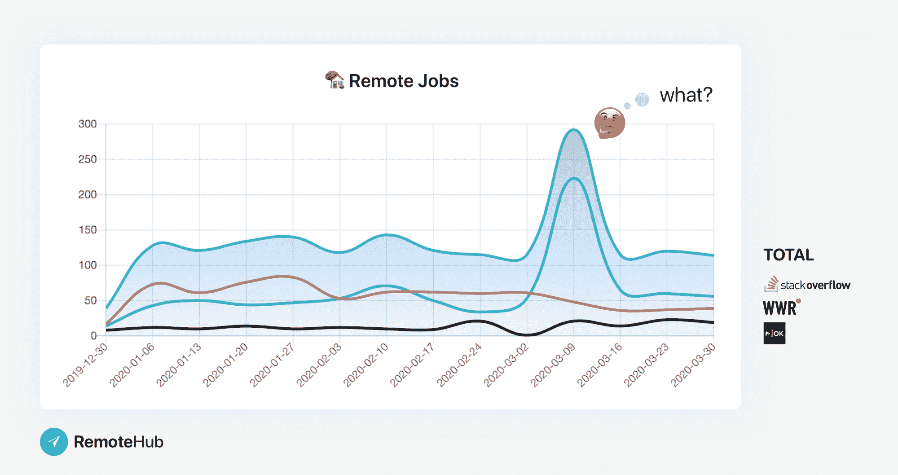
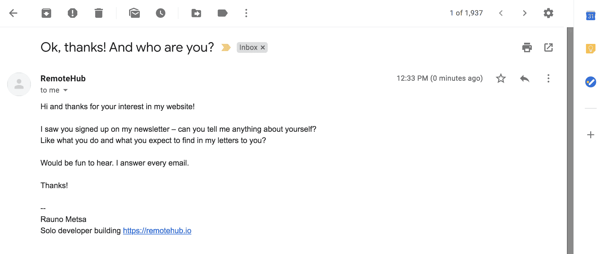
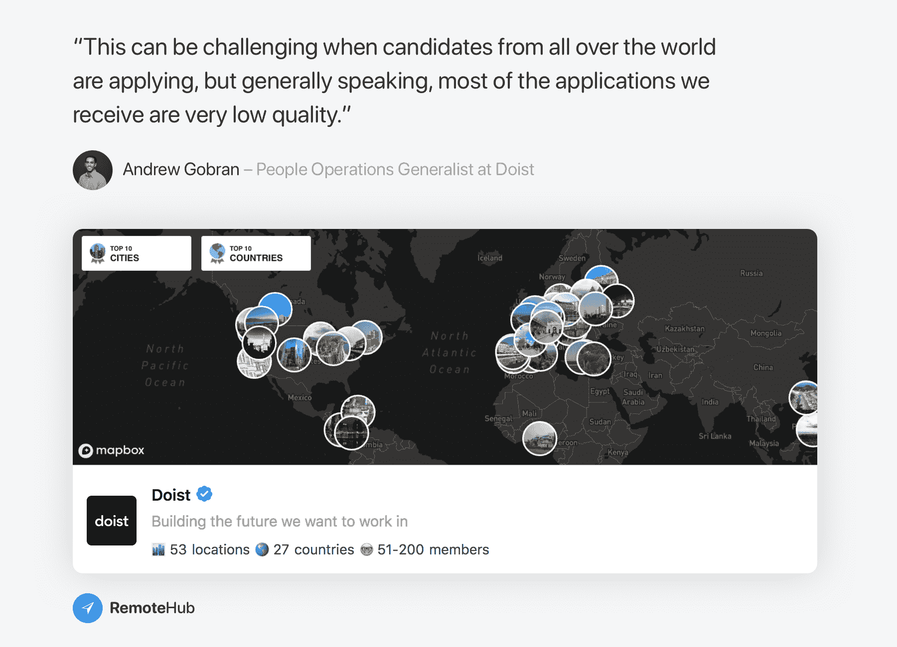
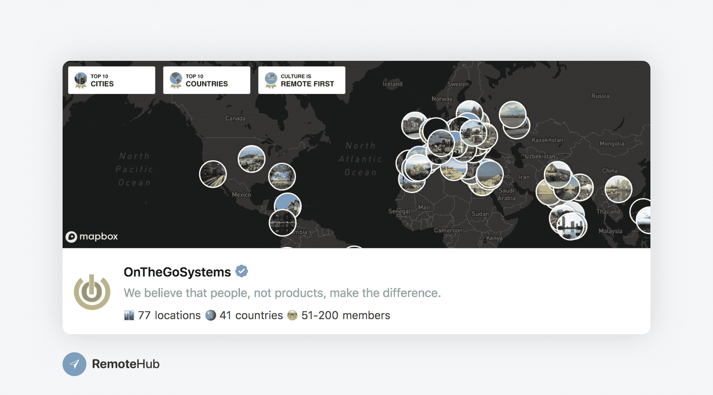
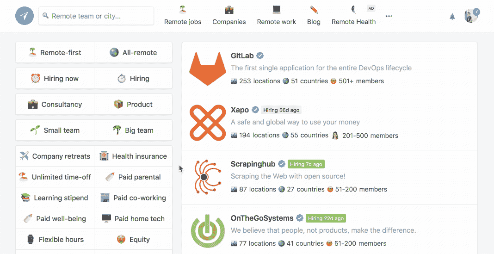
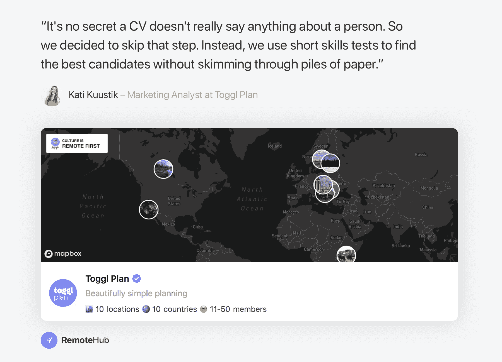
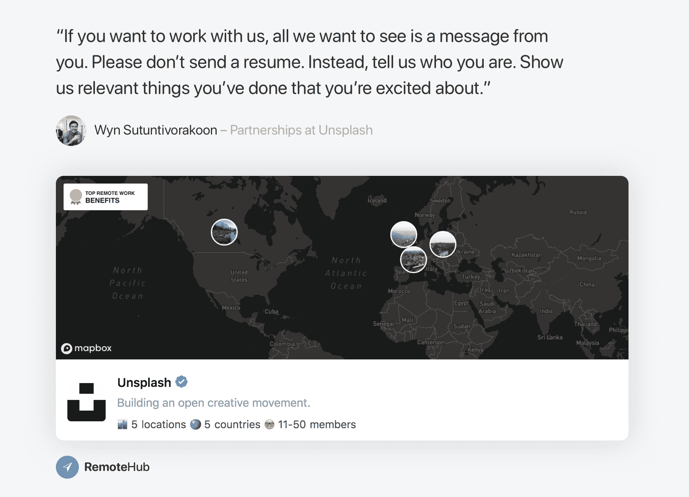
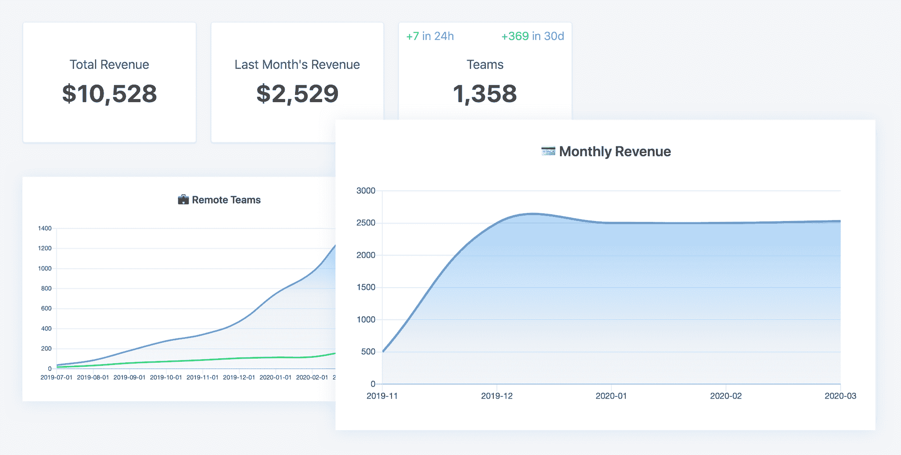

# 想知道如何获得远程工作？我问了 30 家偏远的公司——这是他们说的

> 原文：<https://www.freecodecamp.org/news/how-to-get-a-remote-job/>

我是一名独自开发 bootstrapping RemoteHub 的开发者——这是一个发现最好的[远程工作](https://remotehub.io/remote-jobs)并从领先的分布式团队那里了解[远程工作](https://remotehub.io/remote-work)的地方。

在建立 RemoteHub 的时候，我和很多远程公司的经理谈论过他们如何远程招聘。是的，找到一份远程工作可能非常困难。事实是，可能有数百人从世界各地申请同一个职位。

以 [Doist](https://remotehub.io/doist) 为例，这是一家全远程公司，开发了流行的生产力应用程序 Todoist 和 Twist。他们的员工在全球近 30 个国家工作。他们在一年内收到了 13730 份远程工作申请，雇用了 18 人(0.13%)。这似乎是一场疯狂的比赛。

这是有道理的。当你远程招聘时，人才库比办公室工作大得多。许多人希望远程工作，因为它有很多好处，比如在家工作，时间安排灵活。这意味着更多的人申请。

## 新冠肺炎对新的远程工作的影响

现在又是这个冠状病毒！公司还在招人吗？

当然，我们不知道长期会有什么影响，所以我们只能看到现在正在发生的事情。

但是我一直在看最受欢迎的工作论坛上发布的远程工作，目前除了几周前堆栈溢出的奇怪跳跃之外，我没有看到太多变化。我不知道那是怎么回事。

See the [live graph](https://remotehub.io/open/jobs). Data is based on public RSS files from these job boards. WWR data doesn't include every category, only the most popular (programming, design, marketing and support).

新的工作岗位可能会略有减少，但当世界陷入封锁时，降幅不会很大。可能会有更多的公司被迫呆在家里，继续远程工作和招聘。

## 所以我想知道...我能帮什么忙？

我设置了这封自动邮件，让人们告诉我一些关于他们自己的事情，比如他们做什么，以及我的网站如何能帮助他们。

20%左右回答。有些是远程公司的经理，他们正在建立自己的档案。但大多数人都在寻找一份偏远的工作，他们中的许多人最近都在与新冠肺炎后果作斗争。

有些人的工作涉及到很多人，比如戏剧艺术家，他们靠自己的积蓄生活。他们希望找到一份在家工作的远程工作。

由于公司正努力支付他们的工资，其他人已经失去了工作。

人们经常问我如何增加他们获得远程工作的机会。我想提供帮助，所以我与 30 家远程公司进行了交谈，他们给了我 230 个答案，涉及他们对远程求职者的要求，他们的招聘流程是什么样的，以及他们如何作为一个分布式团队工作。

以下是让我印象深刻的主要内容。

## 表现出你对在远程公司工作的真正兴趣

Doist 是偏远社区的思想领袖之一。我想知道如何从 13730 名候选人中脱颖而出。所以我问了 Andrew Gobran，他是 Doist 的人力运营专员。

“当来自世界各地的候选人都在申请时，这可能是一个挑战，但一般来说，我们收到的大多数申请质量都很低，”安德鲁说。“专注于制作一份高质量的申请，要有条理的简历、深思熟虑的回答，并表明你真的有兴趣加入 Doist。”

阅读你的申请的人会注意到你是否真的想在他们的团队工作，或者你只是每天发出几十份简历，看看是否有回复。

许多其他经理也证实了这一点，比如来自 OnTheGoSystems 的 Laura de Figueiredo，她的分布式团队在 40 多个国家工作:“当我们看到一份申请不仅仅是复制粘贴的大规模申请，而是候选人花时间为我们公司提供的特定角色定制申请时，该候选人肯定会脱颖而出。”

## 做你的研究

当一家公司在招聘栏上发布一个远程职位时，会有更多的候选人申请这个职位，因为这个职位的访问量很大。

但是在就业委员会上发布职位并不是公司招聘的唯一方式。

找到你想去的偏远公司。阅读他们的博客，看看他们的职业页面，确保你了解他们在做什么。然后，作为一个普通人伸出手——谈谈你自己，告诉他们你愿意和他们一起工作。

这并不意味着你会马上得到这份工作，坚持是关键，就像生活中的大多数事情一样。但是你会极大地增加获得远程工作的机会。

我已经建立了一个[远程公司](https://remotehub.io/remote-companies)的列表，你可以用它来寻找你下一个要加入的远程团队。我的名单上目前有 1400 家公司，你可以使用 30 多个过滤器来缩小搜索范围。

例如，你可以找到一些偏远的公司，他们有不同的福利，比如健康保险和灵活的工作时间。或者，您可以选择只查看具有远程优先文化的公司，或者甚至没有办公室的全远程团队。

## 开始做你的副业

公司想知道你是否具备这份工作的技能，我从许多偏远的公司听说简历不是很有用。

但是什么是有用的呢？

Toggl Plan 是一家分布在 10 个国家的公司，该公司的 Kati Kuustik 告诉我，他们正在使用在线测试来寻找最佳候选人:“众所周知，简历并不能真正反映一个人的任何情况。所以我们决定跳过这一步。相反，我们使用简短的技能测试来寻找最佳候选人，而不是浏览成堆的纸张。”

另一种方法是展示你已经完成并引以为豪的项目。“如果你想和我们一起工作，我们只想看到你的一个信息。请不要发简历。相反，告诉我们你是谁。向我们展示你做过的让你感到兴奋的相关事情，”当我们谈到他们如何远程招聘时，来自 Unsplash 的 Wyn Sutuntivorakoon 说。

因为展示上一份工作的项目可能会很复杂，所以你可以很容易地建立自己的兼职项目来展示你的技能。在一个对你来说有趣的项目中，你的技能会更加明显！

这还有一个好处:也许你的兼职项目很快就会变成一份全职工作！

## RemoteHub 是我的副业

这就是我用 RemoteHub 做的事情。我开始赚钱了，但我也在家里为一家初创公司工作。

我很高兴看到 RemoteHub 的成长。近 1000 人注册了每周简讯，700 人建立了自己的用户档案。远程公司已经在 130 个国家增加了 2600 个城市。

我正在写我作为一名独立开发者的旅程，并分享我在这个过程中的所有指标，包括流量和收入数字。