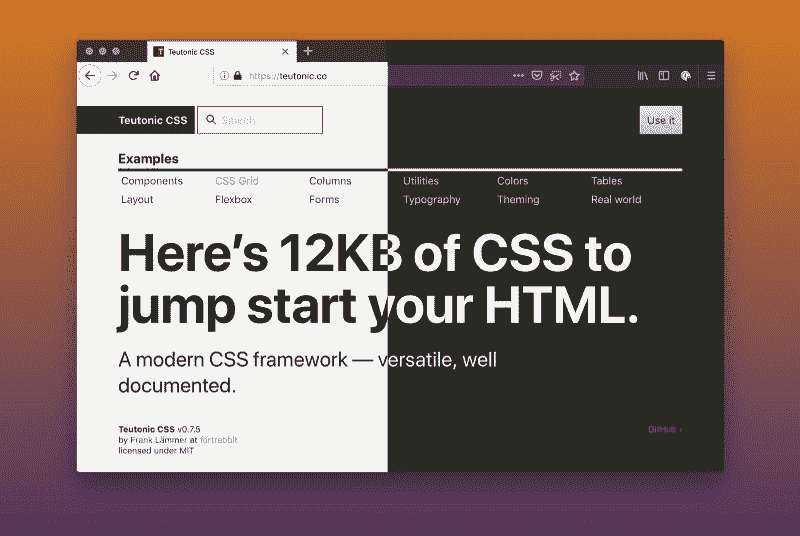
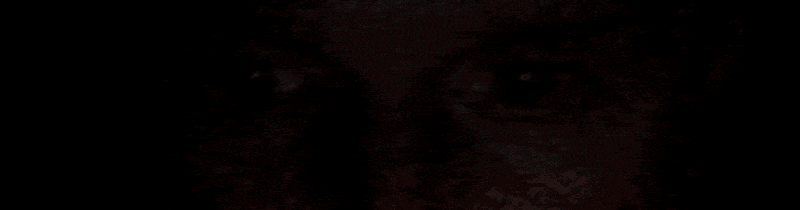
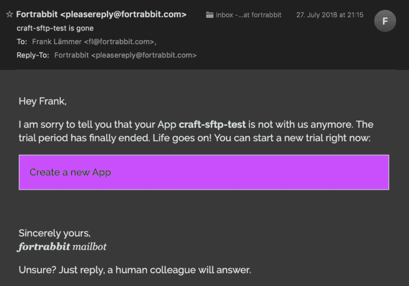
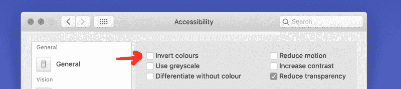
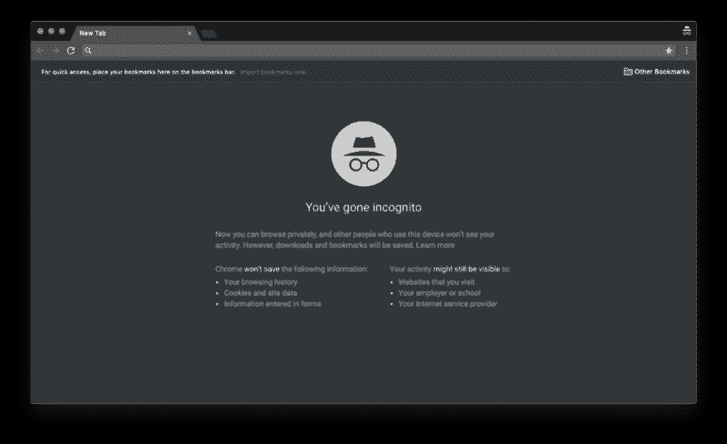
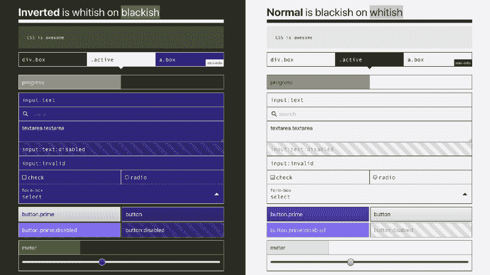
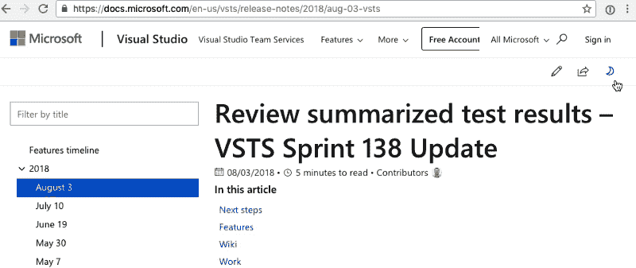

# 如何在黑暗模式下使用 CSS

> 原文：<https://www.freecodecamp.org/news/how-to-get-dark-mode-working-with-css-740ad31e22e/>

由弗兰克·羔羊

# 如何在黑暗模式下使用 CSS



Mockup: Light browser, light website; dark browser, dark website.

我最近一直在玩 MacOS Mojave 的黑暗模式。我看着还不是 100%满意。但是当你在夜晚光线不足的时候，它特别有用。

黑暗模式是一种设计趋势。很多阅读应用(Medium App，Twitter……)都已经有了。这不仅仅是反转所有的颜色，这也是艺术方向。


In macOS Mojave you can turn your interface dark. Safari and Firefox are supporting it already.

#### 并非一切都是黑暗的

在黑暗模式下工作时，有一件事可能有点令人震惊，那就是当打开一个白色大背景的文档时会出现闪光。这篇文章探讨了如何处理网页上的黑暗模式和用 CSS 设计黑暗模式。



The author opening this Medium post in dark mode with little ambient light.

### 处理黑暗模式用户设置

所以如果文档和网站能尊重当前周围的主题不是很好吗？

#### 自动颜色转换？

至少 Safari 和 Firefox 已经有了“阅读器模式”,支持深色背景下的浅色文本。这里，

上下文使用自定义样式呈现，以获得最佳可读性并消除混乱，还有一个反转颜色的设置。在此基础上，浏览器可能会用智能样式自动反转网站。听起来很恐怖！但至少苹果邮件已经在这么做了。它甚至为一些 HTML 邮件反转颜色。

OMG all colors inverted in a HTML mail in Apple Mail, macOS Mojave

智能反转颜色可能是也可能不是一个解决方案。还有什么？

#### 媒体质疑来救援！

我并不孤单。CSS 的黑暗模式目前(2018 年 8 月) [**正在讨论**在“CSS 工作组编辑草案”](https://github.com/w3c/csswg-drafts/issues/2735)。我们的想法是将它作为媒体查询。[的东西](https://bugs.webkit.org/show_bug.cgi?id=186606)已经登陆 Safari ( [private](https://twitter.com/rmondello/status/1007400236514504706) )，参见[这里](https://github.com/WebKit/webkit/commit/46198bd7636f0d1f85e36d830fd3108707d4c169)。

所以理论上你可以这样做:

```
@media (prefers-color-scheme: dark) {   color: white;   background: black}
```

让我们等到所有的浏览器都准备好了。我认为标准化还有一段路要走。操作系统制造商可能也需要在某些事情上达成一致。

### 反转不是黑暗模式



Fun fact: You can invert the colors in dark mode as well.

您知道吗:在媒体查询级别 4 中，已经有一个针对“反转颜色”的[媒体功能。这和黑暗模式不一样。一种“黑暗模式”已经存在了一段时间。Windows 也有**高对比度**模式。对此有许多不同的看法。](https://developer.mozilla.org/en-US/docs/Web/CSS/@media/inverted-colors)

然而，如果网站作者可以决定当一个启用了“黑暗模式”的用户访问他们的网站时，是否以及如何处理它，这将是非常酷的。因此，作为设计者，你可以完全控制你的网站在“关灯模式”下的外观。你还有更多的工作要做？不，这很简单。请继续阅读。

### 隐姓埋名不是黑暗模式



This is NOT dark mode!

当打开一个隐姓埋名的窗口进行私密浏览时，很多浏览器会呈现一个深色的浏览器 chrome 来突出区别。那也不是黑暗模式，但是很黑暗。

### 使用 CSS 变量的主题黑暗模式

由于“CSS 自定义属性”(也称为“CSS 变量”)，我们现在可以比以往任何时候都更容易地用很少的 CSS 创建主题。最简单的反转主题:

```
root: {  --text-color: DarkBlue;  --back-color: Azure;}
```

```
body { color: var(--text-color); background: var(--back-color)}
```

```
@media (prefers-dark-interface) {  root: {   --text-color: Azure;   --back-color: DarkBlue;  } }
```

无耻之徒:我的(伟大的新)CSS 框架日尔曼 CSS 已经利用了这样简单的反转:



Put “.inverted” on the outer container to invert all colors via CSS Vars. See it in action [here](https://teutonic.co/examples/colors#inverted).

### 网站更改浏览器 chrome

这篇文章是关于用户设置如何改变网站的外观。反之亦然:网站可以改变浏览器的外观。有一些专有的 meta 标签，目前只适用于移动浏览器:

```
<meta name="theme-color" content="black"><meta name="msapplication-navbutton-color" content="black"><meta name="apple-mobile-web-app-capable" content="yes"><meta name="apple-mobile-web-app-status-bar-style" content="black">
```

*啊！*

### 进一步阅读

Adrian Roselli 的文章“ [**OS:高对比度与反转颜色**](http://adrianroselli.com/2017/11/os-high-contrast-versus-inverted-colors.html) ”讨论了 Windows 和 macOS 中“反转”和“高对比度”之间的差异。

马修·阿特金森的文章“ [**“反转亮度”如何提高可访问性并帮助我们使用我们的设备**](https://developer.paciellogroup.com/blog/2017/12/how-invert-brightness-can-improve-accessibility-and-help-us-use-our-devices/) ”讨论了反转颜色如何帮助用户体验。你也可以在这里找到“智能反转”颜色的概念。

### 摘要



A day/night switch on microsoft developer pages. Nice detail: this setting is persistent (localstorage or cookie).

标准的好处是你有太多的选择。

虽然“夜间模式”肯定是一种趋势，但不同的实现方式正在四处浮动。提高你的声音，让这一个网络标准。让你的 CSS 向前兼容，这样你就可以不费力地支持它。