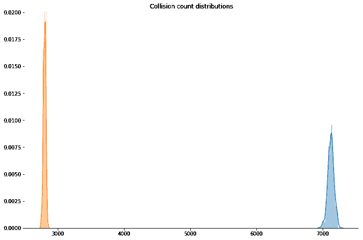

# 如何用 Python 实现令人尴尬的快速随机子集采样

> 原文：<https://www.freecodecamp.org/news/how-to-get-embarrassingly-fast-random-subset-sampling-with-python-da9b27d494d9/>

作者:基里尔·杜波维科夫

# 如何用 Python 实现令人尴尬的快速随机子集采样

假设你正在开发一个机器学习模型来对文章进行分类。您已经设法得到了一个不合理的大文本文件，其中包含了属于同一类的类似文章的数百万个标识符。您不确定彼此接近的标识符是否独立。

例如，一个解析器可以将来自一个站点的文章的标识符写在一起。因此，现在您希望从几百万个元素的数组中获取大量随机样本，以创建训练数据集或统计一些经验统计数据。这种情况在实践中会比你想象的更频繁地出现。

多亏了 Binder，你可以在线使用代码**，而无需在本地安装任何东西。或者你可以克隆 [Github 库](https://github.com/kdubovikov/fastsampling)。请注意，所有基准可能因机器而异。**

**嗯，怎么了？还是用 [numpy](http://www.numpy.org) 吧！**

**在 Macbook Pro 上，这段代码每循环运行大约 1.4s。如果你想得到 10 万个样本，这大约需要一天半的时间。哎哟！**

#### **跟上☄️的速度**

**那里发生了什么？为了生成随机样本，numpy.random.choice 在我们每次调用数组**时都会对其进行置换。**当我们的样本大小只是整个数组长度的一部分时，我们不需要在每次想要抽取样本时都打乱数组。让我们只将它混洗一次，并从混洗后的数组的开始处进行采样。**

**当我们到最后一个元素时，我们必须重新洗牌。这种优化也有一个非常好的副作用:我们将有更少的冲突(重复样本)。**

**现在是时候编码了:**

**这次我们得到的是每循环 21.1 s 979 ns，快了几个数量级。**

#### **甚至更快？？**

****

**我们能做得更快吗？是的，但是我们需要本土化。 [Cython](http://cython.org) 将类似 Python 的代码翻译成优化的原生 C 或 C++，这些代码可以被编译并在以后用作友好和熟悉的 Python 模块。**

**您可以在 Jupyter 笔记本中使用 Cython，方法是加载带有`%load_ext Cython`的 Cython 扩展，并使用`%%cython` magic 作为带有 Cython 代码的单元格中的第一条语句。**

**几乎所有的 Python 代码都是有效的 Cython 代码。但是为了充分利用它，我们需要利用 Cython 提供的扩展:**

*   **我们静态注释所有类型的函数签名和变量定义，尽可能使用原生 C 变量，而不是缓慢的 Python 对象**
*   **对于不需要导出为 Python API 的函数，我们使用`cdef`关键字。`cdef`通话快多了。**
*   **我们用`@cython.wraparound`和`@cython.boundscheck`禁用负索引和数组边界检查以获得更快的速度**

**与 Python 版本相比，这个小的重构足以获得合理的加速(在我的笔记本电脑上是 2 倍)。**

**我不得不说，Cython 不仅仅是一个优化的 Python-C 翻译器。借助这款出色的工具，您还可以:**

*   **克服 [GIL](https://www.google.ru/url?sa=t&rct=j&q=&esrc=s&source=web&cd=6&cad=rja&uact=8&ved=0ahUKEwjQlqzs6eDWAhXhCJoKHW0mD0cQFghFMAU&url=https%3A%2F%2Fwiki.python.org%2Fmoin%2FGlobalInterpreterLock&usg=AOvVaw20YulOZd6sYn-anu5E4rz4) 的局限性**
*   **[使用高级 OpenMP 包装器并行化您的代码](http://cython.readthedocs.io/en/latest/src/userguide/parallelism.html)(使用线程，而不是进程！)**
*   **通过[内存视图](http://cython.readthedocs.io/en/latest/src/userguide/memoryviews.html)使用快速数组**
*   **通过[缓冲协议](http://cython.readthedocs.io/en/latest/src/userguide/buffer.html)将原始内存缓冲区暴露给 Python 代码**

#### **碰撞呢？？**

**当我们在对数组进行采样时得到一个重复元素时，就会发生采样冲突。为简单起见，让我们假设数组不包含重复项。**

**我们将从冲突的角度比较这两种算法。对于每种算法，我们可以从相同的阵列中收集大量的样本，然后计算冲突的总数。**

**当我们重复这个过程几次并记录结果时，我们实际上是在为两种算法收集冲突计数的随机样本。**

**手头有了这些样本，我们可以运用统计学来比较它们。在这种情况下，我们将使用 t-检验(你可以在我的[上一篇文章](https://medium.freecodecamp.org/the-t-distribution-a-key-statistical-concept-discovered-by-a-beer-brewery-dbfdc693184)中了解更多关于 t-分布的信息，在这里了解更多关于 t-检验的信息[)。](http://www.statisticshowto.com/probability-and-statistics/t-test/)**

**我们得到的 p 值是 0，这意味着我们得到的结果是显著的。**

**让我们画一个图，看看有什么不同:**

****

**如你所见，我们得到了更低的碰撞数作为奖励。**

#### **结论**

**非常感谢看完！给我几下掌声？如果你觉得这份材料有帮助——它将有助于信息的传播。**