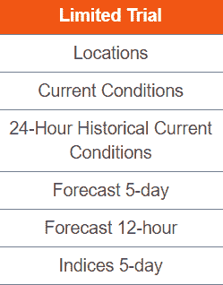
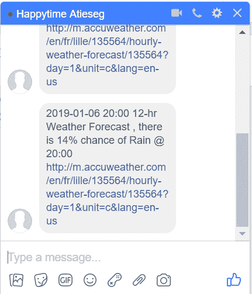
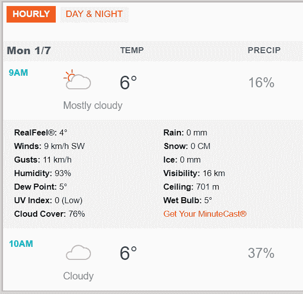

# 如何让脸书信使通知您有关天气

> 原文：<https://www.freecodecamp.org/news/how-to-get-facebook-messenger-to-notify-you-about-the-weather-8b5e87a64540/>

### 一个完整的 DIY 指南，建立自己的天气警报机器人。

早晨的例行公事总是令人紧张。如果早上你少了一件要担心的事情，那不是很好吗？

如果你有一个可定制的天气警报机器人，只有当降雨量超过你预先定义的阈值时，它才会向你发送短信，那会怎么样？

不要浪费时间在一个单独的应用程序中查看天气。它可以在你的脸书信使聊天室直播！

### 你需要什么？

*   安装了 pandas 和 [fbchat](https://github.com/carpedm20/fbchat) 包的 Python 3.6(或更早版本)

```
pip install fbchat
```



AccuWeather Free Account

*   [AccuWeather 开发者账号](https://developer.accuweather.com/packages)，免费包应该够了。它提供 50 个电话/天与 1 个关键/开发人员帐户。

### 我们开始吧！

在本操作指南结束时，脚本文件夹中会有 3 个文件:

[keys.py](https://github.com/ekapope/Weather_Alert_Notification_Facebook_Chat/tree/master/scripts) :存储你的 facebook 电子邮件、密码和 accuweather API 密钥

[params.py](https://github.com/ekapope/Weather_Alert_Notification_Facebook_Chat/blob/master/scripts/params.py) :存储阈值和天气预报位置 id

[main.py](https://github.com/ekapope/Weather_Alert_Notification_Facebook_Chat/blob/master/scripts/main.py) :这是主脚本，它将调用 keys.py 和 params.py

#### 1.设置脸书帐户和 AccuWeather API 密钥

首先，让我们将您的帐户详细信息放在 [keys.py](https://github.com/ekapope/Weather_Alert_Notification_Facebook_Chat/blob/master/scripts/keys.py) 文件中。

```
# Your Facebook usersname (email)
FB_USERNAME= "" 

# Your Facebook password
FB_PASSWORD= "" 

# Your AccuWeather API key
ACCUWEATHER_API_KEY= ""
```

#### **2。设置参数**

在这一步中，我们将定义下雨或下雪的概率阈值、每个请求和消息之间的延迟时间以及位置。

目前，我们将雨雪的阈值都设置为 25%。只有当 AccuWeather 数据显示概率≥ 25%时，我们才会收到警报信息。

以下脚本将每 1 小时(UPDATE_INTERVAL_HR= 1)向 AccuWeather 请求数据，并每 4 小时(DELAY_TIME_HR= 4)发送一条消息。

这些参数将存储在 [params.py](https://github.com/ekapope/Weather_Alert_Notification_Facebook_Chat/blob/master/scripts/params.py) 文件中。

```
# Define % threshold for probability of rain and snow. 
# The msg will be sent out if the % chance exceed the value
RAIN_THRESHOLD = 25
SNOW_THRESHOLD = 25

# time between Accuweather request (in hour)
UPDATE_INTERVAL_HR = 1 

# delay time between msg (in hour)
DELAY_TIME_HR = 4 

# location id
# for example, https://www.accuweather.com/en/fr/lille/135564/weather-forecast/135564
# location id is 135564
LOCATION_ID = "135564" 
```

#### 3.从 AccuWeather 检索数据

现在有趣的部分来了。我们现在将处理主脚本。

如果您计划在本地运行它，请设置您的目录并导入键和参数。确保将 [keys.py](https://github.com/ekapope/Weather_Alert_Notification_Facebook_Chat/blob/master/scripts/keys.py) 和 [params.py](https://github.com/ekapope/Weather_Alert_Notification_Facebook_Chat/blob/master/scripts/params.py) 放在与这个 [main.py](https://github.com/ekapope/Weather_Alert_Notification_Facebook_Chat/blob/master/scripts/main.py) 脚本相同的文件夹中。

```
#set the current directory
import os
os.chdir(r".\YOUR_PATH")
###############################################################################
#import keys and parameters other scripts in the same folder
from keys import FB_USERNAME,FB_PASSWORD,ACCUWEATHER_API_KEY
from params import RAIN_THRESHOLD,SNOW_THRESHOLD,UPDATE_INTERVAL_HR,DELAY_TIME_HR,LOCATION_ID 
```

导入所需的模块。

```
#import required modules
import urllib
import urllib.parse
import json
import time
import requests
import pandas as pd
import logging
import sys
from fbchat import Client
from fbchat.models import *
from datetime import datetime
```

定义要请求的“url_page ”,在本例中，我们将检索 12 小时的每小时预测。将我们的更新/延迟时间转换为秒。

```
url_page = "http://dataservice.accuweather.com/forecasts/v1/hourly/12hour/"+str(LOCATION_ID)+"?apikey="+ACCUWEATHER_API_KEY+"&details=true&metric=true"
#convert hours to seconds
update_interval_sec = 60*60*UPDATE_INTERVAL_HR 
delay_time_sec = 60*60*DELAY_TIME_HR 
```

然后，请求数据并放入名为“json_df”的 pandas 数据帧。

此时，我们可以检查检索到的表。提取并重命名我们需要的元素。在本例中，我们需要所需格式的 AccuWeather link、% rain、% snow、date 和 time。

```
 json_page = urllib.request.urlopen(url_page)
    json_data = json.loads(json_page.read().decode())
    json_df = pd.DataFrame(json_data)

    # set maximum width, so the links are fully shown and clickable
    pd.set_option('display.max_colwidth', -1)
    json_df['Links'] = json_df['MobileLink'].apply(lambda x: '<a href='+x+'>Link</a>')

    json_df['Real Feel (degC)'] = json_df['RealFeelTemperature'].apply(lambda x: x.get('Value'))
    json_df['Weather'] = json_df['IconPhrase'] 
    json_df['Percent_Rain'] = json_df['RainProbability'] 
    json_df['Percent_Snow'] = json_df['SnowProbability'] 
```

如果我们仔细观察,“DateTime”列的提取有点棘手，需要做一些工作。清理后，将其保存在“当前检索日期时间”变量中。

```
json_df[['Date','Time']] = json_df['DateTime'].str.split('T', expand=True)
# trim the time to hh:mm format, change to str
json_df[['Time']] = json_df['Time'].str.split('+', expand=True)[0].astype(str).str[:5]

current_retrieved_datetime = str(json_df['Date'][0])+' '+str(json_df['Time'][0])
```

接下来，编写一个 if-else 条件来定制警报消息。检索到的表格为我们提供了 12 小时的预测。我们将检查雨和雪列的每个元素，如果概率高于阈值，则返回一条消息。

首先，初始化每个案例的警报消息。

```
rain_msg=""
snow_msg=""
```

检查“Percent_Rain”和“Percent_Snow”列，如果百分比概率高于阈值，则标记为 1(否则标记为 0)。

对列求和，并修改“rain_msg”和“snow_msg”。

```
 # check % Rain column, return rain_msg
    json_df.loc[json_df['Percent_Rain'] >= RAIN_THRESHOLD, 'Rain_Alert'] = 1  
    json_df.loc[json_df['Percent_Rain'] < RAIN_THRESHOLD, 'Rain_Alert'] = 0
    if (sum(json_df['Rain_Alert']) > 0):
        rain_msg = 'There is ' \
                    +str(json_df['Percent_Rain'][json_df['Rain_Alert']==1][0]) \
                    +' % chance of rain' \
                    +' at ' \
                    +str(json_df['Time'][json_df['Rain_Alert']==1][0])

    # check % Snow column
    json_df.loc[json_df['Percent_Snow'] >= SNOW_THRESHOLD, 'Snow_Alert'] = 1  
    json_df.loc[json_df['Percent_Snow'] < SNOW_THRESHOLD, 'Snow_Alert'] = 0
    if (sum(json_df['Snow_Alert']) > 0):
        snow_msg = 'There is ' \
                    +str(json_df['Percent_Snow'][json_df['Percent_Snow']==1][0]) \
                    +' % chance of snow' \
                    +' at ' \
                    +str(json_df['Time'][json_df['Percent_Snow']==1][0])
```

初始化“警报消息”，如果有“雨消息”或“雪消息”，修改消息。

```
alert_msg =""
if(len(rain_msg)|len(snow_msg)!=0):
     alert_msg = rain_msg +" "+snow_msg
```

将链接添加到变量“link_for_click ”,稍后发送时，该变量将被附加到消息中。

```
link_for_click = json_df['MobileLink'][0]
```

至此，我们可以将它们包装成一个函数。如果你迷路了，不要担心，我已经把它们放在一起了。

```
def func_get_weather(url_page):

    json_page = urllib.request.urlopen(url_page)
    json_data = json.loads(json_page.read().decode())
    json_df = pd.DataFrame(json_data)

    # set maximum width, so the links are fully shown and clickable
    pd.set_option('display.max_colwidth', -1)
    json_df['Links'] = json_df['MobileLink'].apply(lambda x: '<a href='+x+'>Link</a>')

    json_df['Real Feel (degC)'] = json_df['RealFeelTemperature'].apply(lambda x: x.get('Value'))
    json_df['Weather'] = json_df['IconPhrase'] 
    json_df['Percent_Rain'] = json_df['RainProbability'] 
    json_df['Percent_Snow'] = json_df['SnowProbability'] 
    json_df[['Date','Time']] = json_df['DateTime'].str.split('T', expand=True)
    # trim the time to hh:mm format, change to str
    json_df[['Time']] = json_df['Time'].str.split('+', expand=True)[0].astype(str).str[:5]

    current_retrieved_datetime = str(json_df['Date'][0])+' '+str(json_df['Time'][0])

    rain_msg=""
    snow_msg=""

    # check % Rain column, return rain_msg
    json_df.loc[json_df['Percent_Rain'] >= RAIN_THRESHOLD, 'Rain_Alert'] = 1  
    json_df.loc[json_df['Percent_Rain'] < RAIN_THRESHOLD, 'Rain_Alert'] = 0
    if (sum(json_df['Rain_Alert']) > 0):
        rain_msg = 'There is ' \
                    +str(json_df['Percent_Rain'][json_df['Rain_Alert']==1][0]) \
                    +' % chance of rain' \
                    +' at ' \
                    +str(json_df['Time'][json_df['Rain_Alert']==1][0])

    # check % Snow column
    json_df.loc[json_df['Percent_Snow'] >= SNOW_THRESHOLD, 'Snow_Alert'] = 1  
    json_df.loc[json_df['Percent_Snow'] < SNOW_THRESHOLD, 'Snow_Alert'] = 0
    if (sum(json_df['Snow_Alert']) > 0):
        snow_msg = 'There is ' \
                    +str(json_df['Percent_Snow'][json_df['Percent_Snow']==1][0]) \
                    +' % chance of snow' \
                    +' at ' \
                    +str(json_df['Time'][json_df['Percent_Snow']==1][0])

    alert_msg =""
    if(len(rain_msg)|len(snow_msg)!=0):
         alert_msg = rain_msg +" "+snow_msg

    link_for_click = json_df['MobileLink'][0]

    return(current_retrieved_datetime,alert_msg,link_for_click)
```

#### 4.自动循环

最后，在最后一部分，我们将通过使用循环来自动化这个过程。下面的脚本将循环次数设置为“num_repeat = 999”。

```
num_repeat = 999 # number of loops to repeat
previous_alert_msg = "" # initialize alert msg
```

使用 try 和 except 来克服错误(以防连接出现问题)。调用' func_get_weather '函数并赋值给变量。

```
for i in range(num_repeat):
    try:
        current_retrieved_datetime,alert_msg,link_for_click = func_get_weather(url_page)
    except (RuntimeError, TypeError, NameError, ValueError, urllib.error.URLError):
        print('error catched')
```

然后，检查天气是否有任何变化。如果没有任何变化，将消息打印到屏幕上。将不发送任何聊天消息。

```
 #if the weather forecast has not changed, no alert msg will be sent
    if len(alert_msg) > 0 and previous_alert_msg == alert_msg:
        print(i, current_retrieved_datetime, 'no changes in weather forecast')
```

只有天气有任何变化，这条消息才会发出。

我们可以在这一点上最终确定我们的信息。获取您朋友的用户 id 并存储在“朋友列表”中。循环将消息逐个发送给每个朋友。我们在每条消息和完成后注销之间设置睡眠时间= 2 秒。

```
 if len(alert_msg) > 0 and previous_alert_msg != alert_msg:    
        # login and send facebook msg 
        client = Client(FB_USERNAME,FB_PASSWORD)
        users = client.fetchAllUsers()
        friend_list=[user.uid for user in users if user.uid!="0"]
        # loop though all friends
        for id in friend_list: 
            client.send(Message(text=current_retrieved_datetime+' '+'12-hr Weather Forecast' +' '+ alert_msg +' '+link_for_click),thread_id=id, thread_type=ThreadType.USER)
            #sleep for 2 secs between each msg
            time.sleep(2) 
        #logout after sent
        client.logout() 
```

下一条消息的执行延迟时间。已经在 [params.py](https://github.com/ekapope/Weather_Alert_Notification_Facebook_Chat/blob/master/scripts/params.py) 文件中定义—在本例中，为 4 小时。另一个 AccuWeather 请求延迟是 1 小时。

```
 time.sleep(delay_time_sec)                         
time.sleep(update_interval_sec)
```

还是那句话，迷路了也不用担心。我已经把完整的循环放在一起。

```
# Execute functions, retrieve data and send facebook msg
num_repeat = 999 # number of loops to repeat
previous_alert_msg = "" # initialize alert msg
for i in range(num_repeat):

    try:
        current_retrieved_datetime,alert_msg,link_for_click = func_get_weather(url_page)
    except (RuntimeError, TypeError, NameError, ValueError, urllib.error.URLError):
        print('error catched')

    #if the weather forecast has not changed, no alert msg will be sent
    if len(alert_msg) > 0 and previous_alert_msg == alert_msg:
        print(i, current_retrieved_datetime, 'no changes in weather forecast')
    #if there is any changes in weather       
    if len(alert_msg) > 0 and previous_alert_msg != alert_msg:    
        # login and send facebook msg 
        client = Client(FB_USERNAME,FB_PASSWORD)
        users = client.fetchAllUsers()
        friend_list=[user.uid for user in users if user.uid!="0"]
        # loop though all friends
        for id in friend_list: 
            client.send(Message(text=current_retrieved_datetime+' '+'12-hr Weather Forecast' +' '+ alert_msg +' '+link_for_click),thread_id=id, thread_type=ThreadType.USER)
            #sleep for 2 secs between each msg
            time.sleep(2) 
        #logout after sent
        client.logout()    
        time.sleep(delay_time_sec)                         
    time.sleep(update_interval_sec)
print(current_retrieved_datetime,'Run Completed')
```

哒哒！在我们所有的努力工作之后，这里是我们将得到的信息的快照。



Facebook chatbox msg. The location id in this example is 135564.

如果我们需要知道更多的细节，我们可以直接点击链接。它将导航到 AccuWeather 移动网站。



AccuWeather Link

GitHub 上的[也记录了该操作方法的完整脚本。](https://github.com/ekapope/Weather_Alert_Notification_Facebook_Chat)

感谢您的阅读。请尝试一下，玩得开心，并让我知道你的反馈！

如果你喜欢我的做法，可以考虑在 [GitHub](https://ekapope.github.io/) 、 [Medium](https://medium.com/@ekapope.v) 和 [Twitter](https://twitter.com/EkapopeV) 上关注我。确保[在 GitHub](https://github.com/Ekapope) :D 上启动