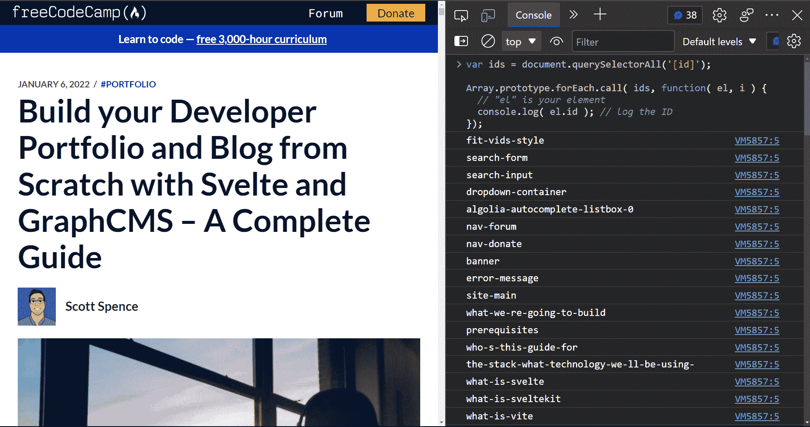
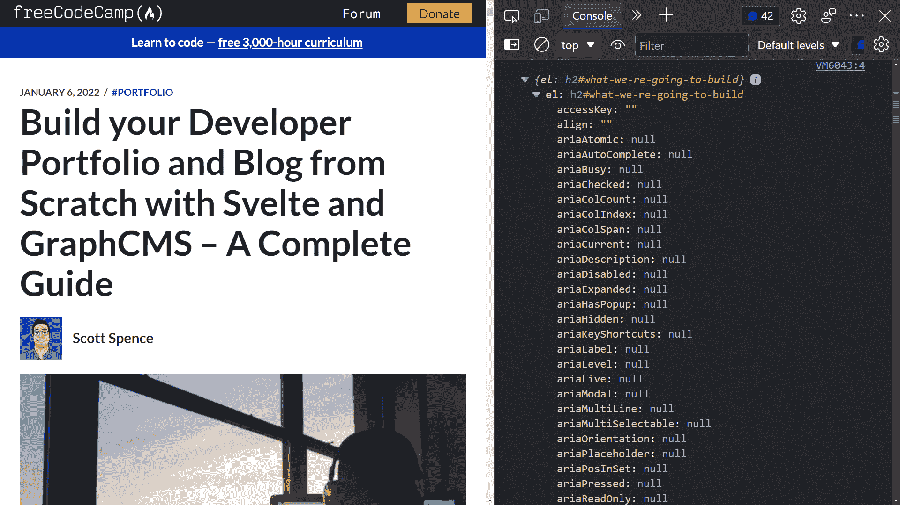
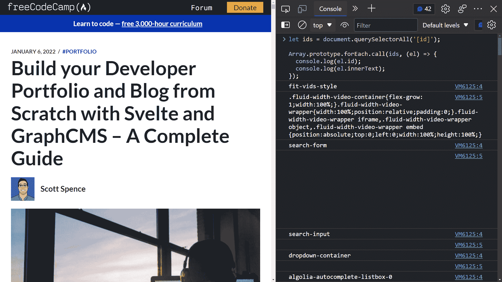
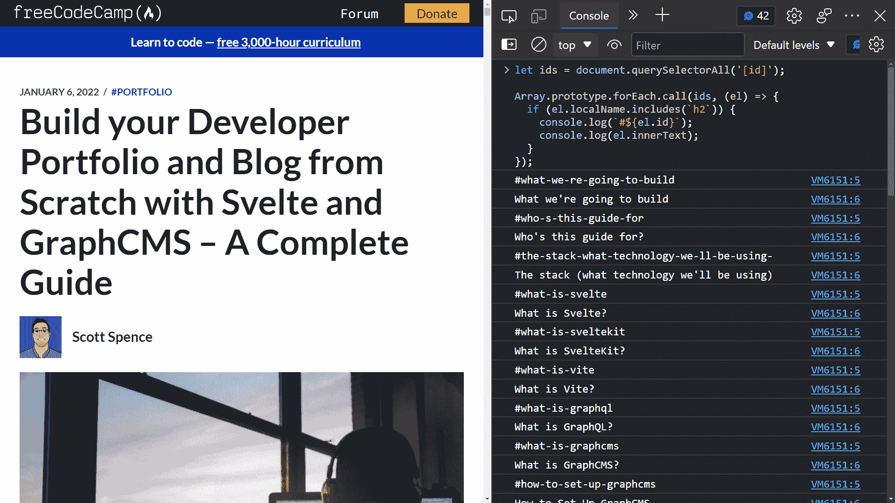

# 如何获取 freeCodeCamp 博客文章目录的标题和 id

> 原文：<https://www.freecodecamp.org/news/how-to-get-headings-and-ids-for-your-freecodecamp-blog-posts/>

在这篇文章中，我们将从 freeCodeCamp 博客文章中获取所有标题，在 Ghost CMS 中创建一个目录(ToC)。

我最近在 freeCodeCamp 上发表了[一篇相当大的文章](https://www.freecodecamp.org/news/build-your-developer-portfolio-from-scratch-with-sveltekit-and-graphcms/),需要给这篇文章添加一个目录。

Colby Fayock 写了一篇关于如何做到这一点的很好的支持文章。它非常清楚地描述了这个过程。

您可以查看视频和全面的指南，了解所有细节:

[How to Add a Table of Contents to Your Blog Post or ArticleProviding a table of contents [https://en.wikipedia.org/wiki/Table_of_contents] helps preview and prioritize content when writing lengthier articles. But notevery platform makes it easy to add one. How can we implement one when we lackfirst class tooling? Want to skip ahead of the “what” and “wh…Colby FayockfreeCodeCamp.org](https://www.freecodecamp.org/news/how-to-add-a-table-of-contents-to-your-blog-post-or-article/)

Colby 的帖子详细介绍了为什么您需要目录(ToC)以及如何使用 Ghost 编辑器(在 Ghost CMS 中编写这篇帖子时使用的编辑器)创建目录。

事情是这样的，我在帖子里有 33 个标题需要添加链接。一想到滚动一份 10，000 字的文档以获得标题，然后滚动到顶部以将其添加到目录中，我就想知道是否有更好的方法来做到这一点！

### 目录:

*   JavaScript 拯救世界！
*   [获取元素属性](#get-the-element-properties)
*   [获取元素 id 和`innerText`](#get-the-element-id-and-innertext)
*   [过滤掉`localName`上的](#filter-on-the-localname)
*   [结论](#conclusion)

## JavaScript 拯救世界！

带着这个想法，我快速搜索了一下，找到了一个我可以使用的[堆栈溢出](https://stackoverflow.com/a/7115083/1138354)答案。以下是片段:

```
var ids = document.querySelectorAll('[id]');

Array.prototype.forEach.call( ids, function( el, i ) {
  // "el" is your element
  console.log( el.id ); // log the ID
});
```

所以，现在让我们跳到浏览器上，尝试一下。

现在，我将在浏览器中浏览已发布的帖子，并打开开发者工具。(在 Chrome 和 Edge 中，打开开发工具需要按 F12 键。)然后，我将示例代码粘贴到控制台中，并按 enter 键，以下是输出:



## 获取元素属性

不错，但是我也想要标题，所以查看元素属性的一个快速方法是用花括号将`el`括起来:

```
let ids = document.querySelectorAll('[id]');

Array.prototype.forEach.call(ids, (el) => {
  console.log({el});
});
```

你会注意到我对函数做了一些清理，用一个箭头函数替换了内联函数，用`let`替换了`var`，所以语法更现代了。

现在，在浏览器中运行该代码片段会为我提供每个元素的对象:


然后，我可以展开其中一个元素，以获得与其相关的所有属性。从这里开始，我想获取`id`(我已经知道它在那里)和标题标题`innerText`:



## 获取元素`id`和`innerText`

让我们将`innerText`元素添加到我们正在处理的代码片段中，看看现在是什么样子。以下是片段:

```
let ids = document.querySelectorAll('[id]');

Array.prototype.forEach.call(ids, (el) => {
  console.log(el.id);
  console.log(el.innerText);
});
```

这是我们得到的结果:



好的，这真的很吵，因为它显示了文档中每个元素的`innerText`,其中有许多不相关的信息。我们真正感兴趣的是标题的标题和 id。

## 在`localName`上过滤

我在文章中使用的所有标题都是`h2`标题，所以我想有一种方法来过滤它。因此，从`{el}`属性中，我需要获取`localName`，它表示元素`h2`的类型。

因此，让我们使用一个`if`函数来查看`localName`是否包含`h2`，以及它是否记录了该事件。我还将使用一个模板文本将锚 id `#`添加到 id 的开头:

```
let ids = document.querySelectorAll('[id]');

Array.prototype.forEach.call(ids, (el) => {
  if (el.localName.includes(`h2`)) {
    console.log(`#${el.id}`);
    console.log(el.innerText);
  }
});
```

现在让我们来看看输出:



好多了！

现在，我可以使用该输出开始制作我的目录了！

[https://www.youtube.com/embed/8UnglHuuVTA?feature=oembed](https://www.youtube.com/embed/8UnglHuuVTA?feature=oembed)

## 结论

我们采用了一个相当扩展的过程，并把它变成了一个方便的片段，每次我们需要为我们的博客文章创建一个目录时，我们都可以在浏览器控制台中使用它。

就这些，希望你觉得有用！🙏

如果你喜欢这些内容，你可以在我的[博客](https://scottspence.com/)上查看更多，你也可以在[推特](https://twitter.com/spences10)上关注我。