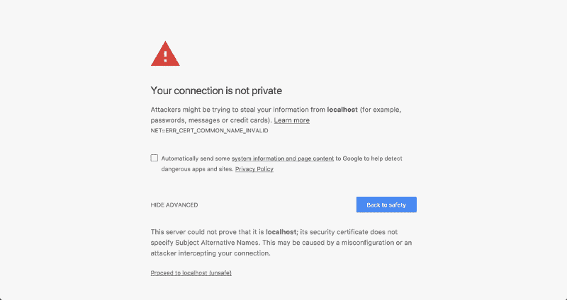
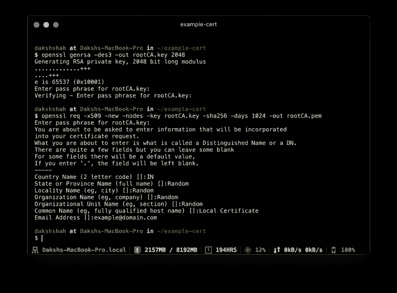
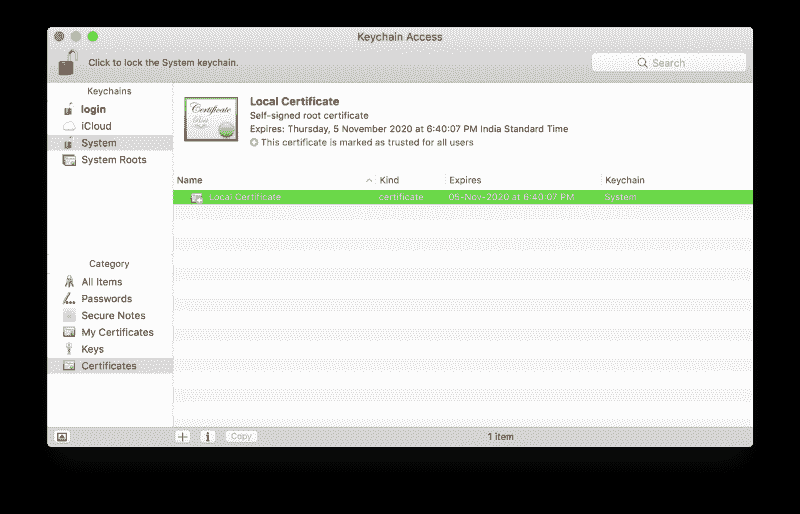
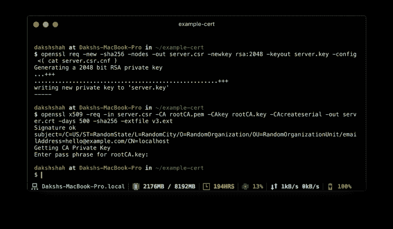
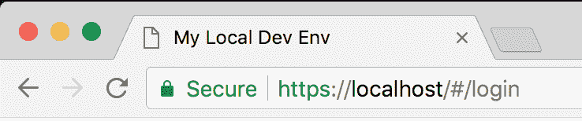

# 如何在 5 分钟内让 HTTPS 在您的本地开发环境中工作

> 原文：<https://www.freecodecamp.org/news/how-to-get-https-working-on-your-local-development-environment-in-5-minutes-7af615770eec/>


几乎你今天访问的所有网站都受到 HTTPS 的保护。如果你的还没有，[应该是](https://developers.google.com/web/fundamentals/security/encrypt-in-transit/why-https)。通过 HTTPS 保护您的服务器也意味着您不能从不受 HTTPS 保护的服务器向该服务器发送请求。这给使用本地开发环境的开发人员带来了一个问题，因为他们都是开箱即用的。

在我参与的初创公司，我们决定用 HTTPS 来保护我们的 AWS 弹性负载平衡器端点，作为增强安全性措施的一部分。我遇到了这样一种情况，我的本地开发环境对服务器的请求开始被拒绝。

随后，我在谷歌上快速搜索了一下，发现了几篇文章，如[这篇](https://devcenter.heroku.com/articles/ssl-certificate-self)、[这篇](https://www.kevinleary.net/self-signed-trusted-certificates-node-js-express-js/)或[这篇](https://blog.praveen.science/securing-your-localhost/)，详细说明了我如何在`localhost`上实现 HTTPS。即使我虔诚地遵循了这些指示，它们似乎都不起作用。Chrome 总是向我抛出一个`NET::ERR_CERT_COMMON_NAME_INVALID`错误。



### 问题是

我发现的所有详细说明在当时都是正确的。不再是了。

在大量的谷歌搜索后，我发现我的本地证书被拒绝的原因是 [Chrome 不赞成在证书](https://groups.google.com/a/chromium.org/forum/m/#!topic/security-dev/IGT2fLJrAeo)中支持通用名称匹配，实际上，从 2017 年 1 月开始需要 subjectAltName。

### 解决方案

我们将使用 [OpenSSL](https://www.openssl.org/) 来生成我们所有的证书。

#### 步骤 1:根 SSL 证书

第一步是创建根安全套接字层(SSL)证书。然后，这个根证书可以用来签署您可能为单个域生成的任意数量的证书。如果你不熟悉 SSL 生态系统，这篇来自 DNSimple 的文章在介绍根 SSL 证书方面做得很好。

生成一个 RSA-2048 密钥，并将其保存到文件`rootCA.key`。该文件将用作生成根 SSL 证书的密钥。每次使用这个特定的密钥生成证书时，系统都会提示您输入一个密码短语。

```
openssl genrsa -des3 -out rootCA.key 2048
```

您可以使用生成的密钥来创建新的根 SSL 证书。将其保存到名为`rootCA.pem`的文件中。该证书的有效期为 1024 天。你可以随意把它改成你想要的天数。还会提示您输入其他可选信息。

```
openssl req -x509 -new -nodes -key rootCA.key -sha256 -days 1024 -out rootCA.pem
```



#### 步骤 2:信任根 SSL 证书

在使用新创建的根 SSL 证书开始颁发域证书之前，还有一个步骤。您需要告诉您的 Mac 信任您的根证书，以便它颁发的所有个人证书也是可信的。

在 Mac 上打开“钥匙串访问”,然后前往系统钥匙串中的“证书”类别。一旦存在，使用文件>导入项目导入`rootCA.pem`。双击导入的证书，并将“使用此证书时:”下拉列表**更改为“信任”部分中的“总是信任”**。

如果到目前为止您已经正确地按照说明进行了操作，那么您的证书在“钥匙串访问”中应该看起来像这样。



#### 步骤 2:域 SSL 证书

根 SSL 证书现在可以用来专门为位于`localhost`的本地开发环境颁发证书。

创建一个新的 OpenSSL 配置文件`server.csr.cnf`，这样您就可以在创建证书时导入这些设置，而不是在命令行中输入它们。

```
[req]
default_bits = 2048
prompt = no
default_md = sha256
distinguished_name = dn

[dn]
C=US
ST=RandomState
L=RandomCity
O=RandomOrganization
OU=RandomOrganizationUnit
emailAddress=hello@example.com
CN = localhost
```

创建一个`v3.ext`文件，以便创建一个 [X509 v3 证书](https://en.wikipedia.org/wiki/X.509)。注意我们在这里是如何指定`subjectAltName`的。

```
authorityKeyIdentifier=keyid,issuer
basicConstraints=CA:FALSE
keyUsage = digitalSignature, nonRepudiation, keyEncipherment, dataEncipherment
subjectAltName = @alt_names

[alt_names]
DNS.1 = localhost
```

使用存储在`server.csr.cnf`中的配置设置为`localhost`创建一个证书密钥。这把钥匙存放在`server.key`里。

```
openssl req -new -sha256 -nodes -out server.csr -newkey rsa:2048 -keyout server.key -config <( cat server.csr.cnf )
```

证书签名请求通过我们之前创建的根 SSL 证书发出，以便为`localhost`创建域证书。输出是一个名为`server.crt`的证书文件。

```
openssl x509 -req -in server.csr -CA rootCA.pem -CAkey rootCA.key -CAcreateserial -out server.crt -days 500 -sha256 -extfile v3.ext
```



#### 使用您的新 SSL 证书

你现在已经准备好保护你与 HTTPS 的`localhost`。将`server.key`和`server.crt`文件移动到服务器上可访问的位置，并在启动服务器时包含它们。

在用 Node.js 编写的 Express 应用程序中，你可以这样做。确保只为您的本地环境这样做。**不要在生产中使用这个**。



我希望这个教程对你有用。如果您不习惯自己运行这里给出的命令，我已经创建了一组方便的脚本，您可以快速运行这些脚本来为您生成证书。更多细节可以在 [GitHub repo](https://github.com/dakshshah96/local-cert-generator/) 上找到。

我喜欢帮助其他网站开发者。在推特上关注我，如果你有任何建议或反馈，请告诉我。如果你想对我所做的任何工作表示赞赏，不管是一篇博文、一个开源项目还是一条有趣的推文，你可以[请我喝杯咖啡](https://www.buymeacoffee.com/dakshshah96)。