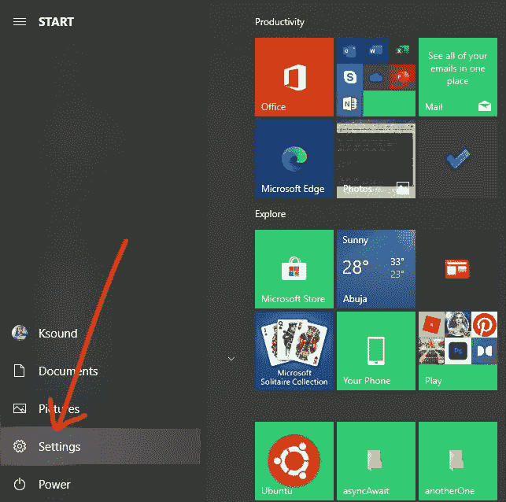

# 如何进入 Windows 10 中的 BIOS–BIOS 设置 PC 指南

> 原文：<https://www.freecodecamp.org/news/how-to-get-into-bios-in-windows-10-bios-setup-pc-guide/>

BIOS 代表基本输入输出系统。它作为主板芯片嵌入到计算机中，主要负责引导计算机系统。

除了启动计算机之外，BIOS 还在幕后负责许多其他功能，例如管理操作系统和连接的硬件设备(如打印机、鼠标、键盘、硬盘和扫描仪)之间的数据流。

一旦在启动过程中确认一切正常，您的计算机将成功启动。否则，将显示一条错误消息，如 BSOD(蓝屏死机)或其他几条消息。

如果您可以访问 PC 上的 BIOS，您可以执行各种操作，例如更改硬盘设置、为 BIOS 创建密码以使您的计算机更加安全、更改启动顺序等等。

因此，在这篇文章中，我将向您展示两种进入 Windows 10 BIOS 的方法。

## 如何通过设置进入 Windows 10 中的 BIOS

**第一步**:点击开始，选择设置，打开设置 app。或者直接按`WIN` (Windows 键)+ `I`。

**第二步**:点击“更新和安全”。

**第三步**:选择“恢复”。

**步骤 4** :在“高级启动”下，点击“立即重启”。这将允许您重新启动计算机进行恢复和一些配置。

**步骤 5** :电脑重启后，你会看到一个蓝色背景菜单，里面有“继续”、“故障排除”和“关闭电脑”等选项。点击故障排除。

**第六步**:点击“高级选项”

**第七步**:选择“UEFI 固件设置”，最终进入电脑 BIOS。

就这样-你应该加入。

如果你没有找到 UEFI 固件设置，使用热键进入 BIOS 将会来救援。现在让我们来看看如何使用它们。

## 如何通过热键进入 Windows 10 中的 BIOS

一些计算机制造商给用户几个键或组合键，让他们在启动时按，这样他们就可以进入 BIOS。这通常是许多设备上的 F2 键，但也有一些例外。

下表显示了在不同品牌的计算机上进入 BIOS 的热键。

惠普:ESC(退出)进入启动菜单，然后 F10 或 F12。

| 品牌 | 热键 |
| --- | --- |
| 宏基电脑公司 | `F2`或`DEL`(删除) |
| 东芝 | `F2` |
| 联想 Thinkpad | `ENTER` + `F1` |
| 联想台式机 | `F1` |
| （里面或周围有树的）小山谷 | `F2` |
| 中规模集成电路（medium-scale integration 的缩写） | `DEL` |
| 三星电子 | `F2` |
| 索尼 | `F2` |
| 原始 PC | `F2` |

## 结论

在本指南中，您学习了如何在 Windows 10 中进入 BIOS，这样您就可以更好地控制您的设备。它还可以让你进入更多设置，你可能在设置应用程序中找不到。

Windows 10 设置在现代电脑上提供了一种更好的进入 BIOS 的方式，但如果你使用的是旧设备，使用热键可能是你进入 BIOS 的最佳选择。

如果你想知道 UEFI 是什么，它代表统一可扩展固件接口。它的工作方式类似于 BIOS，但提供了更快的启动时间，并且可以支持高达 9 兆字节的驱动器大小，而 BIOS 仅支持高达 2.2 兆字节的驱动器大小。

小心你在 BIOS 中的所作所为，因为你篡改的任何东西都可能对你的计算机产生持久的影响。

感谢您的阅读。