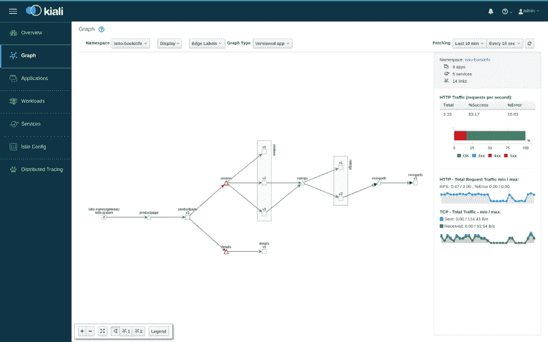
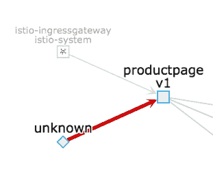
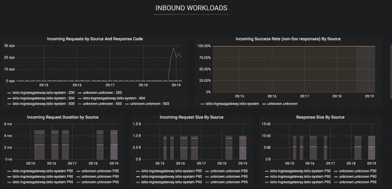

# 如何启动和运行 Istio

> 原文：<https://www.freecodecamp.org/news/how-to-get-istio-up-and-running-1935dc7cfb90/>

克里斯·库尼

# 如何启动和运行 Istio

#### 一旦发生了，你可以做些疯狂的事情。


An actual picture of me when Kiali started working

当你开始在你的集群上工作的时候，感觉你已经向前迈出了一大步。您立即获得的监控、安全和功能水平远远领先于竞争对手。几个月前，我们冒险将 Istio 安装到我们的 Kubernetes 集群上，然后…真该死。我们将从头开始，从安装和我们发现的缺陷开始，然后概述我们发现最有用的工具。

### 启动马达。

安装 Istio 最简单有效的方法是使用舵图。您可以获得开箱即用的生产就绪安装。您有几个选项，但 Istio 提供了一个方便的下载命令，因此您可以下拉一个版本化的 Istio 舵图包。下面将为您提供 Istio 包的版本`1.0.6`。

```
curl -L https://git.io/getLatestIstio | ISTIO_VERSION=1.0.6 sh -
```

在这个下载包中，有一个方便的小舵图。它位于`install/kubernetes/helm/istio`。一旦你在这个目录中，这是一个简单的舵安装。我们更喜欢使用`helm upgrade — install`而不是直接安装，这样同样的命令可以自动执行:

```
helm upgrade istio . -f values.yaml \--namespace istio-system \--install
```

这将使用文件夹中提供的默认`values.yaml`文件。您可以修改这个文件来打开或关闭不同的功能。

#### 卸载 Istio 的注意事项

常识告诉我们，`helm delete --purge istio`会移除所有的 Istio 资源，但是它不会移除`CustomResourceDefinition`类型。我们不得不四处挖掘，手动删除 CRD。我们最终编写了这个脚本。只是一些需要记住的事情。

安装完成后，我们配置了一些端点，并开始评估新集群的功能。哦，天啊，我们没有失望。

### 配置 Istio

最后要做的事情是注释一个名称空间，以表明 Istio 可以执行自动 sidecar 注入。这是使用 Istio 最简单的方法。注释很简单。您可以使用的名称空间 yaml 示例如下:

```
apiVersion: v1kind: Namespacemetadata:    name: my-namespacelabels:    istio-injection: enabled
```

部署到该名称空间中的任何应用程序都将获得一个特使代理。这个代理将分析您的网络流量，并发布到 Istio Prometheus 服务器，下游系统可以使用它。

#### 我如何知道我是否有特使代理？

很简单，在您想要的名称空间中运行`kubectl get pods`。您会看到类似这样的内容:

```
my-application-pod   2/2     Running   0          2d
```

假设每个 pod 只部署一个容器，现在将出现第二个容器。第二个容器是您的特使代理。如果它在那里并且准备好了，你就可以走了。

### 琪丽亚

我正带着我最喜欢的东西出门。 [Kiali](https://www.kiali.io/) 为您的应用提供实时网络图表和 HTTP 统计数据。这是一个真正的大众喜闻乐见，它给你一个优秀的“一目了然”的仪表板。



Kiali gives you serious visibility

看这张图片的右边。除了高度的可视性，您还可以获得细节。你可以把网络概览贴在电视屏幕上。当其中一行变红时，您可以深入了解 HTTP 细节。

#### 基亚里的怪癖

您可能会在 kiali 看到来自“未知”的流量，如下所示:



Is it a hacker!?

这实际上是 Kubernetes 健康检查。没什么好担心的。您可以通过以下几种方式隐藏这一点:

*   调整您的 healthcheck 以使用 docker 容器上的本地 exec，而不是基于 HTTP 的检查。这是一个有点 hacky。
*   使用与主应用程序端口不同的端口进行运行状况检查。这是我们前进的方向，也为我们打开了另一扇门

Istio 正在解决这个问题，在全新的 1.1 版本中有一个修复。

### 格拉夫纳

Istio 将立即为您填充一个 [Grafana](https://grafana.com/) 实例。这个 Grafana 实例绝对包含有用的应用程序指标，由每个应用程序的 envoy 代理发布的数据驱动。

一旦您使用 envoy 代理部署了新的应用程序，您就会获得通常需要团队数周时间才能汇总的指标:



Oh aye.

重要的是要认识到，*这些都不是我配置的。* Istio 与您的系统密切相关，可以为您解决所有这些问题。更重要的是，这是众多仪表板中的一个。有很多，比我想我会用的还要多。在监控方面，越多越好。我宁愿有太多的细节和低调，而不是完全没有可见性。

### 普罗米修斯

这是正在发生的一切背后的引擎。普罗米修斯公司正在收集和汇总大量的数据，并以一种方便的方式呈现出来。说实话，我不需要花太多时间去玩它。Istio 服务提供了一些非常有用的现成功能。Prometheus 可用于编写您自己的图表或从您的应用程序中抓取自定义指标。

在这些数据的背后，您可以使用警报管理器触发警报，为您的应用程序创建高度复杂的监控和警报平台。

### 你获得的控制

除此之外，Istio 还内置了一些实用程序，真正推动了极限。你将能够触发故障，导致停电，黑洞交通和更多。我已经详细介绍了一些我有机会使用的很酷的特性，但是还有更多。

#### 故障注入

使用 Istio，可以注入失败。例如，以下 YAML 将导致 100%的请求返回 HTTP 状态代码 500。在模拟第三方中断时非常有用。

```
apiVersion: networking.istio.io/v1alpha3 kind: VirtualService metadata:   name: ratings   spec:   hosts:   - ratings   http:   - fault:       abort:         httpStatus: 500         percent: 100     match:     - headers:         end-user:           exact: json     route:     - destination:         host: ratings         subset: v
```

文档非常好，您可以深入了解所有这些功能。我在这里做的只是向你展示表面。

#### 作为标准的弹性政策

您多久编写一次实现重试的逻辑？将所有这些都预先加载到一个产品中，很难专注于特定的业务价值。Istio 让这变得更简单。例如，通过在以下位置重试烘焙:

```
apiVersion: networking.istio.io/v1alpha3kind: VirtualService metadata:     name: ratings spec:     hosts:      — ratings     http:       — route:         — destination:           host: ratings           subset: v1         retries:            attempts: 3           perTryTimeout: 2s
```

这将确保您的服务发出的请求重试三次，每次超时两秒。不再污染您的应用程序代码——将其加载到服务网格中，保持您的服务简单。

#### 相互 TLS

服务对服务的加密可能很困难。确保证书不会过期是一项严肃的工作……但对 Istio 来说不是。Istio 使用证书管理器 pod 来确保您的应用程序拥有自己的闪亮证书。

然后，使用正确的`DestinationRule`，您可以要求您的应用程序只允许 TLS 加密的流量。这可以确保锁定所有集群间通信。应用程序没有任何线索。它在 HTTP 中发出请求，特使代理 sidecar 将透明地将其升级到相互 TLS。以下目的地规则将确保对`productpage`服务**的`v1`的所有请求必须使用相互 TLS 对**进行加密。

```
apiVersion: networking.istio.io/v1alpha3kind: DestinationRulemetadata:  name: productpagespec:  host: productpage  trafficPolicy:    tls:      mode: ISTIO_MUTUAL  subsets:  - name: v1    labels:      version: v1
```

### 天下没有免费的午餐

和所有事情一样，也有一些危险和权衡。Istio 太棒了，我印象深刻。很容易偏离轨道，发现自己是一个服务混合体，而不是一个服务网格。

#### 杂乱的集成层

任何在足够大的组织中工作过的人都会看到这一点。最初设计用于将两个应用程序链接在一起的“集成层”。然后，他们得到一点额外的逻辑，一些文件在这里和那里，一些路由规则撒在顶部，突然，他们是一个复杂的巢。

在这方面要小心 Istio。它非常强大，但需要仔细思考。有些功能很酷，但你可能实际上并不需要它们。有时，我敢说，微服务中的一点重复比实际应用中的逻辑更多的服务网格更可取。

#### 复杂性

Kubernetes 提供了很多可以学习的东西。学习曲线很好，尤其是与其他选择相比，但是领域很广。当你引入 Istio 时，你也引入了一系列新的、更复杂的概念。`VirtualService`和`Gateway`您需要熟悉的自定义资源定义类型。

这是一个权衡。看看你的团队，然后决定。我们的监控工作做得完美吗？我们的应用程序有弹性吗？工程师们抱怨逻辑的重复吗？确保你从这种复杂性中得到回报，这种交易是显而易见的。只是不要梦游做噩梦。

#### 变化…很快

Istio 最近宣布它已经做好了生产准备，随着它的`1.1`发布，解决了许多现有的问题。也就是说，这是一个新产品。如果你是那种努力跟上的组织，Istio 前进的步伐可能会对你不利。落后可能是灾难性的，尤其是如果出现了安全漏洞和缺陷。

再一次，这是一个你需要思考的负担。你有能力跟上吗？如果没有，你能吗？即使你可以，这值得吗？您真的需要这种额外的运营开销吗？

### 这是所有的乡亲

我已经给出了我在 Istio 体验的亮点。我个人已经使用了本文中的所有功能，它非常出色。我们已经看到了一两个奇怪的怪癖，但没有什么让我们停下来思考。总而言之，如果你有需要的情况，Istio 会让你的集群更上一层楼。

我经常在我的推特账户上谈论 Istio、Kubernetes 和 DevOps。