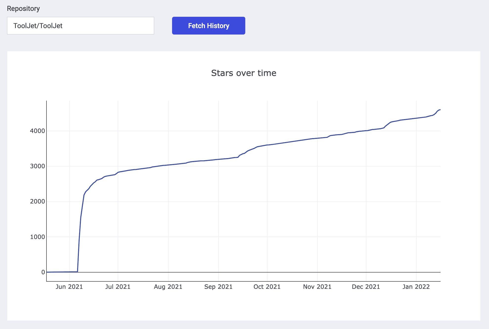
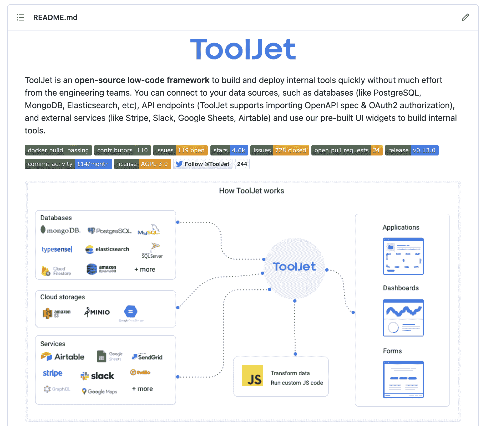
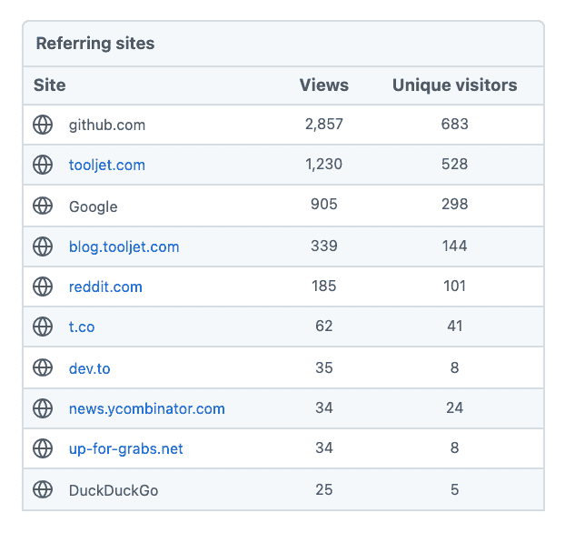
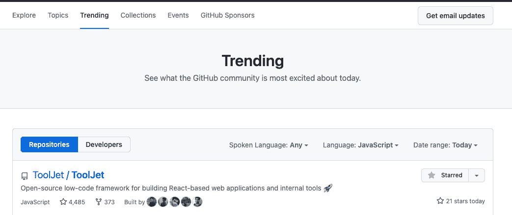
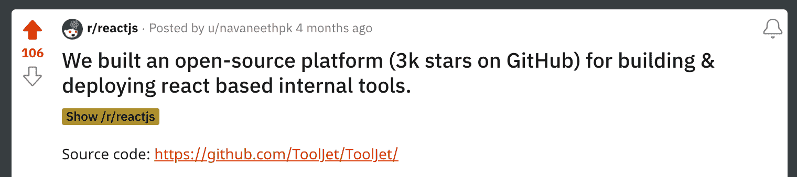

# 我们如何在 6 个月内在我们的开源项目上获得 4.5K+ GitHub Stars

> 原文：<https://www.freecodecamp.org/news/how-to-get-more-engagement-with-your-open-source-project/>

我们在 2021 年 6 月启动了我们的开源项目，从那时起，我们已经为我们的库**获得了超过 4500 颗星星**。

以下是对我们有效的策略。这不是一篇关于如何为你的存储库获得更多星星的文章。相反，本文解释了如何很好地展示您的项目，以便它对开源社区有所帮助。

其中的一些点也帮助我们获得了更多开发者的贡献。我们现在有 100 多个开发者的贡献。

有趣的事实:上面的图表是使用我们的工具构建的应用程序生成的。你可以[在这里尝试](https://apps.tooljet.com/github-star-history)为你的项目生成一个星图。

好了，让我们深入探讨一下我们用来提高项目知名度的策略。

## 写一篇好的自述

自述文件是存储库访问者看到的第一样东西。它应该能够传达你的项目是做什么的，如何安装项目，如何部署项目(如果适用)，如何贡献，以及如何工作。

你也可以使用对开发者有帮助的徽章。我们使用[https://shields.io/](https://shields.io/)在我们的自述文件中添加徽章。

下面是我们的自述:

下面是一些包含优秀自述文件的项目示例:

1.  [https://github.com/nestjs/nest](https://github.com/nestjs/nest)
2.  [https://github.com/typesense/typesense](https://github.com/typesense/typesense)
3.  [https://github.com/airbytehq/airbyte](https://github.com/airbytehq/airbyte)
4.  [https://github.com/strapi/strapi](https://github.com/strapi/strapi)

## 专注于文档

我们的[文档门户](https://docs.tooljet.com/)比我们的主网站获得了更多的流量。一个记录良好的项目总是受到社区的喜爱。

像 [Docusaurus](https://github.com/facebook/docusaurus/) 这样的开源项目使得构建开箱即用的文档门户变得非常容易。从文档中添加到存储库的链接可以吸引更多的访问者访问您的存储库。

### 文档中包括什么

#### 如何安装/部署项目

如果项目有一个编译的软件作为最终产品，请确保添加安装说明。

如果项目是一个库的代码库，比如一个 npm 包或者一个 Ruby gem，包括如何导入和使用这个库的细节。

如果项目需要或者能够部署在 Kubernetes、Docker、Heroku 等平台上，那么应该为每个选项提供单独的指南。

#### 投稿指南

除了代码库中有贡献的指南文档之外，还要在文档中添加一个。它应该包括在 Docker、Mac OS、Ubuntu、Windows 等不同平台上设置本地环境的指南。

#### 教程和代码示例

如果这是适用的，它真的很有帮助。如何使用该项目的指南将向其他开发者展示他们如何真正开始。如果项目是一个库，它可以是代码示例。

#### 架构参考

如果文档中有关于项目不同组成部分的详细信息，将会对贡献者有所帮助。

例如，如果项目有服务器和客户端组件，则包括一个关于所有组件如何协同工作的图表。下面是 ToolJet 文档中的一个例子。

以下是一些有很好文档的项目:

1.  [https://docs.nestjs.com/](https://docs.nestjs.com/)
2.  [https://docs.n8n.io/](https://docs.n8n.io/)
3.  [https://guides.rubyonrails.org/](https://guides.rubyonrails.org/)
4.  [https://plotly.com/python/](https://plotly.com/python/)
5.  [https://docs.mapbox.com/](https://docs.mapbox.com/)

## 将访问者从您的网站吸引到 GitHub

许多访问者在第一次访问我们的网站后查看了我们的知识库。在你的网站上添加横幅、徽章和其他奖励，这样访问者就会查看你的知识库。

在你的网站和博客上添加一个 CTA，这样访问者就可以查看你的知识库。写一些和你的听众相关的话题。例如，如果您的项目用于记录错误，那么编写如何在应用程序中跟踪错误可能是个好主意。

在 freeCodeCamp、dev.to、Hashnode 和 Hackernoon 等平台上发布文章也可以帮助你的博客文章获得更多的可见性。其中一些平台允许交叉发布，而其他一些平台更适合独家内容。

## 积极参与开发者社区

有许多不和谐/松散的社区，论坛，Reddit 社区，等等，开发者通常在那里闲逛。积极参与这些社区，但不要让它看起来像是自我推销(这可能会让你因为显而易见的原因被禁止)。

你可以通过参与相关讨论为社区增加价值。例如，如果您正在构建一个图表库，如果有人询问有关使用 React 绘制图表的问题，您可以提供帮助。

记住，好好表现。如果你的项目没有给讨论增加任何价值，不要试图链接到它。你通过帮助别人建立的关系越多，你就越能以自然、有益的方式分享你的项目信息。

## GitHub 上的趋势知识库

如果你进入了趋势 GitHub 库列表，它会让你的库更加引人注目。

当我们进入趋势列表时，我们的知识库和网站有了更多的访问者。

也有特定语言的趋势列表。每当有新的存储库进入趋势列表时，许多 Twitter 机器人和其他工具都会通知开发人员。

### 如何登上 GitHub 的趋势列表

总的原则应该是将最活跃的存储库(明星、访问者、问题、贡献等)添加到趋势列表中。

GitHub 没有公开提到选择趋势库的标准，所以我们只能假设它是如何工作的。

## 向相关社区寻求反馈

像 [ProductHunt](https://www.producthunt.com/posts/tooljet) 、 [Hackernews](https://news.ycombinator.com/item?id=27421408) 、Reddit 社区等社区可能会发现你的项目很有用。这可以给你的仓库带来更多的访客和观星者。

只针对相关的社区。如果你认为大多数成员不会对你的项目感兴趣，那么它就不是一个相关的社区。滥发垃圾邮件弊大于利。还有，就是不好看。

## 围绕你的项目发展一个社区

在不和谐或懈怠的时候创建一个社区，让你的用户和贡献者可以一起出去玩。

当成员被某件事困住时，如果他们想提出新的建议，社区会很有帮助。如果有一个活跃的社区，你未来的帖子和公告可能会得到更多的关注。

我们在 Slack 上创建了这个社区，因为大多数开发者都有一个 Slack 账户。不要使用鲜为人知的平台来建立你的社区，因为这将使人们在加入社区时多走一步。

## 添加公共路线图

公共路线图有助于用户和贡献者理解项目的发展方向。它概述了该项目的短期愿景。

有许多工具可用于创建公共路线图，但在大多数情况下，GitHub 项目对于创建简单而有效的公共路线图来说已经足够了。

公开路线图应包括所有主要功能和变化，预计将在未来几个月内发布。作为产品路线图的一部分，添加次要的功能和缺陷会导致很多噪音，所以要尽可能避免。

如果您使用 GitHub 项目，请链接到相关问题或讨论，以便社区可以评论他们的建议。

我们已经使用 GitHub 项目创建了一个，你可以点击这里查看。

## 活跃在 Twitter 上

积极发表与你的项目相关的帖子可以提高知名度，增加 Twitter 上的追随者数量，并吸引更多的访问者访问你的知识库。

参与和你的项目相关的讨论。例如，如果您的项目是一个文档框架，您可以为比较不同文档框架的线程增加很多价值。

确保在项目的 Twitter 个人资料上链接您的存储库。另外，在 GitHub 存储库中添加一个 tweet 按钮。

同样，确保你给讨论增加了价值。没有人喜欢垃圾邮件制造者。

## 回应反馈

开源社区通常非常有帮助，并给出很多反馈。回应所有这些反馈，因为他们花了宝贵的时间来帮助你改进你的项目。

积极的反馈帮助你保持动力，而消极的反馈帮助你重新思考你到目前为止已经做了什么。

不要试图避免或忽视负面反馈。保持开放的心态，仔细考虑对方分享了什么。如果它符合你的愿景，就努力去做，否则礼貌地解释。

## 为贡献者添加相关标签

添加诸如“好的第一期”和“待价而沽”这样的标签可以吸引更多的贡献者加入你的知识库。

有许多平台，如[https://goodfirstissue.dev/](https://goodfirstissue.dev/)，扫描带有相关标签的问题，以帮助贡献者发现新的存储库和问题。

确保快速回复投稿人。贡献者可以是有经验的开发人员，也可以是处于职业生涯早期的开发人员或学生。尝试帮助第一次投稿的人，以便他们可以轻松加入。

## 包扎

您看到这篇文章可能是因为您有一个有趣的开源项目。我很想看看你的项目。我在 navaneeth@tooljet.com 和推特上都有空。

希望这篇文章对你有帮助。如果您能花一点时间[查看我们的项目 ToolJet](https://github.com/ToolJet/ToolJet) ，并向我们提供您可能有的任何反馈，我们将不胜感激。