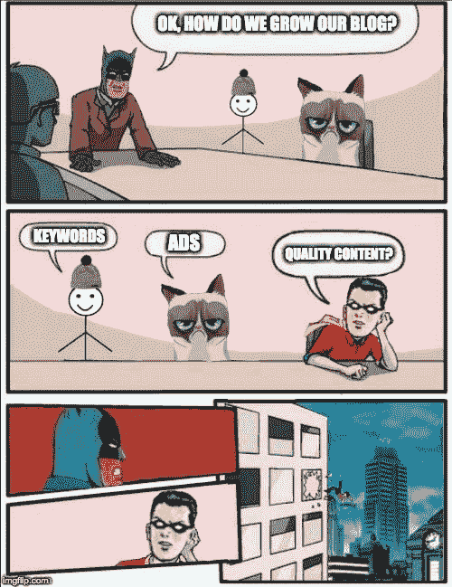

# 如何在你的科技博客上获得更多的浏览

> 原文：<https://www.freecodecamp.org/news/how-to-get-more-tech-blog-views/>

关注技术，而不是博客。

如果你是一个拥有 Twitter 账户的开发者，你已经看到每个人和他们的猫都开了博客、YouTube 频道或 Patreon。我们都想成为明星，或者至少是一个业内知名的名字。

为什么不呢？一些好处包括

*   你建立了一个内容组合。
*   你通过教学保留知识并使他人受益。
*   你建立了一个观众群，创造了适合他们口味的内容。
*   找工作变得更容易。
*   公司开始申请*你*！我们大多数人都会收到招聘人员的电子邮件，但是顶尖的技术人员会收到*的实际工作邀请*。

## 任何人都可以做

创建内容从未如此简单。今天的工具允许任何有互联网连接的人跳上舞台，分享他们的见解。

和生活中的其他事情一样，这也有权衡。

✅内容创作者被授权。正面！

❌现在更难脱颖而出了。具有讽刺意味的是，这可能会让内容创作者感到自己的权利减少。

但是不管竞争有多激烈，给你带来最大优势的是...

## 创建优质内容

创造和分享高质量的内容是关键。否则，不管其他一切有多好，人们都不会留下来。

但是你具体是怎么做的呢？

## 关注技术，而不是博客

这是优化你的博客布局、搜索引擎优化或营销策略之前的第一要务。确保你很好地理解你的技术！如果你不理解它，你如何帮助别人理解它？

我寻找符合以下标准的主题。

*   我对这个主题充满热情。
*   我可以谈论 15 分钟或更长时间。
*   我可以用多种方式解释。
*   我对它做了很多研究，现在我可以做上面的事情之一。

我也很喜欢这句话。

> 如果你不能用简单的术语解释某事，你就不理解它——理查德·费曼

理想情况下，你应该努力达到这种理解水平。它会改变一切。

## 不会做的人，教

这听起来很奇怪，但是我发现如果你只知道写博客，你的编码技能会变得生疏！

永远记住*教*和*做*是两回事。如果你所做的只是教书，你最终会成为那种理论上什么都懂，但什么都做不了的人。

确保通过不断挑战自己来平衡教与学的比例。做一个副业，在工作中接受更难的任务，任何可以提高你技能的事情。

## 请自便

博客不是“快速致富”的计划。分享高质量的内容需要很长时间，并且会感到缓慢、无望和注定失败。

但如果你在整个过程中享受其中，你将建立一个坚实的内容组合，造福他人，发展你的品牌(随着时间的推移)，并通过在全球舞台上分享你的见解巩固你来之不易的知识。

慢慢来，重质轻量，时刻挑战自己。

## 感谢阅读

我现在在我的 YouTube 频道上教编码！[点击这里查看](https://www.youtube.com/channel/UC9pYepHoYW9Hr_VLDrgLhRA?view_as=subscriber)。

更多类似的内容，请查看[https://yazeedb.com](https://yazeedb.com)。请告诉我你还想看什么！[我的 DM 在 Twitter 上是公开的。](https://twitter.com/yazeedBee)

下次见！