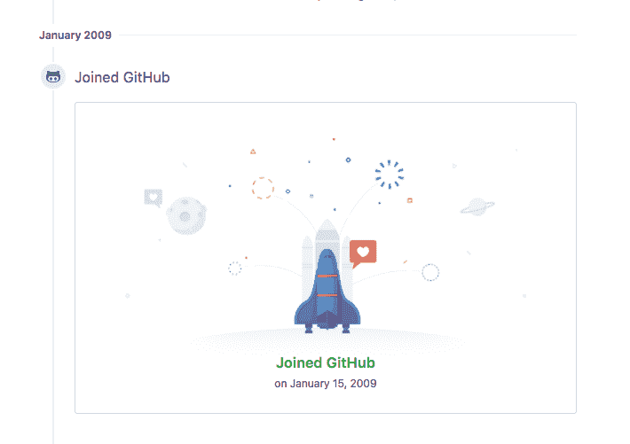

# 如何克服恐惧，为开源做贡献

> 原文：<https://www.freecodecamp.org/news/how-to-get-over-your-fear-of-contributing-to-open-source-6160e4cdf0d3/>

你是新开发人员吗？或者甚至可能只是一个已经在一家公司工作了十年的老员工，从事一个内部项目，而现在你在想，“嘿，我已经在我的盒子里很长时间了。有什么新鲜事吗？”我以前也有过这样的经历，在那段时间里，我有自己需要克服的恐惧。

毕业的时候，心里已经有了职业生涯的大方向:网页开发，游戏，或者两者兼而有之。我喜欢互联网，我也知道如何在网上狂欢。在那个时候，天真的我觉得知道 HTML/CSS 是不可战胜的。我还知道一些 Flash 和 PHP，所以我认为我是一个非常多才多艺的开发人员(是的，我们有我们骄傲的时刻)。

长话短说，我进入了一些网页开发和游戏开发的角色。在某个时候，我被我的好朋友托弗介绍到了 T2 红宝石的世界。

我对它提供的一切都很陌生:

*   Git(我对 Flash 作品的版本控制形式就像 FINAL-FINAL-V22.zip)
*   命令行:当然，对 PHP 有一些经验，但是在 Windows 机器上，经验不多
*   Unix 操作系统

那时候，我不知道什么是开源。我知道 PHP 是开源的，这基本上意味着每个人都可以看到源代码。就是这样。

### 输入 Github

在我看来， [Github](https://github.com/) 开创了开源热潮的先河。Ruby on rails 在当时也是相当新的，当 Github 是使用 rails 制作的时候，它是我开源之旅的开始。

I joined Github almost 10 years ago! WOW!

直到一年半后[我创建了我的“第一个”开源项目](https://github.com/corroded/ijgmaps)。这是[实际上只是鲍勃·克雷文作品](https://bobcravens.com/2010/06/06/a-google-maps-version-3-jquery-plugin/)的一个分支，我为另一个项目修改了一些部分。

又过了一年，我创建了[我的第一期](https://github.com/justinfrench/formtastic/issues/491)和[拉请求](https://github.com/mickeyren/jquery-notifications/pull/1)。是的，花了我一年的时间！然而，在这之后，我感到更加自信，在我老板的鼓励下，他也是一个开源倡导者，我为开源做出了越来越多的贡献。

### 那么我该如何克服这种恐惧呢？

首先也是最重要的，问问你自己为什么害怕做出贡献。这是克服恐惧的第一步(至少对我来说！).

除了我听说过的最常见的恐惧(学生、同事等告诉我的)，以下是我自己的恐惧，这些恐惧可能适用于你，也可能不适用于你:

*   如果我的贡献不被接受怎么办？
*   如果我写了没人喜欢的垃圾代码怎么办？
*   人们会根据我写的代码来评判我吗？
*   他们的代码我一个也看不懂！:(
*   我不知道如何编码/我只是个新手。
*   不知道从何说起！

列出这些恐惧后，一个接一个地解决它们，或者至少试着找到解决它们的方法。因此，我可以列出一些解决这些问题的方法，希望能帮助你们中的一些人度过难关，开始做出贡献。

### 如果我的贡献不被接受怎么办？

老实说，这对我来说并不可怕，但更多的是不便。当我的作品被拒绝时，我的一小部分就死去了(谁没有呢？)，但就是这么回事。有时候我们必须学会接受这一点。由于代码质量、重复等原因，拉请求可能不会被接受。**而且没事**。我怎么强调都不为过。

在我捐款的最初几年，我遭到了几次拒绝，这让我有点沮丧。不过请注意，[有些人实际上并没有完全拒绝你](https://github.com/vwall/compass-twitter-bootstrap/pull/2)，因为对于一些项目，[的维护人员被拉式请求弄得不知所措](https://github.com/cucumber-attic/cucumber-tck)或[有些问题已经解决但还没有发布](https://github.com/twbs/bootstrap/pull/4802)。

我的建议是继续前进，寻找其他的选择。你不能永远停留在拉动请求上！试着从中得到些什么。在我被拒绝的过程中，我学会了用更小的拉请求做更少的提交，而不是一次完成一个史诗般的特性。

### 我写的代码没人喜欢怎么办？

我认为没有人不喜欢代码，尤其是那些本该对项目有帮助的东西。当然，有些项目需要比其他项目更高质量的代码，但是最终，贡献是他们的动力——所以希望没有人会调用你的代码？。

在大多数开源项目中，人们会就如何提高你的贡献发表评论并提供建设性的建议。向他们学习，听从他们的建议。重构。最重要的是，询问维护人员您如何修复它和/或为您指出正确的方向。你会惊讶地发现，他们会轻而易举地为你提供你需要的工具！

### 人们会根据我写的代码来评判我吗？

以我的经验，大部分人不会因为你的代码来评判你(至少我遇到的几百个开发者没有)。现在，要记住的是，每当你写你不确定的代码时，征求别人的意见，或者请一个更资深的开发人员为你审阅。如果你不知道谁符合这个要求，那么让维护人员在你的拉请求描述中知道你可能有一些不太好的代码，并询问他们的意见。

我认为在这类事情上最好开诚布公，如果他们有时间，他们肯定会让你知道并帮助你。然而，得到好的回应的最好方法是不要仅仅问“我如何做得更好？”不是每个人都有时间帮助其他人，所以这会为你(和维护者)节省很多时间！)，如果你首先研究如何让你的代码更好，然后**再**寻求帮助。更像是，“嗨，我还是新来的，但这里是我已经做的，以及一些关于我为什么这样做的资源链接。我认为它仍然不够好，我想知道你是否有任何意见，或者你是否可以给我指出正确的方向。”诸如此类的事情。

### 他们的代码我一点都不懂！

这有时仍然困扰着我。在许多大型开源项目中，如 Rails、React 和其他类似的项目中，这种情况最为普遍。通常，理解的唯一方法是遇到一个问题/ bug，并在您的终端重现它。我真正能说的是，你不必了解所有的事情，但至少知道事情是如何运作的。

我曾经有一个学生在我指导的时候问过我这个问题。他想真正推动自己，我建议他接受一项挑战(我自己还没有完成！)是创建对 Rails 或他喜欢的任何项目的拉请求。一周后，当他提到他的第一个拉动式需求被合并时，他喜形于色。这是对日文版 Rails guide 的一个拉请求。那天我是一个非常骄傲的导师。

他还没有完全理解 Rails，但是他真的很想为它做出贡献。因此，他没有关注 Rails 本身，而是以另一种方式提供帮助，修改翻译，让非英语人士/读者能够更好地理解它。

这让我想到了另一点，它实际上解决了另一种恐惧…

### 我不知道如何编码/我只是个新手

我们都必须从某个地方开始。你所认识的所有专家、维护人员和著名开发人员都是从新手开始的。这里的关键是，他们设法提高了自己，没有让成为一名新的开发人员阻碍他们做一些伟大的事情。

现在，我认识很多甚至没有计算机科学背景的人，他们知道的比我多得多(而且我有 CS 学位！).不知道如何编码不应该成为恐惧的来源，因为不编码你也能做出贡献。

请记住，**贡献并不仅仅意味着提出拉取请求**！它可以是参与关于一个特性的讨论，指出错误，甚至是归档 bug(被[确定](http://edgeguides.rubyonrails.org/contributing_to_ruby_on_rails.html)到[遵循](https://github.com/elixir-lang/elixir#contributing) [他们的](https://github.com/elixir-lang/elixir#contributing) [贡献](https://github.com/kelseyhightower/nocode#contributing) [程序](https://github.com/facebook/react#contributing)！)

大多数情况下，项目需要翻译或校对人员。如果你喜欢做这些任务，去找一个你喜欢的项目并支持他们。我是 Elixir 的狂热粉丝，虽然我还没有编写生产 Elixir 代码，[我自愿帮助维护风格指南](https://github.com/christopheradams/elixir_style_guide)。当然，我首先询问了维护者，但这也是我训练自己掌握各种语法和项目管理的方式。我不必成为灵丹妙药专家，我主要是管理问题，并仔细检查提交的拉请求。

### 太好了！我能从哪里开始？！

同样，Github 是一个很好的起点。如果你有一个你支持的项目，试着先去那里看看。否则，如果你觉得你可以征服任何东西，看看 Github 中的[趋势库，或者甚至是](https://github.com/explore?trending=repositories#trending)[探索 Gitlab](https://gitlab.com/explore) 。

现在去传播开源之爱吧！

更新:我还写了一篇关于如何提出你的第一个拉取请求(并将其合并)的文章作为补充。[点击这里查看](https://medium.com/@corrodedlotus/how-to-get-your-first-pull-request-merged-2826d7295ee9)。