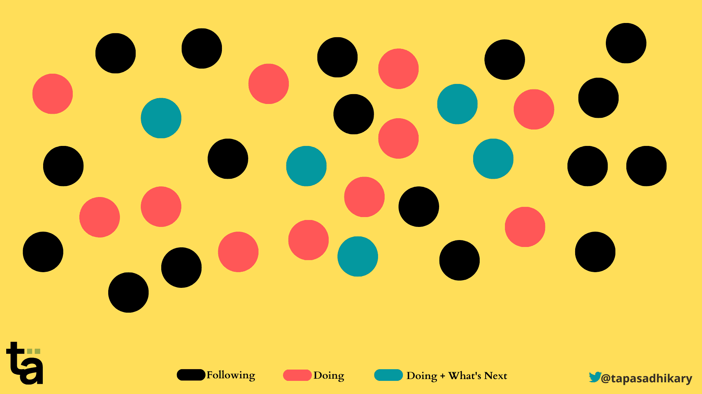
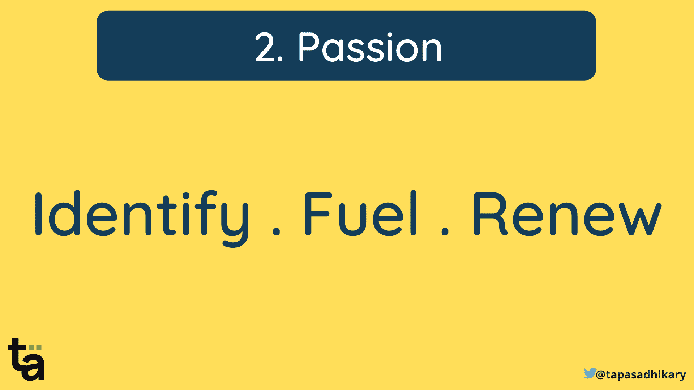
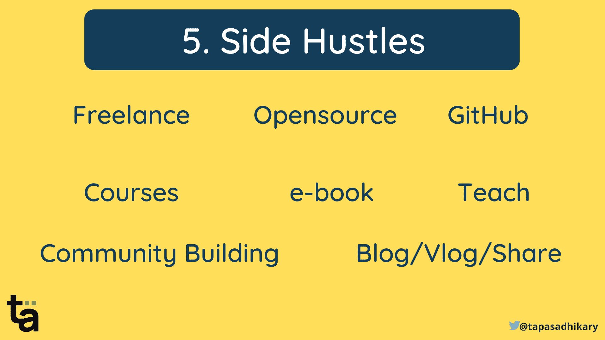
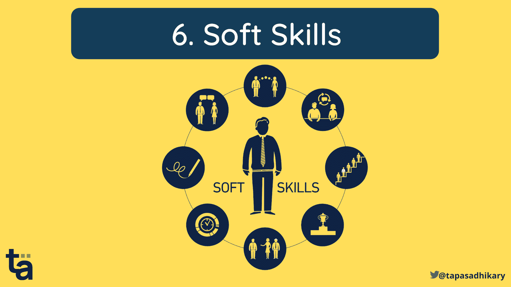

# 如何为科技行业的工作做好准备——给初学者的建议

> 原文：<https://www.freecodecamp.org/news/how-to-get-ready-for-a-job-in-tech/>

几个月前，我应邀给印度一所著名大学的工程系学生演讲。我应该与他们互动，激励他们，最后告诉他们，“这个行业(“工作”世界)是什么样子的？”、“怎么能准备好呢？”

在花了 15 年多的时间开发软件、发布产品、管理团队、客户和期望之后，我有很多想法要和年轻一代分享。

幸运的是，我能够用八个高层次的要点概括一切，而不会让我的观众感到厌烦。

我将在本文中分享这些观点，以帮助您更好地为即将到来的机遇和挑战做准备。文章中提到的所有观点都适用于每个人，不管他们目前在这个行业中的经验如何。

在本文中，无论我在哪里提到术语“行业”，我指的是“软件行业”，因为我的经验与它直接相关。快乐阅读！

## 这个行业有三种人

我们可以把在软件行业工作的人分成三大类。

*   **跟在**后面:需要职业指导和既定道路来实现职业目标的人。他们从已经在做行业发展所需的事情的人那里寻求反馈和认可。
*   **做**:这群人已经在做行业成长所需的事情。他们关注外面最新最棒的东西。他们定期磨砺自己的`skills`，通过分享知识和信息来帮助追随者成长。这一类别的人比`Following`类别的人少。
*   **在做+下一步是什么？:**这群人不仅在做事，还在为未来创造特色。他们培养`what's next?`的愿景，并以大量的`passion`朝着它努力。他们的努力不一定会产生非凡的成果，但他们会继续努力。同样，这个类别的人比我们之前讨论的`Doing`类别的人要少。

请注意，这些类别并不决定谁是行业或组织中的高级或低级。相反，这些类别存在于所有的工作等级、级别和工作职能中。

此外，令人兴奋的是，一个人可以根据情况、技能和背景在所有三个类别中扮演自己的角色。

例如，X 女士在 web 开发技术、解决问题和创造工具以帮助未来事物方面表现出色。她现在开始了她的博客之旅，广泛分享她的知识。她正通过`following`知名博主向技术博客社区学习。

那么，我们如何确保我们在这些类别中不断建立自己的地位，并进入`Doing`和`Doing+ What's Next`阶段呢？

## 帮助你推进编码事业的 8 个技巧

是的，我想把我的建议总结成八个重点。你可能已经做了其中的一些或全部，或者还没有开始做。无论哪种方式都可以，我希望它能鼓励你从这里走得更远。

## 1.养成习惯

我们的生活驱动着我们。我们在不知不觉中建立了许多，我们必须有意识地建立一些。

好习惯有助于你培养解决问题、应对挑战和做出更好决定的正确态度。它帮助你设定合理的目标并接近它们。有好习惯的人有条理，有思想，平易近人，有积极的心态。

那么有哪些好习惯呢？有很多，下面是一些基本的。

*   阅读
*   写作，记笔记
*   体育运动
*   制定时间表
*   变得有条理
*   省钱
*   学问

养成习惯，好的习惯。它将为你决定好与坏、短期与长期、该做与不该做、对与错搭建舞台。

但是，我们如何培养良好的习惯呢？好吧，我可以单独就这个话题写几篇文章，但我现在只强调这几点:

*   找到一个习惯和一个你想培养它的理由。最终目标是什么？
*   找个导火索。一个触发器激励你开始，并推动你坚持下去。例如，听音乐可以触发开始体育锻炼。
*   知道你的局限性和所有失败的可能性，为它做好计划。
*   如果你没能坚持这个习惯，想想哪里出了问题。你需要它吗？重新调整，重新计划，重新开始。

## 2.找到你的激情

你的`passion`让你继续前进，帮助你过上有动力的职业和个人生活。激情是一种“个人”的东西，可能会影响到你圈子里的很多人。你可以对科技、健康、写作——任何你喜欢不断做的事情充满热情。

然而，我在职业生涯早期得到的一条建议是，“不要盲目追随你的激情”。激情应该与你的目标、职业和工作联系在一起。找到爱好和激情之间的区别是很重要的。你可能有一个与职业无关的爱好，但你的热情应该与之相关。

重要的是要确定你的激情，通过大量的实践来激发它，并不时地更新它。

## 3.与人交流

`Social networking`对于开发人员和`developer communities`在构建你的职业生涯中具有影响力。你会遇到志同道合的人，找到榜样，获得合作、学习和找工作的机会。

无论你是学生，新生，还是资深专业人士，对于开发者来说，社交网络无疑是一个很好的选择。像 [Twitter](https://twitter.com/) 、 [LinkedIn](https://linkedin.com/) 、 [Showwcase](http://showwcase.com) 和 [Polywork](https://polywork.com/) 这样的平台是值得一试的。你可以和感兴趣的人联系，向他们学习，做出贡献。

学习和分享是一个构建知识的奇妙循环。当我们走出小天地，在公共场合学习时，它就成长了。此外，学习他人的经验会加速我们的成长。所以，联系吧。

## 4.保持好奇

`Curiosity`是学习新事物的欲望。保持好奇心，虚心学习。好奇心会带来问题和疑惑。乐趣在于寻找答案。

所以，请在你有疑问的时候提问，不要害羞的去想这是不是一个很傻的问题，别人会怎么想，等等。

保持好奇心将有助于你发现事情是如何运作的。对于编程来说，了解事物的内部有很多好处。所以，保持好奇，不断探索。

## 5.发展副业

我最喜欢的观点来了，`Side Hustles`。当你养成做事的习惯，激发你对职业目标的热情，寻求学习新事物，与人交往时，你就有大量的机会从事副业。

但是等等，什么是副业，为什么需要副业？我们要做的事情还不够多吗？是的，非常实际的问题。让我们一个一个来。

副业是你在日常工作之外所做的任何事情，目的是获取知识、声誉、金钱和成长。有各种形式副业，

*   为开源项目做贡献
*   在博客上写文章
*   指导
*   教学
*   当自由职业者
*   社区建设
*   发行书籍，电子书
*   在会议上发言
*   创建视频内容...还有更多

现在所有这些都需要时间，当然，你可能有一些所谓的“主要”工作要处理。然而，以上大部分不需要大量的时间或奉献。此外，所有这些都可能是你“主要”工作的副产品。

让我们举几个例子:

*   你解决过工作中的技术问题吗？把它写成一篇文章。制作一个解释步骤的视频并上传到 YouTube 上。在 StackOverflow、Showwcase 社区、Twitter 和 LinkedIn 上分享一下吧。
*   你是否在特定领域有专长，并且做了很多解决问题的笔记？将它们移动到文档中，并以电子书的形式发布。不要担心谁会利用他们。对优质内容的需求一直很大。
*   你喜欢教书吗？周末花一个小时和对你专业领域感兴趣的人交流。在会议上谈论这个话题。

如果你能在不精疲力尽的情况下管理副业，这是正确的做法。我捕捉到了一些我作为开发者在这里做兼职项目的个人经历。

## 6.不要忽视软技能

`Soft skills`都是关于人类如何在工作中、个人生活中、世界任何地方、以任何可能的方式(物理、远程、虚拟)与他人互动。与技术技能不同，软技能更多的是实现，而不是学习。

这里有一些需要特别注意的软技能，

*   耐心
*   神入
*   问题解决
*   沟通(不仅仅是口头或书面语言，还包括肢体语言、自信、解决冲突等等)
*   协力
*   承认你的错误或责任
*   时间管理——我们一会儿会谈到它。

一些课程会教你很多这些软技能。但是你需要努力缩小自己的差距，逐步提高这些技能。

## 7.管理你的时间

我先坦白一件事。我还在学习如何管理时间，但好消息是我越来越擅长这个了。

我们每个人一天有 24 小时。因此，我们需要在此期间管理我们的所有活动。然而，问题是有太多的事情需要在这段时间内完成。

以下是我一直遵循的一些实践(也是原则),并看到了好的结果。

*   每件事对我们来说都不重要。棘手的是，我们认为某样东西是必不可少的，直到我们给予它足够的思考。
*   所以，我们需要思考并分清主次。它还包括有规律的活动，如睡觉、锻炼、按时吃饭、健康、家庭护理等等。
*   不要把注意力放在那些优先级较低或者可以等到第二天或第三周的事情上。
*   不要一心多用。从长远来看，这只会增加压力，降低生产率。接下一个任务，有时间限制地专注于它，完成它，然后进入下一个。
*   在任务切换之间休息一下。让自己恢复活力。
*   如果某件事花费的时间比预期的多，接受它的发生。你可能不会每天都达到你的时间管理计划。

我希望这些建议能帮助你有足够的思考过程来更好地管理时间。

## 8.找一个导师

帮你自己一个忙。找一个好的导师。从某人的知识和经验中学习是非常有益的。因此，让我们了解谁是导师，他们的角色是什么，以及我们作为学员如何受益。

是一个为你提供指导和建议，让你的愿望成为现实的人。这可能是为了职业发展，学习一个新的领域，了解业务流程，等等。

导师可以帮助分享经验和资源，提供动力，并设定和跟踪个人和项目目标。导师也可以是老师，但大多数情况下，教学重在“如何”，师徒重在“为什么”。

一个人正在接受导师的指导、引导和建议。学员带着抱负、抱负和渴望接近导师。导师指导学员帮助他们实现目标。

在指导计划中，学员在导师的帮助下取得成功。学员决定他们需要多少帮助和指导来实现导师目标。

导师和学员的关系应该不仅仅是技术和项目知识共享。这也是为了理解彼此的情感空间，以实现指导目标。

现在最关键的部分是`finding a good mentor`。一些平台提供导师服务。有一些伟大的导师为许多有抱负的人创造价值。你总是可以试试运气，找到最好的连接。我觉得如果你从你的人际网络或社区圈子里找到一个你认识的人，那会更真实。这甚至可能会有更好的结果。

## 概括起来

总结一下，用我们在本文中讨论的所有要点来关注以下几点:

*   养成良好的习惯。
*   仔细寻找你的激情。
*   和志同道合的人联系，建立你的关系网。
*   保持好奇，不断学习。
*   利用副业来发展。
*   软技能必不可少。
*   学会管理你的时间。
*   找个导师。

## 在结束之前...

我希望你觉得这篇文章很有见地，并帮助你更好地准备你的职业生涯。如果你想进一步讨论或者只是想进行一次职业聊天，你可以在 [Twitter](https://twitter.com/tapasadhikary) 或 [LinkedIn](https://www.linkedin.com/in/tapasadhikary/) 上用 DM ping 我。

我们来连线。我也在这些平台上分享我在 JavaScript、Web 开发、职业和博客方面的学习:

*   [订阅我的 YouTube 频道](https://www.youtube.com/tapasadhikary?sub_confirmation=1)
*   [在 Twitter 上关注我](https://twitter.com/tapasadhikary)
*   [GitHub 上的侧项目](https://github.com/atapas)
*   [在 LinkedIn 上连接](https://www.linkedin.com/in/tapasadhikary/)

我的下一篇文章再见。在那之前，请照顾好自己，保持快乐。